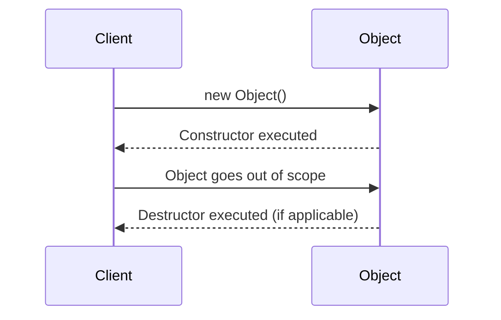

## 2.4.1 Constructors and Destructors

In the realm of object-oriented programming (OOP), understanding how objects are created, initialized, and eventually destroyed is fundamental. This section will delve into the concepts of constructors and destructors, their roles in managing the lifecycle of objects, and how they are implemented in popular programming languages like Python and JavaScript. We'll explore practical examples, best practices, and the nuances of resource management, especially in environments with automatic garbage collection.

### Understanding Constructors

**Constructors** are special methods in a class that are automatically called when a new object is instantiated. Their primary purpose is to initialize the object's properties and allocate any necessary resources. Constructors ensure that the object starts its life in a valid state, ready for use.

#### Types of Constructors

1. **Default Constructors:**
   - A default constructor is a no-argument constructor that initializes object attributes with default values. In many programming languages, if no constructor is explicitly defined, a default constructor is provided by the language.

2. **Parameterized Constructors:**
   - Parameterized constructors allow the passing of arguments to initialize an object with specific values. This type of constructor provides more flexibility and control over the object's initial state.

#### Example in Python

In Python, constructors are defined using the `__init__` method. Here is a simple example demonstrating both default and parameterized constructors:

```python
class Car:
    def __init__(self, make='Toyota', model='Corolla'):
        self.make = make
        self.model = model
        print(f"Car created: {self.make} {self.model}")

car1 = Car()

car2 = Car('Honda', 'Civic')
```

#### Example in JavaScript

JavaScript uses the `constructor` method to define constructors within a class. Unlike Python, JavaScript does not have a default constructor unless explicitly defined:

```javascript
class Car {
    constructor(make = 'Toyota', model = 'Corolla') {
        this.make = make;
        this.model = model;
        console.log(`Car created: ${this.make} ${this.model}`);
    }
}

// Using default constructor
const car1 = new Car();

// Using parameterized constructor
const car2 = new Car('Honda', 'Civic');
```

### Exploring Destructors

**Destructors** are methods that are called when an object is about to be destroyed. They are more relevant in languages like C++ where memory management is manual. In garbage-collected languages like Python and JavaScript, destructors are less commonly used because the garbage collector automatically handles memory deallocation.

#### Destructors in Python

In Python, the `__del__` method acts as a destructor. However, its use is limited due to the automatic garbage collection system. It is primarily used for cleanup activities, such as closing files or network connections.

```python
class FileHandler:
    def __init__(self, filename):
        self.file = open(filename, 'r')
        print("File opened.")

    def __del__(self):
        self.file.close()
        print("File closed.")

handler = FileHandler('data.txt')
```

#### Destructors in JavaScript

JavaScript does not have explicit destructors. Instead, developers rely on manual cleanup functions or `finally` blocks to release resources.

```javascript
class ResourceHandler {
    constructor() {
        this.connection = this.connect();
        console.log("Resource acquired.");
    }

    connect() {
        // Simulate acquiring a resource
        return {};
    }

    dispose() {
        // Release the resource
        this.connection = null;
        console.log("Resource released.");
    }
}

const handler = new ResourceHandler();
// Later in the code
handler.dispose();
```

### Resource Management in Constructors and Destructors

Constructors and destructors play a vital role in resource management, particularly in handling non-memory resources like file handles, network connections, and database connections. Proper management of these resources is crucial to prevent resource leaks and ensure application stability.

#### Best Practices for Constructors

- **Minimal Logic:** Keep the logic within constructors minimal. The constructor should primarily focus on initializing the object, not performing complex operations.
  
- **Avoid Heavy Operations:** Avoid performing heavy operations within constructors, such as network requests or file I/O, as these can slow down object creation.

#### Best Practices for Destructors

- **Limited Use in Garbage-Collected Languages:** In languages like Python and JavaScript, avoid relying on destructors for critical resource management. Instead, use context managers (Python) or manual cleanup functions (JavaScript).

- **Explicit Cleanup:** Always provide a method for explicit cleanup of resources, such as a `close` or `dispose` method, to ensure resources are released in a timely manner.

### Visualizing Object Lifecycle

To better understand the lifecycle of an object, let's visualize the process using a sequence diagram. This diagram illustrates the creation and destruction of an object, highlighting the role of constructors and destructors.



### Key Points to Emphasize

- **Essential Role of Constructors:** Constructors are crucial for initializing objects properly, ensuring they start in a valid state.
  
- **Explicit Cleanup in Garbage-Collected Languages:** While memory is managed automatically, non-memory resources require explicit cleanup to prevent leaks and ensure efficient resource utilization.

- **Flexibility with Parameterized Constructors:** Parameterized constructors offer flexibility in object initialization, allowing for customized object states.

### Conclusion

Constructors and destructors are fundamental concepts in object-oriented programming, playing a pivotal role in the lifecycle management of objects. By understanding their functions and best practices, developers can create robust and efficient applications. While destructors are less relevant in garbage-collected languages, understanding their role and limitations is crucial for effective resource management. As you continue your journey in software development, mastering these concepts will empower you to write cleaner, more maintainable code.

## Quiz Time!



### What is the primary purpose of a constructor in a class?

- [x] To initialize the object's properties and allocate resources
- [ ] To destroy the object and free resources
- [ ] To handle exceptions within the class
- [ ] To perform complex operations within the class

> **Explanation:** Constructors are used to initialize the object's properties and allocate necessary resources when a new object is instantiated.

### Which method acts as a destructor in Python?

- [x] `__del__`
- [ ] `__init__`
- [ ] `__destroy__`
- [ ] `__finalize__`

> **Explanation:** The `__del__` method in Python acts as a destructor, called when an object is about to be destroyed.

### In JavaScript, how do you typically handle resource cleanup?

- [x] Using manual cleanup functions or `finally` blocks
- [ ] Using explicit destructors
- [ ] Using automatic garbage collection
- [ ] Using the `__del__` method

> **Explanation:** JavaScript does not have explicit destructors. Resource cleanup is handled using manual cleanup functions or `finally` blocks.

### What is a default constructor?

- [x] A no-argument constructor that initializes object attributes with default values
- [ ] A constructor that takes parameters to initialize object attributes
- [ ] A method that destroys an object
- [ ] A method that handles exceptions

> **Explanation:** A default constructor is a no-argument constructor that initializes object attributes with default values.

### Why should you avoid heavy operations in constructors?

- [x] They can slow down object creation
- [ ] They can lead to memory leaks
- [x] They can make the constructor complex
- [ ] They can cause exceptions

> **Explanation:** Heavy operations in constructors can slow down object creation and make the constructor complex, which is not recommended.

### What is the role of the `__init__` method in Python?

- [x] To act as a constructor for initializing objects
- [ ] To act as a destructor for cleaning up resources
- [ ] To handle exceptions within the class
- [ ] To perform file I/O operations

> **Explanation:** The `__init__` method in Python acts as a constructor, responsible for initializing objects.

### What should be the focus of a constructor in a class?

- [x] Initializing the object
- [ ] Destroying the object
- [x] Allocating resources
- [ ] Handling exceptions

> **Explanation:** The focus of a constructor should be on initializing the object and allocating necessary resources.

### In Python, what is a common alternative to using destructors for resource management?

- [x] Using context managers
- [ ] Using explicit destructors
- [ ] Using automatic garbage collection
- [ ] Using the `__destroy__` method

> **Explanation:** In Python, context managers are commonly used for resource management, providing a way to allocate and release resources precisely.

### What is a parameterized constructor?

- [x] A constructor that takes parameters to initialize object attributes
- [ ] A no-argument constructor that initializes object attributes with default values
- [ ] A method that destroys an object
- [ ] A method that handles exceptions

> **Explanation:** A parameterized constructor takes parameters to initialize object attributes, offering flexibility in object initialization.

### True or False: In garbage-collected languages, destructors are necessary for memory management.

- [x] True
- [ ] False

> **Explanation:** In garbage-collected languages, destructors are not necessary for memory management as the garbage collector handles memory deallocation automatically.


