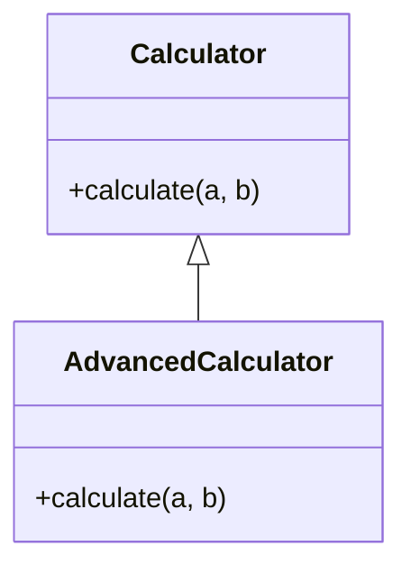

## 2.4.2 Method Overloading and Overriding

In the realm of object-oriented programming (OOP), **method overloading** and **method overriding** are two pivotal concepts that enhance the flexibility and capability of software design. These techniques allow developers to write code that is both adaptable and efficient, catering to a wide range of scenarios and requirements. This section will delve into these concepts, providing a comprehensive understanding and practical insights into their applications.

### Understanding Method Overloading

**Method overloading** refers to the ability to define multiple methods with the same name but different parameters within the same class. This allows a single method name to handle different types or numbers of inputs, providing a flexible interface to the users of a class.

#### Key Characteristics of Method Overloading

- **Same Method Name:** Overloaded methods must have the same name.
- **Different Parameters:** They must differ in the type, number, or order of parameters.
- **Compile-Time Polymorphism:** Overloading is a form of compile-time polymorphism, where the method to be executed is determined at compile time.

#### Method Overloading in Python and JavaScript

While languages like Java and C++ support method overloading natively, Python and JavaScript handle it differently due to their dynamic nature.

##### Simulating Method Overloading in Python

Python does not support method overloading in the traditional sense. Instead, developers use default parameters and variable-length argument lists to achieve similar functionality.

```python
class Greeter:
    def greet(self, name=None):
        if name:
            print(f"Hello, {name}!")
        else:
            print("Hello, world!")

greeter = Greeter()
greeter.greet("Alice")  # Output: Hello, Alice!
greeter.greet()         # Output: Hello, world!
```

In this example, the `greet` method can handle calls with or without a parameter, simulating overloading by using a default parameter value.

##### Simulating Method Overloading in JavaScript

JavaScript, being a dynamically typed language, also lacks native support for method overloading. Developers often use conditional logic within a single method to handle different parameter scenarios.

```javascript
class Greeter {
    greet(name) {
        if (name) {
            console.log(`Hello, ${name}!`);
        } else {
            console.log("Hello, world!");
        }
    }
}

const greeter = new Greeter();
greeter.greet("Alice"); // Output: Hello, Alice!
greeter.greet();        // Output: Hello, world!
```

Here, the `greet` method uses an `if` statement to check for the presence of a `name` parameter, allowing it to behave differently based on the input.

#### Usage Scenarios for Method Overloading

Method overloading is particularly useful for:

- **Convenience Methods:** Providing multiple ways to call a method, enhancing usability.
- **Type-Specific Operations:** Handling different data types within the same logical operation.
- **Backward Compatibility:** Allowing new versions of a method without breaking existing code.

### Understanding Method Overriding

**Method overriding** is a feature that allows a subclass to provide a specific implementation for a method that is already defined in its superclass. This is a cornerstone of runtime polymorphism in OOP, enabling subclasses to tailor inherited methods to their specific needs.

#### Key Characteristics of Method Overriding

- **Same Method Signature:** The overriding method must have the same name and parameters as the method in the superclass.
- **Runtime Polymorphism:** Overriding is a form of runtime polymorphism, where the method to be executed is determined at runtime.
- **Subclass-Specific Behavior:** Allows subclasses to modify or extend the behavior of superclass methods.

#### Method Overriding in Python

In Python, method overriding is straightforward and commonly used in inheritance hierarchies.

```python
class Calculator:
    def calculate(self, a, b):
        return a + b

class AdvancedCalculator(Calculator):
    def calculate(self, a, b):
        return a * b

calc = AdvancedCalculator()
print(calc.calculate(2, 3))  # Output: 6
```

In this example, the `AdvancedCalculator` class overrides the `calculate` method of the `Calculator` class, changing its behavior from addition to multiplication.

#### Method Overriding in JavaScript

JavaScript also supports method overriding through its class inheritance model.

```javascript
class Calculator {
    calculate(a, b) {
        return a + b;
    }
}

class AdvancedCalculator extends Calculator {
    calculate(a, b) {
        return a * b;
    }
}

const calc = new AdvancedCalculator();
console.log(calc.calculate(2, 3)); // Output: 6
```

Here, the `AdvancedCalculator` class extends `Calculator` and overrides its `calculate` method to perform multiplication instead of addition.

#### Usage Scenarios for Method Overriding

Method overriding is ideal for:

- **Extending Functionality:** Adding new behavior to inherited methods.
- **Customizing Behavior:** Tailoring superclass methods to meet specific subclass requirements.
- **Implementing Abstract Methods:** Providing concrete implementations for abstract methods defined in a superclass or interface.

### Visualizing Method Overriding

To better understand method overriding, consider the following UML diagram illustrating a simple class hierarchy:



In this diagram, `AdvancedCalculator` inherits from `Calculator` and overrides the `calculate` method, demonstrating how subclasses can alter inherited behavior.

### Key Points to Emphasize

- **Overloading vs. Overriding:** Overloading is about providing multiple method signatures, while overriding is about redefining a method in a subclass.
- **Polymorphism:** Both techniques contribute to polymorphism, enhancing the flexibility and reusability of code.
- **Dynamic Languages:** In dynamically-typed languages like Python and JavaScript, method overloading is simulated using default parameters and conditional logic.

### Best Practices and Common Pitfalls

#### Best Practices

- **Clear Intent:** Ensure that method overloading and overriding are used to enhance clarity and functionality, not to obscure logic.
- **Consistent Naming:** Use meaningful method names and parameter lists to avoid confusion.
- **Documentation:** Clearly document the behavior of overloaded and overridden methods to aid understanding and maintenance.

#### Common Pitfalls

- **Overuse of Overloading:** Avoid excessive overloading, which can lead to complex and hard-to-maintain code.
- **Ignoring Superclass Methods:** When overriding, consider calling the superclass method using `super()` to retain existing functionality.
- **Type Confusion:** In dynamically-typed languages, ensure that overloaded methods handle all expected input types correctly.

### Conclusion

Method overloading and overriding are powerful tools in the object-oriented programmer's toolkit. By understanding and applying these concepts, developers can create flexible, efficient, and maintainable software. Whether simulating overloading in dynamic languages or leveraging overriding for subclass-specific behavior, these techniques are essential for modern software design.

---

## Quiz Time!



### What is method overloading?

- [x] Defining multiple methods with the same name but different parameters.
- [ ] Redefining a method in a subclass that already exists in the superclass.
- [ ] A feature unique to statically-typed languages.
- [ ] Only applicable in Java and C++.

> **Explanation:** Method overloading involves defining multiple methods with the same name but different parameter lists, allowing for different implementations based on input.

### How does Python simulate method overloading?

- [x] By using default parameters and variable-length argument lists.
- [ ] Through a special overloading keyword.
- [ ] Using decorators.
- [ ] It cannot simulate overloading.

> **Explanation:** Python uses default parameter values and variable-length argument lists to simulate method overloading, as it does not support it natively.

### What is method overriding?

- [x] Redefining a method in a subclass that already exists in the superclass.
- [ ] Defining multiple methods with the same name but different parameters.
- [ ] A compile-time polymorphism technique.
- [ ] Only applicable in dynamically-typed languages.

> **Explanation:** Method overriding allows a subclass to provide a specific implementation of a method that is already defined in its superclass.

### In JavaScript, how do you achieve method overriding?

- [x] By defining a method with the same name in a subclass.
- [ ] Using a special override keyword.
- [ ] Through function overloading.
- [ ] It is not possible in JavaScript.

> **Explanation:** In JavaScript, method overriding is achieved by defining a method with the same name in a subclass, which replaces the superclass method.

### Which of the following is a use case for method overloading?

- [x] Convenience methods.
- [x] Type-specific operations.
- [ ] Implementing abstract methods.
- [ ] Customizing inherited behavior.

> **Explanation:** Method overloading is useful for convenience methods and handling type-specific operations, providing multiple ways to call a method.

### What is a common pitfall of method overloading?

- [x] Overuse can lead to complex and hard-to-maintain code.
- [ ] It is not supported in Python.
- [ ] It always requires a superclass.
- [ ] It cannot handle different data types.

> **Explanation:** Overusing method overloading can make code complex and difficult to maintain, as it can lead to confusion over which method is called.

### Why is method overriding important?

- [x] It allows subclasses to customize or replace superclass methods.
- [x] It supports runtime polymorphism.
- [ ] It is required for all subclasses.
- [ ] It simplifies code maintenance.

> **Explanation:** Method overriding is crucial for allowing subclasses to provide specific implementations and supports runtime polymorphism, enhancing flexibility.

### How does JavaScript handle method overloading?

- [x] By using conditional logic within a single method.
- [ ] Through a special keyword.
- [ ] It cannot handle overloading.
- [ ] Using default parameters.

> **Explanation:** JavaScript handles method overloading by using conditional logic within a method to simulate different behaviors based on input.

### What should you consider when overriding a method?

- [x] Whether to call the superclass method using `super()`.
- [ ] Always defining new parameters.
- [ ] Using a different method name.
- [ ] Avoiding any inherited functionality.

> **Explanation:** When overriding, consider whether to call the superclass method using `super()` to retain or extend existing functionality.

### True or False: Method overloading is a form of runtime polymorphism.

- [ ] True
- [x] False

> **Explanation:** Method overloading is a form of compile-time polymorphism, where the method to be executed is determined at compile time.



By mastering method overloading and overriding, you are well on your way to becoming proficient in object-oriented programming, capable of designing flexible and robust software systems.
