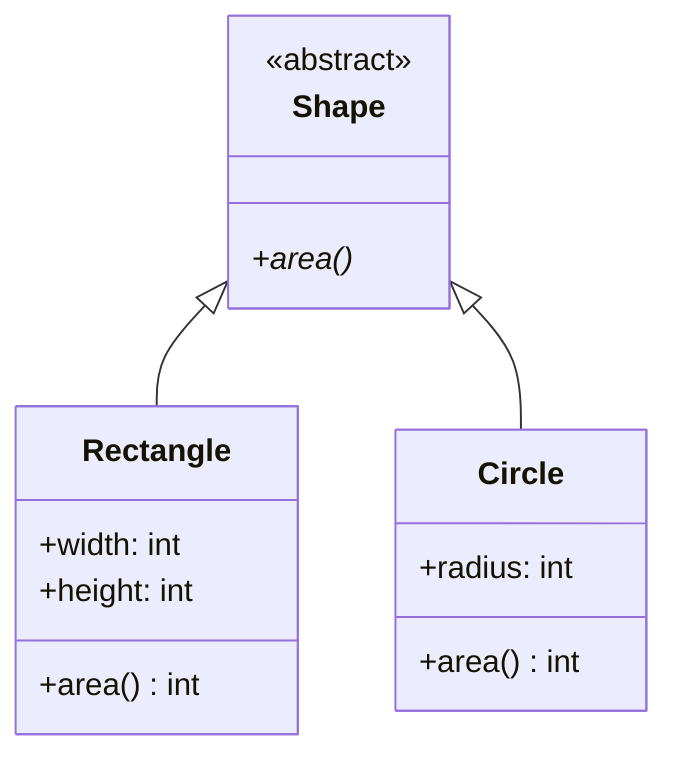

## 2.4.3 Interfaces and Abstract Classes

In the realm of object-oriented programming (OOP), **interfaces** and **abstract classes** serve as foundational elements that define the contracts and blueprints for classes. These constructs are pivotal in promoting **consistency**, **polymorphism**, and **code reusability** across software systems. In this section, we will delve into the intricacies of interfaces and abstract classes, exploring their definitions, implementations, and practical applications in modern programming languages such as Python and JavaScript.

### Understanding Abstract Classes

#### Definition and Purpose

An **abstract class** is a class that cannot be instantiated on its own. It often contains one or more abstract methods, which are methods declared without an implementation. The primary role of an abstract class is to provide a common base for derived classes, allowing them to share code while mandating the implementation of specific methods.

Abstract classes are instrumental in scenarios where you want to enforce a certain structure across multiple subclasses while providing some shared functionality. They act as templates, ensuring that all derived classes adhere to a predefined interface.

#### Key Characteristics

- **Non-Instantiable**: Abstract classes cannot be instantiated directly. They are meant to be subclassed, with concrete implementations provided by derived classes.
- **Shared Code**: Abstract classes can contain both abstract methods (without implementation) and concrete methods (with implementation), allowing shared functionality among subclasses.
- **Polymorphism**: By defining a common interface, abstract classes enable polymorphism, allowing objects of different subclasses to be treated uniformly.

#### Example in Python

In Python, abstract classes are implemented using the `abc` module, which provides tools for defining abstract base classes.

```python
from abc import ABC, abstractmethod

class Shape(ABC):
    @abstractmethod
    def area(self):
        pass

class Rectangle(Shape):
    def __init__(self, width, height):
        self.width = width
        self.height = height

    def area(self):
        return self.width * self.height

rect = Rectangle(10, 5)
print(rect.area())  # Output: 50
```

In this example, `Shape` is an abstract class with an abstract method `area()`. The `Rectangle` class inherits from `Shape` and provides an implementation for the `area()` method.

### Exploring Interfaces

#### Definition and Role

In languages that support interfaces, such as Java, an **interface** is a contract that defines a set of method signatures without providing any implementation. Interfaces specify what a class must do, but not how it does it. This allows different classes to implement the same interface in diverse ways, promoting flexibility and interchangeability.

Interfaces are crucial for defining capabilities that can be shared across unrelated classes, ensuring that they adhere to a common protocol.

#### Key Characteristics

- **Method Signatures**: Interfaces only define method signatures, leaving the implementation to the classes that implement the interface.
- **Multiple Inheritance**: Interfaces allow a form of multiple inheritance, enabling a class to implement multiple interfaces and inherit their contracts.
- **Contractual Obligation**: Classes that implement an interface are obligated to provide concrete implementations for all its methods.

#### Interface Implementation in JavaScript

JavaScript does not have built-in support for interfaces like Java. However, developers can use documentation and conventions to denote intended interfaces, relying on **duck typing** and **protocols** to achieve similar outcomes.

```javascript
// "Interface" definition (not enforceable)
/**
 * @interface Shape
 * @method area
 */

class Rectangle {
    constructor(width, height) {
        this.width = width;
        this.height = height;
    }

    area() {
        return this.width * this.height;
    }
}

const rect = new Rectangle(10, 5);
console.log(rect.area());  // Output: 50
```

In this JavaScript example, we use comments to document the intended interface. The `Rectangle` class follows this interface by implementing the `area` method.

### Interfaces and Abstract Classes in Action

#### Promoting Consistency and Polymorphism

Both interfaces and abstract classes define a set of methods that must be implemented by subclasses, ensuring consistency across different implementations. This consistency is crucial for polymorphism, where objects of different classes can be treated as instances of a common superclass or interface.

Consider a scenario where you have different types of shapes, such as circles, rectangles, and triangles. By defining a common interface or abstract class, you can ensure that each shape class implements methods like `area()` and `perimeter()`, allowing you to handle them uniformly in your code.

#### Real-World Applications

1. **Web Development**: In web applications, interfaces and abstract classes can define common APIs for components, ensuring that different components adhere to the same contract.
2. **Game Development**: Abstract classes can define common behaviors for game entities, such as movement or collision detection, while allowing specific implementations for different types of entities.
3. **Data Processing**: Interfaces can define common methods for data processing tasks, such as reading, writing, and transforming data, enabling different data sources to be handled uniformly.

### Implementing Abstract Classes in Python

Python's `abc` module provides a straightforward way to define abstract base classes. Let's explore a more complex example involving multiple abstract methods and concrete implementations.

```python
from abc import ABC, abstractmethod

class Vehicle(ABC):
    @abstractmethod
    def start_engine(self):
        pass

    @abstractmethod
    def stop_engine(self):
        pass

    def honk(self):
        print("Honk!")

class Car(Vehicle):
    def start_engine(self):
        print("Car engine started.")

    def stop_engine(self):
        print("Car engine stopped.")

class Motorcycle(Vehicle):
    def start_engine(self):
        print("Motorcycle engine started.")

    def stop_engine(self):
        print("Motorcycle engine stopped.")

car = Car()
car.start_engine()
car.honk()
car.stop_engine()

motorcycle = Motorcycle()
motorcycle.start_engine()
motorcycle.honk()
motorcycle.stop_engine()
```

In this example, `Vehicle` is an abstract class with two abstract methods: `start_engine()` and `stop_engine()`. The `Car` and `Motorcycle` classes inherit from `Vehicle` and provide concrete implementations for these methods.

### Implementing Interfaces in JavaScript

While JavaScript lacks formal interface support, developers can simulate interfaces using conventions and documentation. Let's explore a more detailed example involving multiple methods.

```javascript
// "Interface" definition (not enforceable)
/**
 * @interface Vehicle
 * @method startEngine
 * @method stopEngine
 * @method honk
 */

class Car {
    startEngine() {
        console.log("Car engine started.");
    }

    stopEngine() {
        console.log("Car engine stopped.");
    }

    honk() {
        console.log("Honk!");
    }
}

class Motorcycle {
    startEngine() {
        console.log("Motorcycle engine started.");
    }

    stopEngine() {
        console.log("Motorcycle engine stopped.");
    }

    honk() {
        console.log("Honk!");
    }
}

const car = new Car();
car.startEngine();
car.honk();
car.stopEngine();

const motorcycle = new Motorcycle();
motorcycle.startEngine();
motorcycle.honk();
motorcycle.stopEngine();
```

In this JavaScript example, we define a conceptual `Vehicle` interface and implement it in the `Car` and `Motorcycle` classes. While not enforceable by the language, this approach promotes consistency and clarity in the codebase.

### Visualizing Abstract Classes and Interfaces

To better understand the relationships between abstract classes, interfaces, and their implementations, let's use a class diagram to illustrate these concepts.



In this diagram, `Shape` is an abstract class with an abstract method `area()`. `Rectangle` and `Circle` are concrete classes that inherit from `Shape` and provide implementations for the `area()` method.

### Best Practices and Common Pitfalls

#### Best Practices

- **Use Abstract Classes for Shared Code**: When you have shared functionality that can be reused across multiple classes, consider using abstract classes to encapsulate this code.
- **Define Clear Interfaces**: Whether using formal interfaces or conventions, ensure that your interfaces are well-documented and clear, specifying the expected behavior of implementing classes.
- **Leverage Polymorphism**: Use interfaces and abstract classes to enable polymorphism, allowing you to write flexible and reusable code that can handle different types of objects uniformly.

#### Common Pitfalls

- **Overusing Abstract Classes**: Avoid creating overly complex hierarchies of abstract classes, which can lead to rigid and difficult-to-maintain code.
- **Ignoring Documentation**: In languages like JavaScript, where interfaces are not enforced, it's crucial to maintain clear documentation to ensure that intended interfaces are understood and followed.
- **Inconsistent Implementations**: Ensure that all classes implementing an interface or inheriting from an abstract class provide consistent and complete implementations of required methods.

### Conclusion

Interfaces and abstract classes are powerful tools in object-oriented programming, enabling developers to define clear contracts and promote consistency across their codebases. By understanding and effectively utilizing these constructs, you can create flexible, maintainable, and reusable software systems. Whether you're working in Python, JavaScript, or another language, the principles of interfaces and abstract classes remain universally applicable, guiding you toward better software design.

## Quiz Time!



### What is an abstract class?

- [x] A class that cannot be instantiated and may contain abstract methods without implementation.
- [ ] A class that must be instantiated and contains no abstract methods.
- [ ] A class that only contains static methods.
- [ ] A class that cannot be inherited.

> **Explanation:** An abstract class is designed to provide a common interface and shared code for subclasses. It cannot be instantiated directly and often contains abstract methods that must be implemented by subclasses.

### What is the primary role of an interface in programming languages like Java?

- [x] To define a contract with method signatures but no implementation.
- [ ] To provide a complete implementation of methods.
- [ ] To store data and state information.
- [ ] To restrict access to certain methods.

> **Explanation:** Interfaces define a set of method signatures that implementing classes must provide. They do not contain implementations, allowing flexibility in how the methods are realized.

### How can abstract classes be implemented in Python?

- [x] Using the `abc` module to define abstract base classes.
- [ ] By using the `interface` keyword.
- [ ] By creating classes with no methods.
- [ ] By using the `abstract` keyword.

> **Explanation:** Python uses the `abc` module to define abstract base classes, which can contain abstract methods that subclasses are required to implement.

### How do you denote an interface in JavaScript?

- [x] Using comments or documentation to specify intended methods.
- [ ] By using the `interface` keyword.
- [ ] By creating a class with no methods.
- [ ] By using the `implements` keyword.

> **Explanation:** JavaScript does not have formal support for interfaces, so developers use comments and documentation to denote intended interfaces and rely on conventions.

### Which of the following best describes polymorphism?

- [x] The ability to treat objects of different classes uniformly through a common interface.
- [ ] The ability to create multiple instances of a class.
- [ ] The ability to inherit methods from a superclass.
- [ ] The ability to override methods in a subclass.

> **Explanation:** Polymorphism allows objects of different classes to be treated as instances of a common superclass or interface, enabling flexible and reusable code.

### What is a key benefit of using abstract classes?

- [x] They allow shared code and enforce method implementation in subclasses.
- [ ] They prevent code reuse and enforce strict class hierarchies.
- [ ] They allow classes to be instantiated directly.
- [ ] They enable multiple inheritance.

> **Explanation:** Abstract classes provide a mechanism for sharing code among subclasses while enforcing the implementation of specific methods, promoting code reuse and consistency.

### How can interfaces promote consistency in a codebase?

- [x] By defining a set of methods that must be implemented by all classes adhering to the interface.
- [ ] By allowing classes to implement methods in any order.
- [ ] By providing default implementations for all methods.
- [ ] By restricting access to certain methods.

> **Explanation:** Interfaces define a consistent set of methods that implementing classes must adhere to, ensuring uniformity and predictability in how classes behave.

### What is duck typing, and how is it used in JavaScript?

- [x] A programming style where an object's suitability is determined by the presence of methods and properties rather than its type.
- [ ] A way to enforce strict type checking in JavaScript.
- [ ] A method for defining class hierarchies.
- [ ] A technique for optimizing code performance.

> **Explanation:** Duck typing allows JavaScript to determine an object's suitability based on its methods and properties, rather than its explicit type, promoting flexibility.

### What is a common pitfall when using abstract classes?

- [x] Creating overly complex hierarchies that are difficult to maintain.
- [ ] Allowing classes to be instantiated directly.
- [ ] Providing complete implementations for all methods.
- [ ] Restricting access to certain methods.

> **Explanation:** Overly complex hierarchies of abstract classes can lead to rigid and difficult-to-maintain code, reducing flexibility and increasing maintenance costs.

### True or False: Interfaces in JavaScript are enforced by the language.

- [ ] True
- [x] False

> **Explanation:** JavaScript does not enforce interfaces; they are typically documented using comments and conventions, relying on developers to adhere to the intended design.


