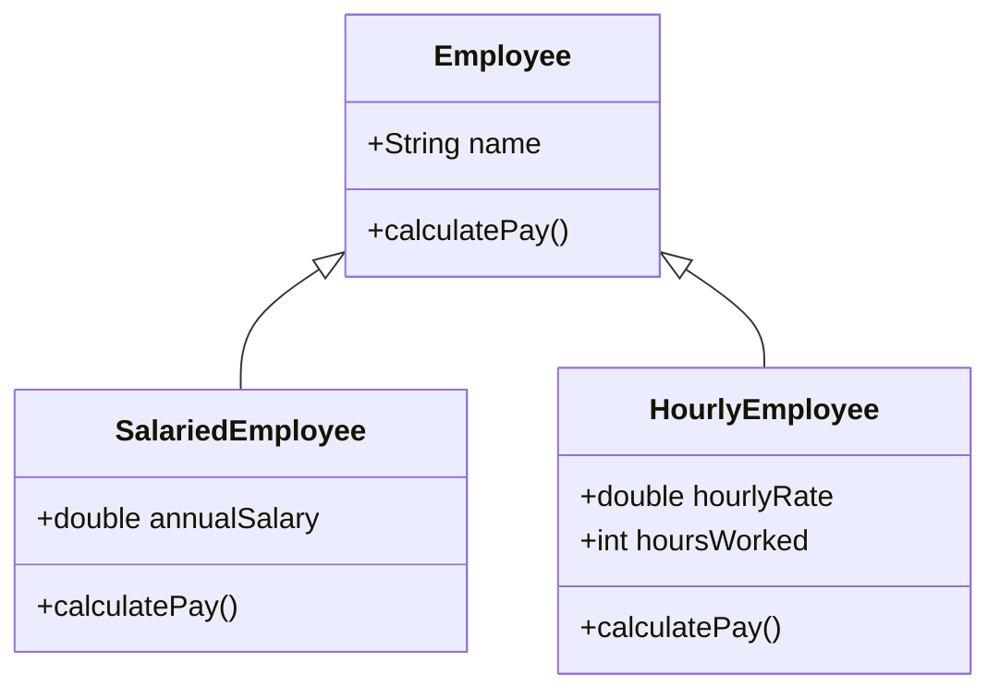

## 2.4.4 Practical Examples in Python and JavaScript

In this section, we will delve into practical examples that illustrate the core principles of Object-Oriented Programming (OOP) using Python and JavaScript. These examples aim to solidify your understanding of encapsulation, inheritance, polymorphism, and abstraction—concepts that are crucial for designing robust, scalable software systems.

### Choosing a Relevant Scenario

To effectively demonstrate these OOP principles, we will use a scenario that is both relatable and applicable to real-world software development: a simple employee management system. This system will calculate the monthly pay for different types of employees, showcasing how OOP can be used to manage complexity and enhance code reusability.

### Demonstrating OOP Principles

Our employee management system will include the following classes:

- **Employee (Abstract Base Class):** Defines the common interface for all employee types.
- **SalariedEmployee:** Represents employees with a fixed annual salary.
- **HourlyEmployee:** Represents employees paid based on the number of hours worked.

These classes will illustrate the use of encapsulation, inheritance, polymorphism, and abstraction.

### Python Implementation

Let's start with the Python implementation of our employee management system. Python's dynamic nature and support for abstract base classes make it an excellent choice for demonstrating OOP concepts.

```python
from abc import ABC, abstractmethod

class Employee(ABC):
    def __init__(self, name):
        self.name = name

    @abstractmethod
    def calculate_pay(self):
        pass

class SalariedEmployee(Employee):
    def __init__(self, name, annual_salary):
        super().__init__(name)
        self.annual_salary = annual_salary

    def calculate_pay(self):
        return self.annual_salary / 12

class HourlyEmployee(Employee):
    def __init__(self, name, hourly_rate, hours_worked):
        super().__init__(name)
        self.hourly_rate = hourly_rate
        self.hours_worked = hours_worked

    def calculate_pay(self):
        return self.hourly_rate * self.hours_worked

employees = [
    SalariedEmployee("Alice", 60000),
    HourlyEmployee("Bob", 20, 160)
]

for emp in employees:
    print(f"{emp.name}: ${emp.calculate_pay():.2f}")
```

#### Code Explanation

- **Encapsulation:** Each class encapsulates its data and behavior. For instance, `SalariedEmployee` and `HourlyEmployee` encapsulate their respective salary calculation logic.
- **Inheritance:** `SalariedEmployee` and `HourlyEmployee` inherit from the `Employee` base class, leveraging the common interface defined by `Employee`.
- **Polymorphism:** The `calculate_pay` method is overridden in each subclass, allowing different implementations to be called through the same interface.
- **Abstraction:** The `Employee` class is abstract, meaning it cannot be instantiated directly. It provides a blueprint for subclasses.

### JavaScript Implementation

Now, let's translate this example into JavaScript. JavaScript's prototypal inheritance and class syntax (introduced in ES6) make it a powerful language for OOP.

```javascript
class Employee {
    constructor(name) {
        if (this.constructor === Employee) {
            throw new Error("Cannot instantiate abstract class");
        }
        this.name = name;
    }

    calculatePay() {
        throw new Error("Abstract method must be implemented");
    }
}

class SalariedEmployee extends Employee {
    constructor(name, annualSalary) {
        super(name);
        this.annualSalary = annualSalary;
    }

    calculatePay() {
        return this.annualSalary / 12;
    }
}

class HourlyEmployee extends Employee {
    constructor(name, hourlyRate, hoursWorked) {
        super(name);
        this.hourlyRate = hourlyRate;
        this.hoursWorked = hoursWorked;
    }

    calculatePay() {
        return this.hourlyRate * this.hoursWorked;
    }
}

const employees = [
    new SalariedEmployee("Alice", 60000),
    new HourlyEmployee("Bob", 20, 160)
];

employees.forEach(emp => {
    console.log(`${emp.name}: $${emp.calculatePay().toFixed(2)}`);
});
```

#### Code Explanation

- **Encapsulation:** Similar to Python, each class encapsulates its data and methods.
- **Inheritance:** `SalariedEmployee` and `HourlyEmployee` extend the `Employee` class, inheriting its properties.
- **Polymorphism:** The `calculatePay` method is overridden in subclasses, demonstrating polymorphism.
- **Abstraction:** The `Employee` class acts as an abstract class, preventing direct instantiation.

### Visualizing the Class Hierarchy

To better understand the relationships between these classes, let's visualize the class hierarchy using a Mermaid.js diagram.



### Encouraging Interactivity

To deepen your understanding, try modifying the code examples:

- **Add a new employee type:** Create a `CommissionedEmployee` class that calculates pay based on sales commissions.
- **Enhance functionality:** Implement a method to display detailed employee information.
- **Experiment with polymorphism:** Add more methods to the `Employee` class and see how they can be overridden in subclasses.

### Real-World Applications

Understanding these OOP principles is crucial for building scalable applications. For instance, in an e-commerce platform, you might use similar patterns to manage different types of products, orders, or users, each with unique attributes and behaviors.

### Best Practices and Common Pitfalls

#### Best Practices

- **Use abstraction wisely:** Ensure your abstract classes provide meaningful interfaces for subclasses.
- **Favor composition over inheritance:** While inheritance is powerful, overuse can lead to complex hierarchies. Consider using composition to combine behaviors.

#### Common Pitfalls

- **Avoid deep inheritance hierarchies:** They can become difficult to manage and understand.
- **Ensure proper encapsulation:** Avoid exposing internal state unless necessary.

### Conclusion

By exploring these practical examples, you should now have a solid understanding of how OOP principles can be applied in real-world scenarios. These concepts are foundational to writing clean, maintainable, and scalable code in both Python and JavaScript.

## Quiz Time!



### What principle does the `Employee` class illustrate by being an abstract class?

- [x] Abstraction
- [ ] Encapsulation
- [ ] Polymorphism
- [ ] Inheritance

> **Explanation:** The `Employee` class is abstract, meaning it provides a blueprint for subclasses, illustrating the principle of abstraction.

### Which method in the `SalariedEmployee` and `HourlyEmployee` classes demonstrates polymorphism?

- [x] calculatePay
- [ ] constructor
- [ ] getName
- [ ] displayInfo

> **Explanation:** The `calculatePay` method is overridden in each subclass, demonstrating polymorphism.

### What is the primary benefit of using inheritance in the provided examples?

- [x] Code reuse
- [ ] Faster execution
- [ ] Smaller file size
- [ ] Easier syntax

> **Explanation:** Inheritance allows subclasses to reuse code from the parent class, promoting code reuse.

### In the JavaScript example, what error is thrown if you try to instantiate the `Employee` class directly?

- [x] "Cannot instantiate abstract class"
- [ ] "Abstract method must be implemented"
- [ ] "Undefined variable"
- [ ] "Syntax error"

> **Explanation:** The `Employee` class throws an error "Cannot instantiate abstract class" to prevent direct instantiation.

### What is the role of the `super` keyword in the examples?

- [x] It calls the constructor of the parent class
- [ ] It defines a new method
- [ ] It creates a new instance
- [ ] It initializes a variable

> **Explanation:** The `super` keyword is used to call the constructor of the parent class, allowing the subclass to inherit properties.

### What OOP principle is demonstrated by having different `calculatePay` implementations in `SalariedEmployee` and `HourlyEmployee`?

- [x] Polymorphism
- [ ] Abstraction
- [ ] Encapsulation
- [ ] Inheritance

> **Explanation:** Polymorphism is demonstrated by having different implementations of the same method in different classes.

### Why is encapsulation important in OOP?

- [x] It protects the internal state of an object
- [ ] It speeds up program execution
- [ ] It reduces memory usage
- [ ] It simplifies syntax

> **Explanation:** Encapsulation is important because it protects the internal state of an object and restricts access to it.

### What could be a potential downside of deep inheritance hierarchies?

- [x] They can become difficult to manage
- [ ] They improve code readability
- [ ] They increase execution speed
- [ ] They reduce code size

> **Explanation:** Deep inheritance hierarchies can become difficult to manage and understand, leading to complex code structures.

### Which of the following is a real-world application of OOP principles?

- [x] Managing different types of products in an e-commerce platform
- [ ] Calculating simple arithmetic
- [ ] Displaying static text
- [ ] Printing documents

> **Explanation:** OOP principles are often used in real-world applications like managing different types of products in an e-commerce platform.

### True or False: Inheritance should always be used over composition.

- [ ] True
- [x] False

> **Explanation:** While inheritance is useful, it should not always be used over composition. Composition can often provide more flexibility and simpler design.



By engaging with these questions and experimenting with the code, you can reinforce your understanding of OOP concepts and their practical applications.
