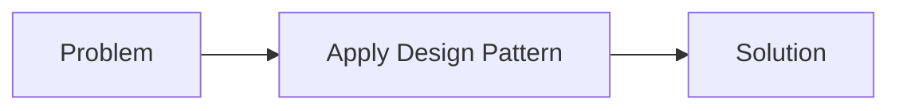

## 3.1.1 Definition of Design Patterns

In the realm of software engineering, design patterns play an integral role in shaping the architecture and functionality of software applications. This section aims to demystify the concept of design patterns, providing a comprehensive understanding of what they are, their characteristics, and their purpose in the software development process.

### What Are Design Patterns?

At its core, a **design pattern** is a general, reusable solution to a commonly occurring problem within a given context in software design. It is not a finished design that can be directly transformed into code but rather a template or a blueprint for solving a problem that can be adapted to various situations. Design patterns are about capturing the best practices and experiences of skilled software engineers and making these insights available to others.

#### Key Characteristics of Design Patterns

Understanding the characteristics of design patterns is crucial for leveraging their full potential in software development. Here are the primary attributes that define design patterns:

1. **Reusability:**
   - Design patterns provide solutions that can be applied across different projects and scenarios. This reusability helps in reducing the time and effort required to solve recurring problems, allowing developers to focus on more complex aspects of their applications.

2. **Best Practices:**
   - Patterns encapsulate the collective wisdom and proven strategies of experienced software engineers. They represent solutions that have been tested and refined over time, ensuring reliability and effectiveness.

3. **Language Neutrality:**
   - Design patterns are conceptual and can be implemented in any programming language. This language neutrality makes them versatile tools that can be adapted to diverse programming environments, from Python and JavaScript to Java and C++.

### Purpose of Design Patterns

Design patterns serve several important purposes in software development, each contributing to the creation of robust, maintainable, and efficient software systems:

- **Promote Code Reuse and Efficiency:**
  - By applying design patterns, developers can avoid reinventing the wheel for common problems. This leads to more efficient development processes, as solutions are readily available and can be adapted to specific needs.

- **Improve Communication Among Developers:**
  - Design patterns provide a common vocabulary for developers, facilitating clearer communication and understanding within development teams. This shared language helps in discussing architecture and design decisions more effectively.

- **Facilitate the Development of Maintainable and Scalable Software:**
  - Patterns encourage the creation of software that is easier to maintain and extend. By adhering to established design principles, developers can build systems that are more adaptable to change and growth.

### A Simple Example: The Singleton Pattern

To illustrate how a design pattern provides a solution to a common problem, let's consider the Singleton pattern. This pattern ensures that a class has only one instance and provides a global point of access to it. This is particularly useful in scenarios where a single shared resource, such as a configuration object or a connection pool, is needed.

#### Without Singleton Pattern

Consider a scenario where multiple instances of a configuration class are created throughout an application, leading to inconsistent configuration states:

```python
class Configuration:
    def __init__(self):
        self.settings = {"theme": "dark", "language": "en"}

config1 = Configuration()
config2 = Configuration()

config1.settings["theme"] = "light"
print(config2.settings["theme"])  # Output: dark
```

#### With Singleton Pattern

By applying the Singleton pattern, we ensure that only one instance of the configuration class exists:

```python
class SingletonMeta(type):
    _instances = {}

    def __call__(cls, *args, **kwargs):
        if cls not in cls._instances:
            instance = super().__call__(*args, **kwargs)
            cls._instances[cls] = instance
        return cls._instances[cls]

class Configuration(metaclass=SingletonMeta):
    def __init__(self):
        self.settings = {"theme": "dark", "language": "en"}

config1 = Configuration()
config2 = Configuration()

config1.settings["theme"] = "light"
print(config2.settings["theme"])  # Output: light
```

This example demonstrates how the Singleton pattern solves the problem of managing a single instance of a class, ensuring consistency across the application.

### Visualizing the Design Pattern Process

To better understand how design patterns are applied, consider the following flowchart, which depicts the process of recognizing a problem, applying a design pattern, and achieving a solution:



This diagram highlights the straightforward yet powerful approach of using design patterns to address software design challenges.

### Key Points to Emphasize

- **Design Patterns as Templates:**
  - Remember that design patterns are not direct solutions but templates that guide the problem-solving process. They provide a framework for thinking about solutions rather than prescribing exact code implementations.

- **Encapsulation of Best Practices:**
  - Patterns encapsulate tried-and-true solutions, making them valuable resources for developers seeking to implement high-quality software.

- **Tools in a Toolbox:**
  - Think of design patterns as tools in a developer's toolbox. Each pattern serves a specific purpose and can be selected based on the problem at hand, much like choosing the right tool for a particular task.

### Conclusion

Design patterns are indispensable tools in the software engineer's arsenal. By providing reusable solutions to common problems, they enhance the efficiency, maintainability, and scalability of software systems. As you continue your journey in software development, embracing design patterns will empower you to craft more robust and adaptable applications.

## Quiz Time!



### What is a design pattern in software engineering?

- [x] A general, reusable solution to a commonly occurring problem within a given context.
- [ ] A specific code implementation for a problem.
- [ ] A programming language feature.
- [ ] A type of software framework.

> **Explanation:** A design pattern is a general, reusable solution to a commonly occurring problem within a given context in software design.

### Which of the following is NOT a characteristic of design patterns?

- [ ] Reusability
- [ ] Best Practices
- [x] Language Specificity
- [ ] Language Neutrality

> **Explanation:** Design patterns are language-neutral and can be implemented in any programming language, making them versatile.

### What is the primary purpose of design patterns?

- [x] To promote code reuse and efficiency.
- [ ] To enforce strict coding guidelines.
- [ ] To provide a specific algorithm for solving problems.
- [ ] To replace the need for software documentation.

> **Explanation:** Design patterns promote code reuse and efficiency by providing reusable solutions to common problems.

### How do design patterns improve communication among developers?

- [x] By providing a common vocabulary for discussing design solutions.
- [ ] By enforcing a specific coding style.
- [ ] By eliminating the need for comments in code.
- [ ] By automating code generation.

> **Explanation:** Design patterns improve communication by providing a common vocabulary that helps developers discuss design solutions more effectively.

### Which design pattern ensures a class has only one instance?

- [x] Singleton
- [ ] Observer
- [ ] Factory
- [ ] Decorator

> **Explanation:** The Singleton pattern ensures a class has only one instance and provides a global point of access to it.

### Why are design patterns considered best practices?

- [x] They encapsulate solutions that have been tested and refined over time.
- [ ] They enforce strict coding standards.
- [ ] They are mandated by programming languages.
- [ ] They are easy to implement without understanding.

> **Explanation:** Design patterns are considered best practices because they encapsulate solutions that have been tested and refined over time.

### What is an example of a problem that the Singleton pattern solves?

- [x] Ensuring a single instance of a class exists.
- [ ] Managing multiple instances of a class.
- [ ] Implementing complex algorithms.
- [ ] Designing user interfaces.

> **Explanation:** The Singleton pattern solves the problem of ensuring a single instance of a class exists, which is useful for shared resources.

### How do design patterns facilitate maintainable software development?

- [x] By encouraging the use of established design principles.
- [ ] By enforcing rigid coding rules.
- [ ] By eliminating the need for testing.
- [ ] By reducing the need for documentation.

> **Explanation:** Design patterns facilitate maintainable software development by encouraging the use of established design principles.

### What does it mean for a design pattern to be a "template"?

- [x] It provides a framework for solving problems without prescribing exact code.
- [ ] It dictates the exact code to be used.
- [ ] It is a type of software library.
- [ ] It is a graphical user interface design.

> **Explanation:** A design pattern being a "template" means it provides a framework for solving problems without prescribing exact code implementations.

### Design patterns are only applicable to object-oriented programming. True or False?

- [ ] True
- [x] False

> **Explanation:** Design patterns are not limited to object-oriented programming; they can be applied in various programming paradigms.


