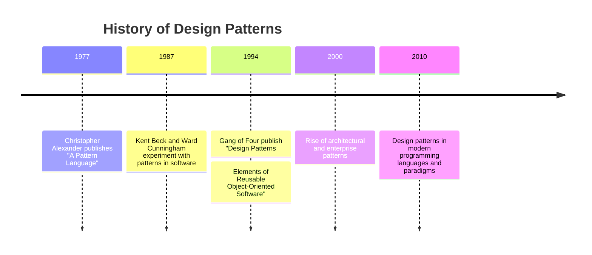

## 3.1.2 History of Design Patterns

Design patterns have become a cornerstone in the realm of software engineering, offering tried and tested solutions to common problems faced during software development. To fully appreciate the significance and utility of design patterns, it is essential to delve into their history, tracing their origins and understanding their evolution over time. This section provides a comprehensive overview of how design patterns came to be, their journey from architectural concepts to essential software engineering tools, and their ongoing influence in the field.

### Origins in Architecture

The concept of design patterns originated outside the realm of software engineering, rooted in the field of architecture. The pioneering work of Christopher Alexander, a prominent architect and design theorist, laid the groundwork for what would eventually become a fundamental concept in software design.

#### Christopher Alexander's Influence

In 1977, Christopher Alexander, along with his colleagues Sara Ishikawa and Murray Silverstein, published "A Pattern Language: Towns, Buildings, Construction." This seminal work introduced the idea of "patterns" as a way to describe solutions to recurring problems in architecture and urban design. Alexander's patterns were not mere templates but were deeply rooted in human experience and the natural environment. They aimed to create spaces that were both functional and aesthetically pleasing.

Alexander's patterns were organized into a "language" that allowed architects to combine them in various ways to solve complex design problems. This approach was revolutionary because it provided a systematic way to capture and communicate design knowledge, making it accessible to both experts and novices.

### Introduction to Software Engineering

The transition of design patterns from architecture to software engineering began in the late 1980s and early 1990s. Software engineers recognized that the challenges they faced in designing complex systems were not unlike those encountered in architecture. They needed a way to capture and share solutions to common design problems, just as Alexander had done for buildings and towns.

#### Early Experiments with Patterns

The adaptation of design patterns to software engineering can be traced back to the work of Kent Beck and Ward Cunningham. In 1987, they experimented with applying Alexander's ideas to software design. Their work focused on developing a pattern language for Smalltalk, a pioneering object-oriented programming language. This was one of the first attempts to formalize the concept of patterns in software engineering.

Their efforts laid the groundwork for a broader acceptance of design patterns in the software community. Beck and Cunningham's work demonstrated that patterns could be an effective way to document and communicate design knowledge, helping developers build more robust and maintainable systems.

### Key Publications: The Gang of Four

The concept of design patterns gained widespread recognition and popularity with the publication of the book "Design Patterns: Elements of Reusable Object-Oriented Software" in 1994. Authored by Erich Gamma, Richard Helm, Ralph Johnson, and John Vlissides, this book is often referred to as the "Gang of Four" (GoF) book.

#### The Gang of Four's Contribution

The Gang of Four's book was groundbreaking for several reasons. It introduced 23 classic design patterns, providing detailed descriptions, use cases, and examples for each. These patterns were categorized into three types: Creational, Structural, and Behavioral, each addressing different aspects of software design.

The GoF book not only provided a catalog of patterns but also established a common vocabulary for software developers. This shared language facilitated communication and collaboration, enabling developers to discuss design solutions more effectively.

The impact of the GoF book cannot be overstated. It fundamentally changed the way software was designed and developed, promoting the use of object-oriented principles and encouraging the reuse of proven solutions.

### Evolution of Patterns

Since the publication of the GoF book, the concept of design patterns has continued to evolve and expand. New patterns have emerged, and the application of patterns has extended beyond object-oriented programming to encompass a wide range of programming paradigms and domains.

#### Growth of Pattern Languages and Catalogs

Following the success of the GoF book, numerous pattern catalogs and languages have been developed. These catalogs cover various aspects of software design, including architectural patterns, concurrency patterns, and enterprise patterns. Each catalog addresses specific challenges and provides solutions tailored to different contexts.

For example, architectural patterns focus on the high-level structure of software systems, providing guidance on how to organize and manage complex architectures. Concurrency patterns address the challenges of designing systems that can perform multiple tasks simultaneously, ensuring efficiency and reliability.

#### Patterns in Modern Programming Languages

As programming languages and paradigms have evolved, so too have design patterns. Modern languages like Python and JavaScript have embraced patterns, adapting them to fit their unique features and capabilities. For instance, JavaScript's functional programming capabilities have led to the development of patterns that leverage closures and higher-order functions.

In addition, the rise of asynchronous programming and microservices architecture has prompted the creation of new patterns that address the challenges of distributed systems and real-time processing.

### Visual Representation: Timeline of Key Milestones

To better understand the historical development of design patterns, let's visualize the key milestones in their evolution:

### Key Points to Emphasize

Understanding the history of design patterns is crucial for several reasons:

- **Appreciation of Value:** Knowing the origins and evolution of design patterns helps us appreciate their value and the reasoning behind their development. Patterns are not arbitrary constructs; they are the result of decades of experience and refinement.

- **Adaptability:** Design patterns have proven to be adaptable, evolving to meet the needs of modern software development. They continue to provide solutions to new challenges, demonstrating their enduring relevance.

- **Shared Language:** The establishment of a common vocabulary through design patterns has facilitated communication and collaboration among developers, leading to more efficient and effective software design.

### Conclusion

The history of design patterns is a testament to the power of shared knowledge and collaboration. From their origins in architecture to their pivotal role in software engineering, design patterns have transformed the way we approach software design. As we continue to face new challenges in an ever-evolving technological landscape, the principles and practices embodied in design patterns will remain invaluable tools for developers worldwide.

## Quiz Time!



### Who introduced the concept of design patterns in architecture?

- [x] Christopher Alexander
- [ ] Erich Gamma
- [ ] Ward Cunningham
- [ ] Richard Helm

> **Explanation:** Christopher Alexander introduced the concept of design patterns in architecture with his work "A Pattern Language."

### What was the first application of design patterns in software engineering?

- [ ] Java programming
- [x] Smalltalk programming
- [ ] C++ programming
- [ ] Python programming

> **Explanation:** Kent Beck and Ward Cunningham first applied design patterns to Smalltalk programming.

### Who are the authors of the seminal book "Design Patterns: Elements of Reusable Object-Oriented Software"?

- [x] Erich Gamma, Richard Helm, Ralph Johnson, John Vlissides
- [ ] Kent Beck, Ward Cunningham
- [ ] Christopher Alexander, Sara Ishikawa, Murray Silverstein
- [ ] Martin Fowler, Robert C. Martin

> **Explanation:** The authors, known as the "Gang of Four," wrote the seminal book on design patterns.

### What are the three categories of design patterns introduced in the GoF book?

- [x] Creational, Structural, Behavioral
- [ ] Architectural, Concurrency, Enterprise
- [ ] Functional, Object-Oriented, Procedural
- [ ] Synchronous, Asynchronous, Reactive

> **Explanation:** The GoF book categorizes design patterns into Creational, Structural, and Behavioral.

### When was the GoF book published?

- [ ] 1987
- [ ] 1990
- [x] 1994
- [ ] 2000

> **Explanation:** The GoF book was published in 1994.

### What impact did the GoF book have on software development?

- [x] It established a common vocabulary for design patterns.
- [ ] It introduced the concept of microservices.
- [ ] It focused solely on web development.
- [ ] It eliminated the need for object-oriented programming.

> **Explanation:** The GoF book established a common vocabulary for design patterns, facilitating communication among developers.

### How have design patterns evolved in modern programming languages?

- [x] They have adapted to new paradigms like functional programming.
- [ ] They have become obsolete.
- [ ] They are only used in legacy systems.
- [ ] They are no longer relevant.

> **Explanation:** Design patterns have evolved to adapt to new programming paradigms, such as functional programming.

### What are architectural patterns primarily concerned with?

- [x] High-level structure of software systems
- [ ] Low-level code optimization
- [ ] User interface design
- [ ] Database management

> **Explanation:** Architectural patterns focus on the high-level structure of software systems.

### Which of the following is not a key milestone in the history of design patterns?

- [ ] 1977: Christopher Alexander publishes "A Pattern Language"
- [ ] 1987: Kent Beck and Ward Cunningham experiment with patterns
- [x] 1999: Introduction of the Agile Manifesto
- [ ] 1994: Publication of the GoF book

> **Explanation:** The introduction of the Agile Manifesto in 1999 is not directly related to the history of design patterns.

### True or False: Design patterns are static and do not evolve over time.

- [ ] True
- [x] False

> **Explanation:** Design patterns are not static; they evolve and adapt to new challenges and programming paradigms.


