## 3.1.3 The Gang of Four (GoF)

In the realm of software engineering, few contributions have been as influential as the work of Erich Gamma, Richard Helm, Ralph Johnson, and John Vlissides, collectively known as the **Gang of Four (GoF)**. Their groundbreaking book, *"Design Patterns: Elements of Reusable Object-Oriented Software"*, has provided a foundation upon which modern software design is built. This chapter delves into the contributions of these four pioneers, exploring their impact on the field of software engineering and the enduring relevance of their work.

### The Architects Behind the Patterns

#### Meet the Gang of Four

The term "Gang of Four" might conjure images of a secretive group, but in the world of software design, it refers to four esteemed computer scientists whose collaborative efforts have left a lasting mark on the industry:

- **Erich Gamma**: A Swiss computer scientist, Gamma has been instrumental in the development of design patterns and has contributed to the Eclipse software development platform.
- **Richard Helm**: An Australian software engineer, Helm's work in object-oriented programming and design patterns has been widely recognized and respected.
- **Ralph Johnson**: A professor of computer science at the University of Illinois, Johnson's research has focused on software architecture and design patterns.
- **John Vlissides**: An American software engineer and author, Vlissides made significant contributions to the field of software design patterns until his untimely passing in 2005.

These four individuals came together in the early 1990s to address a growing need in the software development community: a common language for describing recurring design problems and their solutions in object-oriented programming.

### A Seminal Contribution: *Design Patterns: Elements of Reusable Object-Oriented Software*

Published in 1994, the book *"Design Patterns: Elements of Reusable Object-Oriented Software"* is the seminal work that brought design patterns to the forefront of software engineering. The book catalogs 23 design patterns, each providing a solution to a common design problem in object-oriented software development. These patterns are categorized into three main types:

- **Creational Patterns**: These patterns deal with object creation mechanisms, trying to create objects in a manner suitable to the situation. Examples include the Factory Method and Abstract Factory patterns.
- **Structural Patterns**: These patterns deal with object composition or the ways to assemble objects to form larger structures. Examples include the Adapter and Composite patterns.
- **Behavioral Patterns**: These patterns focus on communication between objects. Examples include the Observer and Strategy patterns.

#### The 23 Foundational Design Patterns

The GoF book introduced a structured approach to software design, providing developers with a toolkit of solutions to common problems. Here's a brief overview of these patterns:

- **Creational Patterns**:
  - **Abstract Factory**: Provides an interface for creating families of related or dependent objects without specifying their concrete classes.
  - **Builder**: Separates the construction of a complex object from its representation, allowing the same construction process to create different representations.
  - **Factory Method**: Defines an interface for creating an object, but lets subclasses alter the type of objects that will be created.
  - **Prototype**: Specifies the kind of objects to create using a prototypical instance, and creates new objects by copying this prototype.
  - **Singleton**: Ensures a class has only one instance and provides a global point of access to it.

- **Structural Patterns**:
  - **Adapter**: Allows the interface of an existing class to be used as another interface.
  - **Bridge**: Decouples an abstraction from its implementation so that the two can vary independently.
  - **Composite**: Composes objects into tree structures to represent part-whole hierarchies.
  - **Decorator**: Attaches additional responsibilities to an object dynamically.
  - **Facade**: Provides a simplified interface to a complex subsystem.
  - **Flyweight**: Reduces the cost of creating and manipulating a large number of similar objects.
  - **Proxy**: Provides a surrogate or placeholder for another object to control access to it.

- **Behavioral Patterns**:
  - **Chain of Responsibility**: Passes a request along a chain of handlers.
  - **Command**: Encapsulates a request as an object, thereby allowing for parameterization and queuing of requests.
  - **Interpreter**: Implements a specialized language.
  - **Iterator**: Provides a way to access the elements of an aggregate object sequentially without exposing its underlying representation.
  - **Mediator**: Defines an object that encapsulates how a set of objects interact.
  - **Memento**: Captures and externalizes an object’s internal state so that the object can be restored to this state later.
  - **Observer**: Defines a one-to-many dependency between objects so that when one object changes state, all its dependents are notified and updated automatically.
  - **State**: Allows an object to alter its behavior when its internal state changes.
  - **Strategy**: Defines a family of algorithms, encapsulates each one, and makes them interchangeable.
  - **Template Method**: Defines the skeleton of an algorithm in an operation, deferring some steps to subclasses.
  - **Visitor**: Represents an operation to be performed on the elements of an object structure.

### The Impact on Software Engineering

The introduction of design patterns by the Gang of Four was a watershed moment in software engineering. Before their work, developers often struggled with reinventing solutions to common problems. The GoF book provided a shared language and a set of best practices that could be universally understood and applied. This had several profound impacts:

- **Shared Vocabulary**: By cataloging these patterns, the GoF gave developers a common vocabulary to describe solutions to recurring design problems. This not only improved communication among developers but also facilitated better documentation and understanding of complex systems.
- **Influence on Object-Oriented Programming**: The patterns emphasized the principles of object-oriented design, such as encapsulation, inheritance, and polymorphism, reinforcing their importance in building robust and maintainable software.
- **Educational Foundation**: The GoF book became a cornerstone in software design education, forming part of the curriculum in computer science programs around the world. It has been instrumental in teaching the principles of good software design to generations of developers.

### Patterns Introduced: A Closer Look

The classification of patterns into creational, structural, and behavioral categories provides a framework for understanding the different aspects of software design. This classification helps developers choose the right pattern for the problem at hand, ensuring that the solution is both efficient and maintainable.

#### Creational Patterns

Creational patterns abstract the instantiation process, making it more flexible and dynamic. By decoupling the creation of objects from their usage, these patterns promote code reuse and scalability.

#### Structural Patterns

Structural patterns focus on the composition of classes and objects. They help ensure that if one part of a system changes, the entire system does not need to be refactored, thus promoting maintainability and scalability.

#### Behavioral Patterns

Behavioral patterns are concerned with the interaction and responsibility of objects. They help define clear object communication, which is crucial for building systems that are both flexible and robust.

### Legacy and Continuing Relevance

The legacy of the Gang of Four is evident in the continued relevance of their work. Despite the rapid evolution of technology and programming languages, the design patterns they introduced remain applicable and are widely taught and practiced today. Their work laid the groundwork for subsequent advancements in software design, influencing frameworks, libraries, and best practices across the industry.

The GoF patterns have been implemented in various programming languages, including Python, Java, C++, and JavaScript, demonstrating their versatility and adaptability. As software development continues to evolve, the principles underlying these patterns provide a stable foundation for addressing new challenges and opportunities.

### Visualizing the GoF Patterns

To better understand the organization of the 23 design patterns introduced by the Gang of Four, consider the following diagram, which categorizes the patterns into their respective types:

```mermaid
graph TD
  Creational -->|Patterns| FactoryMethod
  Creational --> AbstractFactory
  Creational --> Builder
  Creational --> Prototype
  Creational --> Singleton
  Structural --> Adapter
  Structural --> Bridge
  Structural --> Composite
  Structural --> Decorator
  Structural --> Facade
  Structural --> Flyweight
  Structural --> Proxy
  Behavioral --> ChainOfResponsibility
  Behavioral --> Command
  Behavioral --> Interpreter
  Behavioral --> Iterator
  Behavioral --> Mediator
  Behavioral --> Memento
  Behavioral --> Observer
  Behavioral --> State
  Behavioral --> Strategy
  Behavioral --> TemplateMethod
  Behavioral --> Visitor
```

### Conclusion: The Enduring Influence of the Gang of Four

The contributions of the Gang of Four have transcended time, continuing to influence software design and development decades after their seminal book was published. Their work provided a blueprint for addressing common design challenges and established a framework for thinking about software design in a structured and systematic way.

For anyone embarking on a journey in software development, understanding the design patterns introduced by the GoF is essential. These patterns not only equip developers with practical solutions but also instill a deeper appreciation for the art and science of software design.

As you continue to explore the world of design patterns, remember that the principles and practices introduced by the Gang of Four are not just historical artifacts but living tools that can be adapted and applied to the ever-evolving challenges of software engineering.

## Quiz Time!



### Who are the authors collectively known as the Gang of Four?

- [x] Erich Gamma, Richard Helm, Ralph Johnson, John Vlissides
- [ ] Alan Turing, John von Neumann, Donald Knuth, Edsger Dijkstra
- [ ] Brian Kernighan, Dennis Ritchie, Ken Thompson, Bjarne Stroustrup
- [ ] Linus Torvalds, Richard Stallman, Guido van Rossum, James Gosling

> **Explanation:** The Gang of Four refers to Erich Gamma, Richard Helm, Ralph Johnson, and John Vlissides, who co-authored the influential book on design patterns.

### What is the title of the book written by the Gang of Four?

- [x] Design Patterns: Elements of Reusable Object-Oriented Software
- [ ] Patterns of Enterprise Application Architecture
- [ ] Refactoring: Improving the Design of Existing Code
- [ ] The Pragmatic Programmer

> **Explanation:** The book by the Gang of Four is titled *Design Patterns: Elements of Reusable Object-Oriented Software*.

### How many design patterns are cataloged in the GoF book?

- [x] 23
- [ ] 10
- [ ] 15
- [ ] 30

> **Explanation:** The GoF book catalogs 23 design patterns.

### Which of the following is not a category of design patterns introduced by the GoF?

- [ ] Creational
- [ ] Structural
- [ ] Behavioral
- [x] Functional

> **Explanation:** The GoF categorized design patterns into Creational, Structural, and Behavioral categories.

### Which pattern is an example of a Creational pattern?

- [x] Factory Method
- [ ] Adapter
- [ ] Observer
- [ ] Strategy

> **Explanation:** The Factory Method is a Creational pattern that deals with object creation.

### What is the main purpose of Structural patterns?

- [x] To deal with object composition and assembly
- [ ] To define algorithms and communication between objects
- [ ] To manage object creation mechanisms
- [ ] To encapsulate request handling

> **Explanation:** Structural patterns focus on the composition of classes and objects, promoting maintainability and scalability.

### Which pattern is known for defining a one-to-many dependency between objects?

- [x] Observer
- [ ] Singleton
- [ ] Builder
- [ ] Flyweight

> **Explanation:** The Observer pattern defines a one-to-many dependency between objects, allowing automatic updates when the state changes.

### What impact did the GoF's work have on software engineering?

- [x] It provided a shared language for developers and influenced object-oriented programming.
- [ ] It introduced the concept of functional programming.
- [ ] It focused on hardware design patterns.
- [ ] It was primarily concerned with network protocols.

> **Explanation:** The GoF's work provided a shared language for developers and had a significant impact on object-oriented programming.

### Are the design patterns introduced by the GoF still relevant today?

- [x] True
- [ ] False

> **Explanation:** The design patterns introduced by the GoF remain relevant and are widely taught and practiced in modern software development.

### Which of the following is an example of a Behavioral pattern?

- [x] Strategy
- [ ] Composite
- [ ] Singleton
- [ ] Builder

> **Explanation:** The Strategy pattern is a Behavioral pattern that defines a family of algorithms and makes them interchangeable.


