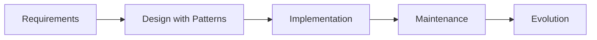

## 3.1.4 Importance of Design Patterns

In the ever-evolving field of software development, design patterns have emerged as indispensable tools for developers and organizations alike. They provide a structured approach to solving common design problems, thereby enhancing the overall quality and success of software projects. This section delves into the multifaceted importance of design patterns, illustrating their role in improving communication, enhancing code maintainability, promoting best practices, facilitating learning and onboarding, increasing problem-solving efficiency, and addressing scalability and flexibility.

### Improving Communication

One of the most significant advantages of design patterns is their ability to improve communication among developers. In a team setting, clear and effective communication is paramount. Design patterns offer a shared vocabulary that simplifies the discussion of complex design issues. When developers refer to a "Singleton" or "Observer" pattern, they are leveraging a well-defined concept that encapsulates a specific solution to a problem. This common language reduces misunderstandings and allows teams to collaborate more efficiently.

#### Example: The Observer Pattern

Consider a scenario where a team is developing a notification system. Without a design pattern, explaining the architecture might involve intricate details about how each component interacts. However, by stating that the system uses the Observer pattern, the team immediately understands the structure: a subject maintains a list of observers and notifies them of any state changes.

```javascript
// JavaScript Example of the Observer Pattern

class Subject {
    constructor() {
        this.observers = [];
    }

    addObserver(observer) {
        this.observers.push(observer);
    }

    notifyObservers(message) {
        this.observers.forEach(observer => observer.update(message));
    }
}

class Observer {
    update(message) {
        console.log(`Observer received message: ${message}`);
    }
}

// Usage
const subject = new Subject();
const observer1 = new Observer();
const observer2 = new Observer();

subject.addObserver(observer1);
subject.addObserver(observer2);

subject.notifyObservers('Hello Observers!');
```

This example demonstrates how the Observer pattern provides a clear framework for implementing a notification system, making it easier for team members to understand and discuss.

### Enhancing Code Maintainability

Design patterns play a crucial role in enhancing the maintainability of code. By adhering to proven solutions, developers can create systems that are easier to understand, modify, and extend. This is particularly important in large projects where codebases can become unwieldy over time.

#### Example: Singleton Pattern for Resource Management

Consider a scenario where an application needs to manage a single configuration object. Without a design pattern, developers might inadvertently create multiple instances, leading to inconsistent behavior. The Singleton pattern ensures that only one instance of the configuration object exists, simplifying management and reducing errors.

```python

class SingletonMeta(type):
    _instances = {}

    def __call__(cls, *args, **kwargs):
        if cls not in cls._instances:
            instance = super().__call__(*args, **kwargs)
            cls._instances[cls] = instance
        return cls._instances[cls]

class Configuration(metaclass=SingletonMeta):
    def __init__(self):
        self.settings = {"theme": "dark"}

config1 = Configuration()
config2 = Configuration()

print(config1 is config2)  # Output: True
```

By using the Singleton pattern, developers ensure that the configuration object is consistent throughout the application, making the codebase more maintainable.

### Promoting Best Practices

Design patterns encapsulate best practices that have been refined through years of software development. By following these patterns, developers can avoid common pitfalls and create robust, efficient systems.

#### Example: Factory Pattern for Object Creation

The Factory pattern is a prime example of promoting best practices in object creation. It abstracts the instantiation process, allowing for more flexible and scalable code.

```javascript
// JavaScript Example of the Factory Pattern

class Car {
    constructor(make, model) {
        this.make = make;
        this.model = model;
    }
}

class CarFactory {
    createCar(make, model) {
        return new Car(make, model);
    }
}

// Usage
const factory = new CarFactory();
const car1 = factory.createCar('Toyota', 'Corolla');
const car2 = factory.createCar('Honda', 'Civic');

console.log(car1, car2);
```

The Factory pattern provides a clear and standardized way to create objects, promoting code reuse and reducing duplication.

### Facilitating Learning and Onboarding

For new team members, understanding the architecture of a large codebase can be daunting. Design patterns provide a familiar framework that accelerates the learning process and helps newcomers get up to speed more quickly.

#### Example: Decorator Pattern for Extending Functionality

In a project using the Decorator pattern, new developers can easily identify how functionality is extended without modifying existing code.

```python

def bold_decorator(func):
    def wrapper():
        return f"<b>{func()}</b>"
    return wrapper

@bold_decorator
def greet():
    return "Hello, World!"

print(greet())  # Output: <b>Hello, World!</b>
```

By using the Decorator pattern, developers can add new features without altering the original function, making the code easier to understand and extend.

### Problem-Solving Efficiency

Design patterns provide templates for solving common problems, significantly reducing the time needed to design solutions from scratch. This efficiency is particularly valuable in fast-paced development environments where time is of the essence.

#### Example: Strategy Pattern for Dynamic Algorithms

The Strategy pattern allows developers to define a family of algorithms, encapsulate each one, and make them interchangeable. This approach simplifies the process of selecting the appropriate algorithm at runtime.

```javascript
// JavaScript Example of the Strategy Pattern

class Context {
    constructor(strategy) {
        this.strategy = strategy;
    }

    executeStrategy(a, b) {
        return this.strategy(a, b);
    }
}

const addStrategy = (a, b) => a + b;
const multiplyStrategy = (a, b) => a * b;

// Usage
const context = new Context(addStrategy);
console.log(context.executeStrategy(5, 3));  // Output: 8

context.strategy = multiplyStrategy;
console.log(context.executeStrategy(5, 3));  // Output: 15
```

The Strategy pattern allows for dynamic algorithm selection, making the codebase more flexible and adaptable to changing requirements.

### Scalability and Flexibility

Design patterns often address issues of scalability, performance, and flexibility inherently. By providing a structured approach to design, patterns help developers create systems that can grow and adapt to changing demands.

#### Example: Proxy Pattern for Resource Optimization

The Proxy pattern is used to control access to an object, often to defer the full cost of its creation and initialization until it is actually needed.

```python

class Image:
    def __init__(self, filename):
        self.filename = filename
        self.load_image()

    def load_image(self):
        print(f"Loading image from {self.filename}")

    def display(self):
        print(f"Displaying {self.filename}")

class ProxyImage:
    def __init__(self, filename):
        self.filename = filename
        self.image = None

    def display(self):
        if self.image is None:
            self.image = Image(self.filename)
        self.image.display()

proxy_image = ProxyImage("photo.jpg")
proxy_image.display()  # Output: Loading image from photo.jpg
                       #         Displaying photo.jpg
proxy_image.display()  # Output: Displaying photo.jpg
```

The Proxy pattern optimizes resource usage by delaying the creation of an object until it is needed, enhancing the scalability and performance of the system.

### Visualizing Design Patterns in the Software Development Process

To understand how design patterns fit into the broader software development process, consider the following diagram:



This flowchart illustrates how design patterns are integrated into the design phase, influencing implementation and maintenance, and ultimately supporting the evolution of the software.

### Key Points to Emphasize

- **Design Patterns as Essential Tools:** Design patterns are not just theoretical constructs; they are practical tools that enhance the effectiveness of software design.
- **Contribution to Software Quality:** By providing proven solutions, design patterns contribute to the overall quality and success of software projects.
- **Encouragement of Best Practices:** Patterns encapsulate best practices, guiding developers towards efficient and maintainable solutions.

In conclusion, the importance of design patterns in modern software development cannot be overstated. They improve communication, enhance code maintainability, promote best practices, facilitate learning, increase problem-solving efficiency, and address scalability and flexibility. By incorporating design patterns into their workflow, developers and organizations can achieve greater success in their software projects.

## Quiz Time!



### Design patterns help improve communication among developers by providing:

- [x] A common vocabulary for discussing solutions
- [ ] A way to write code faster
- [ ] A method for testing code
- [ ] An alternative to documentation

> **Explanation:** Design patterns offer a shared language that simplifies discussions about complex design issues, improving communication among team members.

### How do design patterns enhance code maintainability?

- [x] By providing proven solutions that are easier to understand and modify
- [ ] By making code run faster
- [ ] By reducing the number of lines of code
- [ ] By eliminating the need for comments

> **Explanation:** Design patterns lead to code that is easier to understand, modify, and extend, thereby enhancing maintainability.

### Which design pattern is used to ensure a class has only one instance?

- [x] Singleton
- [ ] Observer
- [ ] Factory
- [ ] Strategy

> **Explanation:** The Singleton pattern ensures that a class has only one instance and provides a global point of access to it.

### What is a key benefit of using the Factory pattern?

- [x] It abstracts the instantiation process, allowing for flexible object creation
- [ ] It ensures only one instance of a class exists
- [ ] It allows for dynamic algorithm selection
- [ ] It optimizes resource usage

> **Explanation:** The Factory pattern abstracts the process of object creation, promoting flexibility and scalability.

### Design patterns help facilitate learning and onboarding by:

- [x] Providing a familiar framework for understanding architecture
- [ ] Reducing the need for documentation
- [x] Making code easier to read
- [ ] Automating the onboarding process

> **Explanation:** Design patterns offer a familiar structure that accelerates the learning process for new team members.

### How do design patterns increase problem-solving efficiency?

- [x] By providing templates for solving common problems
- [ ] By reducing the number of bugs
- [ ] By automating code writing
- [ ] By eliminating the need for testing

> **Explanation:** Design patterns provide ready-made templates for solving common design issues, thus reducing the time needed to design solutions from scratch.

### Which pattern allows for dynamic algorithm selection at runtime?

- [x] Strategy
- [ ] Singleton
- [x] Factory
- [ ] Proxy

> **Explanation:** The Strategy pattern allows for dynamic selection of algorithms, making the codebase more flexible.

### What is the primary purpose of the Proxy pattern?

- [x] To control access to an object and optimize resource usage
- [ ] To ensure a class has only one instance
- [ ] To encapsulate a family of algorithms
- [ ] To provide a global point of access

> **Explanation:** The Proxy pattern controls access to an object, often deferring the full cost of its creation and initialization until it is needed.

### Which of the following is NOT a benefit of using design patterns?

- [ ] Improved communication
- [ ] Enhanced maintainability
- [ ] Problem-solving efficiency
- [x] Increased code complexity

> **Explanation:** Design patterns aim to reduce complexity by providing structured solutions to common problems, not increase it.

### Design patterns inherently address issues of scalability and flexibility.

- [x] True
- [ ] False

> **Explanation:** Many design patterns are designed to address issues of scalability and flexibility, making them suitable for evolving software systems.


