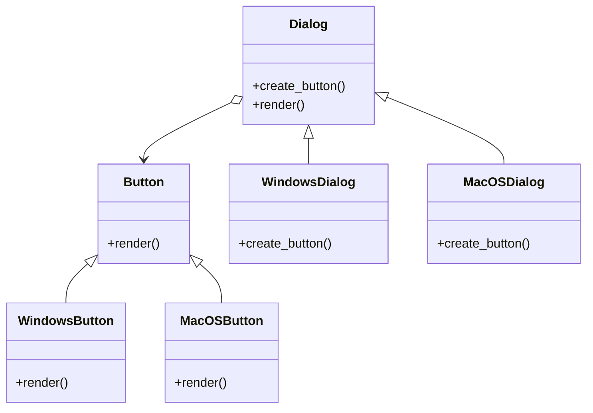

## 3.2.1 Creational Patterns

In the realm of software design, **creational patterns** play a pivotal role in managing the complexities of object creation. These patterns provide a structured approach to instantiating objects, making your code more flexible, reusable, and easier to maintain. This section delves into the core concepts of creational patterns, their purpose, and their common implementations in modern programming languages like Python and JavaScript.

### Understanding Creational Patterns

#### Definition

Creational patterns are design patterns that deal with object creation mechanisms. They abstract the instantiation process, allowing for more flexibility in deciding which objects need to be created for a given scenario. By encapsulating the creation logic, creational patterns help in managing the complexities associated with creating objects, especially when dealing with complex object hierarchies or dependencies.

#### Purpose

The primary purpose of creational patterns is to decouple the client code from the concrete classes it needs to instantiate. This decoupling provides several benefits:

- **Flexibility:** Creational patterns allow for flexibility in what gets created, who creates it, how it gets created, and when. This flexibility is crucial for adapting to changes in requirements without extensive modifications to existing code.
- **Reusability:** By abstracting the creation process, creational patterns promote code reuse. They allow developers to leverage existing creation logic across different parts of an application or even across different projects.
- **Maintainability:** With creational patterns, changes to object creation logic are localized, making the codebase easier to maintain and extend.

### Common Creational Patterns

Let's explore some of the most common creational patterns and understand how they contribute to effective software design.

#### Singleton Pattern

The **Singleton** pattern ensures that a class has only one instance and provides a global point of access to that instance. This pattern is useful when exactly one object is needed to coordinate actions across the system.

**Example in Python:**

```python
class SingletonMeta(type):
    _instances = {}

    def __call__(cls, *args, **kwargs):
        if cls not in cls._instances:
            instance = super().__call__(*args, **kwargs)
            cls._instances[cls] = instance
        return cls._instances[cls]

class Singleton(metaclass=SingletonMeta):
    def some_business_logic(self):
        pass

singleton1 = Singleton()
singleton2 = Singleton()

assert singleton1 is singleton2
```

**Explanation:**

- The `SingletonMeta` metaclass ensures that only one instance of the `Singleton` class is created.
- The `__call__` method checks if an instance already exists; if not, it creates one.
- `singleton1` and `singleton2` refer to the same instance, demonstrating the Singleton pattern.

#### Factory Method Pattern

The **Factory Method** pattern defines an interface for creating an object but lets subclasses alter the type of objects that will be created. This pattern is particularly useful for scenarios where a class cannot anticipate the class of objects it must create.

**Example in Python:**

```python
from abc import ABC, abstractmethod

class Button(ABC):
    @abstractmethod
    def render(self):
        pass

class WindowsButton(Button):
    def render(self):
        print("Render a button in Windows style")

class MacOSButton(Button):
    def render(self):
        print("Render a button in MacOS style")

class Dialog(ABC):
    @abstractmethod
    def create_button(self):
        pass

    def render(self):
        button = self.create_button()
        button.render()

class WindowsDialog(Dialog):
    def create_button(self):
        return WindowsButton()

class MacOSDialog(Dialog):
    def create_button(self):
        return MacOSButton()

dialog = WindowsDialog()
dialog.render()
```

**Explanation:**

- **Abstract Base Classes:** `Button` and `Dialog` are abstract classes that define the interface for buttons and dialogs, respectively.
- **Concrete Implementations:** `WindowsButton` and `MacOSButton` are concrete implementations of the `Button` interface.
- **Factory Method:** `create_button` is the factory method in the `Dialog` class that is overridden by subclasses `WindowsDialog` and `MacOSDialog` to create specific button instances.
- **Usage:** The `WindowsDialog` class creates a `WindowsButton`, demonstrating the Factory Method pattern.

**Class Diagram:**



#### Abstract Factory Pattern

The **Abstract Factory** pattern provides an interface for creating families of related or dependent objects without specifying their concrete classes. It is a super-factory that creates other factories, encapsulating a group of individual factories with a common theme.

**Example in Python:**

```python
from abc import ABC, abstractmethod

class GUIFactory(ABC):
    @abstractmethod
    def create_button(self):
        pass

    @abstractmethod
    def create_checkbox(self):
        pass

class WinFactory(GUIFactory):
    def create_button(self):
        return WindowsButton()

    def create_checkbox(self):
        return WindowsCheckbox()

class MacFactory(GUIFactory):
    def create_button(self):
        return MacOSButton()

    def create_checkbox(self):
        return MacOSCheckbox()

class Button(ABC):
    @abstractmethod
    def paint(self):
        pass

class WindowsButton(Button):
    def paint(self):
        print("Windows Button")

class MacOSButton(Button):
    def paint(self):
        print("MacOS Button")

class Checkbox(ABC):
    @abstractmethod
    def paint(self):
        pass

class WindowsCheckbox(Checkbox):
    def paint(self):
        print("Windows Checkbox")

class MacOSCheckbox(Checkbox):
    def paint(self):
        print("MacOS Checkbox")

def client_code(factory: GUIFactory):
    button = factory.create_button()
    checkbox = factory.create_checkbox()
    button.paint()
    checkbox.paint()

client_code(WinFactory())
client_code(MacFactory())
```

**Explanation:**

- **Abstract Factory:** `GUIFactory` defines the interface for creating related objects like buttons and checkboxes.
- **Concrete Factories:** `WinFactory` and `MacFactory` implement the `GUIFactory` interface to create Windows and MacOS components, respectively.
- **Client Code:** The `client_code` function uses the factory to create and use GUI components without knowing their specific classes.

#### Builder Pattern

The **Builder** pattern separates the construction of a complex object from its representation, allowing the same construction process to create different representations. It is useful when an object needs to be created in multiple steps or when an object has numerous configurations.

**Example in Python:**

```python
class Car:
    def __init__(self):
        self.parts = []

    def add(self, part):
        self.parts.append(part)

    def list_parts(self):
        print(f"Car parts: {', '.join(self.parts)}")

class Builder(ABC):
    @abstractmethod
    def produce_part_a(self):
        pass

    @abstractmethod
    def produce_part_b(self):
        pass

    @abstractmethod
    def produce_part_c(self):
        pass

class ConcreteBuilder1(Builder):
    def __init__(self):
        self.reset()

    def reset(self):
        self._product = Car()

    def produce_part_a(self):
        self._product.add("PartA1")

    def produce_part_b(self):
        self._product.add("PartB1")

    def produce_part_c(self):
        self._product.add("PartC1")

    def get_product(self):
        product = self._product
        self.reset()
        return product

class Director:
    def __init__(self):
        self._builder = None

    @property
    def builder(self):
        return self._builder

    @builder.setter
    def builder(self, builder):
        self._builder = builder

    def build_minimal_viable_product(self):
        self.builder.produce_part_a()

    def build_full_featured_product(self):
        self.builder.produce_part_a()
        self.builder.produce_part_b()
        self.builder.produce_part_c()

builder = ConcreteBuilder1()
director = Director()
director.builder = builder

print("Standard basic product:")
director.build_minimal_viable_product()
builder.get_product().list_parts()

print("Standard full featured product:")
director.build_full_featured_product()
builder.get_product().list_parts()

print("Custom product:")
builder.produce_part_a()
builder.produce_part_c()
builder.get_product().list_parts()
```

**Explanation:**

- **Builder Interface:** Defines methods for creating different parts of the product.
- **Concrete Builder:** Implements the builder interface and provides specific implementations for creating parts.
- **Director:** Constructs an object using the builder interface.
- **Product:** Represents the complex object being built, with methods to add parts and list them.

#### Prototype Pattern

The **Prototype** pattern specifies the kinds of objects to create using a prototypical instance and creates new objects by copying this prototype. It is useful for creating objects when the cost of creating a new instance is more expensive than copying an existing one.

**Example in Python:**

```python
import copy

class Prototype:
    def __init__(self):
        self._objects = {}

    def register_object(self, name, obj):
        self._objects[name] = obj

    def unregister_object(self, name):
        del self._objects[name]

    def clone(self, name, **attrs):
        obj = copy.deepcopy(self._objects.get(name))
        obj.__dict__.update(attrs)
        return obj

class Car:
    def __init__(self):
        self.make = "Ford"
        self.model = "Mustang"
        self.color = "Red"

    def __str__(self):
        return f"{self.make} {self.model} {self.color}"

prototype = Prototype()
car = Car()
prototype.register_object('ford', car)

car_clone = prototype.clone('ford', color='Blue')
print(car_clone)
```

**Explanation:**

- **Prototype Registry:** Manages a registry of objects that can be cloned.
- **Clone Method:** Creates a deep copy of the registered object and updates its attributes.
- **Usage:** Demonstrates cloning an object and modifying its attributes without altering the original.

### Benefits of Creational Patterns

Creational patterns offer several benefits that enhance software design:

- **System Complexity Reduction:** By abstracting the instantiation process, creational patterns reduce the complexity of the system and minimize dependencies between classes.
- **Enhanced Flexibility:** These patterns provide flexibility in object creation, allowing for easy adaptation to changes in requirements.
- **Reusability:** Creational patterns promote code reuse by encapsulating creation logic, making it easy to use the same logic across different parts of an application.

### Key Points to Emphasize

- **Flexibility in Object Creation:** Creational patterns provide flexibility in how objects are created, who creates them, and when they are created.
- **Decoupling Client Code:** By decoupling client code from concrete classes, these patterns enhance code maintainability and adaptability.
- **Managing Object Creation:** Creational patterns help manage object creation in a way that reduces complexity and enhances code reuse.

### Conclusion

Creational patterns are fundamental to effective software design, providing a structured approach to object creation that enhances flexibility, maintainability, and reusability. By understanding and applying these patterns, developers can create robust and adaptable software systems that meet the evolving needs of users and businesses.

## Quiz Time!



### What is the primary purpose of creational patterns?

- [x] To decouple the client code from the concrete classes it needs to instantiate
- [ ] To provide a specific algorithm for sorting data
- [ ] To manage the state of an object
- [ ] To define a family of algorithms

> **Explanation:** Creational patterns aim to decouple the client code from the concrete classes it needs to instantiate, providing flexibility in object creation.

### Which pattern ensures a class has only one instance?

- [x] Singleton
- [ ] Factory Method
- [ ] Abstract Factory
- [ ] Builder

> **Explanation:** The Singleton pattern ensures a class has only one instance and provides a global point of access to it.

### What does the Factory Method pattern define?

- [x] An interface for creating an object, but lets subclasses alter the type of objects that will be created
- [ ] A way to create objects using a prototypical instance
- [ ] A method for cloning objects
- [ ] A way to separate an object's construction from its representation

> **Explanation:** The Factory Method pattern defines an interface for creating an object, allowing subclasses to alter the type of objects that will be created.

### Which pattern provides an interface for creating families of related objects?

- [x] Abstract Factory
- [ ] Singleton
- [ ] Builder
- [ ] Prototype

> **Explanation:** The Abstract Factory pattern provides an interface for creating families of related or dependent objects without specifying their concrete classes.

### What is a key benefit of the Builder pattern?

- [x] It separates the construction of a complex object from its representation
- [ ] It ensures a class has only one instance
- [x] It allows the same construction process to create different representations
- [ ] It provides a way to clone objects

> **Explanation:** The Builder pattern separates the construction of a complex object from its representation, allowing the same construction process to create different representations.

### Which pattern is useful when the cost of creating a new instance is more expensive than copying an existing one?

- [x] Prototype
- [ ] Singleton
- [ ] Factory Method
- [ ] Builder

> **Explanation:** The Prototype pattern is useful for creating objects when the cost of creating a new instance is more expensive than copying an existing one.

### What does the Singleton pattern provide?

- [x] A global point of access to a single instance of a class
- [ ] An interface for creating families of related objects
- [x] A way to ensure a class has only one instance
- [ ] A method for creating objects using a prototypical instance

> **Explanation:** The Singleton pattern ensures a class has only one instance and provides a global point of access to it.

### In the Factory Method pattern, what is the role of the `create_button` method in the `Dialog` class?

- [x] It is the factory method that subclasses override to create specific button instances
- [ ] It paints the button on the screen
- [ ] It initializes the button's properties
- [ ] It registers the button with the operating system

> **Explanation:** In the Factory Method pattern, `create_button` is the factory method that subclasses override to create specific button instances.

### What is the role of the Director in the Builder pattern?

- [x] To construct an object using the builder interface
- [ ] To clone objects
- [ ] To provide a global point of access to a single instance
- [ ] To define an interface for creating families of related objects

> **Explanation:** The Director in the Builder pattern constructs an object using the builder interface.

### True or False: Creational patterns reduce system complexities and class dependencies.

- [x] True
- [ ] False

> **Explanation:** Creational patterns reduce system complexities and class dependencies by abstracting the instantiation process.


