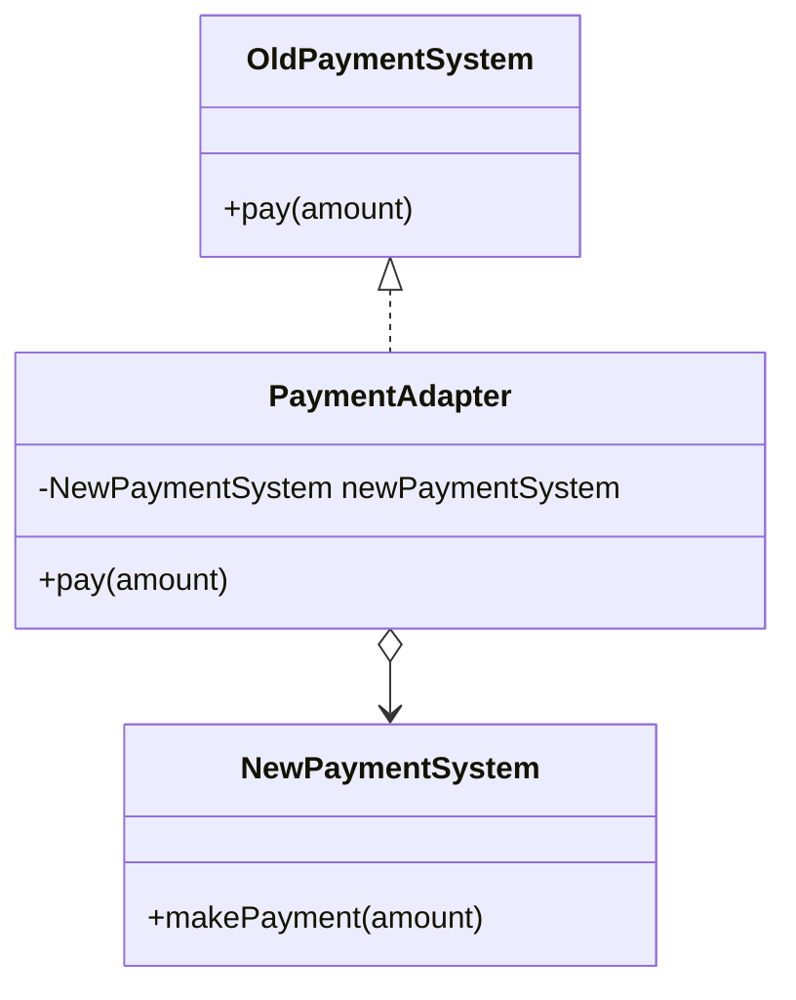

## 3.2.2 Structural Patterns

In the realm of software design, structural patterns play a crucial role by providing solutions to ease the design process through the identification of simple ways to realize relationships between entities. These patterns focus on how classes and objects can be composed to form larger structures, facilitating the design of complex systems with a focus on flexibility and reusability. In this section, we will delve into the essence of structural patterns, explore common examples, and understand their benefits in software architecture.

### Understanding Structural Patterns

**Definition:**  
Structural patterns are design patterns that simplify the design process by identifying straightforward methods to establish relationships between entities. They primarily utilize inheritance and composition to assemble interfaces and define ways to compose objects to obtain new functionalities.

**Purpose:**  
The primary goal of structural patterns is to facilitate the design of software systems by identifying simple ways to realize relationships between entities. This is typically achieved through the use of inheritance for interface composition and composition for defining object relationships. By doing so, structural patterns help in creating flexible and reusable code structures, which are easier to manage and extend.

### Common Structural Patterns

Structural patterns provide a variety of ways to organize code for better maintainability and flexibility. Here are some of the most commonly used structural patterns:

1. **Adapter Pattern:**  
   The Adapter pattern allows the interface of an existing class to be used as another interface. It is particularly useful when integrating new components into existing systems without modifying the existing codebase.

2. **Bridge Pattern:**  
   The Bridge pattern decouples an abstraction from its implementation, allowing the two to vary independently. This pattern is beneficial in scenarios where a system may need to switch between different implementations dynamically.

3. **Composite Pattern:**  
   The Composite pattern composes objects into tree structures to represent part-whole hierarchies. It allows clients to treat individual objects and compositions of objects uniformly, which is particularly useful in building complex UI components or file systems.

4. **Decorator Pattern:**  
   The Decorator pattern adds additional responsibilities to an object dynamically. It is a flexible alternative to subclassing for extending functionality, enabling behaviors to be added or removed at runtime.

5. **Facade Pattern:**  
   The Facade pattern provides a simplified interface to a complex subsystem. It hides the complexities of the subsystem from the client, making the subsystem easier to use.

6. **Flyweight Pattern:**  
   The Flyweight pattern reduces the cost of creating and manipulating a large number of similar objects. It achieves this by sharing common parts of objects between multiple contexts.

7. **Proxy Pattern:**  
   The Proxy pattern provides a surrogate or placeholder for another object to control access to it. This pattern is useful in scenarios such as lazy loading, access control, and logging.

### Benefits of Structural Patterns

Structural patterns offer several advantages in software design:

- **Code Reuse:** By defining common structures and interfaces, structural patterns promote code reuse across different parts of a system.
- **Flexibility:** These patterns enable systems to be more flexible by allowing components to be easily interchanged or extended.
- **Simplification:** Structural patterns simplify complex relationships between objects, making systems easier to understand and maintain.
- **Decoupling:** They help in decoupling the interface from the implementation, allowing changes to be made to one without affecting the other.

### The Adapter Pattern: A Detailed Example

The Adapter pattern is one of the most widely used structural patterns. It acts as a bridge between two incompatible interfaces, allowing them to work together. Let's explore an example in JavaScript to understand how the Adapter pattern works.

#### JavaScript Example: Adapter Pattern

```javascript
// Existing interface
class OldPaymentSystem {
    pay(amount) {
        console.log(`Paid ${amount} using Old Payment System`);
    }
}

// New interface
class NewPaymentSystem {
    makePayment(amount) {
        console.log(`Paid ${amount} using New Payment System`);
    }
}

// Adapter
class PaymentAdapter {
    constructor() {
        this.newPaymentSystem = new NewPaymentSystem();
    }

    pay(amount) {
        this.newPaymentSystem.makePayment(amount);
    }
}

// Client code
function processPayment(paymentSystem, amount) {
    paymentSystem.pay(amount);
}

const oldPaymentSystem = new OldPaymentSystem();
processPayment(oldPaymentSystem, 100);

const adapter = new PaymentAdapter();
processPayment(adapter, 200);
```

**Explanation:**  
In this example, the `OldPaymentSystem` and `NewPaymentSystem` classes have different interfaces for processing payments. The `PaymentAdapter` class acts as an adapter, allowing the `NewPaymentSystem` to be used with the existing `processPayment` function, which expects the `pay` method. This demonstrates how the Adapter pattern enables the integration of new components without altering existing code.

#### Visual Representation: Adapter Pattern

To better understand the relationships in the Adapter pattern, let's visualize it using a class diagram.



### Exploring Other Structural Patterns

While the Adapter pattern is a powerful tool for interface compatibility, other structural patterns offer unique benefits for different scenarios. Let's briefly explore each of them:

#### Bridge Pattern

The Bridge pattern is designed to separate an abstraction from its implementation, allowing both to evolve independently. This pattern is particularly useful in scenarios where a system may need to switch between different implementations dynamically.

**Example Scenario:**  
Consider a drawing application where shapes can be rendered in different formats (e.g., vector and raster). The Bridge pattern allows the shape abstraction to be decoupled from the rendering implementation, enabling each to vary independently.

```javascript
// Abstraction
class Shape {
    constructor(renderer) {
        this.renderer = renderer;
    }

    draw() {
        throw new Error("This method should be overridden");
    }
}

// Refined Abstraction
class Circle extends Shape {
    constructor(renderer, radius) {
        super(renderer);
        this.radius = radius;
    }

    draw() {
        this.renderer.renderCircle(this.radius);
    }
}

// Implementor
class Renderer {
    renderCircle(radius) {
        throw new Error("This method should be overridden");
    }
}

// Concrete Implementor A
class VectorRenderer extends Renderer {
    renderCircle(radius) {
        console.log(`Drawing a circle with radius ${radius} in vector format`);
    }
}

// Concrete Implementor B
class RasterRenderer extends Renderer {
    renderCircle(radius) {
        console.log(`Drawing a circle with radius ${radius} in raster format`);
    }
}

// Client code
const vectorCircle = new Circle(new VectorRenderer(), 5);
vectorCircle.draw();

const rasterCircle = new Circle(new RasterRenderer(), 5);
rasterCircle.draw();
```

In this example, the `Shape` class is the abstraction, and `Renderer` is the implementor. The `Circle` class is a refined abstraction, while `VectorRenderer` and `RasterRenderer` are concrete implementors. The Bridge pattern allows the `Circle` to use different rendering implementations without changing its code.

#### Composite Pattern

The Composite pattern is used to compose objects into tree structures to represent part-whole hierarchies. It allows clients to treat individual objects and compositions of objects uniformly.

**Example Scenario:**  
Consider a file system where files and directories are represented as nodes in a tree structure. The Composite pattern enables operations to be performed uniformly on both files and directories.

```javascript
// Component
class FileSystemComponent {
    getName() {
        throw new Error("This method should be overridden");
    }

    display(indent = 0) {
        throw new Error("This method should be overridden");
    }
}

// Leaf
class File extends FileSystemComponent {
    constructor(name) {
        super();
        this.name = name;
    }

    getName() {
        return this.name;
    }

    display(indent = 0) {
        console.log(`${' '.repeat(indent)}- ${this.name}`);
    }
}

// Composite
class Directory extends FileSystemComponent {
    constructor(name) {
        super();
        this.name = name;
        this.children = [];
    }

    add(component) {
        this.children.push(component);
    }

    remove(component) {
        this.children = this.children.filter(child => child !== component);
    }

    getName() {
        return this.name;
    }

    display(indent = 0) {
        console.log(`${' '.repeat(indent)}+ ${this.name}`);
        for (const child of this.children) {
            child.display(indent + 2);
        }
    }
}

// Client code
const root = new Directory("root");
const file1 = new File("file1.txt");
const file2 = new File("file2.txt");
const subDir = new Directory("subdir");
const file3 = new File("file3.txt");

root.add(file1);
root.add(subDir);
subDir.add(file2);
subDir.add(file3);

root.display();
```

In this example, the `FileSystemComponent` is the component interface, `File` is the leaf, and `Directory` is the composite. The Composite pattern allows the `Directory` to contain both `File` and other `Directory` objects, enabling hierarchical structures.

#### Decorator Pattern

The Decorator pattern is used to add additional responsibilities to an object dynamically. It provides a flexible alternative to subclassing for extending functionality.

**Example Scenario:**  
Consider a text editor where text can have various styles (e.g., bold, italic). The Decorator pattern allows styles to be added or removed dynamically without modifying the text class.

```javascript
// Component
class Text {
    getContent() {
        throw new Error("This method should be overridden");
    }
}

// Concrete Component
class PlainText extends Text {
    constructor(content) {
        super();
        this.content = content;
    }

    getContent() {
        return this.content;
    }
}

// Decorator
class TextDecorator extends Text {
    constructor(text) {
        super();
        this.text = text;
    }

    getContent() {
        return this.text.getContent();
    }
}

// Concrete Decorators
class BoldText extends TextDecorator {
    getContent() {
        return `<b>${super.getContent()}</b>`;
    }
}

class ItalicText extends TextDecorator {
    getContent() {
        return `<i>${super.getContent()}</i>`;
    }
}

// Client code
const plainText = new PlainText("Hello, World!");
const boldText = new BoldText(plainText);
const italicBoldText = new ItalicText(boldText);

console.log(plainText.getContent()); // Output: Hello, World!
console.log(boldText.getContent());  // Output: <b>Hello, World!</b>
console.log(italicBoldText.getContent()); // Output: <i><b>Hello, World!</b></i>
```

In this example, the `Text` class is the component interface, `PlainText` is the concrete component, and `TextDecorator` is the decorator. The `BoldText` and `ItalicText` classes are concrete decorators that add styles dynamically.

#### Facade Pattern

The Facade pattern provides a simplified interface to a complex subsystem. It hides the complexities of the subsystem from the client, making the subsystem easier to use.

**Example Scenario:**  
Consider a home theater system with various components like a TV, sound system, and DVD player. The Facade pattern can provide a simple interface to control all these components.

```javascript
// Subsystem classes
class TV {
    on() {
        console.log("TV is on");
    }

    off() {
        console.log("TV is off");
    }
}

class SoundSystem {
    on() {
        console.log("Sound system is on");
    }

    off() {
        console.log("Sound system is off");
    }
}

class DVDPlayer {
    play() {
        console.log("DVD is playing");
    }

    stop() {
        console.log("DVD is stopped");
    }
}

// Facade
class HomeTheaterFacade {
    constructor(tv, soundSystem, dvdPlayer) {
        this.tv = tv;
        this.soundSystem = soundSystem;
        this.dvdPlayer = dvdPlayer;
    }

    watchMovie() {
        this.tv.on();
        this.soundSystem.on();
        this.dvdPlayer.play();
        console.log("Enjoy your movie!");
    }

    endMovie() {
        this.dvdPlayer.stop();
        this.soundSystem.off();
        this.tv.off();
        console.log("Movie ended");
    }
}

// Client code
const tv = new TV();
const soundSystem = new SoundSystem();
const dvdPlayer = new DVDPlayer();
const homeTheater = new HomeTheaterFacade(tv, soundSystem, dvdPlayer);

homeTheater.watchMovie();
homeTheater.endMovie();
```

In this example, the `HomeTheaterFacade` class provides a simplified interface for controlling the TV, sound system, and DVD player, hiding the complexities of the subsystem from the client.

#### Flyweight Pattern

The Flyweight pattern reduces the cost of creating and manipulating a large number of similar objects by sharing common parts of objects between multiple contexts.

**Example Scenario:**  
Consider a text editor where each character is represented as an object. The Flyweight pattern can be used to share character objects to reduce memory usage.

```javascript
// Flyweight
class Character {
    constructor(char) {
        this.char = char;
    }

    display(position) {
        console.log(`Character ${this.char} at position ${position}`);
    }
}

// Flyweight Factory
class CharacterFactory {
    constructor() {
        this.characters = {};
    }

    getCharacter(char) {
        if (!this.characters[char]) {
            this.characters[char] = new Character(char);
        }
        return this.characters[char];
    }
}

// Client code
const factory = new CharacterFactory();
const text = "hello world";

for (let i = 0; i < text.length; i++) {
    const char = factory.getCharacter(text[i]);
    char.display(i);
}
```

In this example, the `CharacterFactory` class creates and manages `Character` objects, ensuring that each character is created only once and shared across multiple contexts.

#### Proxy Pattern

The Proxy pattern provides a surrogate or placeholder for another object to control access to it. This pattern is useful in scenarios such as lazy loading, access control, and logging.

**Example Scenario:**  
Consider a large image that takes time to load. The Proxy pattern can provide a placeholder image until the actual image is loaded.

```javascript
// Real Subject
class RealImage {
    constructor(filename) {
        this.filename = filename;
        this.loadFromDisk();
    }

    loadFromDisk() {
        console.log(`Loading ${this.filename} from disk`);
    }

    display() {
        console.log(`Displaying ${this.filename}`);
    }
}

// Proxy
class ProxyImage {
    constructor(filename) {
        this.filename = filename;
        this.realImage = null;
    }

    display() {
        if (!this.realImage) {
            this.realImage = new RealImage(this.filename);
        }
        this.realImage.display();
    }
}

// Client code
const image = new ProxyImage("large_image.jpg");
image.display(); // Image is loaded from disk
image.display(); // Image is displayed without loading again
```

In this example, the `ProxyImage` class acts as a proxy for the `RealImage` class, controlling access to the real image and delaying its loading until necessary.

### Key Points to Emphasize

- **Organizing Code:** Structural patterns help organize code for better maintainability by defining clear interfaces and relationships between components.
- **Decoupling:** They focus on decoupling the interface from the implementation, allowing changes to be made to one without affecting the other.
- **Flexibility and Reusability:** Structural patterns promote flexibility and reusability by enabling components to be easily interchanged or extended.
- **Simplification:** These patterns simplify complex relationships between objects, making systems easier to understand and maintain.

### Conclusion

Structural patterns are essential tools in software design that provide solutions for organizing code and managing complex relationships between objects. By understanding and applying these patterns, developers can create flexible, reusable, and maintainable software systems. Whether it's using the Adapter pattern to integrate new components or the Composite pattern to build hierarchical structures, structural patterns offer a wide range of benefits that enhance software architecture.

## Quiz Time!



### What is the primary purpose of structural patterns in software design?

- [x] To facilitate the design of software by identifying simple ways to realize relationships between entities.
- [ ] To provide solutions for creating new algorithms.
- [ ] To manage the lifecycle of objects.
- [ ] To handle concurrency in software systems.

> **Explanation:** Structural patterns focus on identifying simple ways to realize relationships between entities, usually through inheritance and composition.


### Which pattern allows the interface of an existing class to be used as another interface?

- [x] Adapter
- [ ] Bridge
- [ ] Composite
- [ ] Decorator

> **Explanation:** The Adapter pattern allows the interface of an existing class to be used as another interface, enabling compatibility between different interfaces.


### What does the Bridge pattern decouple?

- [x] An abstraction from its implementation.
- [ ] A client from its server.
- [ ] A method from its class.
- [ ] A function from its parameters.

> **Explanation:** The Bridge pattern decouples an abstraction from its implementation, allowing both to vary independently.


### Which pattern is used to compose objects into tree structures to represent part-whole hierarchies?

- [x] Composite
- [ ] Facade
- [ ] Proxy
- [ ] Flyweight

> **Explanation:** The Composite pattern is used to compose objects into tree structures to represent part-whole hierarchies, allowing clients to treat individual objects and compositions of objects uniformly.


### How does the Decorator pattern enhance objects?

- [x] By adding additional responsibilities to an object dynamically.
- [ ] By removing unnecessary methods from an object.
- [x] By providing a simplified interface to a complex subsystem.
- [ ] By controlling access to an object.

> **Explanation:** The Decorator pattern enhances objects by adding additional responsibilities dynamically, providing a flexible alternative to subclassing.


### What is the main advantage of the Facade pattern?

- [x] It provides a simplified interface to a complex subsystem.
- [ ] It reduces the number of classes in a system.
- [ ] It allows for dynamic method invocation.
- [ ] It ensures data consistency across multiple objects.

> **Explanation:** The Facade pattern provides a simplified interface to a complex subsystem, making it easier for clients to use.


### Which pattern is useful for reducing the cost of creating a large number of similar objects?

- [x] Flyweight
- [ ] Proxy
- [x] Adapter
- [ ] Bridge

> **Explanation:** The Flyweight pattern is useful for reducing the cost of creating and manipulating a large number of similar objects by sharing common parts.


### How does the Proxy pattern control access to an object?

- [x] By providing a surrogate or placeholder for the object.
- [ ] By encrypting the object's data.
- [ ] By logging all interactions with the object.
- [ ] By duplicating the object.

> **Explanation:** The Proxy pattern controls access to an object by providing a surrogate or placeholder, which can manage access and additional responsibilities.


### In the Adapter pattern, what role does the adapter class play?

- [x] It acts as a bridge between two incompatible interfaces.
- [ ] It provides additional functionality to an object.
- [ ] It reduces the number of objects in a system.
- [ ] It simplifies a complex subsystem.

> **Explanation:** In the Adapter pattern, the adapter class acts as a bridge between two incompatible interfaces, allowing them to work together.


### True or False: Structural patterns primarily focus on how objects are created.

- [ ] True
- [x] False

> **Explanation:** False. Structural patterns primarily focus on how classes and objects are composed to form larger structures, not on how objects are created.


