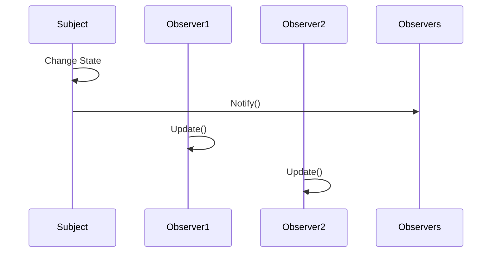

## 3.2.3 Behavioral Patterns

In the realm of software design, behavioral patterns play a pivotal role in defining how objects interact and communicate with each other. These patterns are crucial for managing complex control flows and ensuring that systems remain flexible and maintainable as they grow. This section delves into the essence of behavioral design patterns, their purpose, and provides practical examples to illustrate their implementation.

### Understanding Behavioral Patterns

**Definition:**

Behavioral design patterns are concerned with algorithms and the assignment of responsibilities between objects. They focus on the interactions between objects, ensuring that these interactions are efficient and manageable.

**Purpose:**

- **Manage Object Interactions:** Behavioral patterns streamline the communication between objects, allowing for flexible and dynamic interactions.
- **Encapsulate Behavior:** These patterns encapsulate behavior within objects, enabling the delegation of requests and responsibilities.
- **Promote Loose Coupling:** By defining clear interaction protocols, behavioral patterns reduce dependencies between objects, promoting loose coupling and enhancing system modularity.

### Common Behavioral Patterns

Behavioral patterns are diverse, each addressing specific interaction challenges in software design. Here, we explore some of the most widely used behavioral patterns:

#### Strategy Pattern

The Strategy pattern defines a family of algorithms, encapsulates each one, and makes them interchangeable. This pattern allows the algorithm to vary independently from the clients that use it.

**Use Case:** When multiple algorithms are available for a task, and the choice of algorithm should be made at runtime.

**Example:**

Imagine a payment system where different payment methods (credit card, PayPal, cryptocurrency) can be used interchangeably. The Strategy pattern can be used to encapsulate these payment methods.

```python
class PaymentStrategy:
    def pay(self, amount):
        pass

class CreditCardPayment(PaymentStrategy):
    def pay(self, amount):
        print(f"Paying {amount} using Credit Card.")

class PayPalPayment(PaymentStrategy):
    def pay(self, amount):
        print(f"Paying {amount} using PayPal.")

class ShoppingCart:
    def __init__(self, strategy: PaymentStrategy):
        self._strategy = strategy

    def checkout(self, amount):
        self._strategy.pay(amount)

cart = ShoppingCart(CreditCardPayment())
cart.checkout(100)

cart = ShoppingCart(PayPalPayment())
cart.checkout(200)
```

#### Observer Pattern

The Observer pattern establishes a subscription mechanism to notify multiple objects about any events that happen to the object they observe. It's particularly useful in scenarios where a change in one object requires updates to others.

**Use Case:** When an object needs to notify other objects without making assumptions about who those objects are.

**Example:**

Consider a data monitoring system where multiple observers need to be notified whenever the data changes.

```python
class Observer:
    def update(self, subject):
        pass

class Subject:
    def __init__(self):
        self._observers = []

    def attach(self, observer):
        self._observers.append(observer)

    def detach(self, observer):
        self._observers.remove(observer)

    def notify(self):
        for observer in self._observers:
            observer.update(self)

class DataSubject(Subject):
    def __init__(self):
        super().__init__()
        self._data = None

    @property
    def data(self):
        return self._data

    @data.setter
    def data(self, value):
        self._data = value
        self.notify()

class DataObserver(Observer):
    def update(self, subject):
        print(f"Observer: Data has changed to {subject.data}")

subject = DataSubject()
observer1 = DataObserver()
observer2 = DataObserver()

subject.attach(observer1)
subject.attach(observer2)

subject.data = 10
```

In this example, when the `data` property of `DataSubject` changes, all attached observers are notified and updated accordingly.

**Sequence Diagram:**

The following sequence diagram illustrates the notification process in the Observer pattern:



#### Command Pattern

The Command pattern encapsulates a request as an object, thereby allowing for parameterization and queuing of requests. It decouples the object that invokes the operation from the one that knows how to perform it.

**Use Case:** When you need to issue requests to objects without knowing anything about the operation being requested or the receiver of the request.

**Example:**

A remote control system where each button press corresponds to a command object that encapsulates the request.

```python
class Command:
    def execute(self):
        pass

class Light:
    def on(self):
        print("The light is on")

    def off(self):
        print("The light is off")

class LightOnCommand(Command):
    def __init__(self, light: Light):
        self._light = light

    def execute(self):
        self._light.on()

class LightOffCommand(Command):
    def __init__(self, light: Light):
        self._light = light

    def execute(self):
        self._light.off()

class RemoteControl:
    def __init__(self):
        self._commands = {}

    def set_command(self, button, command: Command):
        self._commands[button] = command

    def press_button(self, button):
        if button in self._commands:
            self._commands[button].execute()

light = Light()
light_on = LightOnCommand(light)
light_off = LightOffCommand(light)

remote = RemoteControl()
remote.set_command("ON", light_on)
remote.set_command("OFF", light_off)

remote.press_button("ON")
remote.press_button("OFF")
```

#### Iterator Pattern

The Iterator pattern provides a way to access the elements of an aggregate object sequentially without exposing its underlying representation.

**Use Case:** When you need to traverse a collection without exposing its internal structure.

**Example:**

A collection of books where an iterator is used to traverse the collection.

```python
class Book:
    def __init__(self, title):
        self.title = title

class BookCollection:
    def __init__(self):
        self._books = []

    def add_book(self, book):
        self._books.append(book)

    def __iter__(self):
        return iter(self._books)

collection = BookCollection()
collection.add_book(Book("Book 1"))
collection.add_book(Book("Book 2"))

for book in collection:
    print(book.title)
```

#### State Pattern

The State pattern allows an object to alter its behavior when its internal state changes. The object will appear to change its class.

**Use Case:** When an object's behavior depends on its state, and it must change its behavior at runtime depending on that state.

**Example:**

A traffic light system where the behavior changes based on the current state (red, yellow, green).

```python
class TrafficLightState:
    def handle(self):
        pass

class RedLight(TrafficLightState):
    def handle(self):
        print("Red Light - Stop")

class YellowLight(TrafficLightState):
    def handle(self):
        print("Yellow Light - Caution")

class GreenLight(TrafficLightState):
    def handle(self):
        print("Green Light - Go")

class TrafficLight:
    def __init__(self, state: TrafficLightState):
        self._state = state

    def change_state(self, state: TrafficLightState):
        self._state = state

    def handle(self):
        self._state.handle()

light = TrafficLight(RedLight())
light.handle()

light.change_state(GreenLight())
light.handle()

light.change_state(YellowLight())
light.handle()
```

#### Template Method Pattern

The Template Method pattern defines the skeleton of an algorithm in an operation, deferring some steps to subclasses. It allows subclasses to redefine certain steps of an algorithm without changing its structure.

**Use Case:** When you have an algorithm that can be broken down into steps, and some of these steps need to be implemented by subclasses.

**Example:**

A data processing system where the processing steps are defined in a template method, but specific steps are implemented by subclasses.

```python
class DataProcessor:
    def process(self):
        self.load_data()
        self.analyze_data()
        self.save_data()

    def load_data(self):
        pass

    def analyze_data(self):
        pass

    def save_data(self):
        print("Data saved")

class CSVDataProcessor(DataProcessor):
    def load_data(self):
        print("Loading CSV data")

    def analyze_data(self):
        print("Analyzing CSV data")

processor = CSVDataProcessor()
processor.process()
```

### Benefits of Behavioral Patterns

Behavioral patterns offer several advantages in software design:

- **Loose Coupling:** By clearly defining interaction protocols, these patterns reduce dependencies between objects, promoting loose coupling.
- **Flexibility:** They provide flexibility in how objects communicate and interact, making it easier to modify and extend systems.
- **Encapsulation:** By encapsulating behavior, these patterns enhance code organization and readability.
- **Maintainability:** By managing complex control flows, behavioral patterns make systems easier to maintain and evolve.

### Key Points to Emphasize

- **Focus on Communication:** Behavioral patterns primarily focus on the communication between objects, ensuring that interactions are efficient and manageable.
- **Complex Control Flows:** They help manage complex control flows in a clean and maintainable way, enhancing system flexibility and scalability.

### Conclusion

Behavioral design patterns are essential tools in the software architect's toolkit. By providing structured ways to manage interactions and responsibilities, they enable the creation of flexible, maintainable, and scalable systems. As you continue your journey in software design, understanding and applying these patterns will empower you to tackle complex design challenges with confidence.

## Quiz Time!



### What is the primary concern of behavioral design patterns?

- [x] Algorithms and the assignment of responsibilities between objects
- [ ] The physical structure of the code
- [ ] The visual representation of the user interface
- [ ] The scalability of the database

> **Explanation:** Behavioral patterns focus on the interactions and communication between objects, managing algorithms and responsibilities.

### Which pattern defines a family of algorithms and makes them interchangeable?

- [x] Strategy
- [ ] Observer
- [ ] Command
- [ ] Template Method

> **Explanation:** The Strategy pattern encapsulates algorithms, allowing them to be interchangeable.

### In the Observer pattern, what happens when the subject's state changes?

- [x] All attached observers are notified and updated
- [ ] The subject is reset to its initial state
- [ ] The observers detach themselves
- [ ] The subject changes its type

> **Explanation:** The Observer pattern ensures that all observers are notified when the subject's state changes.

### Which pattern encapsulates a request as an object?

- [x] Command
- [ ] Iterator
- [ ] State
- [ ] Strategy

> **Explanation:** The Command pattern encapsulates requests as objects, allowing for parameterization and queuing.

### What is the main use case for the Iterator pattern?

- [x] To traverse a collection without exposing its internal structure
- [ ] To notify multiple objects about an event
- [ ] To encapsulate a request as an object
- [ ] To allow an object to alter its behavior when its state changes

> **Explanation:** The Iterator pattern provides a way to access elements of a collection without exposing its internal structure.

### In which pattern does an object alter its behavior when its internal state changes?

- [x] State
- [ ] Observer
- [ ] Command
- [ ] Template Method

> **Explanation:** The State pattern allows an object to change its behavior based on its state.

### Which pattern defines the skeleton of an algorithm, deferring some steps to subclasses?

- [x] Template Method
- [ ] Strategy
- [ ] Observer
- [ ] Command

> **Explanation:** The Template Method pattern defines the algorithm's skeleton, allowing subclasses to implement specific steps.

### What is the benefit of using behavioral patterns in software design?

- [x] They promote loose coupling and flexibility in object interactions
- [ ] They increase the complexity of the code
- [ ] They simplify the database schema
- [ ] They enhance the visual appearance of the application

> **Explanation:** Behavioral patterns promote loose coupling and flexibility, improving communication between objects.

### Which pattern is best suited for a scenario where multiple algorithms can be used interchangeably?

- [x] Strategy
- [ ] Observer
- [ ] Command
- [ ] State

> **Explanation:** The Strategy pattern is designed for scenarios where multiple algorithms can be used interchangeably.

### True or False: Behavioral patterns are primarily concerned with the physical structure of the code.

- [ ] True
- [x] False

> **Explanation:** Behavioral patterns focus on the interactions and responsibilities between objects, not the physical code structure.


