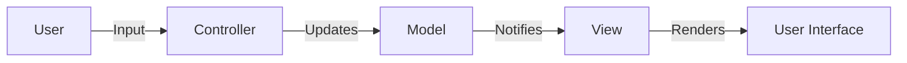

## 3.2.4 Other Types of Patterns

In the realm of software design, patterns serve as time-tested solutions to common problems. While the classic Gang of Four (GoF) patterns are well-known for their role in object-oriented design, there exists a broader spectrum of patterns that address various aspects of software architecture and concurrency. This section explores these additional categories, providing insights into how they help in designing robust, scalable, and maintainable systems.

### Understanding Architectural Patterns

Architectural patterns are high-level strategies that define the structure and organization of software systems. They provide a blueprint for system architecture, guiding the arrangement of components and their interactions. Unlike design patterns, which focus on individual components or classes, architectural patterns address system-wide concerns and are crucial for achieving scalability, flexibility, and maintainability.

#### Model-View-Controller (MVC)

The Model-View-Controller (MVC) pattern is a cornerstone in software architecture, particularly in web applications. It separates an application into three interconnected components:

- **Model:** Represents the data and business logic of the application. It is responsible for managing the data and responding to requests for information or updates.
- **View:** Handles the presentation layer, displaying data to the user and capturing user input.
- **Controller:** Acts as an intermediary between the Model and the View, processing user input and updating the Model or View accordingly.

**Example: Simplified MVC in JavaScript**

```javascript
// Model
class Model {
    constructor() {
        this.data = '';
    }
    setData(data) {
        this.data = data;
    }
    getData() {
        return this.data;
    }
}

// View
class View {
    constructor() {
        this.display = document.getElementById('display');
    }
    render(data) {
        this.display.textContent = data;
    }
}

// Controller
class Controller {
    constructor(model, view) {
        this.model = model;
        this.view = view;
        // Event listeners
        document.getElementById('input').addEventListener('input', (e) => {
            this.updateData(e.target.value);
        });
    }
    updateData(data) {
        this.model.setData(data);
        this.view.render(this.model.getData());
    }
}

// Usage
const app = new Controller(new Model(), new View());
```

**Explanation:**

In this example, the separation of concerns is clear: the Model manages data, the View handles the display, and the Controller processes input and updates the Model. This separation aids in organizing code, making it easier to manage and extend.

**Diagram: MVC Components and Interactions**



#### Client-Server

The Client-Server pattern divides a system into two main components: clients and servers. Clients request services, and servers provide them. This pattern is foundational in networked applications, where multiple clients interact with a central server.

**Characteristics:**

- **Decoupling:** Clients and servers are decoupled, allowing independent development and scaling.
- **Scalability:** Servers can handle multiple client requests simultaneously, and load balancing can be implemented to manage traffic.

#### Microservices

Microservices architecture structures applications as a collection of loosely coupled services. Each service is independent, focusing on a specific business capability, and can be developed, deployed, and scaled independently.

**Key Benefits:**

- **Scalability:** Services can be scaled independently based on demand.
- **Resilience:** Failure in one service does not affect the entire system.
- **Flexibility:** Services can be developed using different technologies.

### Concurrency Patterns

Concurrency patterns address challenges in multi-threaded programming and parallel execution. They provide solutions for managing concurrent operations, ensuring efficient and safe execution.

#### Producer-Consumer

The Producer-Consumer pattern coordinates data exchange between producer and consumer threads. Producers generate data, and consumers process it, often using a shared buffer or queue to manage the data flow.

**Implementation Considerations:**

- **Synchronization:** Ensures that producers and consumers do not access the buffer simultaneously, preventing data corruption.
- **Buffer Management:** Choosing the right buffer size is crucial for balancing between throughput and resource usage.

#### Thread Pool

The Thread Pool pattern manages a collection of reusable threads, optimizing resource usage by reusing threads for multiple tasks. This pattern is essential in environments where thread creation and destruction are costly operations.

**Advantages:**

- **Performance:** Reduces the overhead of thread creation and destruction.
- **Resource Management:** Limits the number of concurrent threads, preventing resource exhaustion.

#### Monitor Object

The Monitor Object pattern synchronizes access to an object, ensuring that only one thread can execute a method at a time. This pattern is vital for maintaining data consistency in multi-threaded environments.

**Key Concepts:**

- **Mutual Exclusion:** Only one thread can access the object's methods at a time.
- **Condition Variables:** Allow threads to wait for certain conditions to be met before proceeding.

### Other Pattern Types

Beyond architectural and concurrency patterns, there are additional types of patterns that address specific needs in software design.

#### Anti-Patterns

Anti-patterns are common responses to recurring problems that are ineffective and counterproductive. Recognizing and avoiding anti-patterns is crucial for maintaining code quality and avoiding technical debt.

**Examples:**

- **Spaghetti Code:** Code with a complex and tangled control structure, making it difficult to understand and maintain.
- **God Object:** An object that knows too much or does too much, violating the single responsibility principle.

#### Domain-Specific Patterns

Domain-specific patterns apply to specific domains, such as user interface design, data access, or networking. These patterns provide targeted solutions for common problems within a particular domain.

**Examples:**

- **Active Record:** A pattern for data access where an object wraps a row in a database table, encapsulating database access and business logic.
- **Observer:** A pattern often used in user interface design, where an object maintains a list of dependents and notifies them of state changes.

### Importance of These Patterns

Understanding architectural and concurrency patterns is crucial for designing scalable and maintainable systems. These patterns address broader concerns in software design, providing solutions to challenges that extend beyond object-oriented design.

**Key Points to Emphasize:**

- **Architectural Patterns:** Address system-wide concerns, guiding the overall structure and organization of software systems.
- **Concurrency Patterns:** Provide solutions for managing concurrent operations, ensuring efficient and safe execution.
- **Anti-Patterns and Domain-Specific Patterns:** Highlight the importance of recognizing ineffective solutions and applying targeted patterns within specific domains.

### Conclusion

Incorporating architectural and concurrency patterns into your design toolkit expands your ability to address complex software challenges. By understanding these patterns, you can design systems that are not only functional but also scalable, maintainable, and resilient.

## Quiz Time!



### Which component in the MVC pattern is responsible for handling the presentation layer?

- [ ] Model
- [x] View
- [ ] Controller
- [ ] User

> **Explanation:** The View component is responsible for handling the presentation layer, displaying data to the user and capturing user input.

### What is a key benefit of using the Microservices architectural pattern?

- [x] Scalability
- [ ] Tight coupling
- [ ] Centralized control
- [ ] Single point of failure

> **Explanation:** Microservices architecture allows for independent scaling of services, making the system more scalable and resilient.

### In the Producer-Consumer pattern, what is often used to manage the data flow between producers and consumers?

- [ ] Direct method calls
- [ ] Global variables
- [x] Shared buffer or queue
- [ ] Separate databases

> **Explanation:** A shared buffer or queue is commonly used to manage the data flow between producers and consumers, ensuring synchronization and efficient data exchange.

### What problem does the Thread Pool pattern primarily address?

- [ ] Data consistency
- [ ] User interface design
- [x] Resource management
- [ ] Network latency

> **Explanation:** The Thread Pool pattern addresses resource management by reusing threads for multiple tasks, reducing the overhead of thread creation and destruction.

### Which of the following is an example of an anti-pattern?

- [x] Spaghetti Code
- [ ] MVC
- [ ] Producer-Consumer
- [x] God Object

> **Explanation:** Spaghetti Code and God Object are examples of anti-patterns, which are ineffective and counterproductive solutions to common problems.

### What is the primary role of the Controller in the MVC pattern?

- [ ] To store data
- [x] To process user input and update the Model or View
- [ ] To render the user interface
- [ ] To manage network requests

> **Explanation:** The Controller processes user input and updates the Model or View accordingly, acting as an intermediary between them.

### How does the Client-Server pattern enhance scalability?

- [x] By decoupling clients and servers
- [ ] By using a single server for all requests
- [ ] By tightly coupling clients and servers
- [ ] By limiting the number of clients

> **Explanation:** The Client-Server pattern enhances scalability by decoupling clients and servers, allowing independent development and scaling.

### Which pattern is often used in user interface design to notify dependents of state changes?

- [x] Observer
- [ ] Singleton
- [ ] Factory
- [ ] Adapter

> **Explanation:** The Observer pattern is often used in user interface design to notify dependents of state changes, ensuring they are updated accordingly.

### What is a common characteristic of domain-specific patterns?

- [ ] They apply to all domains
- [x] They provide targeted solutions for specific domains
- [ ] They are ineffective in practice
- [ ] They are only used in legacy systems

> **Explanation:** Domain-specific patterns provide targeted solutions for specific domains, addressing common problems within those areas.

### True or False: Architectural patterns only apply to object-oriented programming.

- [ ] True
- [x] False

> **Explanation:** Architectural patterns apply to various programming paradigms, not just object-oriented programming, addressing system-wide concerns.


