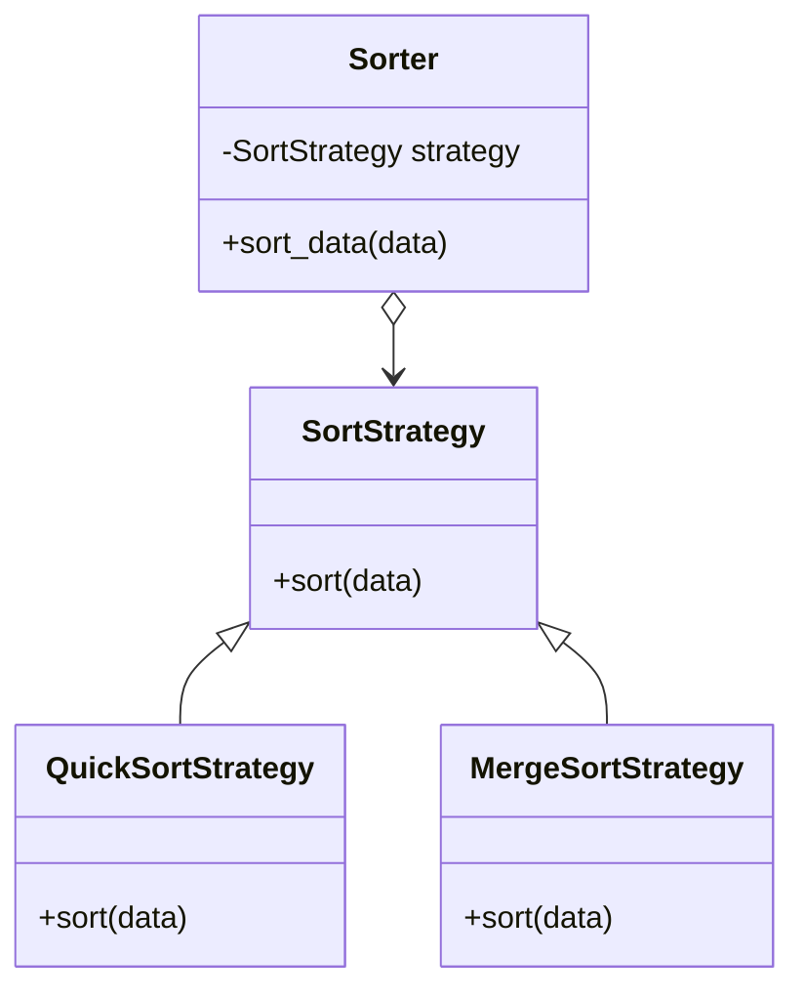

## 3.3.1 Code Reusability

In the ever-evolving landscape of software development, the ability to write reusable code is a significant advantage. Code reusability not only boosts efficiency but also ensures consistency and reliability across software projects. In this section, we delve into the concept of code reusability, its benefits, and how design patterns play a pivotal role in achieving it. We will explore practical examples and provide insights into implementing reusable code using design patterns like the Strategy and Singleton patterns.

### Understanding Code Reusability

**Code reusability** refers to the practice of using existing code to build new functionalities or software applications. This approach minimizes redundancy, reduces development time, and enhances the quality of the software. By reusing code, developers can focus on solving new challenges rather than reinventing solutions to problems that have already been addressed.

#### Benefits of Code Reusability

1. **Efficiency:** Reusing code saves time and resources. Developers can leverage existing solutions, allowing them to focus on unique aspects of a project.
2. **Consistency:** Reusable code promotes uniformity across different parts of an application or even across different projects. This consistency makes it easier to maintain and update the software.
3. **Quality Assurance:** Utilizing well-tested and proven code reduces the likelihood of errors, enhancing the overall quality of the software.

### The Role of Design Patterns in Code Reusability

Design patterns are established solutions to common problems encountered in software design. They serve as templates that can be adapted to various scenarios, promoting code reusability and consistency.

#### How Design Patterns Enhance Reusability

- **Proven Solutions:** Design patterns provide a tested framework for solving recurring design issues, reducing the need to develop new solutions from scratch.
- **Adaptability:** Patterns can be tailored to fit specific needs without altering their core structure, making them versatile tools in a developer's toolkit.
- **Documentation and Communication:** Design patterns offer a common language for developers, improving communication and understanding within development teams.

### Practical Examples of Code Reusability with Design Patterns

To illustrate the concept of code reusability, let's explore two design patterns: the Strategy pattern and the Singleton pattern.

#### The Strategy Pattern

The Strategy pattern is a behavioral design pattern that enables selecting an algorithm's behavior at runtime. It defines a family of algorithms, encapsulates each one, and makes them interchangeable. This pattern is particularly useful for situations where multiple algorithms can be applied to a problem, and the choice of algorithm might change.

**Scenario:** Imagine a sorting application that can use different sorting algorithms based on user preference or data characteristics. By implementing the Strategy pattern, you can switch between algorithms without modifying the core logic of the application.

**Python Example: Strategy Pattern**

```python
from abc import ABC, abstractmethod

class SortStrategy(ABC):
    @abstractmethod
    def sort(self, data):
        pass

class QuickSortStrategy(SortStrategy):
    def sort(self, data):
        print("Sorting using quick sort")
        # Implement quick sort algorithm

class MergeSortStrategy(SortStrategy):
    def sort(self, data):
        print("Sorting using merge sort")
        # Implement merge sort algorithm

class Sorter:
    def __init__(self, strategy: SortStrategy):
        self.strategy = strategy

    def sort_data(self, data):
        self.strategy.sort(data)

data = [5, 2, 9, 1]
sorter = Sorter(QuickSortStrategy())
sorter.sort_data(data)
```

In this example, the `Sorter` class can use any sorting strategy that implements the `SortStrategy` interface. This design promotes code reusability by allowing different sorting algorithms to be used interchangeably without changing the `Sorter` class.

**Visual Representation: Strategy Pattern**



This diagram illustrates the relationship between the `Sorter` class and the various sorting strategies, highlighting how different strategies can be plugged into the `Sorter` class.

#### The Singleton Pattern

The Singleton pattern ensures that a class has only one instance and provides a global point of access to it. This pattern is particularly useful for managing shared resources, such as a configuration object or a connection pool.

**Scenario:** Consider an application that requires a single instance of a configuration manager to handle application settings. The Singleton pattern ensures that only one instance of the configuration manager exists, preventing inconsistencies and potential conflicts.

**Python Example: Singleton Pattern**

```python
class SingletonMeta(type):
    _instances = {}

    def __call__(cls, *args, **kwargs):
        if cls not in cls._instances:
            instance = super().__call__(*args, **kwargs)
            cls._instances[cls] = instance
        return cls._instances[cls]

class ConfigurationManager(metaclass=SingletonMeta):
    def __init__(self):
        self.settings = {}

    def set_setting(self, key, value):
        self.settings[key] = value

    def get_setting(self, key):
        return self.settings.get(key)

config1 = ConfigurationManager()
config2 = ConfigurationManager()
config1.set_setting('theme', 'dark')

print(config2.get_setting('theme'))  # Output: dark
```

In this example, `ConfigurationManager` is implemented as a Singleton, ensuring that `config1` and `config2` refer to the same instance. This design pattern promotes code reusability by providing a consistent way to manage shared resources across an application.

### Advantages of Using Design Patterns for Code Reusability

1. **Efficiency:** Design patterns save development time by providing ready-to-use solutions, allowing developers to focus on unique aspects of their projects.
2. **Consistency:** Patterns promote uniformity in code structure, making it easier to understand and maintain.
3. **Quality Assurance:** Leveraging well-established patterns reduces the risk of errors, leading to more reliable software.

### Key Points to Emphasize

- Design patterns significantly reduce code duplication, making it easier to maintain and extend codebases.
- They facilitate the maintenance and extension of software by providing clear, structured solutions to common problems.
- By promoting code reusability, design patterns enhance the efficiency, consistency, and quality of software development.

### Conclusion

Code reusability is a cornerstone of efficient and effective software development. By leveraging design patterns, developers can create flexible, maintainable, and reliable software solutions. The Strategy and Singleton patterns are just two examples of how design patterns can enhance code reusability, providing a foundation for building robust applications. As you continue your journey in software development, consider how design patterns can help you write reusable code, saving time and resources while improving the quality of your projects.

## Quiz Time!



### What is code reusability?

- [x] The practice of using existing code for new functions or software
- [ ] The process of writing new code for every software project
- [ ] A method to increase code redundancy
- [ ] A technique to decrease software efficiency

> **Explanation:** Code reusability refers to using existing code to build new functionalities or applications, reducing redundancy and increasing efficiency.

### How do design patterns enhance code reusability?

- [x] By providing proven solutions to common problems
- [x] By serving as adaptable templates
- [ ] By requiring developers to write more code
- [ ] By discouraging code sharing

> **Explanation:** Design patterns offer tested solutions and adaptable templates, promoting reusability and reducing the need to reinvent solutions.

### What is a key advantage of code reusability?

- [x] Saves development time
- [ ] Increases code complexity
- [ ] Requires more resources
- [ ] Leads to inconsistent code

> **Explanation:** Code reusability saves development time by allowing developers to leverage existing solutions rather than creating new ones from scratch.

### Which design pattern ensures only one instance of a class?

- [x] Singleton pattern
- [ ] Strategy pattern
- [ ] Observer pattern
- [ ] Factory pattern

> **Explanation:** The Singleton pattern ensures that a class has only one instance and provides a global point of access to it.

### In the Strategy pattern, what is the role of the context?

- [x] To use and switch between different strategies
- [ ] To implement all strategies
- [ ] To act as a singleton
- [ ] To increase code redundancy

> **Explanation:** The context in the Strategy pattern uses and can switch between different strategies, allowing for flexible algorithm selection.

### What does the Singleton pattern prevent?

- [x] Multiple instances of a class
- [ ] Code reusability
- [ ] Algorithm interchangeability
- [ ] Code consistency

> **Explanation:** The Singleton pattern prevents multiple instances of a class, ensuring that only one instance exists.

### How does the Strategy pattern promote code reusability?

- [x] By allowing algorithms to be swapped without changing the context
- [ ] By creating multiple instances of a class
- [ ] By increasing code redundancy
- [ ] By ensuring only one algorithm is used

> **Explanation:** The Strategy pattern allows different algorithms to be used interchangeably without altering the context, promoting code reusability.

### What is a benefit of using design patterns?

- [x] Reduces code duplication
- [ ] Increases the need for new solutions
- [ ] Complicates code maintenance
- [ ] Decreases software quality

> **Explanation:** Design patterns reduce code duplication by providing structured solutions to common problems, facilitating easier maintenance and higher quality.

### Why is consistency important in software development?

- [x] It makes code easier to understand and maintain
- [ ] It increases code complexity
- [ ] It requires more resources
- [ ] It leads to more errors

> **Explanation:** Consistency in software development makes code easier to understand and maintain, reducing errors and improving quality.

### True or False: Design patterns can only be used in object-oriented programming.

- [ ] True
- [x] False

> **Explanation:** Design patterns can be applied in various programming paradigms, not just object-oriented programming, to solve common design issues.


