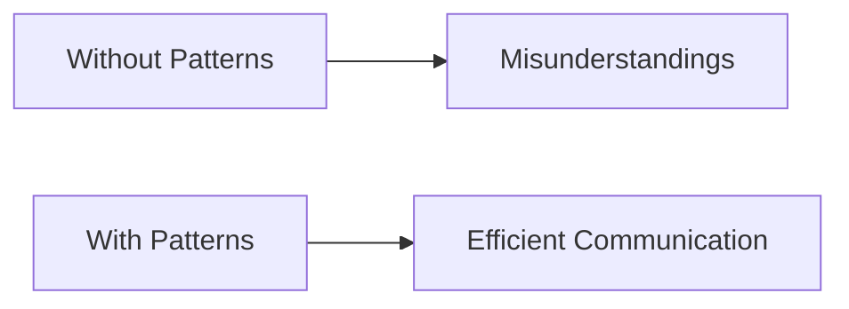

## 3.3.2 Improved Communication

In the fast-paced world of software development, effective communication is crucial for the success of any project. Design patterns play a pivotal role in enhancing communication among developers and stakeholders by providing a common vocabulary, facilitating collaboration, and simplifying documentation. This section will delve into how design patterns improve communication, helping teams to work more efficiently and cohesively.

### The Power of a Common Vocabulary

Design patterns offer a standardized set of terms that encapsulate complex software design concepts. This shared vocabulary is invaluable in the development process, as it allows team members to communicate ideas quickly and accurately.

#### Standardized Terms

When developers mention a design pattern such as the "Observer pattern," they are not just referring to a specific implementation detail. Instead, they are invoking a well-understood concept that includes the pattern's structure, behavior, and intended use. This shorthand communication can significantly reduce misunderstandings and streamline discussions.

For example, consider a scenario where a team is discussing how to handle notifications in a system. By simply suggesting, "Let's use the Observer pattern here," a developer can convey a wealth of information about the proposed solution, including how components will interact and how changes will propagate through the system.

#### Case Study: Observer Pattern in Action

In a real-world application, such as a stock market monitoring system, the Observer pattern can be used to notify various components when stock prices change. By referencing the Observer pattern, team members instantly understand that they will implement a system where observers (e.g., user interfaces, logging systems) subscribe to updates from a subject (e.g., stock price data source). This common understanding allows the team to focus on implementation details rather than debating the overall architecture.

### Enhancing Collaboration

Design patterns also foster better collaboration among team members. By aligning their understanding of a system's architecture, patterns help teams work together more effectively.

#### Aligning Team Understanding

When a team adopts design patterns, they create a shared mental model of the system's architecture. This alignment is crucial for collaboration, as it ensures that all team members are on the same page regarding how different components interact and how responsibilities are distributed.

For instance, in a complex web application, using the Model-View-Controller (MVC) pattern helps developers understand which parts of the codebase are responsible for data management (Model), user interface (View), and application logic (Controller). This clear separation of concerns allows team members to work on different parts of the application simultaneously without stepping on each other's toes.

#### Onboarding New Team Members

Design patterns also ease the onboarding process for new team members. Developers familiar with standard patterns can quickly grasp the architecture of a new codebase, as they can rely on their existing knowledge of patterns to understand how the system is structured.

Imagine a new developer joining a project that uses the Singleton pattern to manage a configuration manager. If the developer is already familiar with the Singleton pattern, they will immediately understand the rationale behind having a single instance of the configuration manager and how to interact with it. This familiarity reduces the learning curve and accelerates the onboarding process.

### Simplifying Documentation

Documentation is a critical component of software development, and design patterns can simplify this process by making documentation clearer and more accessible.

#### Clearer Documentation

When design patterns are used, documentation can leverage the common vocabulary to describe the system's architecture more succinctly. Instead of lengthy explanations about how components interact, documentation can reference patterns to convey the same information more efficiently.

For example, a system that uses the Factory pattern for object creation can include a brief note in the documentation stating, "Object creation is handled using the Factory pattern." This statement instantly informs readers about the design decision, allowing them to focus on other aspects of the documentation.

#### Accessible to a Wider Audience

Because design patterns are widely recognized and understood, documentation that references patterns is accessible to a broader audience. Developers from different backgrounds and experiences can understand the system's architecture without needing detailed explanations of every design choice.

### Streamlining Discussions

Design patterns streamline discussions during code reviews or architectural planning by providing a common framework for evaluating design decisions.

#### Code Reviews

In code reviews, referencing design patterns can help reviewers quickly understand the rationale behind certain design choices. When a developer uses a pattern like the Strategy pattern, reviewers can focus on evaluating how well the pattern is implemented rather than questioning the choice of pattern itself.

#### Architectural Planning

During architectural planning, design patterns serve as a toolkit for exploring different design options. By discussing patterns, teams can evaluate the pros and cons of various approaches and select the most appropriate pattern for the task at hand.

For example, when designing a system that requires dynamic behavior changes, a team might consider using the State pattern. By discussing the pattern's characteristics and potential benefits, the team can make an informed decision about its applicability to their specific use case.

### Visualizing Communication Improvements

To illustrate the impact of design patterns on communication, consider the following flowchart:

This simple diagram highlights the contrast between communication without patterns, which often leads to misunderstandings, and communication with patterns, which fosters efficient and effective exchanges of ideas.

### Key Points to Emphasize

1. **Shared Understanding Reduces Miscommunication:** Design patterns provide a common language that reduces the likelihood of misunderstandings among team members.

2. **Patterns as Shorthand:** In technical discussions, patterns act as shorthand, allowing developers to convey complex ideas quickly and accurately.

3. **Facilitating Collaboration:** By aligning team understanding and easing onboarding, design patterns enhance collaboration and teamwork.

4. **Simplifying Documentation:** Patterns make documentation clearer and more accessible, benefiting both current team members and future developers.

5. **Streamlining Discussions:** During code reviews and architectural planning, design patterns streamline discussions by providing a common framework for evaluating design decisions.

### Conclusion

In conclusion, design patterns play a vital role in improving communication within software development teams. By providing a common vocabulary, facilitating collaboration, simplifying documentation, and streamlining discussions, design patterns help teams work more effectively and efficiently. As you continue your journey in software development, embracing design patterns will not only enhance your technical skills but also improve your ability to communicate and collaborate with others.

## Quiz Time!



### How do design patterns provide a common vocabulary?

- [x] By encapsulating complex concepts into standardized terms
- [ ] By making code more complex
- [ ] By reducing the number of developers needed
- [ ] By eliminating the need for documentation

> **Explanation:** Design patterns encapsulate complex concepts into standardized terms, allowing developers to communicate ideas quickly and accurately.

### What is one benefit of using design patterns in documentation?

- [x] They make documentation clearer and more accessible
- [ ] They eliminate the need for documentation
- [ ] They make documentation longer
- [ ] They complicate the documentation process

> **Explanation:** Design patterns make documentation clearer and more accessible by leveraging a common vocabulary to describe the system's architecture succinctly.

### How do design patterns facilitate collaboration?

- [x] By aligning team understanding of a system's architecture
- [ ] By increasing the number of meetings
- [ ] By reducing the need for communication
- [ ] By making code reviews unnecessary

> **Explanation:** Design patterns facilitate collaboration by aligning team understanding of a system's architecture, ensuring all team members are on the same page.

### How can design patterns ease the onboarding process for new team members?

- [x] By allowing them to rely on their existing knowledge of patterns
- [ ] By requiring them to learn new patterns
- [ ] By making the codebase more complex
- [ ] By eliminating the need for training

> **Explanation:** Design patterns ease the onboarding process by allowing new team members to rely on their existing knowledge of patterns to understand the system's architecture.

### What is a benefit of using design patterns during code reviews?

- [x] They help reviewers quickly understand design choices
- [ ] They make code reviews longer
- [ ] They eliminate the need for code reviews
- [ ] They complicate the review process

> **Explanation:** Design patterns help reviewers quickly understand the rationale behind design choices, allowing them to focus on evaluating the implementation.

### How do design patterns streamline architectural planning?

- [x] By providing a common framework for evaluating design options
- [ ] By making planning more complex
- [ ] By reducing the need for planning
- [ ] By eliminating design options

> **Explanation:** Design patterns streamline architectural planning by providing a common framework for evaluating design options, helping teams make informed decisions.

### What is a key point to emphasize about design patterns?

- [x] They provide a common language that reduces miscommunication
- [ ] They make code more complex
- [ ] They eliminate the need for documentation
- [ ] They complicate communication

> **Explanation:** A key point is that design patterns provide a common language that reduces miscommunication among team members.

### How do design patterns act as shorthand in technical discussions?

- [x] By allowing developers to convey complex ideas quickly
- [ ] By making discussions longer
- [ ] By eliminating the need for discussions
- [ ] By complicating discussions

> **Explanation:** Design patterns act as shorthand by allowing developers to convey complex ideas quickly and accurately in technical discussions.

### How do design patterns benefit team collaboration?

- [x] By aligning team understanding and easing onboarding
- [ ] By reducing the need for collaboration
- [ ] By making collaboration more complex
- [ ] By eliminating the need for team meetings

> **Explanation:** Design patterns benefit team collaboration by aligning team understanding and easing the onboarding process for new members.

### True or False: Design patterns eliminate the need for documentation.

- [ ] True
- [x] False

> **Explanation:** False. Design patterns do not eliminate the need for documentation; instead, they make documentation clearer and more accessible by providing a common vocabulary.


