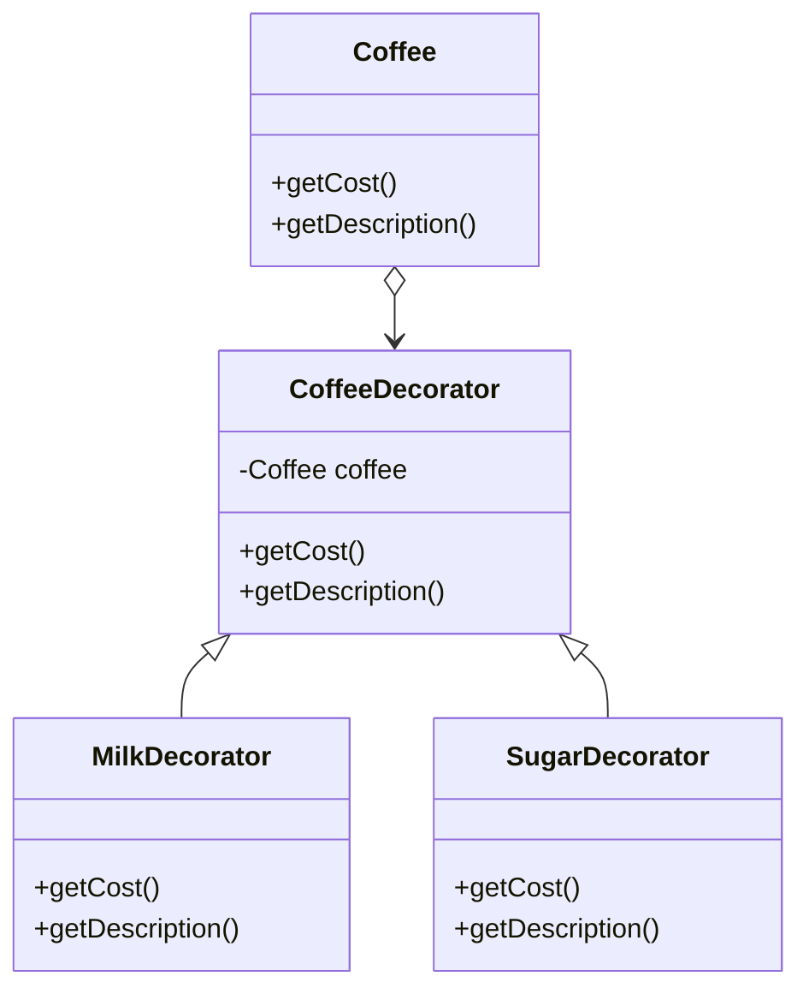

## 3.3.3 Enhanced Code Maintainability

In the ever-evolving landscape of software development, one of the paramount challenges developers face is ensuring that their code remains maintainable over time. As systems grow in complexity, the ease with which they can be understood, modified, and extended becomes crucial. Design patterns offer a robust solution to this challenge by providing proven templates for solving common design problems, thus enhancing the maintainability of codebases.

### Understanding Code Maintainability

**Code maintainability** refers to the ease with which a software system can be modified to fix defects, improve performance, or adapt to a changing environment. It is a critical aspect of the software lifecycle that influences the long-term success and sustainability of a project. Maintainable code is characterized by its clarity, simplicity, and modularity, enabling developers to make changes quickly and with minimal risk of introducing new errors.

#### Importance of Maintainability

The importance of maintainability cannot be overstated, as it directly impacts the following:

- **Cost Efficiency:** Easier maintenance reduces the time and resources required for updates and bug fixes.
- **Adaptability:** Maintainable code can be adapted to new requirements or technologies with minimal disruption.
- **Quality Assurance:** Well-structured code is less prone to bugs and easier to test.
- **Team Collaboration:** Clear and understandable code facilitates teamwork and onboarding of new developers.

### Design Patterns and SOLID Principles

Design patterns inherently support the SOLID principles, which are a set of guidelines for writing maintainable and scalable object-oriented software. Let's explore how these principles align with design patterns:

#### Single Responsibility Principle (SRP)

Design patterns like the **Strategy** and **State** patterns ensure that classes have a single responsibility by encapsulating varying behaviors or states within separate classes.

#### Open/Closed Principle (OCP)

Patterns such as **Decorator** and **Observer** exemplify the Open/Closed Principle by allowing systems to be extended with new functionality without modifying existing code.

#### Liskov Substitution Principle (LSP)

The **Factory Method** and **Template Method** patterns support LSP by ensuring that subclasses can be used interchangeably without altering the correctness of the program.

#### Interface Segregation Principle (ISP)

The **Adapter** and **Proxy** patterns help enforce ISP by creating interfaces that are specific to client needs, avoiding the implementation of unnecessary methods.

#### Dependency Inversion Principle (DIP)

Patterns like **Dependency Injection** and **Service Locator** embody DIP by decoupling high-level modules from low-level modules, relying on abstractions rather than concrete implementations.

### Encapsulation and Modularity

Design patterns promote encapsulation and modularity, which are key tenets of maintainable code. By encapsulating behavior and promoting modular design, patterns help keep components separate and interchangeable.

#### Encapsulation

Encapsulation involves bundling data and methods that operate on that data within a single unit, typically a class. This hides the internal state of the object and exposes only what is necessary through a public interface. Patterns such as **Facade** and **Decorator** leverage encapsulation to provide simplified interfaces and extend functionality without altering the underlying components.

#### Modularity

Modularity refers to the degree to which a system's components can be separated and recombined. It enhances maintainability by allowing developers to isolate changes to specific modules without affecting the entire system. The **Composite** and **Chain of Responsibility** patterns exemplify modularity by allowing complex structures to be built from simpler components and enabling flexible processing of requests, respectively.

### Ease of Updates and Extensions

One of the primary benefits of using design patterns is the ease with which systems can be updated and extended. Patterns provide a blueprint for adding new features or modifying existing ones without disrupting the overall architecture.

#### Case Study: The Decorator Pattern

The **Decorator Pattern** is a prime example of how design patterns facilitate the addition of new functionality without altering existing code. It allows behavior to be added to individual objects, dynamically, without affecting the behavior of other objects from the same class.

Consider the following JavaScript example:

```javascript
// Base component
class Coffee {
    getCost() {
        return 5;
    }
    getDescription() {
        return "Simple coffee";
    }
}

// Decorator
class CoffeeDecorator {
    constructor(coffee) {
        this.coffee = coffee;
    }
    getCost() {
        return this.coffee.getCost();
    }
    getDescription() {
        return this.coffee.getDescription();
    }
}

// Concrete decorators
class MilkDecorator extends CoffeeDecorator {
    getCost() {
        return this.coffee.getCost() + 1;
    }
    getDescription() {
        return `${this.coffee.getDescription()}, milk`;
    }
}

class SugarDecorator extends CoffeeDecorator {
    getCost() {
        return this.coffee.getCost() + 0.5;
    }
    getDescription() {
        return `${this.coffee.getDescription()}, sugar`;
    }
}

// Usage
let myCoffee = new Coffee();
myCoffee = new MilkDecorator(myCoffee);
myCoffee = new SugarDecorator(myCoffee);
console.log(myCoffee.getDescription()); // Simple coffee, milk, sugar
console.log(myCoffee.getCost()); // 6.5
```

**Explanation:**

- **Base Component:** The `Coffee` class provides the core functionality.
- **Decorator:** The `CoffeeDecorator` class is an abstract class that holds a reference to a `Coffee` object and defines methods to delegate calls to the wrapped object.
- **Concrete Decorators:** `MilkDecorator` and `SugarDecorator` extend the `CoffeeDecorator` class to add specific functionalities.
- **Usage:** New features (e.g., milk, sugar) are added without modifying the base `Coffee` class, demonstrating the pattern's flexibility.

#### Visual Representation

Below is a class diagram illustrating the Decorator pattern:



### Reduction of Code Smells

Design patterns help reduce code smells, which are indicators of potential problems in the codebase. By addressing common issues such as tight coupling and large classes, patterns contribute to cleaner, more maintainable code.

#### Common Code Smells Addressed by Patterns

- **Tight Coupling:** Patterns like **Observer** and **Mediator** reduce tight coupling by promoting loose coupling between components.
- **Large Classes:** The **Facade** pattern simplifies complex systems by providing a unified interface, preventing large monolithic classes.
- **Duplicated Code:** The **Template Method** pattern reduces code duplication by defining a skeleton of an algorithm in a method, deferring some steps to subclasses.

### Key Points to Emphasize

- **Design patterns make codebases easier to understand and modify.** They provide a common language and set of practices that facilitate communication among developers.
- **They promote practices that prevent technical debt.** By adhering to best practices and principles, patterns help avoid the accumulation of technical debt that can hinder future development.

### Conclusion

Incorporating design patterns into your software development process is an effective strategy for enhancing code maintainability. By promoting encapsulation, modularity, and adherence to SOLID principles, patterns ensure that your codebase remains adaptable and easy to evolve over time. As you continue your journey in software design, leveraging these patterns will not only improve the quality of your code but also empower you to tackle complex challenges with confidence.

## Quiz Time!



### What is code maintainability?

- [x] The ease with which a software system can be modified to fix defects, improve performance, or adapt to a changing environment.
- [ ] The ability of a system to operate without failure.
- [ ] The speed at which a system processes requests.
- [ ] The number of features a system can support.

> **Explanation:** Code maintainability refers to the ease of modifying a software system to fix defects, improve performance, or adapt to changes.

### Which design pattern supports the Open/Closed Principle by allowing systems to be extended without modifying existing code?

- [x] Decorator
- [ ] Singleton
- [ ] Factory
- [ ] Command

> **Explanation:** The Decorator pattern allows for the extension of functionality without modifying existing code, adhering to the Open/Closed Principle.

### How do design patterns promote encapsulation?

- [x] By bundling data and methods within a single unit and exposing only necessary interfaces.
- [ ] By making all class members public.
- [ ] By using global variables.
- [ ] By avoiding the use of classes.

> **Explanation:** Design patterns promote encapsulation by bundling data and methods within a single unit and exposing only necessary interfaces.

### Which design pattern is best for reducing tight coupling between components?

- [x] Observer
- [ ] Singleton
- [ ] Factory
- [ ] Adapter

> **Explanation:** The Observer pattern reduces tight coupling by promoting loose coupling between components.

### What is a primary benefit of using the Decorator pattern?

- [x] It allows behavior to be added to individual objects dynamically.
- [x] It does not affect the behavior of other objects from the same class.
- [ ] It ensures only one instance of a class is created.
- [ ] It provides a global point of access to a resource.

> **Explanation:** The Decorator pattern allows behavior to be added dynamically to individual objects without affecting others from the same class.

### How do design patterns help in reducing code smells?

- [x] By addressing issues like tight coupling and large classes.
- [ ] By increasing the number of lines of code.
- [ ] By removing comments from the code.
- [ ] By using only procedural programming.

> **Explanation:** Design patterns help reduce code smells by addressing issues like tight coupling and large classes.

### What is the role of the CoffeeDecorator class in the provided JavaScript example?

- [x] To act as an abstract class that holds a reference to a Coffee object.
- [ ] To provide the main functionality of the coffee.
- [x] To define methods to delegate calls to the wrapped object.
- [ ] To calculate the cost of the coffee directly.

> **Explanation:** The CoffeeDecorator class acts as an abstract class holding a reference to a Coffee object and defines methods to delegate calls to the wrapped object.

### Which principle does the Strategy pattern help enforce?

- [x] Single Responsibility Principle
- [ ] Open/Closed Principle
- [ ] Liskov Substitution Principle
- [ ] Dependency Inversion Principle

> **Explanation:** The Strategy pattern helps enforce the Single Responsibility Principle by encapsulating varying behaviors within separate classes.

### Why is modularity important in software design?

- [x] It allows developers to isolate changes to specific modules without affecting the entire system.
- [ ] It increases the complexity of the codebase.
- [ ] It ensures all code is written in a single module.
- [ ] It requires all modules to be tightly coupled.

> **Explanation:** Modularity is important because it allows developers to isolate changes to specific modules without affecting the entire system.

### Design patterns inherently support which set of principles?

- [x] SOLID Principles
- [ ] DRY Principles
- [ ] KISS Principles
- [ ] YAGNI Principles

> **Explanation:** Design patterns inherently support the SOLID principles, which guide writing maintainable and scalable object-oriented software.


