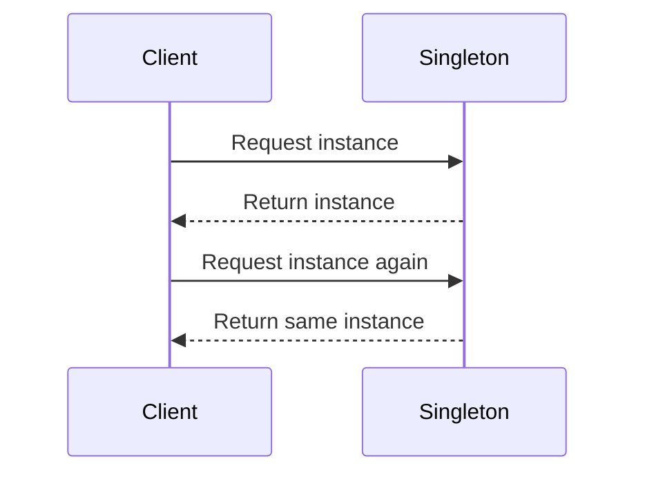

## 3.3.4 Problem-Solving Efficiency

In the ever-evolving field of software development, efficiency is paramount. Developers are constantly seeking ways to streamline processes, reduce errors, and focus on the unique challenges that each project presents. Design patterns play a crucial role in achieving these goals by providing time-tested solutions to common problems. This section explores how design patterns enhance problem-solving efficiency, allowing developers to accelerate development, reduce errors, and concentrate on the distinctive aspects of their applications.

### Accelerated Development

One of the most significant advantages of using design patterns is the acceleration of the development process. Design patterns offer pre-defined solutions to recurring problems, eliminating the need for developers to reinvent the wheel. This not only saves time but also ensures that the solutions are robust and reliable.

#### Eliminating Redundant Problem-Solving

Consider the scenario where a developer needs to implement a system that requires a single instance of a class throughout the application. Without design patterns, the developer would need to devise a custom solution to manage this requirement. However, with the Singleton pattern, a well-established solution is readily available, allowing the developer to implement it quickly and efficiently.

#### Example: Singleton Pattern in Python

The Singleton pattern ensures that a class has only one instance and provides a global point of access to it. This is particularly useful in scenarios such as database connections, where multiple instances could lead to resource conflicts or inconsistent data states.

```python
class SingletonMeta(type):
    _instance = None

    def __call__(cls, *args, **kwargs):
        if cls._instance is None:
            cls._instance = super().__call__(*args, **kwargs)
        return cls._instance

class DatabaseConnection(metaclass=SingletonMeta):
    def connect(self):
        print("Connecting to database...")

db1 = DatabaseConnection()
db2 = DatabaseConnection()
print(db1 is db2)  # Output: True
```

In this example, the `SingletonMeta` metaclass ensures that only one instance of `DatabaseConnection` is created. When `db1` and `db2` are instantiated, they point to the same instance, demonstrating the Singleton pattern's effectiveness in managing shared resources.

#### Visual Representation: Singleton Pattern Sequence Diagram

To further illustrate the Singleton pattern, consider the following sequence diagram, which depicts the creation of Singleton instances:



This diagram shows how the client requests an instance from the Singleton, and the Singleton returns the same instance for subsequent requests, ensuring consistency and resource management.

### Reduced Errors

Design patterns not only accelerate development but also reduce the likelihood of errors. By utilizing well-established patterns, developers can rely on proven solutions that have been tested and refined over time. This reduces the risk of introducing bugs and enhances the overall stability of the application.

#### Minimizing Risk with Proven Solutions

When developers create custom solutions for common problems, there is always a risk of overlooking edge cases or introducing subtle bugs. Design patterns mitigate this risk by providing solutions that have been vetted by the developer community and have stood the test of time.

For example, the Singleton pattern, as demonstrated earlier, eliminates the possibility of creating multiple instances of a class, which could lead to resource conflicts or inconsistent states. By adhering to this pattern, developers can confidently manage shared resources without fear of introducing concurrency issues.

### Focus on Unique Challenges

By applying design patterns to standard problems, developers can shift their focus to the unique challenges that their applications present. This allows them to dedicate more time and resources to crafting innovative solutions that address the specific needs of their projects.

#### Customizing Solutions for Specific Needs

Design patterns provide a solid foundation upon which developers can build customized solutions. For instance, while the Singleton pattern provides a basic framework for managing a single instance, developers can extend this pattern to include additional features such as lazy initialization or thread safety, depending on the requirements of their application.

This flexibility allows developers to leverage the strengths of design patterns while tailoring them to meet the unique demands of their projects. By focusing on application-specific logic, developers can create more efficient and effective solutions that align with their goals.

### Real-World Applications of Design Patterns

Design patterns are not limited to theoretical concepts; they have practical applications in real-world software development. Consider the following scenarios where design patterns enhance problem-solving efficiency:

#### Web Application Development

In web application development, design patterns such as the Model-View-Controller (MVC) pattern are widely used to separate concerns and organize code effectively. By applying the MVC pattern, developers can ensure that their applications are scalable, maintainable, and easy to test.

#### Asynchronous Programming

In environments that require asynchronous programming, such as Node.js, design patterns like the Observer pattern facilitate event-driven architectures. By using the Observer pattern, developers can efficiently manage events and update subscribers in real-time, enhancing the responsiveness of their applications.

### Key Points to Emphasize

- **Patterns Save Development Time:** By providing pre-defined solutions to common problems, design patterns accelerate the development process and allow developers to focus on unique challenges.
- **Reliable Solutions Increase Confidence:** Design patterns offer proven solutions that have been tested and refined, reducing the risk of errors and increasing confidence in the code.

### Conclusion

Design patterns play a pivotal role in enhancing problem-solving efficiency in software development. By accelerating development, reducing errors, and allowing developers to focus on unique challenges, design patterns provide a valuable framework for creating robust and efficient applications. As developers continue to embrace these time-tested solutions, they can confidently tackle the complexities of modern software development with greater efficiency and effectiveness.

## Quiz Time!



### What is one of the primary benefits of using design patterns in software development?

- [x] They accelerate the development process by providing pre-defined solutions.
- [ ] They increase the complexity of the codebase.
- [ ] They eliminate the need for testing.
- [ ] They make the code harder to read.

> **Explanation:** Design patterns accelerate the development process by providing pre-defined solutions to common problems, allowing developers to implement them quickly and efficiently.

### How does the Singleton pattern help in managing resources?

- [x] It ensures that only one instance of a class is created.
- [ ] It allows multiple instances of a class to be created.
- [ ] It duplicates resources to improve performance.
- [ ] It restricts access to class methods.

> **Explanation:** The Singleton pattern ensures that only one instance of a class is created, which is particularly useful for managing shared resources like database connections.

### What is a key advantage of using well-established design patterns?

- [x] They reduce the likelihood of introducing bugs.
- [ ] They increase the need for custom solutions.
- [ ] They complicate the codebase.
- [ ] They slow down the development process.

> **Explanation:** Well-established design patterns reduce the likelihood of introducing bugs because they provide solutions that have been tested and refined over time.

### In the provided Python example, what does the `SingletonMeta` metaclass do?

- [x] It ensures that only one instance of `DatabaseConnection` is created.
- [ ] It allows multiple instances of `DatabaseConnection` to be created.
- [ ] It restricts access to the `connect` method.
- [ ] It duplicates the `DatabaseConnection` instances.

> **Explanation:** The `SingletonMeta` metaclass ensures that only one instance of `DatabaseConnection` is created, implementing the Singleton pattern.

### Why is focusing on unique challenges important in software development?

- [x] It allows developers to create solutions tailored to specific project needs.
- [ ] It increases the likelihood of introducing bugs.
- [ ] It complicates the development process.
- [ ] It reduces the efficiency of the application.

> **Explanation:** Focusing on unique challenges allows developers to create solutions tailored to specific project needs, enhancing the effectiveness and efficiency of the application.

### How does the MVC pattern benefit web application development?

- [x] It separates concerns and organizes code effectively.
- [ ] It increases the complexity of the application.
- [ ] It eliminates the need for testing.
- [ ] It makes the application harder to maintain.

> **Explanation:** The MVC pattern separates concerns and organizes code effectively, ensuring that web applications are scalable, maintainable, and easy to test.

### What is the role of the Observer pattern in asynchronous programming?

- [x] It facilitates event-driven architectures.
- [ ] It complicates the event management process.
- [ ] It restricts real-time updates.
- [ ] It duplicates event handlers.

> **Explanation:** The Observer pattern facilitates event-driven architectures by efficiently managing events and updating subscribers in real-time.

### How do design patterns contribute to reducing errors in software development?

- [x] They provide proven solutions that have been tested and refined.
- [ ] They increase the complexity of the codebase.
- [ ] They eliminate the need for debugging.
- [ ] They make the code harder to understand.

> **Explanation:** Design patterns provide proven solutions that have been tested and refined, reducing the likelihood of introducing errors in the code.

### What is a common use case for the Singleton pattern?

- [x] Managing a single shared instance, such as a database connection.
- [ ] Creating multiple instances of a class.
- [ ] Duplicating resources to improve performance.
- [ ] Restricting access to class methods.

> **Explanation:** A common use case for the Singleton pattern is managing a single shared instance, such as a database connection, to ensure resource consistency.

### True or False: Design patterns only apply to theoretical concepts and have no practical applications.

- [ ] True
- [x] False

> **Explanation:** False. Design patterns have practical applications in real-world software development, providing solutions to common problems and enhancing the efficiency and effectiveness of applications.


