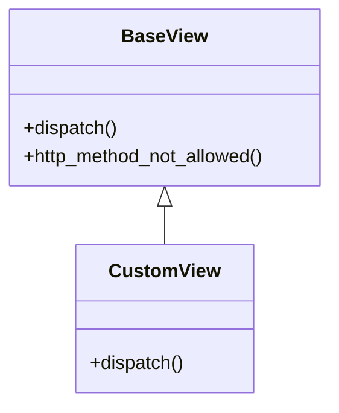
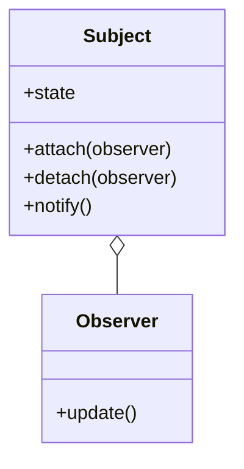

## 3.4.2 Studying Real-World Examples

In the journey of mastering design patterns, one of the most effective strategies is to study real-world examples. Observing how seasoned developers implement these patterns in actual projects not only solidifies theoretical knowledge but also provides practical insights into solving complex software design problems. This section will guide you through the process of learning from existing implementations, analyzing case studies, and exploring pattern catalogs and repositories.

### Learning from Others: The Value of Studying Open-Source Projects

Open-source projects are a treasure trove of learning opportunities. They offer a window into the minds of experienced developers, showcasing how they tackle real-world challenges using design patterns. By examining these projects, you can gain a deeper understanding of how patterns are applied in various contexts.

#### Why Open Source?

- **Accessibility:** Open-source projects are freely available, allowing anyone to explore and learn from them.
- **Diverse Applications:** These projects cover a wide range of applications, from small utilities to large-scale enterprise systems.
- **Community Insights:** Many open-source projects have active communities where developers discuss design decisions, providing additional context and learning opportunities.

#### Key Open-Source Projects to Explore

1. **Django (Python):** Known for its "batteries-included" philosophy, Django is a high-level Python web framework that encourages rapid development. It extensively uses the Template Method pattern to allow customization of its components, such as authentication and request handling.

2. **React (JavaScript):** A popular library for building user interfaces, React employs the Observer pattern through its component lifecycle and state management, enabling efficient UI updates.

3. **Spring Framework (Java):** This comprehensive framework for enterprise Java development leverages various design patterns, including Dependency Injection and Aspect-Oriented Programming, to promote loose coupling and modularity.

### Analyzing Case Studies: Learning from Well-Known Software

Studying well-known software that successfully implements design patterns can provide valuable insights into their practical application. Let's explore a few case studies where design patterns played a crucial role in solving specific issues.

#### Case Study 1: Django's Use of the Template Method Pattern

**Problem:** Django needed a way to allow developers to customize the behavior of its components without altering the core framework code.

**Solution:** The Template Method pattern was employed, enabling developers to override specific methods in their subclasses while keeping the overall algorithm intact. This approach allows for flexibility and customization, ensuring that developers can tailor the framework to their needs without compromising its integrity.

**Diagram: Django's Template Method Pattern**



#### Case Study 2: React's Implementation of the Observer Pattern

**Problem:** React needed a mechanism to efficiently update the user interface in response to changes in application state.

**Solution:** The Observer pattern was implemented through React's component lifecycle and state management. Components observe changes in state and re-render only when necessary, optimizing performance and ensuring a responsive user interface.

**Diagram: React's Observer Pattern**



### Pattern Catalogs and Repositories: Resources for Further Exploration

To deepen your understanding of design patterns, it's beneficial to explore pattern catalogs and repositories. These resources provide a wealth of information on various patterns, including their structure, intent, and real-world examples.

#### Recommended Resources

- **GitHub:** A vast repository of open-source projects where you can find numerous implementations of design patterns. Search for projects in your language of choice and explore how patterns are applied.

- **Stack Overflow:** A popular Q&A platform where developers discuss design patterns, share code snippets, and provide solutions to common problems.

- **Design Pattern Catalog Websites:** Websites like [Refactoring.Guru](https://refactoring.guru/design-patterns) offer comprehensive guides on design patterns, including UML diagrams and code examples.

### Hands-On Exploration: Cloning Repositories and Experimenting with Code

To truly grasp the application of design patterns, it's essential to get your hands dirty by experimenting with code. Cloning repositories and modifying them to see how changes affect the system can be incredibly enlightening.

#### Steps for Hands-On Exploration

1. **Clone a Repository:** Choose an open-source project that interests you and clone it to your local machine.

2. **Identify Design Patterns:** Examine the codebase to identify where and how design patterns are used.

3. **Modify the Code:** Make changes to the code to see how the system behaves. Try implementing a different pattern or refactoring existing code to use a pattern more effectively.

4. **Document Your Findings:** Keep a journal of your observations and insights. Note how patterns solve specific problems and how they could be improved.

### Code Examples from Popular Frameworks

Let's delve deeper into how popular frameworks implement design patterns, with code examples to illustrate these concepts.

#### Example 1: Django's Template Method Pattern

In Django, the Template Method pattern is used extensively in class-based views. Here's a simplified example:

```python
from django.views import View
from django.http import HttpResponse

class MyView(View):
    def get(self, request):
        return HttpResponse('Hello, World!')

    def post(self, request):
        return HttpResponse('Posted!')

# that calls the appropriate method (get, post, etc.) based on the request type.
```

#### Example 2: React's Observer Pattern

React components observe changes in state and re-render accordingly. Here's a basic example:

```javascript
import React, { useState } from 'react';

function Counter() {
  const [count, setCount] = useState(0);

  return (
    <div>
      <p>You clicked {count} times</p>
      <button onClick={() => setCount(count + 1)}>
        Click me
      </button>
    </div>
  );
}

export default Counter;
```

In this example, the `Counter` component observes the `count` state. When the state changes, the component re-renders, demonstrating the Observer pattern in action.

### Visuals and Diagrams: Enhancing Understanding

Visual aids can significantly enhance your understanding of design patterns. Diagrams illustrate the relationships between classes and objects, making it easier to grasp complex concepts.

#### Creating Your Own Diagrams

- **Use Tools:** Tools like [Mermaid](https://mermaid-js.github.io/mermaid/) or [PlantUML](https://plantuml.com/) can help you create diagrams to visualize design patterns.
- **Diagram Existing Code:** Create diagrams for the code you explore to better understand the structure and flow of the patterns.

### Key Points to Emphasize

- **Practical Exposure:** Studying real-world examples provides practical exposure, helping you see how patterns are applied in different contexts.
- **Accelerated Learning:** Learning from existing code accelerates your mastery of design patterns, as you can see firsthand how experienced developers solve problems.
- **Hands-On Practice:** Experimenting with code reinforces your understanding and allows you to apply patterns in your own projects.

### Conclusion

Studying real-world examples is an invaluable step in mastering design patterns. By exploring open-source projects, analyzing case studies, and experimenting with code, you can deepen your understanding and gain practical insights into the effective application of design patterns. This approach not only enhances your knowledge but also prepares you to tackle complex software design challenges with confidence.

## Quiz Time!



### What is a primary benefit of studying open-source projects?

- [x] They provide real-world examples of design patterns.
- [ ] They are always written in the same programming language.
- [ ] They are free of any bugs.
- [ ] They do not require any understanding of design patterns.

> **Explanation:** Open-source projects offer real-world examples of how design patterns are applied, providing valuable learning opportunities.

### Which pattern does Django extensively use for its class-based views?

- [x] Template Method
- [ ] Observer
- [ ] Singleton
- [ ] Factory

> **Explanation:** Django uses the Template Method pattern in its class-based views to allow customization of behavior.

### What is the main purpose of the Observer pattern in React?

- [x] To efficiently update the UI in response to state changes.
- [ ] To manage database connections.
- [ ] To handle user authentication.
- [ ] To optimize server performance.

> **Explanation:** The Observer pattern in React is used to efficiently update the UI whenever the application state changes.

### Which resource is NOT recommended for exploring design patterns?

- [ ] GitHub
- [ ] Stack Overflow
- [x] Instagram
- [ ] Design Pattern Catalog Websites

> **Explanation:** Instagram is not a resource for exploring design patterns; GitHub, Stack Overflow, and catalog websites are recommended.

### What should you do after cloning a repository for study?

- [x] Identify design patterns used.
- [x] Modify the code to see changes.
- [ ] Delete unnecessary files.
- [ ] Immediately push changes to the main branch.

> **Explanation:** After cloning, you should identify design patterns and modify the code to understand their application. Deleting files or pushing changes is not part of the learning process.

### How does practical exposure help in learning design patterns?

- [x] It provides real-world context and application.
- [ ] It eliminates the need for further study.
- [ ] It guarantees immediate expertise.
- [ ] It is only useful for experienced developers.

> **Explanation:** Practical exposure provides real-world context and application, enhancing understanding and learning.

### What is a benefit of creating diagrams for design patterns?

- [x] They help visualize class and object relationships.
- [ ] They replace the need for code comments.
- [ ] They are only useful for UML experts.
- [ ] They are optional and rarely used.

> **Explanation:** Diagrams help visualize the relationships between classes and objects, making it easier to understand design patterns.

### Why is experimenting with code important?

- [x] It reinforces understanding and allows practical application.
- [ ] It is only necessary for debugging.
- [ ] It is not recommended for beginners.
- [ ] It should be avoided to prevent errors.

> **Explanation:** Experimenting with code reinforces understanding and allows for practical application of design patterns.

### What does the Template Method pattern allow in Django?

- [x] Customization of behavior in subclasses.
- [ ] Direct modification of core framework code.
- [ ] Automatic database migrations.
- [ ] Simplified user authentication.

> **Explanation:** The Template Method pattern allows customization of behavior in subclasses without altering the core framework code.

### True or False: Learning from existing code can accelerate your mastery of design patterns.

- [x] True
- [ ] False

> **Explanation:** True, because studying existing code provides practical insights and accelerates the learning process for design patterns.


