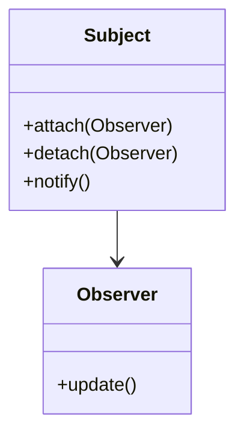
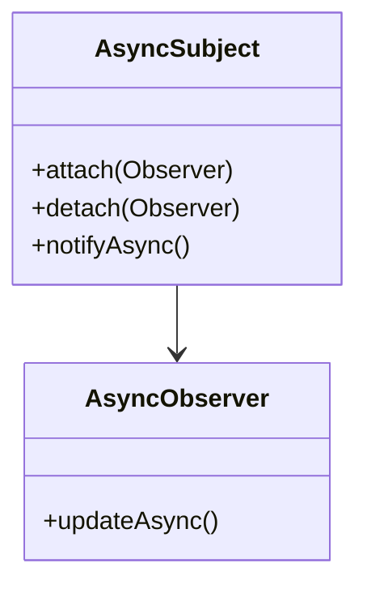

## 3.4.4 Adapting Patterns to Your Needs

Design patterns have long been celebrated as a cornerstone of effective software development. They provide tried-and-tested solutions to common problems, offering a shared language for developers to communicate complex ideas succinctly. However, one of the most critical aspects of design patterns is their inherent flexibility. Patterns are not rigid prescriptions but rather adaptable templates that can be tailored to meet the unique needs of your project. In this section, we'll explore how to adapt design patterns to your specific requirements, ensuring they remain relevant and effective in solving your software challenges.

### Understanding Patterns as Guidelines

Design patterns should be viewed as guidelines rather than strict rules. They encapsulate best practices that have been refined over time, but they are not a one-size-fits-all solution. The real power of design patterns lies in their adaptability. By understanding the core principles behind a pattern, you can modify it to better suit the context of your project.

Consider the classic **Singleton Pattern**, which ensures a class has only one instance and provides a global point of access to it. While this pattern is useful in many scenarios, its implementation can vary significantly depending on the programming language or the specific requirements of the application.

#### Example: Singleton Pattern in Python

In Python, the Singleton Pattern can be implemented using a metaclass:

```python
class SingletonMeta(type):
    _instances = {}

    def __call__(cls, *args, **kwargs):
        if cls not in cls._instances:
            instance = super().__call__(*args, **kwargs)
            cls._instances[cls] = instance
        return cls._instances[cls]

class SingletonClass(metaclass=SingletonMeta):
    def some_business_logic(self):
        pass

singleton1 = SingletonClass()
singleton2 = SingletonClass()

print(singleton1 is singleton2)  # Output: True
```

This implementation uses a metaclass to ensure that only one instance of `SingletonClass` is created. However, if you're working in a multi-threaded environment, additional modifications might be necessary to ensure thread safety.

### Customization: Tailoring Patterns to Fit

Customization is often necessary when applying design patterns to real-world projects. This can involve modifying the pattern to fit the constraints of a specific language, framework, or business requirement.

#### Scenario: Adapting the Observer Pattern

The **Observer Pattern** is commonly used to implement a publish-subscribe model where an object, known as the subject, maintains a list of its dependents, called observers, and notifies them of any state changes.

In JavaScript, you might adapt the Observer Pattern to work with asynchronous operations, such as those involving Promises or async/await.

```javascript
class Subject {
    constructor() {
        this.observers = [];
    }

    subscribe(observer) {
        this.observers.push(observer);
    }

    unsubscribe(observer) {
        this.observers = this.observers.filter(obs => obs !== observer);
    }

    async notify(data) {
        for (const observer of this.observers) {
            await observer.update(data);
        }
    }
}

class Observer {
    async update(data) {
        // Handle the update asynchronously
        console.log('Observer received data:', data);
    }
}

// Usage
const subject = new Subject();
const observer1 = new Observer();
subject.subscribe(observer1);

subject.notify('Some data').then(() => console.log('All observers have been notified.'));
```

In this example, the `notify` method is asynchronous, allowing each observer to handle updates in a non-blocking manner. This adaptation is particularly useful in modern web applications where asynchronous data handling is prevalent.

### Combining Patterns for Greater Flexibility

Sometimes, a single pattern may not be sufficient to address complex requirements. In such cases, combining multiple patterns can provide a more comprehensive solution.

#### Example: Combining the Factory and Strategy Patterns

Suppose you're building a payment processing system that needs to support multiple payment methods (e.g., credit card, PayPal, cryptocurrency). You can use the **Factory Pattern** to create instances of different payment processors and the **Strategy Pattern** to define the algorithm for processing payments.

```python
class PaymentProcessor:
    def process_payment(self, amount):
        raise NotImplementedError("Subclasses must implement this method.")

class CreditCardProcessor(PaymentProcessor):
    def process_payment(self, amount):
        print(f"Processing credit card payment of {amount}")

class PayPalProcessor(PaymentProcessor):
    def process_payment(self, amount):
        print(f"Processing PayPal payment of {amount}")

class PaymentFactory:
    @staticmethod
    def get_processor(method):
        if method == 'credit_card':
            return CreditCardProcessor()
        elif method == 'paypal':
            return PayPalProcessor()
        else:
            raise ValueError(f"Unknown payment method: {method}")

payment_method = 'credit_card'
processor = PaymentFactory.get_processor(payment_method)
processor.process_payment(100.0)
```

In this setup, the Factory Pattern is responsible for creating the appropriate payment processor, while the Strategy Pattern allows each processor to implement its unique payment processing logic.

### Avoiding Over-Engineering

While design patterns are powerful tools, it's essential to avoid over-engineering your solutions. Not every problem requires a complex pattern. Sometimes, a straightforward, pragmatic approach is more effective.

#### Pitfall: Misusing the Singleton Pattern

A common misuse of the Singleton Pattern occurs when it's applied to classes that don't genuinely require a single instance. This can lead to unnecessary complexity and hinder testing due to hidden dependencies.

Instead of defaulting to a pattern, evaluate the problem's requirements. Ask yourself whether the pattern genuinely adds value or if a simpler solution would suffice.

### Innovation: Creating New Patterns

Innovation is at the heart of software development. As you gain experience, you'll encounter unique challenges that existing patterns cannot address. In such cases, don't hesitate to innovate and create new patterns or variations.

#### Case Study: Developing a Custom Caching Pattern

Imagine you're developing a high-performance web application that requires efficient caching mechanisms. You might create a custom caching pattern that combines elements of the Proxy and Decorator Patterns to manage cache retrieval and storage seamlessly.

```python
class CacheProxy:
    def __init__(self, real_subject):
        self._real_subject = real_subject
        self._cache = {}

    def request(self, key):
        if key not in self._cache:
            self._cache[key] = self._real_subject.request(key)
        return self._cache[key]

class RealSubject:
    def request(self, key):
        # Simulate a costly operation
        return f"Data for {key}"

real_subject = RealSubject()
cache_proxy = CacheProxy(real_subject)

print(cache_proxy.request('item1'))  # Retrieves from the real subject
print(cache_proxy.request('item1'))  # Retrieves from the cache
```

In this pattern, the `CacheProxy` acts as an intermediary, caching results to avoid redundant operations. This custom pattern can be adapted further to handle cache invalidation, expiration, and other advanced features.

### Visualizing Adaptations

To better understand how patterns can be adapted, let's compare a standard pattern with its adapted version using diagrams.

#### Standard Observer Pattern



#### Adapted Observer Pattern with Asynchronous Updates



In the adapted version, both the subject and observers are designed to handle asynchronous operations, reflecting the needs of modern applications.

### Key Points to Emphasize

1. **Flexibility is Key:** Design patterns are flexible tools that can be adapted to fit your project's unique requirements. This adaptability ensures they remain relevant and effective.

2. **Customization is Often Necessary:** Tailoring patterns to specific languages, frameworks, or business needs is a common practice that enhances their applicability.

3. **Combining Patterns for Complex Solutions:** In some cases, combining multiple patterns can provide a more robust solution to complex problems.

4. **Avoid Over-Engineering:** Not every problem requires a complex pattern. Evaluate the situation and choose the simplest effective solution.

5. **Innovation Drives Progress:** Don't be afraid to innovate and create new patterns or variations when existing ones don't fit your needs.

### Conclusion

Adapting design patterns to your needs is an essential skill for any software developer. By understanding that patterns are guidelines rather than rigid rules, you can tailor them to solve your specific challenges effectively. Whether you're customizing a pattern for a particular language, combining multiple patterns for a more comprehensive solution, or innovating new patterns, the goal remains the same: to solve problems efficiently and elegantly.

As you continue to explore and apply design patterns, remember that flexibility and creativity are your greatest assets. Embrace the opportunity to adapt and innovate, ensuring that your solutions are not only technically sound but also aligned with your project's unique requirements.

## Quiz Time!



### Which statement best describes design patterns?

- [x] Design patterns are flexible templates that can be adapted to specific needs.
- [ ] Design patterns are strict rules that must be followed exactly.
- [ ] Design patterns are only applicable to object-oriented programming.
- [ ] Design patterns are outdated and rarely used in modern software development.

> **Explanation:** Design patterns are flexible templates that provide a starting point for solving common problems, allowing for adaptation to specific project needs.

### What is a common pitfall when using the Singleton Pattern?

- [x] Using it when a single instance is not necessary.
- [ ] Implementing it in a multi-threaded environment.
- [ ] Applying it to a class with multiple responsibilities.
- [ ] Using it in a language that doesn't support singletons.

> **Explanation:** A common pitfall is using the Singleton Pattern unnecessarily, leading to over-engineering and hidden dependencies.

### How can patterns be combined effectively?

- [x] By integrating them to address complex requirements.
- [ ] By using them interchangeably in a single project.
- [ ] By applying them only to large-scale applications.
- [ ] By avoiding their use in small projects.

> **Explanation:** Patterns can be combined to create more comprehensive solutions for complex problems, leveraging the strengths of each pattern.

### What is the main advantage of adapting design patterns?

- [x] They remain relevant and effective for specific project needs.
- [ ] They become easier to implement in any programming language.
- [ ] They eliminate the need for documentation.
- [ ] They simplify all aspects of software development.

> **Explanation:** Adapting design patterns ensures they remain relevant and effective by fitting the specific needs of a project.

### Why should over-engineering be avoided when using design patterns?

- [x] It can lead to unnecessary complexity.
- [ ] It makes code more readable.
- [x] It can hinder testing and maintenance.
- [ ] It simplifies problem-solving.

> **Explanation:** Over-engineering can introduce unnecessary complexity, making code harder to test and maintain.

### What role does innovation play in design patterns?

- [x] It allows the creation of new patterns or variations.
- [ ] It restricts the use of existing patterns.
- [ ] It eliminates the need for design patterns.
- [ ] It standardizes all software development processes.

> **Explanation:** Innovation allows developers to create new patterns or variations when existing ones don't fit their needs.

### How does the Observer Pattern benefit from asynchronous updates in JavaScript?

- [x] It handles updates in a non-blocking manner.
- [ ] It simplifies the code structure.
- [x] It improves performance in web applications.
- [ ] It restricts the number of observers.

> **Explanation:** Asynchronous updates allow the Observer Pattern to handle updates non-blocking, improving performance in web applications.

### What is a key consideration when customizing a design pattern?

- [x] Ensuring it fits the specific language or framework.
- [ ] Making it as complex as possible.
- [ ] Avoiding any changes to the original pattern.
- [ ] Ensuring it is used in every project.

> **Explanation:** Customizing a pattern involves ensuring it fits the specific language or framework, enhancing its applicability.

### What is the purpose of using a metaclass in a Singleton Pattern in Python?

- [x] To ensure only one instance of a class is created.
- [ ] To allow multiple instances of a class.
- [ ] To simplify the class structure.
- [ ] To avoid using the Singleton Pattern altogether.

> **Explanation:** A metaclass in a Singleton Pattern ensures only one instance of a class is created, enforcing the singleton behavior.

### True or False: Combining patterns is only beneficial for large-scale projects.

- [ ] True
- [x] False

> **Explanation:** Combining patterns can be beneficial for projects of any size, providing robust solutions to complex problems.


