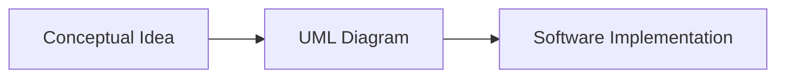

## 4.1.1 What Is UML?

In the ever-evolving landscape of software development, the ability to effectively communicate complex system designs is paramount. The Unified Modeling Language (UML) serves as a cornerstone in this endeavor, providing a standardized approach to visualizing and documenting software architectures. This section delves into the essence of UML, highlighting its significance in the realm of software design patterns.

### Definition of UML

**UML**, or the Unified Modeling Language, is a standardized modeling language designed to create visual representations of software systems. It encompasses a comprehensive set of graphic notation techniques that facilitate the creation of visual models for object-oriented software. By offering a universal language for modeling, UML aids developers, analysts, and stakeholders in understanding the intricacies of software systems.

UML is not just a tool for drawing diagrams; it is a language that conveys the structure and behavior of a system through a set of well-defined symbols and notations. These visual models serve as blueprints that guide the development process, ensuring that all team members share a common understanding of the system's architecture.

### Purpose of UML

The primary purpose of UML is to assist in the understanding, design, and documentation of software components. It plays a crucial role in the following areas:

- **Visualization:** UML provides a visual representation of the system's architecture, making it easier to comprehend complex structures and interactions. This visualization is particularly useful in large-scale systems where textual descriptions alone may be insufficient.

- **Design:** UML aids in the design phase by allowing developers to map out the system's components and their interactions. This helps in identifying potential design flaws early in the development process, reducing the risk of costly revisions later.

- **Documentation:** UML serves as a comprehensive documentation tool, capturing the system's architecture in a format that is easily understandable by all stakeholders. This documentation is invaluable for future maintenance and enhancements.

- **Communication:** Perhaps one of the most significant benefits of UML is its role in facilitating communication among developers, analysts, and stakeholders. By providing a common visual language, UML ensures that all parties involved have a shared understanding of the system's design and architecture.

### History and Standardization

The development of UML can be traced back to the efforts of Grady Booch, Ivar Jacobson, and James Rumbaugh, collectively known as the "Three Amigos." These pioneers at Rational Software sought to create a unified modeling language that would standardize the way software systems are designed and documented.

UML was officially adopted as a standard by the Object Management Group (OMG) in 1997. Since then, it has undergone several revisions, with the latest version incorporating new features and enhancements to meet the evolving needs of the software development community.

### The Role of UML in Design Patterns

UML's importance extends beyond basic modeling; it is an essential tool for working effectively with design patterns. Design patterns are reusable solutions to common problems encountered in software design. UML provides a framework for visualizing these patterns, allowing developers to see how they fit into the overall architecture of the system.

By using UML to model design patterns, developers can:

- **Visualize the Pattern Structure:** UML diagrams can illustrate the components of a design pattern and how they interact, providing a clear picture of the pattern's structure.

- **Identify Pattern Implementation:** UML helps in identifying where and how design patterns can be implemented within the system, ensuring that they are used effectively.

- **Facilitate Pattern Reuse:** By documenting design patterns using UML, developers can easily reuse them in future projects, promoting consistency and efficiency.

### Visualizing UML Concepts

To illustrate the concept of modeling with UML, consider the following simple Mermaid.js diagram. This diagram represents the process of transforming a conceptual idea into a software implementation through UML modeling.

This diagram succinctly captures the essence of UML: transforming abstract ideas into concrete, visual representations that guide the development process.

### Key Points to Emphasize

- **UML as a Universal Language:** UML is a universal language for modeling software systems, providing a standardized approach to visualizing and documenting complex architectures.

- **Visualization and Design:** UML offers a way to visualize the design and architecture of a system before implementation, helping to identify potential issues early in the development process.

- **Communication and Documentation:** UML facilitates communication among team members and stakeholders, ensuring a shared understanding of the system's design. It also serves as a comprehensive documentation tool for future reference.

- **Essential for Design Patterns:** Understanding UML is essential for working effectively with design patterns, as it provides a framework for visualizing and implementing these reusable solutions.

### Conclusion

The Unified Modeling Language (UML) is an indispensable tool in the software development toolkit. Its ability to provide clear, visual representations of complex systems makes it a crucial asset for developers, analysts, and stakeholders alike. As we delve deeper into the world of design patterns, a solid understanding of UML will empower you to harness these patterns effectively, transforming conceptual ideas into robust software implementations.

## Quiz Time!



### What is UML primarily used for?

- [x] Visualizing, designing, and documenting software systems
- [ ] Writing code for software applications
- [ ] Testing software systems
- [ ] Deploying software applications

> **Explanation:** UML is a standardized modeling language used to create visual representations of software systems, aiding in visualization, design, and documentation.

### Who are the "Three Amigos" associated with the development of UML?

- [x] Grady Booch, Ivar Jacobson, and James Rumbaugh
- [ ] Linus Torvalds, Richard Stallman, and Dennis Ritchie
- [ ] Bill Gates, Steve Jobs, and Mark Zuckerberg
- [ ] Tim Berners-Lee, Vint Cerf, and Bob Kahn

> **Explanation:** Grady Booch, Ivar Jacobson, and James Rumbaugh, known as the "Three Amigos," were instrumental in the development of UML at Rational Software.

### Which organization maintains the UML standard?

- [x] Object Management Group (OMG)
- [ ] International Organization for Standardization (ISO)
- [ ] Institute of Electrical and Electronics Engineers (IEEE)
- [ ] World Wide Web Consortium (W3C)

> **Explanation:** The Object Management Group (OMG) is responsible for maintaining the UML standard.

### What is the primary purpose of UML diagrams?

- [x] To provide a visual representation of software architectures
- [ ] To compile and execute software code
- [ ] To encrypt and secure data
- [ ] To monitor network traffic

> **Explanation:** UML diagrams provide a visual representation of software architectures, helping in understanding, designing, and documenting software systems.

### How does UML facilitate communication among stakeholders?

- [x] By providing a common visual language
- [ ] By translating code into multiple languages
- [ ] By automating email notifications
- [ ] By generating reports in real-time

> **Explanation:** UML facilitates communication by providing a common visual language that ensures all stakeholders have a shared understanding of the system's design.

### What is the role of UML in design patterns?

- [x] To visualize and document design patterns
- [ ] To generate code for design patterns
- [ ] To test the implementation of design patterns
- [ ] To deploy design patterns in production

> **Explanation:** UML plays a crucial role in visualizing and documenting design patterns, helping developers understand and implement them effectively.

### Which of the following is NOT a benefit of using UML?

- [ ] Visualization of complex systems
- [ ] Facilitation of communication
- [ ] Comprehensive documentation
- [x] Automatic code generation

> **Explanation:** While UML provides visualization, facilitates communication, and offers comprehensive documentation, it does not automatically generate code.

### What does the Mermaid.js diagram in the section illustrate?

- [x] The process of transforming a conceptual idea into software implementation through UML
- [ ] The steps involved in compiling and running a program
- [ ] The workflow of an agile development process
- [ ] The lifecycle of a software bug

> **Explanation:** The Mermaid.js diagram illustrates the process of transforming a conceptual idea into a software implementation using UML modeling.

### True or False: UML is only useful for object-oriented programming.

- [ ] True
- [x] False

> **Explanation:** While UML is particularly beneficial for object-oriented programming, it is a versatile tool that can be used for modeling various types of software systems.

### Which of the following best describes UML?

- [x] A standardized modeling language for visualizing software systems
- [ ] A programming language for developing software applications
- [ ] A database management system
- [ ] A version control system

> **Explanation:** UML is a standardized modeling language used for visualizing, designing, and documenting software systems.


