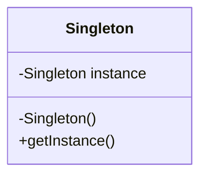

## 4.1.2 Importance of UML in Design Patterns

In the realm of software design, **Unified Modeling Language (UML)** plays a pivotal role in bridging the gap between abstract concepts and practical implementation. As a standardized visual language, UML provides a framework for modeling the architecture, behavior, and interactions of systems. This section delves into the significance of UML in understanding and applying design patterns, focusing on its ability to visualize, communicate, and map design to implementation.

### Visualization of Patterns

UML diagrams serve as a powerful tool for illustrating the structure and relationships inherent in design patterns. By offering a visual representation, UML helps demystify complex patterns, making them more accessible and understandable to developers at all levels.

#### The Power of Visual Representation

Humans are inherently visual creatures. We process visual information more efficiently than textual data, which is why diagrams and illustrations are invaluable in conveying complex ideas. UML diagrams, such as class diagrams, sequence diagrams, and state diagrams, provide a clear and concise view of the components and interactions within a design pattern.

For instance, consider the **Singleton pattern**, which ensures that a class has only one instance and provides a global point of access to it. Representing this pattern through a UML class diagram clarifies its structure:

In this diagram, the `Singleton` class is depicted with its private instance variable and public method `getInstance()`, which is responsible for returning the single instance. Such visualizations help developers quickly grasp the essence of the pattern without wading through extensive textual descriptions.

#### Simplifying Complexity

Design patterns often involve intricate relationships and interactions between classes and objects. UML diagrams simplify these complexities by breaking down the pattern into its constituent parts, highlighting key elements like classes, interfaces, and their interconnections. This simplification is crucial for both learning and applying design patterns effectively.

### Communication Tool

UML is not just a tool for visualization; it is also a universal language for communication among developers, architects, and stakeholders. In collaborative environments, clear communication is essential, and UML provides a standardized means to achieve this.

#### Unambiguous Design Communication

In software development, miscommunication can lead to costly errors and project delays. UML minimizes these risks by offering a clear and unambiguous representation of design ideas. When developers use UML to communicate their designs, they ensure that everyone involved has a common understanding of the system's architecture and behavior.

For example, in a team working on a complex project, UML diagrams can be used to convey how different components interact, the flow of data, and the responsibilities of various modules. This shared understanding is vital for ensuring that all team members are aligned and working towards the same goals.

#### Documentation and Collaboration

UML also plays a critical role in documentation. Well-documented UML diagrams serve as a reference point for future development and maintenance. They provide a snapshot of the system's architecture at a given time, which is invaluable for onboarding new team members or revisiting a project after a hiatus.

In collaborative environments, UML facilitates effective collaboration by providing a common language that transcends individual coding styles and preferences. It enables developers from diverse backgrounds to work together seamlessly, leveraging their collective expertise to solve complex problems.

### Mapping Design to Implementation

One of the most significant challenges in software development is translating abstract design concepts into concrete code. UML acts as a bridge between these two realms, providing a roadmap for implementation.

#### From Concept to Code

Design patterns are, by nature, abstract solutions to recurring problems. While they provide a high-level blueprint, the challenge lies in implementing them in a specific programming language. UML diagrams help bridge this gap by offering a visual representation of the pattern's structure and behavior, which can be directly mapped to code.

For instance, when implementing the **Observer pattern**, a UML class diagram can outline the relationships between the `Subject` and `Observer` classes, including their methods and interactions. This diagram serves as a guide for developers, helping them translate the pattern into code with greater accuracy and efficiency.

#### Facilitating Code Generation

In addition to guiding manual implementation, UML can also facilitate automated code generation. Many modern development environments and tools support the generation of code from UML diagrams, streamlining the development process and reducing the potential for human error.

By using UML as a starting point, developers can ensure that their code adheres to the intended design, maintaining consistency and coherence throughout the project.

### Historical Context: The Gang of Four

The importance of UML in design patterns is underscored by its historical use in seminal works such as the "Design Patterns: Elements of Reusable Object-Oriented Software" by the **Gang of Four** (GoF). Although UML as we know it today was not fully developed at the time, the GoF used precursor notations to describe patterns, setting the stage for UML's adoption in this field.

Their work demonstrated the power of visual representation in conveying complex design concepts, paving the way for UML to become the standard language for modeling software architecture and design patterns.

### Key Points to Emphasize

- **UML enhances understanding** of design patterns by providing clear visual models that simplify complex relationships and interactions.
- **It serves as a critical communication tool**, enabling developers to convey design ideas unambiguously and facilitating collaboration in team environments.
- **UML acts as a bridge** between abstract design concepts and concrete implementation, guiding developers in translating patterns into code.
- **Historical use by the Gang of Four** highlights UML's longstanding role in the field of design patterns, underscoring its value as a tool for modeling and documentation.

### Conclusion

In conclusion, UML is an indispensable tool in the toolkit of any software developer or architect working with design patterns. Its ability to visualize, communicate, and map design to implementation makes it a cornerstone of effective software design. By leveraging UML, developers can enhance their understanding of design patterns, improve communication and collaboration, and streamline the transition from design to code.

As you continue your journey through the world of design patterns, remember that UML is more than just a diagramming tool; it is a language that empowers you to articulate your ideas, share your vision, and bring your designs to life.

## Quiz Time!



### How does UML help in understanding design patterns?

- [x] By providing visual representations of patterns
- [ ] By writing detailed textual descriptions
- [ ] By eliminating the need for documentation
- [ ] By replacing the need for code

> **Explanation:** UML helps in understanding design patterns by offering visual representations that clarify the structure and relationships within patterns.

### What role does UML play in communication among developers?

- [x] It provides a standardized way to convey design ideas
- [ ] It replaces verbal communication entirely
- [ ] It is used only for individual projects
- [ ] It is not useful for documentation

> **Explanation:** UML serves as a standardized language that facilitates clear and unambiguous communication of design ideas among developers.

### How does UML act as a bridge between design and implementation?

- [x] By providing a roadmap for translating designs into code
- [ ] By automatically generating all necessary code
- [ ] By eliminating the need for coding
- [ ] By providing only theoretical concepts

> **Explanation:** UML acts as a bridge by offering diagrams that can be directly mapped to code, guiding developers in the implementation process.

### Which design pattern is represented in the provided UML class diagram?

- [x] Singleton
- [ ] Observer
- [ ] Factory
- [ ] Strategy

> **Explanation:** The provided UML class diagram represents the Singleton pattern, showing a class with a single instance and a method to access it.

### Why is UML considered a critical tool for documentation?

- [x] It provides a visual snapshot of the system's architecture
- [ ] It replaces all textual documentation
- [ ] It is only used during the initial design phase
- [ ] It is not useful for future reference

> **Explanation:** UML is critical for documentation as it provides a visual snapshot of the system's architecture, useful for future reference and onboarding.

### How did the Gang of Four utilize precursor notations in their book?

- [x] To describe design patterns visually
- [ ] To eliminate the need for diagrams
- [ ] To focus solely on code examples
- [ ] To avoid using any visual aids

> **Explanation:** The Gang of Four used precursor notations to describe design patterns visually, setting the stage for UML's adoption in this field.

### What is one of the main advantages of using UML in collaborative environments?

- [x] It facilitates effective collaboration by providing a common language
- [ ] It eliminates the need for team meetings
- [ ] It is only useful for individual developers
- [ ] It complicates the design process

> **Explanation:** UML facilitates effective collaboration by providing a common language that enables developers from diverse backgrounds to work together seamlessly.

### How can UML diagrams simplify complex design patterns?

- [x] By breaking down patterns into constituent parts
- [ ] By providing lengthy textual descriptions
- [ ] By ignoring the relationships between components
- [ ] By focusing solely on code syntax

> **Explanation:** UML diagrams simplify complex design patterns by breaking them down into constituent parts and highlighting key elements and relationships.

### What is the significance of UML in the historical context of design patterns?

- [x] It was used by the Gang of Four to describe patterns
- [ ] It was not relevant to early design pattern literature
- [ ] It replaced all other forms of documentation
- [ ] It was only developed after design patterns became obsolete

> **Explanation:** UML's significance is highlighted by its use by the Gang of Four, who used precursor notations to describe patterns, underscoring its value in the field.

### True or False: UML can be used to automatically generate code from diagrams.

- [x] True
- [ ] False

> **Explanation:** Many modern development environments support the generation of code from UML diagrams, facilitating the development process.


