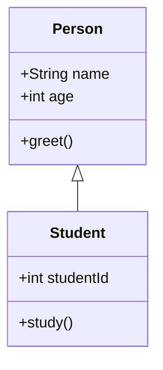
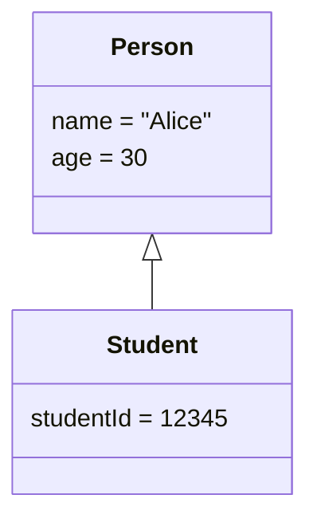
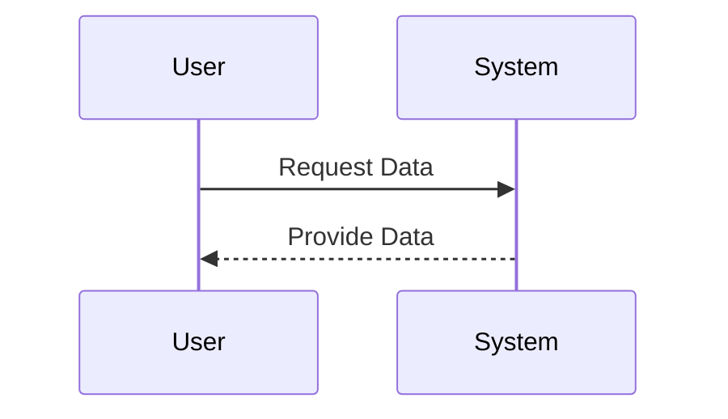
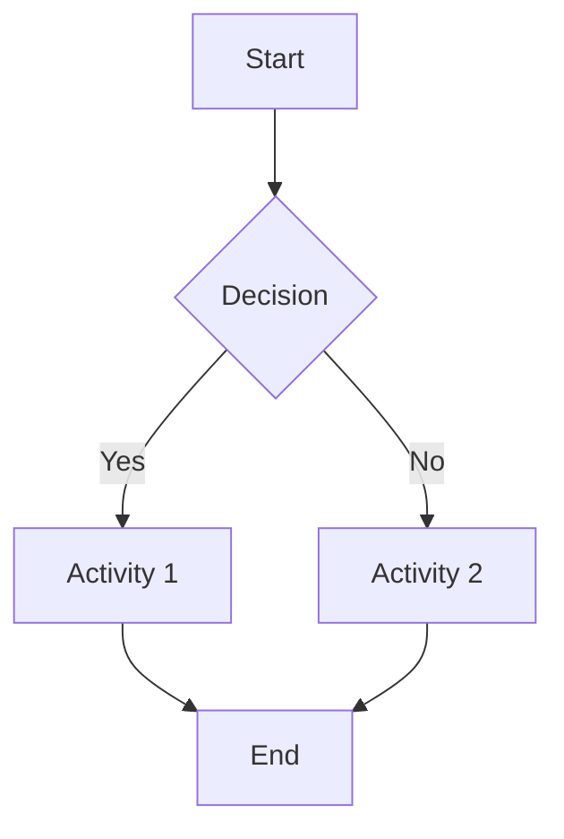
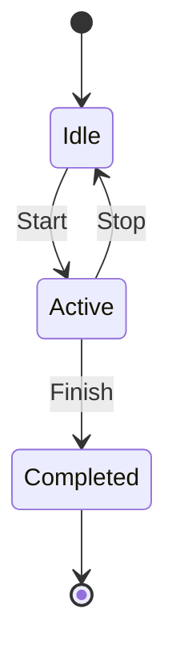

## 4.1.3 Basic UML Diagrams

Unified Modeling Language (UML) serves as a cornerstone in the field of software engineering, providing a standardized way to visualize the design of a system. Understanding UML diagrams is crucial for anyone involved in software design, especially when working with design patterns. This section will delve into the essential UML diagrams that are most relevant to design patterns, explaining their purposes and elements.

### Introduction to UML Diagrams

UML diagrams are divided into two main categories: **Structural Diagrams** and **Behavioral Diagrams**. Each type serves a specific purpose in modeling different aspects of a software system. Structural diagrams focus on the static aspects, such as the organization of system components, while behavioral diagrams emphasize the dynamic interactions and processes.

### Structural Diagrams

#### Class Diagrams

Class diagrams are perhaps the most commonly used UML diagrams. They provide a static view of the system, illustrating the classes, their attributes, methods, and the relationships between them. Class diagrams are essential for understanding the structure of a system and are particularly useful when dealing with structural design patterns.

**Key Elements of Class Diagrams:**

- **Classes:** Represented as rectangles divided into three compartments: the top for the class name, the middle for attributes, and the bottom for methods.
- **Attributes:** Properties or characteristics of a class.
- **Methods:** Functions or operations that a class can perform.
- **Relationships:** Lines connecting classes to show associations, dependencies, generalizations, and realizations.

**Example of a Class Diagram:**

In this example, `Person` is a superclass with attributes `name` and `age`, and a method `greet()`. `Student` is a subclass inheriting from `Person`, with an additional attribute `studentId` and a method `study()`.

#### Object Diagrams

Object diagrams represent a snapshot of the system at a particular point in time, showing instances of classes and their relationships. They are useful for visualizing examples of data structures or specific scenarios.

**Key Elements of Object Diagrams:**

- **Objects:** Instances of classes, depicted similarly to classes but with underlined names.
- **Links:** Connections between objects, representing relationships.

**Example of an Object Diagram:**

Here, `Person` and `Student` are instances with specific values for their attributes.

#### Component Diagrams

Component diagrams illustrate the high-level structure of a system, focusing on the components and their interfaces. They are particularly useful in large systems to show how different parts of the system interact.

**Key Elements of Component Diagrams:**

- **Components:** Modular parts of the system, depicted as rectangles with two smaller rectangles on the side.
- **Interfaces:** Points of interaction between components, shown as circles or lollipops.
- **Dependencies:** Lines indicating that one component relies on another.

While component diagrams are not typically used for individual design patterns, they provide valuable context in understanding the overall architecture within which design patterns operate.

### Behavioral Diagrams

#### Sequence Diagrams

Sequence diagrams are invaluable for illustrating how objects interact over time. They focus on the order of messages exchanged between objects, making them ideal for modeling dynamic behavior and interactions.

**Key Elements of Sequence Diagrams:**

- **Participants:** Objects or entities involved in the interaction, represented at the top of the diagram.
- **Lifelines:** Dashed lines extending downwards from participants, indicating their presence over time.
- **Messages:** Arrows between lifelines, showing communication between participants.

**Example of a Sequence Diagram:**

In this diagram, the `User` sends a request to the `System`, which responds by providing data. Sequence diagrams are particularly useful in behavioral design patterns, such as Observer or Mediator, where the focus is on interactions.

#### Activity Diagrams

Activity diagrams provide a high-level view of workflows or processes within a system. They are useful for modeling the flow of control or data and are often used in conjunction with behavioral patterns.

**Key Elements of Activity Diagrams:**

- **Activities:** Rounded rectangles representing tasks or actions.
- **Transitions:** Arrows showing the flow from one activity to another.
- **Decision Points:** Diamonds indicating branching paths based on conditions.

**Example of an Activity Diagram:**

This diagram shows a simple decision-making process where a decision leads to one of two activities, both eventually leading to an end state.

#### State Machine Diagrams

State machine diagrams model the state changes of an object in response to events. They are particularly useful for understanding the lifecycle of objects in systems where state management is critical.

**Key Elements of State Machine Diagrams:**

- **States:** Rounded rectangles representing different states of an object.
- **Transitions:** Arrows showing the movement from one state to another triggered by events.
- **Events:** Triggers that cause state transitions.

**Example of a State Machine Diagram:**

This diagram illustrates an object's lifecycle, starting in an `Idle` state, transitioning to `Active` upon a start event, and eventually reaching a `Completed` state.

### Usage in Design Patterns

Different UML diagrams are more suitable for different types of design patterns:

- **Class Diagrams** are most useful for structural patterns like Adapter, Composite, and Decorator, where the focus is on class structure and relationships.
- **Sequence Diagrams** excel in behavioral patterns like Observer, Strategy, and Command, where the interactions between objects are key.
- **Activity Diagrams** can be beneficial in patterns like Template Method or State, where the workflow or process is central.
- **State Machine Diagrams** are ideal for patterns such as State or Singleton, where the state management of objects is crucial.

### Conclusion

Understanding and utilizing UML diagrams is essential for effectively applying design patterns in software development. Each type of diagram offers unique insights into different aspects of a system, from static structures to dynamic interactions and processes. By mastering these diagrams, software designers can better communicate their ideas, document systems, and ensure that design patterns are implemented effectively.

## Quiz Time!



### Which UML diagram provides a static view of a system's structure?

- [x] Class Diagram
- [ ] Sequence Diagram
- [ ] Activity Diagram
- [ ] State Machine Diagram

> **Explanation:** Class diagrams represent the static structure of a system, showing classes, attributes, methods, and their relationships.

### What is the main purpose of an object diagram?

- [x] To represent instances of classes at a specific point in time
- [ ] To illustrate high-level system components
- [ ] To show object interactions over time
- [ ] To model state changes of an object

> **Explanation:** Object diagrams capture a snapshot of instances of classes and their relationships at a particular moment.

### Which diagram is best suited for modeling object interactions over time?

- [x] Sequence Diagram
- [ ] Class Diagram
- [ ] Component Diagram
- [ ] Activity Diagram

> **Explanation:** Sequence diagrams illustrate how objects interact in a particular sequence over time.

### What do activity diagrams primarily represent?

- [x] Workflows or processes
- [ ] Static class structures
- [ ] Object states
- [ ] Component dependencies

> **Explanation:** Activity diagrams model the flow of control or data through a process or workflow.

### In a state machine diagram, what triggers a transition from one state to another?

- [x] Events
- [ ] Activities
- [ ] Messages
- [ ] Components

> **Explanation:** Transitions in state machine diagrams are triggered by events that cause an object to change its state.

### Which UML diagram is most useful for structural design patterns?

- [x] Class Diagram
- [ ] Sequence Diagram
- [ ] Activity Diagram
- [ ] State Machine Diagram

> **Explanation:** Class diagrams are ideal for structural patterns because they focus on the relationships and organization of classes.

### What is the primary focus of a component diagram?

- [x] High-level system structure and interactions
- [ ] Object interactions over time
- [ ] Workflow processes
- [ ] State changes of an object

> **Explanation:** Component diagrams illustrate the high-level structure and interactions between system components.

### Which diagram would be most appropriate for modeling a decision-making process?

- [x] Activity Diagram
- [ ] Class Diagram
- [ ] Sequence Diagram
- [ ] State Machine Diagram

> **Explanation:** Activity diagrams are well-suited for representing decision-making processes and workflows.

### What do lifelines represent in a sequence diagram?

- [x] The presence of participants over time
- [ ] The state of an object
- [ ] The flow of control in a process
- [ ] The static structure of a system

> **Explanation:** Lifelines in sequence diagrams indicate the presence and duration of participants during interactions.

### True or False: State machine diagrams are used to represent workflows.

- [ ] True
- [x] False

> **Explanation:** State machine diagrams model the state changes of an object rather than workflows, which are better represented by activity diagrams.



By mastering these fundamental UML diagrams, you will gain a deeper understanding of how to apply design patterns effectively in your software projects. These diagrams not only aid in documenting and visualizing complex systems but also enhance communication among team members, leading to more robust and maintainable software solutions.
