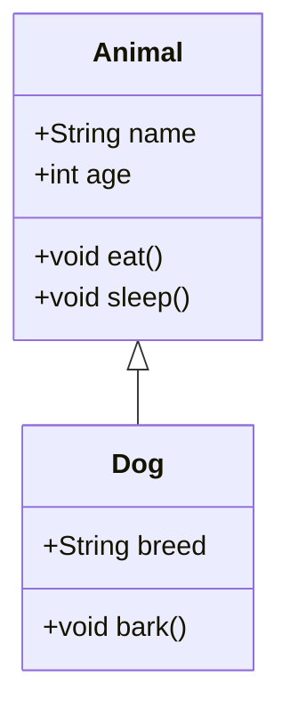

## 4.1.4 Tools for Creating UML Diagrams

Unified Modeling Language (UML) diagrams are essential in visualizing and designing complex software systems. They help developers and stakeholders understand the architecture and relationships within a system. In this section, we will explore various tools available for creating UML diagrams, ranging from simple and accessible to advanced and feature-rich options. We will discuss their features, advantages, and how they can be integrated into your workflow, especially focusing on their applicability in modern software development environments.

### Introduction to UML Diagramming Tools

Choosing the right tool for creating UML diagrams can significantly impact your productivity and the clarity of your designs. The tools we will cover include both commercial and open-source options, each with unique features and capabilities. Let's delve into each tool, starting with Mermaid.js, which is particularly noteworthy for its integration with Hugo.

### Mermaid.js: A Lightweight and Versatile Option

Mermaid.js is a JavaScript-based diagramming tool that allows you to create diagrams using a simple text-based syntax. It is particularly popular among developers due to its ease of integration into static site generators like Hugo, making it an excellent choice for documentation and blogs.

#### Using Mermaid.js with Hugo

Mermaid.js can be seamlessly integrated into Hugo, a popular static site generator. This integration allows you to include dynamic diagrams directly in your markdown files, which Hugo can then render as part of your static site.

Here is a basic tutorial on using Mermaid.js syntax to create a UML class diagram:

```markdown
    ```mermaid
    classDiagram
        class Animal {
            +String name
            +int age
            +void eat()
            +void sleep()
        }
        class Dog {
            +String breed
            +void bark()
        }
        Animal <|-- Dog
    ```
```

In this example, we define two classes, `Animal` and `Dog`, with `Dog` inheriting from `Animal`. This simple syntax allows you to quickly visualize class hierarchies and relationships.



#### Key Features of Mermaid.js

- **Text-Based Syntax:** Easy to write and maintain within markdown files.
- **Integration with Hugo:** Perfect for developers using Hugo for documentation.
- **Lightweight:** No heavy GUI, making it fast and responsive.
- **Open Source:** Free to use and contribute to.

### Lucidchart: Real-Time Collaboration and Templates

Lucidchart is a web-based diagramming tool known for its user-friendly interface and robust collaboration features. It is particularly beneficial for teams that require real-time collaboration and a wide range of templates to jumpstart their design process.

#### Features of Lucidchart

- **Real-Time Collaboration:** Multiple users can work on the same diagram simultaneously, making it ideal for remote teams.
- **Extensive Templates:** Offers a variety of templates for UML diagrams, flowcharts, and more.
- **Integration with Other Tools:** Connects with platforms like Google Workspace, Microsoft Office, and Slack.
- **Cross-Platform:** Accessible from any device with a web browser.

Lucidchart's intuitive drag-and-drop interface makes it easy for users of all skill levels to create complex diagrams without a steep learning curve.

### Microsoft Visio: Professional and Comprehensive

Microsoft Visio is a powerful diagramming tool that is part of the Microsoft Office suite. It is widely used in professional environments for its comprehensive features and integration with other Microsoft products.

#### Advantages of Using Visio

- **Professional Quality:** Offers a wide range of tools for creating detailed and precise diagrams.
- **Integration with Microsoft Office:** Seamlessly integrates with Word, Excel, and PowerPoint.
- **Advanced Features:** Includes data linking, which allows diagrams to be connected to real-time data sources.
- **Enterprise-Level Support:** Ideal for large organizations requiring robust support and security features.

Visio is best suited for users who need a professional-grade tool with extensive capabilities and are already embedded in the Microsoft ecosystem.

### draw.io (diagrams.net): Free and Open Source

draw.io, also known as diagrams.net, is a free and open-source diagramming tool that offers a wide range of features without any cost. It is a popular choice for individuals and organizations looking for a cost-effective solution.

#### Key Features of draw.io

- **No Cost:** Completely free with no premium features locked behind a paywall.
- **Open Source:** Community-driven with regular updates and improvements.
- **Ease of Use:** Simple interface with drag-and-drop functionality.
- **Cloud Storage Integration:** Supports saving diagrams to Google Drive, OneDrive, Dropbox, and more.

draw.io is an excellent choice for users who need a reliable and feature-rich tool without the associated costs of commercial software.

### StarUML and Enterprise Architect: Advanced Modeling

For more advanced modeling needs, tools like StarUML and Enterprise Architect offer comprehensive features for software architects and developers.

#### StarUML

StarUML is an open-source software modeling tool that supports UML and other modeling languages. It is designed for agile and iterative development processes.

- **Multi-Platform:** Available on Windows, macOS, and Linux.
- **Support for Multiple Languages:** In addition to UML, it supports SysML, ERD, and more.
- **Extensible:** Supports plugins for additional features and integrations.

#### Enterprise Architect

Enterprise Architect is a comprehensive modeling tool designed for large-scale software development projects. It supports a wide range of modeling languages and frameworks.

- **Enterprise-Level Features:** Includes version control, requirement management, and more.
- **Wide Range of Models:** Supports UML, BPMN, SysML, and more.
- **Robust Collaboration:** Offers features for team collaboration and project management.

### Selection Criteria for UML Tools

Choosing the right UML tool depends on several factors, including ease of use, cost, collaboration features, and integration with other tools. Here are some considerations to keep in mind:

- **Ease of Use:** Consider the learning curve and user interface.
- **Cost:** Evaluate whether the tool fits within your budget, especially for larger teams.
- **Collaboration Features:** Determine if real-time collaboration is necessary for your team.
- **Integration:** Check if the tool integrates with your existing software and workflows.

### Best Practices for UML Diagramming

When creating UML diagrams, it's important to follow best practices to ensure clarity and effectiveness:

- **Consistency in Notation:** Use consistent symbols and styles across all diagrams to avoid confusion.
- **Avoid Overcomplication:** Keep diagrams simple and focused on the key aspects of the system.
- **Regular Updates:** Update diagrams regularly to reflect changes in the system architecture.

### Conclusion

Selecting the right tool for creating UML diagrams can greatly enhance your software design process. Whether you choose a lightweight tool like Mermaid.js for its simplicity and integration with Hugo, or a comprehensive solution like Enterprise Architect for advanced modeling, each tool has its strengths and can be tailored to fit your needs.

By understanding the features and capabilities of each tool, you can make an informed decision that aligns with your project requirements and team dynamics.

## Quiz Time!



### Which tool is best integrated with Hugo for creating UML diagrams?

- [x] Mermaid.js
- [ ] Lucidchart
- [ ] Visio
- [ ] draw.io

> **Explanation:** Mermaid.js is known for its compatibility with Hugo, allowing users to create diagrams directly in markdown files.

### What is a key feature of Lucidchart?

- [x] Real-time collaboration
- [ ] Free and open-source
- [ ] Part of Microsoft Office
- [ ] Only available on Windows

> **Explanation:** Lucidchart offers real-time collaboration, making it ideal for teams working together on diagrams.

### Which tool is part of the Microsoft Office suite?

- [ ] Mermaid.js
- [ ] Lucidchart
- [x] Visio
- [ ] draw.io

> **Explanation:** Visio is part of the Microsoft Office suite and is widely used in professional environments.

### What is a primary advantage of draw.io?

- [ ] Requires a subscription
- [x] Free and open-source
- [ ] Only works offline
- [ ] Limited to one platform

> **Explanation:** draw.io is a free and open-source tool, making it accessible to a wide range of users.

### Which tool is known for advanced modeling capabilities?

- [ ] Mermaid.js
- [ ] Lucidchart
- [ ] Visio
- [x] Enterprise Architect

> **Explanation:** Enterprise Architect is designed for advanced modeling needs, supporting a wide range of modeling languages.

### What should you consider when choosing a UML tool?

- [x] Ease of use
- [x] Cost
- [x] Collaboration features
- [ ] Only the brand name

> **Explanation:** When choosing a UML tool, consider factors like ease of use, cost, and collaboration features to ensure it meets your needs.

### What is a best practice for UML diagramming?

- [x] Consistency in notation
- [ ] Use as many symbols as possible
- [ ] Update diagrams once a year
- [ ] Avoid using colors

> **Explanation:** Consistency in notation is crucial for clear and effective UML diagrams.

### Which tool supports saving diagrams to cloud storage?

- [ ] Mermaid.js
- [ ] Lucidchart
- [ ] Visio
- [x] draw.io

> **Explanation:** draw.io supports saving diagrams to various cloud storage services like Google Drive and Dropbox.

### What is a feature of StarUML?

- [x] Supports multiple modeling languages
- [ ] Only available for Windows
- [ ] Requires internet connection
- [ ] Limited to UML diagrams

> **Explanation:** StarUML supports multiple modeling languages, making it versatile for different types of projects.

### True or False: Enterprise Architect is suitable for small, individual projects only.

- [ ] True
- [x] False

> **Explanation:** Enterprise Architect is designed for large-scale software development projects and offers enterprise-level features.


