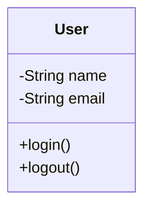
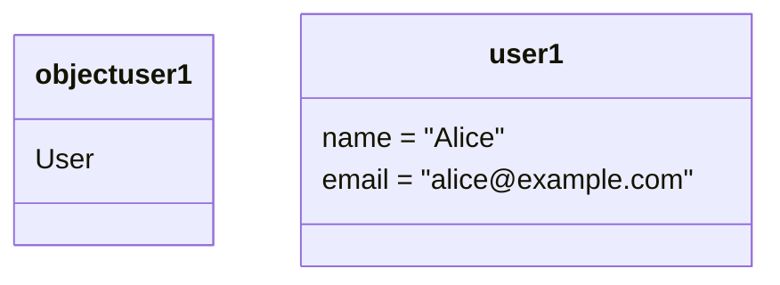

## 4.2.1 Classes and Objects Representation

In the realm of software design, the ability to accurately represent classes and objects is crucial for effective communication and understanding. Unified Modeling Language (UML) class diagrams serve as a powerful tool in this regard, providing a visual representation of the structure and relationships within a system. This section will guide you through the intricacies of representing classes and objects in UML class diagrams, using practical examples and code snippets in Python and JavaScript to ground theoretical concepts.

### Understanding Class Notation

A class in UML is depicted as a rectangle divided into three compartments. The top compartment holds the class name, the middle compartment lists attributes, and the bottom compartment contains methods. Let's delve deeper into each component:

#### Class Structure

1. **Class Name**: This is the identifier for the class and is typically written in bold. It represents the blueprint from which objects are created.

2. **Attributes**: These are the properties or data members of the class. Each attribute is listed with its data type, and visibility is indicated using specific symbols:
   - **Public (+)**: Accessible from any other class.
   - **Private (-)**: Accessible only within the class itself.
   - **Protected (#)**: Accessible within the class and its subclasses.
   - **Package (~)**: Accessible to classes within the same package.

3. **Methods**: These are the functions or operations the class can perform. Methods are listed with their return type and visibility.

#### Visibility and Static Members

Visibility is crucial for encapsulation, a core principle of object-oriented design. Static members, which belong to the class rather than any instance, are denoted by underlining their names. This distinction is important for understanding how data and behavior are shared across instances.

#### Example: User Class

To illustrate these concepts, consider a simple `User` class:



In this diagram, `User` is the class name. The attributes `name` and `email` are private, as indicated by the minus sign (-), meaning they can only be accessed within the `User` class. The methods `login()` and `logout()` are public, allowing them to be called from outside the class.

### Object Notation

Objects, or instances of classes, are represented in UML with a slightly different notation. An object is depicted as a rectangle with the syntax `objectName : ClassName`. This notation is often used in object diagrams to show a snapshot of the system at a particular time, illustrating instance-specific values.

#### Example: User Object

Consider an instance of the `User` class:



Here, `user1` is an instance of the `User` class. The object diagram shows the specific values of `name` and `email` for this instance, providing a concrete example of how the class is utilized.

### Linking UML to Code

Understanding how UML diagrams translate to actual code is essential for software developers. Let's explore how the `User` class can be implemented in Python and JavaScript.

#### Python Implementation

```python
class User:
    def __init__(self, name, email):
        self.__name = name  # Private attribute
        self.__email = email  # Private attribute

    def login(self):
        print(f"{self.__name} has logged in.")

    def logout(self):
        print(f"{self.__name} has logged out.")

user1 = User("Alice", "alice@example.com")
user1.login()
```

In this Python code, the `User` class is defined with a constructor (`__init__`) that initializes the private attributes `name` and `email`. The methods `login` and `logout` are public, allowing interaction with the `User` instance.

#### JavaScript Implementation

```javascript
class User {
    constructor(name, email) {
        this._name = name; // Conventionally private
        this._email = email; // Conventionally private
    }

    login() {
        console.log(`${this._name} has logged in.`);
    }

    logout() {
        console.log(`${this._name} has logged out.`);
    }
}

// Creating an instance of User
const user1 = new User("Alice", "alice@example.com");
user1.login();
```

In JavaScript, the `User` class is created using the `class` keyword. While JavaScript does not have built-in support for private attributes, a common convention is to prefix private properties with an underscore.

### Visuals and Diagrams

Visual representations, such as class and object diagrams, are invaluable for conveying complex information succinctly. They help bridge the gap between abstract concepts and practical implementation.

#### Class Diagram for User Class

The class diagram for the `User` class, as shown earlier, encapsulates the class structure, including its attributes and methods. This diagram serves as a blueprint for developers, providing a clear overview of the class's responsibilities.

#### Object Diagram Instance

The object diagram for `user1` illustrates how an instance of the `User` class is configured with specific values. This snapshot is useful for understanding how the class is instantiated and used in a real-world scenario.

### Key Points to Emphasize

- **UML class diagrams** are a fundamental tool for visualizing and understanding the structure of a system. They provide a clear, standardized way to represent classes and their relationships.
- **Accurate representation** of classes and objects in UML aids in communication among team members and stakeholders, ensuring everyone has a shared understanding of the system architecture.
- **Linking UML to code** is crucial for developers, as it helps translate abstract designs into concrete implementations.

### Best Practices and Common Pitfalls

- **Encapsulation**: Use visibility modifiers to enforce encapsulation, protecting the integrity of your data.
- **Consistency**: Ensure that UML diagrams accurately reflect the codebase, updating them as the system evolves.
- **Avoid Over-Complication**: Keep diagrams simple and focused on key elements to avoid overwhelming stakeholders.

### Conclusion

Understanding how to represent classes and objects in UML class diagrams is a vital skill for software developers. These diagrams provide a powerful means of visualizing and communicating the architecture of a system, bridging the gap between design and implementation. By mastering class and object notation, developers can create clear, effective diagrams that enhance collaboration and understanding.

### Additional Resources

- [UML Documentation](https://www.uml-diagrams.org/)
- [Python Official Documentation](https://docs.python.org/3/)
- [MDN Web Docs for JavaScript](https://developer.mozilla.org/en-US/docs/Web/JavaScript)
- [Design Patterns: Elements of Reusable Object-Oriented Software](https://en.wikipedia.org/wiki/Design_Patterns)

## Quiz Time!



### What does the symbol `+` indicate in a UML class diagram?

- [x] Public visibility
- [ ] Private visibility
- [ ] Protected visibility
- [ ] Package visibility

> **Explanation:** The `+` symbol in UML class diagrams denotes public visibility, meaning the attribute or method is accessible from outside the class.

### How are static members represented in UML class diagrams?

- [x] Underlined names
- [ ] Italicized names
- [ ] Bold names
- [ ] Names in parentheses

> **Explanation:** Static members are represented by underlining their names in UML class diagrams, indicating they belong to the class rather than any instance.

### What is the correct syntax for representing an object in UML?

- [x] `objectName : ClassName`
- [ ] `ClassName : objectName`
- [ ] `objectName = ClassName`
- [ ] `ClassName = objectName`

> **Explanation:** Objects are represented in UML with the syntax `objectName : ClassName`, indicating an instance of the class.

### Which visibility modifier allows access only within the class itself?

- [x] Private (-)
- [ ] Public (+)
- [ ] Protected (#)
- [ ] Package (~)

> **Explanation:** The `-` symbol denotes private visibility, restricting access to within the class itself.

### How can you denote a method that is accessible to subclasses in UML?

- [x] Protected (#)
- [ ] Public (+)
- [ ] Private (-)
- [ ] Package (~)

> **Explanation:** The `#` symbol in UML indicates protected visibility, allowing access within the class and its subclasses.

### In Python, how are private attributes conventionally indicated?

- [x] With a double underscore prefix
- [ ] With a single underscore prefix
- [ ] By using the `private` keyword
- [ ] By using the `protected` keyword

> **Explanation:** In Python, private attributes are conventionally indicated with a double underscore prefix, which invokes name mangling.

### What is the purpose of a class diagram?

- [x] To visualize the structure of a system
- [ ] To execute code
- [ ] To compile code
- [ ] To document user interfaces

> **Explanation:** Class diagrams are used to visualize the structure of a system, showing classes, their attributes, methods, and relationships.

### Which of the following is NOT a visibility modifier in UML?

- [x] Static (~)
- [ ] Public (+)
- [ ] Private (-)
- [ ] Protected (#)

> **Explanation:** Static is not a visibility modifier; it denotes class-level members. The visibility modifiers are public, private, protected, and package.

### How are instance-specific values represented in an object diagram?

- [x] By listing attribute values within the object rectangle
- [ ] By underlining attribute values
- [ ] By italicizing attribute values
- [ ] By bolding attribute values

> **Explanation:** Instance-specific values are shown by listing attribute values within the object rectangle in an object diagram.

### True or False: UML class diagrams can include both attributes and methods.

- [x] True
- [ ] False

> **Explanation:** True. UML class diagrams include both attributes and methods, providing a comprehensive overview of a class's structure.


