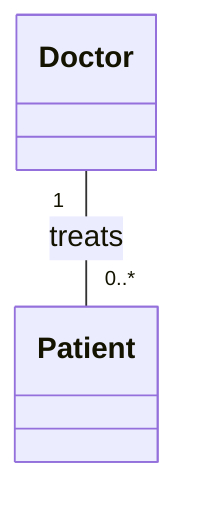
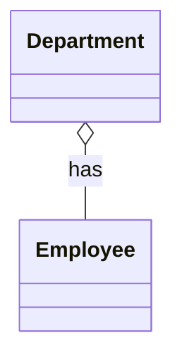
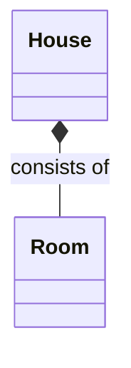
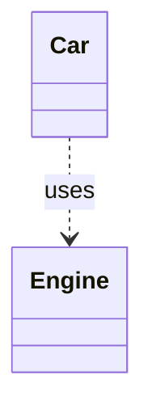

## 4.2.2 Relationships Between Classes

In the realm of software design, understanding the relationships between classes is fundamental to creating robust and maintainable systems. Unified Modeling Language (UML) class diagrams provide a visual representation of these relationships, which are crucial for modeling the structure of a system. This section delves into the different types of relationships that can exist between classes: associations, aggregations, compositions, and dependencies. Each type of relationship has its own significance and implications for how classes interact within a system.

### Associations

**Associations** represent the most basic type of relationship between classes. They define a structural connection, indicating that objects of one class are connected to objects of another. Associations can be either unidirectional or bidirectional, and they often include multiplicity to specify how many instances of a class are involved in the relationship.

#### Unidirectional vs. Bidirectional Associations

- **Unidirectional Association**: This type of association implies that one class is aware of the other, but not vice versa. For example, a `Doctor` class might have a unidirectional association to a `Patient` class if a doctor needs to keep track of their patients, but the patients do not need to keep track of their doctors.

- **Bidirectional Association**: In this case, both classes are aware of each other. For example, both `Doctor` and `Patient` classes might need to be aware of each other if patients also need to know which doctor they are assigned to.

#### Indicating Multiplicity

Multiplicity specifies the number of instances of one class that can be associated with a single instance of another class. Common multiplicity indicators include:

- `1`: Exactly one instance.
- `0..1`: Zero or one instance.
- `*`: Zero or more instances.
- `1..*`: At least one instance.

**Example: Doctor and Patient Association**



In this example, a `Doctor` can treat multiple `Patients` (indicated by `0..*`), but each `Patient` is treated by exactly one `Doctor`.

### Aggregation

**Aggregation** is a "whole-part" relationship where the part can exist independently of the whole. This relationship is represented by a hollow diamond on the side of the whole. Aggregation is often used to model relationships where the lifecycle of the part is not tied to the lifecycle of the whole.

**Example: Department and Employee Aggregation**



In this scenario, a `Department` consists of `Employees`. However, the `Employees` can exist independently of the `Department`—they can be transferred to another department or exist without being part of any department.

### Composition

**Composition** is a stronger form of aggregation where the part cannot exist without the whole. It is represented by a filled diamond. In a composition relationship, the lifecycle of the part is tightly coupled with the lifecycle of the whole.

**Example: House and Room Composition**



Here, a `House` consists of `Rooms`. The `Rooms` cannot exist independently of the `House`. If the `House` is destroyed, the `Rooms` are destroyed as well.

### Dependencies

**Dependencies** indicate a situation where a change in one class might affect another. This is represented by a dashed arrow pointing from the dependent class to the class it depends on. Dependencies are often used to show that one class uses or relies on another class.

**Example: Car and Engine Dependency**



In this example, a `Car` depends on an `Engine`. If the `Engine` changes, it might affect how the `Car` functions.

### Practical Code Examples

To further illustrate these relationships, let's explore some practical code examples using Python.

#### Association Example in Python

```python
class Doctor:
    def __init__(self, name):
        self.name = name
        self.patients = []

    def add_patient(self, patient):
        self.patients.append(patient)

class Patient:
    def __init__(self, name):
        self.name = name

doctor = Doctor("Dr. Smith")
patient1 = Patient("John Doe")
patient2 = Patient("Jane Doe")

doctor.add_patient(patient1)
doctor.add_patient(patient2)

print(f"{doctor.name} treats {', '.join([p.name for p in doctor.patients])}")
```

In this code, a `Doctor` can have multiple `Patients`, demonstrating an association with multiplicity.

#### Aggregation Example in Python

```python
class Department:
    def __init__(self, name):
        self.name = name
        self.employees = []

    def add_employee(self, employee):
        self.employees.append(employee)

class Employee:
    def __init__(self, name):
        self.name = name

dept = Department("HR")
emp1 = Employee("Alice")
emp2 = Employee("Bob")

dept.add_employee(emp1)
dept.add_employee(emp2)

print(f"{dept.name} department has employees: {', '.join([e.name for e in dept.employees])}")
```

Here, `Employees` can exist independently of the `Department`, illustrating an aggregation relationship.

#### Composition Example in Python

```python
class House:
    def __init__(self, address):
        self.address = address
        self.rooms = []

    def add_room(self, room):
        self.rooms.append(room)

class Room:
    def __init__(self, name):
        self.name = name

house = House("123 Main St")
room1 = Room("Living Room")
room2 = Room("Bedroom")

house.add_room(room1)
house.add_room(room2)

print(f"House at {house.address} consists of rooms: {', '.join([r.name for r in house.rooms])}")
```

In this example, `Rooms` cannot exist without the `House`, demonstrating a composition relationship.

#### Dependency Example in Python

```python
class Engine:
    def __init__(self, horsepower):
        self.horsepower = horsepower

class Car:
    def __init__(self, model, engine):
        self.model = model
        self.engine = engine

engine = Engine(150)
car = Car("Toyota", engine)

print(f"{car.model} uses an engine with {car.engine.horsepower} horsepower")
```

A `Car` depends on an `Engine`, showing how changes to the `Engine` can affect the `Car`.

### Key Points to Emphasize

- **Understanding relationships** is crucial for accurate modeling of a system's structure and behavior.
- The **type of relationship** determines how classes interact and depend on each other, influencing design decisions and system architecture.
- **Associations** can be simple or complex, with multiplicity adding depth to the relationship.
- **Aggregation** and **composition** both model whole-part relationships but differ in the independence of the parts.
- **Dependencies** highlight the impact of changes, crucial for understanding coupling between classes.

### Visuals and Diagrams

Visual aids, like the UML diagrams provided, are essential for grasping the nuances of class relationships. They help in visualizing how classes interact and depend on each other, which is invaluable for both design and communication within a development team.

### Conclusion

Mastering the different types of class relationships in UML is a critical skill for any software designer. By understanding associations, aggregations, compositions, and dependencies, you can create more accurate and maintainable models of your systems. This understanding not only aids in the design phase but also enhances communication with stakeholders and team members, leading to more effective and efficient software development processes.

## Quiz Time!



### Which of the following best describes an association in UML?

- [x] A structural relationship between classes.
- [ ] A dependency relationship between classes.
- [ ] A whole-part relationship where the part cannot exist independently.
- [ ] A relationship indicating that a change in one class might affect another.

> **Explanation:** An association is a structural relationship between classes, indicating how they are connected.

### What does a filled diamond represent in a UML class diagram?

- [ ] An association
- [ ] An aggregation
- [x] A composition
- [ ] A dependency

> **Explanation:** A filled diamond represents a composition, indicating a strong whole-part relationship where the part cannot exist without the whole.

### In a UML class diagram, what does a dashed arrow represent?

- [ ] An association
- [ ] An aggregation
- [ ] A composition
- [x] A dependency

> **Explanation:** A dashed arrow represents a dependency, showing that one class relies on another.

### What is the key difference between aggregation and composition?

- [x] In aggregation, the part can exist independently; in composition, it cannot.
- [ ] In composition, the part can exist independently; in aggregation, it cannot.
- [ ] Aggregation and composition are the same.
- [ ] Aggregation involves inheritance, while composition does not.

> **Explanation:** Aggregation allows the part to exist independently, while composition ties the part's lifecycle to the whole.

### Which of the following is true about bidirectional associations?

- [x] Both classes are aware of each other.
- [ ] Only one class is aware of the other.
- [ ] Neither class is aware of the other.
- [ ] It is represented by a dashed line.

> **Explanation:** In bidirectional associations, both classes are aware of each other, allowing for mutual interaction.

### How is multiplicity indicated in UML class diagrams?

- [x] Using symbols like `1`, `0..1`, `*`, `1..*`.
- [ ] By using filled diamonds.
- [ ] With dashed arrows.
- [ ] Through inheritance lines.

> **Explanation:** Multiplicity is indicated using symbols like `1`, `0..1`, `*`, `1..*`, showing the number of instances involved.

### Which of the following relationships is represented by a hollow diamond?

- [ ] Composition
- [x] Aggregation
- [ ] Association
- [ ] Dependency

> **Explanation:** A hollow diamond represents aggregation, indicating a whole-part relationship where the part can exist independently.

### In the context of UML, what does a unidirectional association imply?

- [x] One class is aware of the other, but not vice versa.
- [ ] Both classes are aware of each other.
- [ ] Neither class is aware of the other.
- [ ] It is represented by a filled diamond.

> **Explanation:** A unidirectional association implies that one class is aware of the other, but the reverse is not true.

### What is the significance of understanding class relationships in UML?

- [x] It aids in accurate system modeling and design.
- [ ] It is only useful for documentation purposes.
- [ ] It helps in coding but not in design.
- [ ] It is primarily for aesthetic purposes.

> **Explanation:** Understanding class relationships is crucial for accurate system modeling and design, influencing how classes interact and depend on each other.

### True or False: In a composition relationship, the part can exist independently of the whole.

- [ ] True
- [x] False

> **Explanation:** In a composition relationship, the part cannot exist independently of the whole; its lifecycle is tied to the whole.


