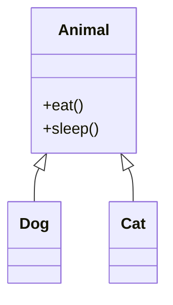
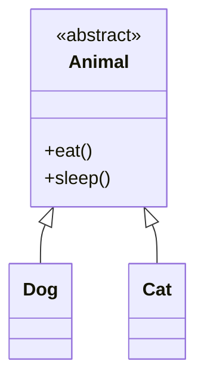

## 4.2.3 Inheritance and Interfaces

In the realm of software design, understanding the concepts of inheritance and interfaces is crucial for creating robust and maintainable systems. These concepts not only facilitate code reuse but also enable polymorphism, a key principle in object-oriented programming. In this section, we will delve into how inheritance and interfaces are represented in UML class diagrams and explore their practical applications through examples in Python and JavaScript.

### Inheritance (Generalization)

Inheritance is a fundamental concept in object-oriented programming that allows a class (known as a child or subclass) to inherit attributes and methods from another class (known as a parent or superclass). This mechanism promotes code reuse and establishes a hierarchical relationship between classes.

#### UML Representation

In UML class diagrams, inheritance is depicted using a solid line with a hollow triangle pointing towards the superclass. This notation clearly indicates the generalization relationship where the subclass extends the functionality of the superclass.

#### Example: Animal Superclass

Consider an example where we have an `Animal` superclass with two subclasses: `Dog` and `Cat`. The `Animal` class defines common behaviors such as `eat()` and `sleep()`, which are inherited by both `Dog` and `Cat`.



In this diagram:
- **Animal** is the superclass with common methods `eat()` and `sleep()`.
- **Dog** and **Cat** are subclasses that inherit these methods.

#### Code Example: Python

Let's see how this inheritance structure can be implemented in Python:

```python
class Animal:
    def eat(self):
        print("Eating")

    def sleep(self):
        print("Sleeping")

class Dog(Animal):
    def bark(self):
        print("Barking")

class Cat(Animal):
    def meow(self):
        print("Meowing")

dog = Dog()
dog.eat()  # Output: Eating
dog.bark() # Output: Barking

cat = Cat()
cat.sleep() # Output: Sleeping
cat.meow()  # Output: Meowing
```

In this Python example:
- The `Dog` and `Cat` classes inherit the `eat()` and `sleep()` methods from the `Animal` class.
- Each subclass can also define its own methods, such as `bark()` for `Dog` and `meow()` for `Cat`.

#### Code Example: JavaScript

Now, let's implement the same structure in JavaScript:

```javascript
class Animal {
    eat() {
        console.log("Eating");
    }

    sleep() {
        console.log("Sleeping");
    }
}

class Dog extends Animal {
    bark() {
        console.log("Barking");
    }
}

class Cat extends Animal {
    meow() {
        console.log("Meowing");
    }
}

// Usage
const dog = new Dog();
dog.eat();  // Output: Eating
dog.bark(); // Output: Barking

const cat = new Cat();
cat.sleep(); // Output: Sleeping
cat.meow();  // Output: Meowing
```

In JavaScript:
- The `extends` keyword is used to create a subclass.
- The `Dog` and `Cat` classes inherit methods from `Animal`, and each defines additional behaviors.

### Interfaces (Realization)

Interfaces define a contract that classes can implement. They specify a set of methods without providing their implementation, allowing different classes to implement these methods in their own way. This promotes a design principle known as "programming to an interface, not an implementation."

#### UML Representation

In UML class diagrams, interfaces are represented with a dashed line and a hollow triangle pointing towards the interface. This notation indicates the realization relationship where a class agrees to implement the interface's methods.

#### Example: Serializable Interface

Consider an example where we have a `Serializable` interface that defines a `serialize()` method. A `User` class can implement this interface to provide its own serialization logic.

```mermaid
classDiagram
    interface Serializable {
        +serialize()
    }
    class User
    Serializable <|.. User
```

In this diagram:
- **Serializable** is an interface with a method `serialize()`.
- **User** is a class that implements the `Serializable` interface.

#### Code Example: Python

Here's how you can implement an interface-like structure in Python using abstract base classes:

```python
from abc import ABC, abstractmethod

class Serializable(ABC):
    @abstractmethod
    def serialize(self):
        pass

class User(Serializable):
    def __init__(self, name, age):
        self.name = name
        self.age = age

    def serialize(self):
        return f"User(name={self.name}, age={self.age})"

user = User("Alice", 30)
print(user.serialize())  # Output: User(name=Alice, age=30)
```

In this Python example:
- The `Serializable` class is an abstract base class with an abstract method `serialize()`.
- The `User` class implements the `serialize()` method, fulfilling the contract defined by `Serializable`.

#### Code Example: JavaScript

In JavaScript, interfaces are not natively supported, but we can simulate them using classes:

```javascript
class Serializable {
    serialize() {
        throw new Error("Method 'serialize()' must be implemented.");
    }
}

class User extends Serializable {
    constructor(name, age) {
        super();
        this.name = name;
        this.age = age;
    }

    serialize() {
        return `User(name=${this.name}, age=${this.age})`;
    }
}

// Usage
const user = new User("Alice", 30);
console.log(user.serialize()); // Output: User(name=Alice, age=30)
```

In this JavaScript example:
- The `Serializable` class acts as a pseudo-interface by throwing an error if `serialize()` is not implemented.
- The `User` class extends `Serializable` and provides its own implementation of `serialize()`.

### Abstract Classes

Abstract classes are classes that cannot be instantiated on their own and are meant to be subclassed. They can contain both implemented methods and abstract methods that must be defined in subclasses.

#### UML Representation

In UML class diagrams, abstract classes are indicated by italicizing the class name or using the `{abstract}` keyword.

#### Example: Abstract Animal Class

Let's modify our previous `Animal` example to make it abstract:



In this diagram:
- **Animal** is an abstract class, indicated by the `<<abstract>>` stereotype.
- **Dog** and **Cat** are concrete subclasses.

#### Code Example: Python

Here's how you can define an abstract class in Python:

```python
from abc import ABC, abstractmethod

class Animal(ABC):
    @abstractmethod
    def eat(self):
        pass

    @abstractmethod
    def sleep(self):
        pass

class Dog(Animal):
    def eat(self):
        print("Dog eating")

    def sleep(self):
        print("Dog sleeping")

dog = Dog()
dog.eat()  # Output: Dog eating
dog.sleep() # Output: Dog sleeping
```

In this Python example:
- The `Animal` class is abstract, with abstract methods `eat()` and `sleep()`.
- The `Dog` class provides concrete implementations for these methods.

#### Code Example: JavaScript

JavaScript does not support abstract classes natively, but we can simulate them:

```javascript
class Animal {
    eat() {
        throw new Error("Method 'eat()' must be implemented.");
    }

    sleep() {
        throw new Error("Method 'sleep()' must be implemented.");
    }
}

class Dog extends Animal {
    eat() {
        console.log("Dog eating");
    }

    sleep() {
        console.log("Dog sleeping");
    }
}

// Usage
const dog = new Dog();
dog.eat();  // Output: Dog eating
dog.sleep(); // Output: Dog sleeping
```

In this JavaScript example:
- The `Animal` class acts as an abstract class by throwing errors for unimplemented methods.
- The `Dog` class provides implementations for `eat()` and `sleep()`.

### Key Points to Emphasize

- **Inheritance** allows for code reuse and establishes a hierarchical relationship between classes.
- **Interfaces** define a contract that classes can implement, promoting polymorphism and flexible design.
- **Abstract Classes** serve as templates for other classes, providing a mix of implemented and abstract methods.
- UML provides clear and standardized notations to represent these relationships, aiding in the visualization and communication of software design.

### Real-World Applications

Inheritance and interfaces are extensively used in software design patterns such as the Factory Pattern, Strategy Pattern, and Observer Pattern. They enable developers to create flexible and scalable systems that can easily adapt to changing requirements.

For instance, in a web application, you might have an abstract `PaymentProcessor` class with concrete subclasses like `CreditCardProcessor` and `PayPalProcessor`. Each subclass implements the `processPayment()` method differently, adhering to the interface defined by the abstract class.

### Conclusion

Understanding inheritance and interfaces is crucial for designing effective object-oriented systems. By leveraging these concepts, developers can create reusable, maintainable, and scalable software. UML class diagrams provide a powerful tool for visualizing these relationships, making it easier to communicate and refine design ideas.

As you continue your journey in software design, practice implementing these concepts in your projects. Experiment with different patterns and explore how inheritance and interfaces can simplify complex systems. By mastering these foundational principles, you'll be well-equipped to tackle a wide range of design challenges.

## Quiz Time!



### What does inheritance in UML class diagrams represent?

- [x] A child class inheriting attributes and methods from a parent class
- [ ] A class implementing an interface
- [ ] A relationship between two unrelated classes
- [ ] A method overriding another method

> **Explanation:** Inheritance in UML class diagrams represents a child class inheriting attributes and methods from a parent class, depicted by a solid line with a hollow triangle pointing to the superclass.


### How is an interface represented in UML class diagrams?

- [ ] With a solid line and hollow triangle
- [x] With a dashed line and hollow triangle
- [ ] With a solid line and filled triangle
- [ ] With a dashed line and filled triangle

> **Explanation:** An interface is represented in UML class diagrams with a dashed line and a hollow triangle pointing to the interface.


### What keyword is used in Python to define an abstract method?

- [ ] interface
- [ ] extends
- [x] abstractmethod
- [ ] implements

> **Explanation:** In Python, the `abstractmethod` decorator is used to define an abstract method within an abstract base class.


### In JavaScript, how do you simulate an abstract class?

- [ ] Using the `abstract` keyword
- [x] By throwing an error in unimplemented methods
- [ ] Using the `interface` keyword
- [ ] By using `extends` without a superclass

> **Explanation:** In JavaScript, abstract classes can be simulated by throwing an error in methods that are meant to be abstract, ensuring subclasses implement them.


### Which of the following promotes code reuse and polymorphism?

- [x] Inheritance
- [ ] Encapsulation
- [ ] Overloading
- [x] Interfaces

> **Explanation:** Both inheritance and interfaces promote code reuse and polymorphism by allowing classes to share behavior and implement shared contracts.


### What is the purpose of an abstract class?

- [ ] To provide a complete implementation
- [x] To serve as a template for other classes
- [ ] To act as a standalone class
- [ ] To implement multiple interfaces

> **Explanation:** An abstract class serves as a template for other classes, containing both implemented and abstract methods that subclasses must define.


### In UML, how is an abstract class indicated?

- [ ] With a solid line and filled triangle
- [x] With the class name in italics or `{abstract}`
- [ ] With a dashed line and filled triangle
- [ ] With a solid line and hollow triangle

> **Explanation:** An abstract class in UML is indicated by italicizing the class name or using the `{abstract}` keyword.


### What does the `extends` keyword do in JavaScript?

- [x] It creates a subclass that inherits from a superclass
- [ ] It implements an interface
- [ ] It defines an abstract class
- [ ] It overrides a method

> **Explanation:** The `extends` keyword in JavaScript is used to create a subclass that inherits properties and methods from a superclass.


### What is the role of the `Serializable` interface in the example?

- [ ] To provide a complete implementation for serialization
- [x] To define a contract for serialization methods
- [ ] To act as a superclass for `User`
- [ ] To override default serialization behavior

> **Explanation:** The `Serializable` interface defines a contract for serialization methods, which classes like `User` must implement.


### True or False: Inheritance and interfaces are unrelated concepts in software design.

- [ ] True
- [x] False

> **Explanation:** False. Inheritance and interfaces are related concepts in software design, both promoting code reuse and polymorphism, though they serve different purposes.


