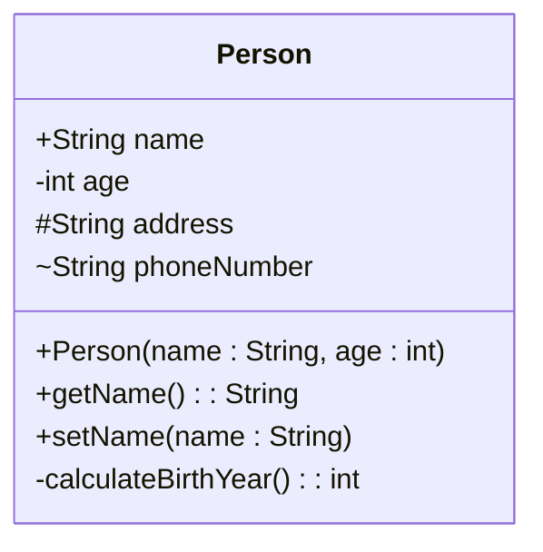

## 4.2.4 Attributes and Methods Notation

In the world of software design, clarity and precision are paramount. Unified Modeling Language (UML) class diagrams serve as a powerful tool to visually represent the structure of a system, detailing the classes, their attributes, and methods. This section delves into the intricacies of how attributes and methods are notated in UML class diagrams, providing a foundational understanding essential for anyone involved in software design and architecture.

### Understanding Attributes in UML Class Diagrams

Attributes in UML class diagrams represent the properties or data members of a class. They are crucial for defining the state of an object. The notation for attributes is structured as follows:

#### Attribute Notation: `[visibility] name : type = defaultValue`

- **Visibility**: Indicates the access level of the attribute.
  - **Public (+)**: Accessible from any other class.
  - **Private (-)**: Accessible only within the class it is defined.
  - **Protected (#)**: Accessible within the class and its subclasses.
  - **Package (~)**: Accessible to classes within the same package or module.

- **Name**: The identifier for the attribute.
- **Type**: The data type of the attribute (e.g., `int`, `String`).
- **Default Value**: An optional initial value for the attribute.

**Example**: `+age : int = 0`

This notation indicates a public attribute named `age` of type `int` with a default value of `0`.

#### Static Attributes

Static attributes, shared across all instances of a class, are underlined in UML diagrams. They are akin to class variables in programming languages like Python and JavaScript.

**Example**: `+maxInstances : int`

### Methods in UML Class Diagrams

Methods, also known as operations, define the behavior of a class. The notation for methods is as follows:

#### Method Notation: `[visibility] name(parameterList) : returnType`

- **Visibility**: Similar to attributes, visibility determines the accessibility of the method.
- **Name**: The method's identifier.
- **Parameter List**: Comma-separated list of parameters, each with a name and type.
- **Return Type**: The data type of the value returned by the method.

**Example**: `+getName() : String`

This notation represents a public method named `getName` that returns a `String`.

#### Parameters and Their Types

Methods can accept parameters, which are specified within parentheses. Each parameter is defined by a name and a type.

**Example**: `+setName(name : String)`

This method accepts a single parameter `name` of type `String`.

#### Abstract Methods

Abstract methods, which must be implemented by subclasses, are indicated by italicizing the method name or using the `{abstract}` stereotype.

**Example**: `+calculateBirthYear() : int {abstract}`

### Stereotypes in UML

Stereotypes provide additional context to UML elements, often used to denote special properties or behaviors. Common stereotypes include:

- `<<interface>>`: Indicates an interface.
- `<<abstract>>`: Denotes an abstract class or method.

### Detailed Class Diagram Example

To illustrate these concepts, consider the following UML class diagram of a `Person` class:



This diagram captures various attributes and methods with different visibility levels, providing a comprehensive view of the `Person` class structure.

### Mapping UML Notation to Code

Understanding UML notation is only part of the equation. Translating these diagrams into actual code is where the design becomes tangible. Let's explore how the UML notation for the `Person` class maps to Python and JavaScript code.

#### Python Code Example

```python
class Person:
    max_instances = 100  # Static attribute

    def __init__(self, name: str, age: int):
        self.name = name  # Public attribute
        self.__age = age  # Private attribute
        self._address = ""  # Protected attribute
        self.phone_number = ""  # Package attribute

    def get_name(self) -> str:
        return self.name

    def set_name(self, name: str):
        self.name = name

    def __calculate_birth_year(self) -> int:  # Private method
        from datetime import datetime
        return datetime.now().year - self.__age
```

#### JavaScript Code Example

```javascript
class Person {
    static maxInstances = 100; // Static attribute

    constructor(name, age) {
        this.name = name; // Public attribute
        let _age = age; // Private attribute
        this._address = ""; // Protected attribute
        this.phoneNumber = ""; // Package attribute

        this.getAge = function() {
            return _age;
        };

        this.calculateBirthYear = function() {
            const currentYear = new Date().getFullYear();
            return currentYear - _age;
        };
    }

    getName() {
        return this.name;
    }

    setName(name) {
        this.name = name;
    }
}
```

### Key Points to Emphasize

- **Precision in Notation**: Accurate UML notation is critical for effective communication of class specifications among developers and stakeholders.
- **Detail-Oriented Diagrams**: UML diagrams can capture detailed information about class structures, enhancing understanding and collaboration.

### Best Practices and Common Pitfalls

When working with UML class diagrams, it's essential to adhere to best practices to ensure clarity and effectiveness:

- **Consistency**: Maintain consistent notation and visibility across all diagrams.
- **Simplicity**: Avoid overcomplicating diagrams with unnecessary details.
- **Clarity**: Use stereotypes and annotations to clarify complex elements.

Common pitfalls to avoid include:

- **Overloading Diagrams**: Including too many details can make diagrams difficult to read.
- **Ignoring Visibility**: Failing to specify visibility can lead to misunderstandings about access levels.
- **Neglecting Updates**: Diagrams should be updated alongside code changes to remain relevant.

### Conclusion

In conclusion, mastering attributes and methods notation in UML class diagrams is a vital skill for software designers and architects. These diagrams provide a visual representation of class structures, facilitating better communication and understanding of complex systems. By translating UML notation into code, developers can bridge the gap between design and implementation, ensuring that software systems are built with precision and clarity.

---

## Quiz Time!



### What does the visibility symbol `+` indicate in UML class diagrams?

- [x] Public
- [ ] Private
- [ ] Protected
- [ ] Package

> **Explanation:** The `+` symbol in UML class diagrams indicates that the attribute or method is public and can be accessed from any other class.


### How is a static attribute represented in UML class diagrams?

- [x] Underlined
- [ ] Italicized
- [ ] Bold
- [ ] With asterisks

> **Explanation:** In UML class diagrams, static attributes are underlined to denote that they are shared across all instances of the class.


### Which stereotype is used to indicate an interface in UML?

- [x] <<interface>>
- [ ] <<abstract>>
- [ ] <<static>>
- [ ] <<class>>

> **Explanation:** The stereotype `<<interface>>` is used in UML to denote an interface, indicating a contract that classes can implement.


### What is the purpose of a parameter list in a method's notation?

- [x] To specify the inputs the method accepts
- [ ] To define the method's return type
- [ ] To indicate the method's visibility
- [ ] To describe the method's behavior

> **Explanation:** The parameter list in a method's notation specifies the inputs the method accepts, including their names and types.


### How are abstract methods indicated in UML class diagrams?

- [x] Italicized or with {abstract}
- [ ] Underlined
- [x] With the {abstract} stereotype
- [ ] In bold

> **Explanation:** Abstract methods in UML class diagrams are indicated by italicizing the method name or using the `{abstract}` stereotype.


### What does the visibility symbol `#` mean in UML class diagrams?

- [x] Protected
- [ ] Public
- [ ] Private
- [ ] Package

> **Explanation:** The `#` symbol in UML class diagrams indicates that the attribute or method is protected, meaning it is accessible within the class and its subclasses.


### What is the default value in an attribute's notation used for?

- [x] To provide an initial value for the attribute
- [ ] To define the attribute's data type
- [x] To set the attribute's visibility
- [ ] To describe the attribute's purpose

> **Explanation:** The default value in an attribute's notation is used to provide an initial value for the attribute, which is optional.


### Which symbol is used to denote package visibility in UML?

- [x] ~
- [ ] +
- [ ] -
- [ ] #

> **Explanation:** The `~` symbol in UML class diagrams denotes package visibility, meaning the attribute or method is accessible to classes within the same package.


### In UML, what does the visibility symbol `-` represent?

- [x] Private
- [ ] Public
- [ ] Protected
- [ ] Package

> **Explanation:** The `-` symbol in UML class diagrams indicates that the attribute or method is private and accessible only within the class it is defined.


### True or False: UML class diagrams can capture detailed information about class structures.

- [x] True
- [ ] False

> **Explanation:** True. UML class diagrams are designed to capture detailed information about class structures, including attributes, methods, and their relationships, enhancing understanding and communication.


