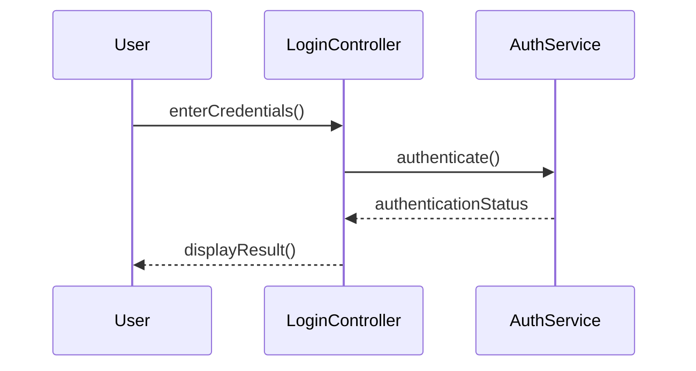
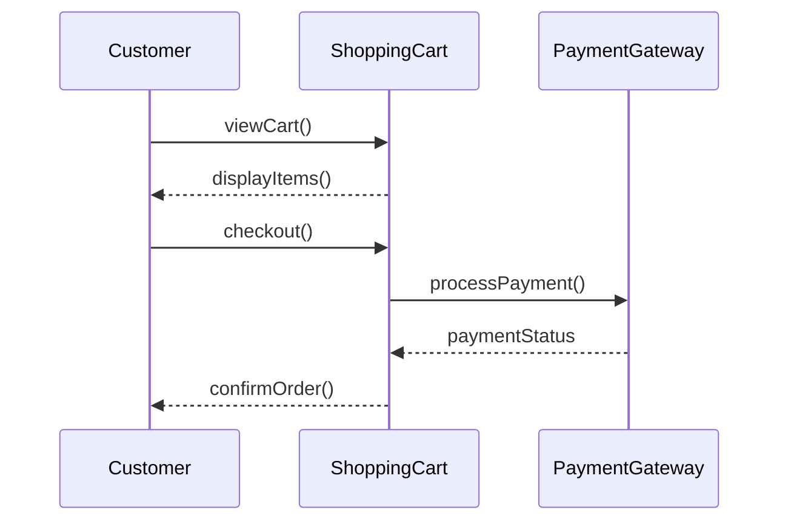

## 4.3.1 Modeling Object Interactions (Sequence Diagrams)

In the world of software design, understanding how objects interact over time is crucial for creating robust and efficient systems. Sequence diagrams, a type of UML (Unified Modeling Language) diagram, serve as a powerful tool for visualizing these interactions. This section will guide you through the purpose, components, and creation of sequence diagrams, using practical examples and code snippets to solidify your understanding.

### Understanding the Purpose of Sequence Diagrams

Sequence diagrams are a type of interaction diagram that show how objects communicate with each other in a particular scenario of a use case. They are invaluable for:

- **Visualizing Object Interactions:** Sequence diagrams depict the sequence of messages exchanged between objects, providing a clear picture of the interactions.
- **Clarifying Use Case Scenarios:** They help in understanding how a particular use case is realized within the system.
- **Supporting Design Patterns:** Sequence diagrams are particularly useful in identifying communication patterns, which are essential in behavioral design patterns.

By illustrating the flow of logic and interactions, sequence diagrams help developers and stakeholders understand the dynamics of the system, making them an essential tool in the software design process.

### Key Components of Sequence Diagrams

To effectively create and interpret sequence diagrams, it's important to understand their key components:

#### Lifelines

- **Definition:** Lifelines represent the existence of an object over time. They are depicted as vertical dashed lines extending downwards.
- **Purpose:** Lifelines show the sequence of interactions an object is involved in throughout the scenario.

#### Actors

- **Definition:** Actors are external entities that interact with the system, such as users or external systems.
- **Purpose:** They initiate interactions and are crucial for understanding how the system interfaces with its environment.

#### Messages

Messages represent communication between objects and can be of two main types:

- **Synchronous Messages:** Indicated by a solid line with a filled arrowhead, these messages require a response before the interaction can continue.
- **Asynchronous Messages:** Represented by a solid line with an open arrowhead, these messages do not require an immediate response, allowing the interaction to proceed independently.

#### Activation Bars

- **Definition:** Activation bars are thin rectangles on a lifeline that indicate when an object is active during an interaction.
- **Purpose:** They show the period during which an object is performing an action or waiting for a response.

### Creating Sequence Diagrams: A Step-by-Step Guide

Creating a sequence diagram involves several steps to ensure that all interactions are accurately represented. Here's a structured approach:

#### Step 1: Identify Participating Objects

Begin by identifying the objects and actors involved in the scenario. Consider:

- **Actors:** Determine who or what interacts with the system.
- **Objects:** Identify the system components that participate in the interaction.

#### Step 2: Define the Scenario

Clearly outline the scenario you wish to model. This could be a specific use case, such as a user logging into a system or completing a purchase.

#### Step 3: Map Out Interactions

- **Initiate the Interaction:** Start by representing the initial action from an actor or object.
- **Sequence Messages:** Lay out the sequence of messages exchanged between objects. Ensure each message is clearly labeled and follows the logical flow of the scenario.
- **Use Activation Bars:** Indicate when each object is active during the interaction.

#### Step 4: Validate the Diagram

Review the sequence diagram to ensure it accurately represents the scenario. Check for:

- **Completeness:** All necessary interactions should be included.
- **Clarity:** The diagram should be easy to understand and follow.
- **Consistency:** Ensure the diagram aligns with the use case and system design.

### Practical Examples of Sequence Diagrams

Let's explore two practical examples to illustrate how sequence diagrams are used in real-world scenarios.

#### Example 1: User Login Process

Consider a typical user login process, where a user enters credentials to access a system. The sequence diagram for this scenario is as follows:



**Explanation:**

- **User:** Initiates the process by entering credentials.
- **LoginController:** Receives the credentials and sends an authentication request to the AuthService.
- **AuthService:** Processes the authentication and returns the status.
- **Result Display:** The LoginController communicates the authentication result back to the User.

This diagram clearly illustrates the flow of messages and the roles of each component in the login process.

#### Example 2: Shopping Cart Checkout

In a shopping cart checkout process, multiple interactions occur between the user, the shopping cart system, and the payment gateway. Here's how this scenario can be modeled:



**Explanation:**

- **Customer:** Initiates the checkout by viewing the cart and proceeding to checkout.
- **ShoppingCart:** Displays items and processes the payment through the PaymentGateway.
- **PaymentGateway:** Handles the payment transaction and returns the status.
- **Order Confirmation:** The ShoppingCart confirms the order with the Customer.

This sequence diagram highlights the interactions necessary for completing a purchase, providing a clear view of the process flow.

### Linking Sequence Diagrams to Code

Sequence diagrams can be directly related to code, illustrating how methods are called and executed. For instance, in the user login process, you might have the following Python code:

```python
class LoginController:
    def enter_credentials(self, username, password):
        auth_service = AuthService()
        status = auth_service.authenticate(username, password)
        self.display_result(status)

    def display_result(self, status):
        if status:
            print("Login successful!")
        else:
            print("Login failed.")

class AuthService:
    def authenticate(self, username, password):
        # Simulate authentication logic
        return username == "admin" and password == "secret"

user = LoginController()
user.enter_credentials("admin", "secret")
```

**Explanation:**

- **`enter_credentials`:** Represents the initial user action.
- **`authenticate`:** Corresponds to the message sent to the AuthService.
- **`display_result`:** Reflects the final communication back to the user.

By linking sequence diagrams to code, developers can better understand the implementation of interactions, leading to more efficient and maintainable systems.

### Key Points to Emphasize

- **Understanding Logic Flow:** Sequence diagrams are essential for visualizing the flow of logic and interactions within a system.
- **Communication Patterns:** They help identify communication patterns, which are crucial for implementing behavioral design patterns.
- **Design Clarity:** Sequence diagrams provide a clear representation of use cases, aiding in both design and communication with stakeholders.

### Best Practices for Creating Sequence Diagrams

- **Keep It Simple:** Avoid overcomplicating diagrams. Focus on key interactions.
- **Use Consistent Notation:** Ensure that symbols and conventions are used consistently across diagrams.
- **Iterate and Refine:** Continuously refine diagrams as understanding of the system evolves.

### Common Pitfalls and How to Avoid Them

- **Overloading Diagrams:** Including too many details can make diagrams difficult to read. Focus on essential interactions.
- **Neglecting External Actors:** Ensure that all relevant actors are included to provide context.
- **Ignoring Activation Bars:** Use activation bars to clearly indicate when objects are active.

### Conclusion

Sequence diagrams are a vital tool in modeling object interactions over time, providing clarity and insight into the dynamics of a system. By understanding their purpose, components, and creation process, you can effectively use sequence diagrams to enhance your software design and implementation.

As you continue your journey in software design, remember that sequence diagrams are not just about drawing lines and boxes—they are about capturing the essence of interactions that drive your system. Embrace them as a means to communicate, design, and refine your software architecture.

## Quiz Time!



### What is the primary purpose of a sequence diagram?

- [x] To show how objects interact in a particular scenario of a use case.
- [ ] To represent the static structure of a system.
- [ ] To model the data flow in a system.
- [ ] To illustrate the deployment of software components.

> **Explanation:** Sequence diagrams are used to model the interactions between objects over time in a specific scenario of a use case.

### Which component of a sequence diagram represents an object's existence over time?

- [x] Lifeline
- [ ] Actor
- [ ] Message
- [ ] Activation Bar

> **Explanation:** Lifelines are vertical dashed lines that denote an object's existence over time in a sequence diagram.

### What type of message in a sequence diagram requires a response before the interaction can continue?

- [x] Synchronous message
- [ ] Asynchronous message
- [ ] Activation message
- [ ] Lifeline message

> **Explanation:** Synchronous messages require a response before the interaction can proceed, indicated by a solid line with a filled arrowhead.

### In a sequence diagram, what do activation bars represent?

- [x] When an object is active during an interaction
- [ ] The start and end of a scenario
- [ ] The external entities interacting with the system
- [ ] The sequence of messages exchanged

> **Explanation:** Activation bars are thin rectangles on a lifeline that indicate when an object is active during an interaction.

### Which of the following is NOT a component of a sequence diagram?

- [ ] Lifeline
- [ ] Actor
- [ ] Message
- [x] Class Diagram

> **Explanation:** Class diagrams are a different type of UML diagram and are not a component of sequence diagrams.

### How are asynchronous messages represented in a sequence diagram?

- [x] Solid line with an open arrowhead
- [ ] Solid line with a filled arrowhead
- [ ] Dashed line with an open arrowhead
- [ ] Dashed line with a filled arrowhead

> **Explanation:** Asynchronous messages are represented by a solid line with an open arrowhead in sequence diagrams.

### What is the first step in creating a sequence diagram?

- [x] Identify participating objects
- [ ] Define the scenario
- [ ] Map out interactions
- [ ] Validate the diagram

> **Explanation:** The first step in creating a sequence diagram is to identify the objects and actors involved in the scenario.

### Which of the following best describes the role of actors in a sequence diagram?

- [x] External entities interacting with the system
- [ ] Objects that perform actions in the system
- [ ] Messages exchanged between objects
- [ ] Activation periods of objects

> **Explanation:** Actors are external entities that interact with the system, initiating interactions in a sequence diagram.

### What should you do to ensure a sequence diagram is accurate?

- [x] Validate the diagram for completeness, clarity, and consistency
- [ ] Include as many details as possible
- [ ] Focus only on the messages
- [ ] Use different notations for each interaction

> **Explanation:** To ensure accuracy, validate the sequence diagram for completeness, clarity, and consistency with the use case and system design.

### True or False: Sequence diagrams are only useful during the implementation phase of a project.

- [ ] True
- [x] False

> **Explanation:** False. Sequence diagrams are useful throughout the software development lifecycle, including design, implementation, and communication with stakeholders.


