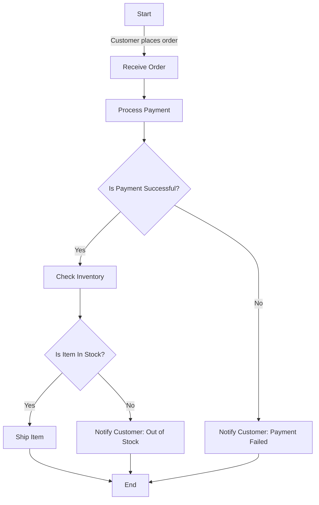
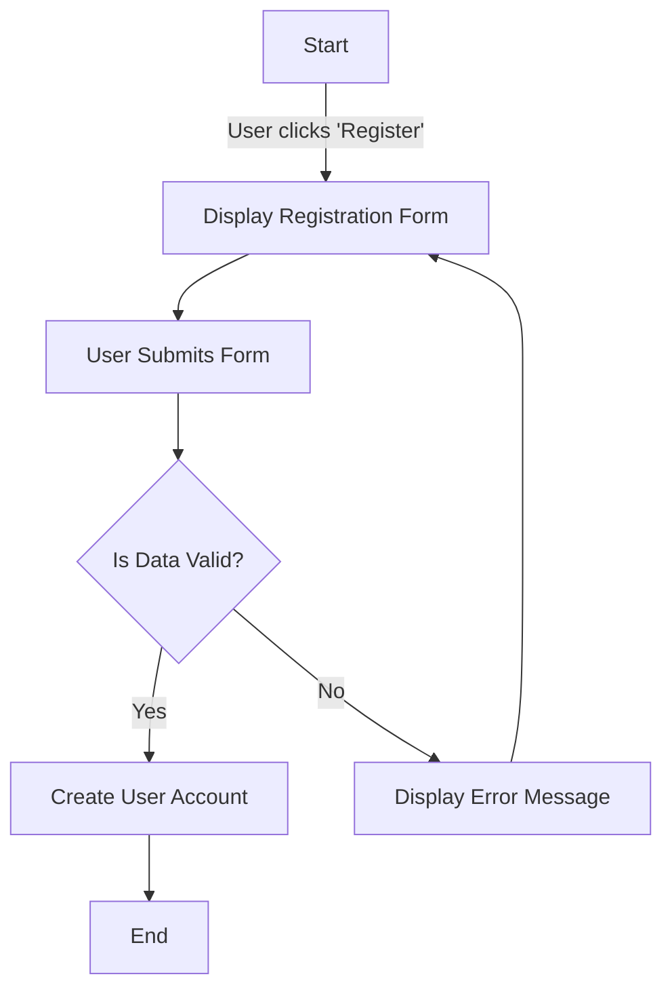
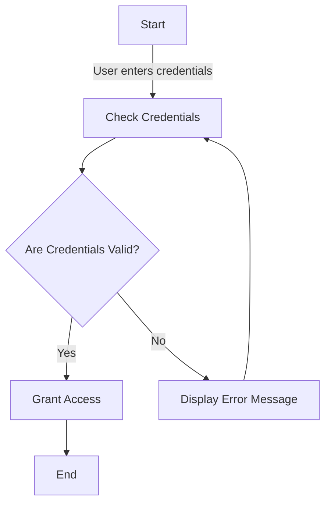

## 4.3.2 Workflow Representations (Activity Diagrams)

In the realm of software design, understanding and modeling workflows and processes is crucial for developing systems that are both efficient and effective. **Activity diagrams**, a key component of the Unified Modeling Language (UML), provide a visual representation of these workflows, allowing designers to map out the sequence of actions and decisions that occur within a system. This section delves into the purpose, components, and creation of activity diagrams, offering practical insights and examples to enhance your understanding.

### The Purpose of Activity Diagrams

Activity diagrams are instrumental in visualizing the flow of activities within a system. They are particularly useful for representing:

- **Complex Workflows:** Activity diagrams can illustrate intricate workflows that involve multiple steps and decision points.
- **Concurrent Processes:** They effectively model processes that occur simultaneously, making them ideal for systems that require multitasking.
- **Business Processes:** By mapping out business processes, activity diagrams help identify potential bottlenecks and optimize workflows.
- **Control Flow:** They provide a clear depiction of the control flow from one activity to another, highlighting the sequence and dependencies of tasks.

### Key Components of Activity Diagrams

To fully utilize activity diagrams, it is essential to understand their components:

- **Activities:** Represented by rounded rectangles, activities are the tasks or actions performed within the workflow. Each activity signifies a step in the process.
- **Start and End Nodes:** These nodes indicate where the workflow begins and ends. The start node is typically a filled circle, while the end node is a circle with a border.
- **Decision Nodes:** Represented by diamonds, decision nodes are branching points where the flow can take different paths based on conditions.
- **Merge Nodes:** Also represented by diamonds, merge nodes combine multiple flows into a single path.
- **Swimlanes:** These are vertical or horizontal lines that divide the diagram into sections, each representing a different actor or component responsible for specific activities.

### Creating Activity Diagrams

Creating an activity diagram involves several steps:

1. **Identify the Sequence of Activities:** Begin by listing all the activities involved in the process. Determine the order in which they occur and any dependencies between them.

2. **Determine Decision Points and Possible Paths:** Identify points in the workflow where decisions are made and outline the possible paths that result from these decisions.

3. **Assign Responsibilities Using Swimlanes:** If the workflow involves multiple actors or components, use swimlanes to assign responsibilities. This helps clarify who is responsible for each activity.

4. **Connect the Activities:** Use arrows to connect the activities, decision nodes, and merge nodes, illustrating the flow of the process.

5. **Review and Refine:** Once the diagram is complete, review it for accuracy and completeness. Ensure that it accurately represents the workflow and includes all necessary components.

### Practical Examples of Activity Diagrams

To illustrate the application of activity diagrams, let's explore two practical examples: modeling an order fulfillment process and representing a user registration workflow.

#### Example 1: Order Fulfillment Process

Consider an e-commerce platform where the order fulfillment process involves several steps, including order placement, payment processing, inventory checking, and shipping. An activity diagram for this process might look as follows:

In this diagram, the workflow begins with the customer placing an order. The process then moves to payment processing, followed by a decision point to check if the payment was successful. If successful, the inventory is checked, leading to another decision point. Depending on the stock availability, the item is either shipped or the customer is notified of the out-of-stock status. If the payment fails, the customer is notified accordingly.

#### Example 2: User Registration Workflow

A user registration workflow typically involves several steps, such as displaying a registration form, validating user input, and creating a user account. Here's how an activity diagram can represent this process:

In this example, the workflow starts when the user clicks the 'Register' button. The system displays the registration form, and upon submission, the data is validated. If the data is valid, a user account is created, and the process ends. If the data is invalid, an error message is displayed, and the user is prompted to correct the information.

### Code Examples and Activity Diagrams

While activity diagrams are primarily visual tools, they can be related to code by mapping activities to method calls or processes. For instance, in a user registration workflow, each activity could correspond to a function or method in your codebase:

- **Display Registration Form:** `displayRegistrationForm()`
- **User Submits Form:** `submitForm()`
- **Is Data Valid?:** `validateData()`
- **Create User Account:** `createUserAccount()`
- **Display Error Message:** `displayErrorMessage()`

By aligning activities with code, developers can ensure that the implementation accurately reflects the designed workflow.

### Visuals and Diagrams

Visual representation is a powerful tool in understanding workflows. Activity diagrams provide a clear and concise way to visualize processes, making it easier for stakeholders to comprehend complex workflows. Here is a detailed example of an activity diagram for a simple login process:

This diagram illustrates a basic login process where the user enters their credentials, which are then checked for validity. If the credentials are valid, access is granted; otherwise, an error message is displayed, and the user is prompted to re-enter their credentials.

### Key Points to Emphasize

- **Modeling Control Flow:** Activity diagrams are effective tools for modeling control flow and business processes, providing a clear depiction of the sequence and dependencies of tasks.
- **Identifying Bottlenecks:** By visualizing workflows, activity diagrams help identify potential bottlenecks and decision points, enabling designers to optimize processes for efficiency.
- **Enhancing Communication:** These diagrams facilitate communication among stakeholders by providing a common visual language to discuss and refine workflows.

### Best Practices for Activity Diagrams

To maximize the effectiveness of activity diagrams, consider the following best practices:

- **Keep It Simple:** Aim for clarity and simplicity. Avoid overloading the diagram with too many details, which can obscure the main workflow.
- **Use Consistent Notation:** Stick to standard UML notation to ensure that the diagram is easily understood by others familiar with UML.
- **Focus on Key Activities:** Highlight the most critical activities and decision points in the workflow, ensuring that the diagram captures the essence of the process.
- **Iterate and Refine:** Activity diagrams are iterative tools. Continuously refine them as the understanding of the workflow evolves or as requirements change.

### Common Pitfalls and How to Avoid Them

Despite their utility, activity diagrams can present challenges. Here are some common pitfalls and how to avoid them:

- **Overcomplicating the Diagram:** Including too many details can make the diagram difficult to read. Focus on the main activities and decision points.
- **Ignoring Alternative Paths:** Ensure that all possible paths, including exceptions and errors, are represented in the diagram.
- **Neglecting Swimlanes:** If the workflow involves multiple actors, use swimlanes to clarify responsibilities and avoid confusion.

### Conclusion

Activity diagrams are invaluable tools in the software design process, offering a visual representation of workflows and processes. By understanding their components and creation, designers can effectively model complex workflows, identify bottlenecks, and enhance communication among stakeholders. Whether you're modeling a simple user registration process or a complex order fulfillment system, activity diagrams provide the clarity and insight needed to design efficient and effective systems.

### Encourage Continued Learning

To further your understanding of activity diagrams and their application in software design, consider exploring additional resources such as UML textbooks, online courses, and software design workshops. Practicing the creation of activity diagrams for various workflows will reinforce your skills and improve your ability to model complex systems.

## Quiz Time!



### What is the primary purpose of activity diagrams?

- [x] To visualize the flow of activities in a system
- [ ] To model database structures
- [ ] To create user interfaces
- [ ] To write code

> **Explanation:** Activity diagrams are used to visualize the flow of activities in a system, helping to model workflows and processes.

### Which component of an activity diagram represents tasks or actions?

- [x] Activities
- [ ] Decision Nodes
- [ ] Start Nodes
- [ ] Swimlanes

> **Explanation:** Activities are represented by rounded rectangles and signify tasks or actions within the workflow.

### What do decision nodes in an activity diagram represent?

- [x] Branching points based on conditions
- [ ] The start of the workflow
- [ ] The end of the workflow
- [ ] Tasks or actions

> **Explanation:** Decision nodes, represented by diamonds, are branching points where the flow can take different paths based on conditions.

### How are swimlanes used in activity diagrams?

- [x] To divide activities among different actors or components
- [ ] To represent decision points
- [ ] To indicate the start and end of the workflow
- [ ] To merge multiple flows into one

> **Explanation:** Swimlanes are used to divide the diagram into sections, each representing a different actor or component responsible for specific activities.

### What is a common pitfall when creating activity diagrams?

- [x] Overcomplicating the diagram
- [ ] Using too few activities
- [ ] Ignoring the start node
- [ ] Focusing solely on decision nodes

> **Explanation:** Overcomplicating the diagram with too many details can make it difficult to read. It's important to focus on the main activities and decision points.

### In the context of activity diagrams, what is a merge node used for?

- [x] To combine multiple flows into one
- [ ] To start a new workflow
- [ ] To represent a task or action
- [ ] To divide activities among actors

> **Explanation:** Merge nodes, represented by diamonds, are used to combine multiple flows into a single path.

### Which of the following best describes the role of start and end nodes?

- [x] They indicate where the workflow begins and ends
- [ ] They represent decision points
- [ ] They divide activities among actors
- [ ] They are used to merge flows

> **Explanation:** Start and end nodes indicate where the workflow begins and ends, marking the boundaries of the process.

### How can activity diagrams enhance communication among stakeholders?

- [x] By providing a common visual language to discuss workflows
- [ ] By detailing every line of code
- [ ] By focusing on user interfaces
- [ ] By modeling database schemas

> **Explanation:** Activity diagrams provide a common visual language to discuss and refine workflows, facilitating communication among stakeholders.

### What should be the focus when creating an activity diagram?

- [x] Key activities and decision points
- [ ] Detailed code implementation
- [ ] Database schema
- [ ] User interface design

> **Explanation:** The focus should be on key activities and decision points to ensure the diagram captures the essence of the process.

### True or False: Activity diagrams can only be used for modeling software processes.

- [ ] True
- [x] False

> **Explanation:** Activity diagrams can be used for modeling a variety of processes, including business workflows and non-software-related activities.


