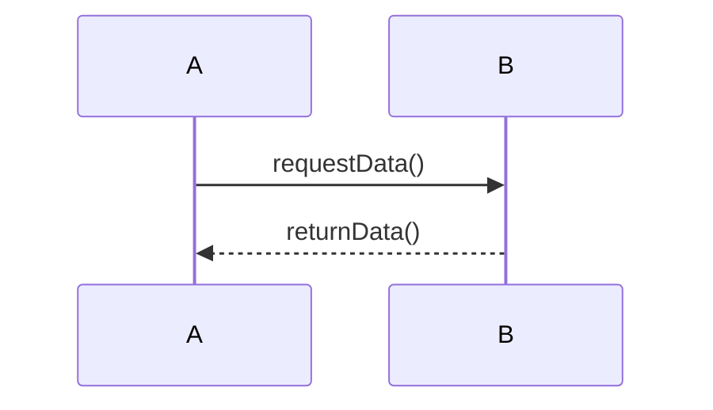
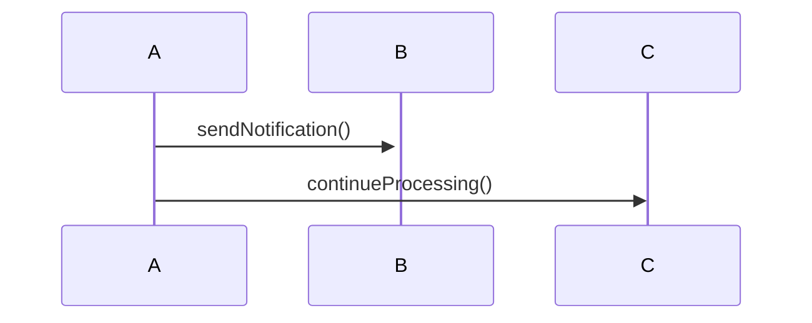
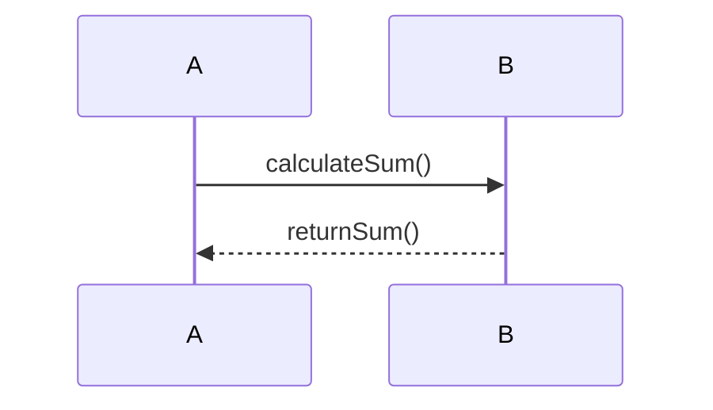
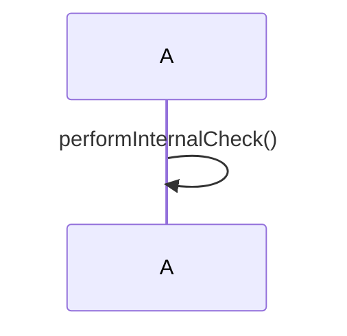
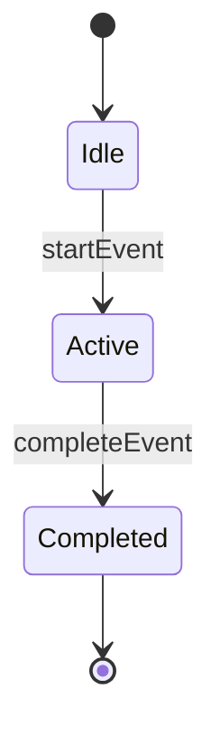
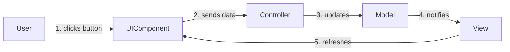

## 4.3.3 Messages and Events

In the realm of software design, understanding how messages and events are depicted in Unified Modeling Language (UML) diagrams is crucial for modeling the dynamic behaviors of systems. This section delves into the representation of messages and events in sequence and communication diagrams, highlighting their roles in depicting interactions and state changes in software systems.

### Messages in Sequence Diagrams

Sequence diagrams are a type of interaction diagram that detail how operations are carried out, focusing on the sequence of messages exchanged between objects. These diagrams are pivotal in showing the order of interactions and the flow of control within a system.

#### Synchronous vs. Asynchronous Messages

**Synchronous Messages:**  
Synchronous messages are those where the sender waits for the receiver to process the message and return control before proceeding. This is akin to a function call in programming, where the caller waits for the function to complete and return a result.



In the above sequence diagram, `A` sends a synchronous message `requestData()` to `B`. `A` waits for `B` to process the message and return `returnData()` before continuing.

**Asynchronous Messages:**  
Asynchronous messages, on the other hand, allow the sender to continue processing without waiting for the receiver to handle the message. This is similar to event-driven programming, where events are triggered and handled independently.



Here, `A` sends an asynchronous message `sendNotification()` to `B` and immediately continues to `continueProcessing()` with `C`, without waiting for `B` to respond.

#### Return Messages and Self-Calls

**Return Messages:**  
Return messages indicate the completion of a message call and the return of control to the sender. They are typically represented by dashed lines in sequence diagrams.



In this example, `B` processes `calculateSum()` and returns the result to `A` via `returnSum()`.

**Self-Calls:**  
Self-calls occur when an object invokes a method on itself. This is depicted by a looped arrow pointing back to the same object.



The self-call `performInternalCheck()` shows `A` executing a method on itself, which can be useful for recursive operations or internal state updates.

### Events

Events are significant occurrences at a specific point in time that can trigger transitions or actions within a system. They are fundamental in modeling reactive systems where state changes are driven by external or internal stimuli.

#### Events in State Machine Diagrams

State machine diagrams use events to trigger transitions between states. Each state represents a condition or situation during the life of an object, and transitions are the responses to events that move the object from one state to another.



In this state machine diagram, the `startEvent` triggers a transition from `Idle` to `Active`, and `completeEvent` moves the system from `Active` to `Completed`.

### Communication Diagrams

Communication diagrams, also known as collaboration diagrams, focus on the structural organization of objects that interact in a system. Unlike sequence diagrams, which emphasize the order of messages, communication diagrams highlight the relationships and interactions between objects.

#### Message Numbering in Communication Diagrams

Communication diagrams use message numbering to indicate the sequence of interactions. Each message is numbered to show the order of execution.



In this communication diagram, the sequence of interactions is numbered, starting with the `User` clicking a button and ending with the `View` refreshing the `UIComponent`.

### Modeling Event-Driven Interactions

Event-driven programming is a paradigm where the flow of the program is determined by events such as user actions, sensor outputs, or message passing. UML diagrams can effectively model these interactions, providing a clear view of how events trigger responses within the system.

#### Example: Button Click Event Handling

Consider a simple event-driven interaction where a button click triggers a series of actions.

```python
class Button:
    def click(self):
        print("Button clicked")
        self.send_data()

    def send_data(self):
        print("Data sent to controller")
        controller = Controller()
        controller.update_model()

class Controller:
    def update_model(self):
        print("Model updated")
        model = Model()
        model.notify_view()

class Model:
    def notify_view(self):
        print("View notified")
        view = View()
        view.refresh()

class View:
    def refresh(self):
        print("UI refreshed")

button = Button()
button.click()
```

In this Python example, a `Button` object handles a click event by sending data to a `Controller`, which updates a `Model` and notifies a `View` to refresh the UI. This sequence of operations is akin to the communication diagram shown earlier.

### Key Points to Emphasize

- **Understanding Messages and Events:** Grasping how messages and events are represented in UML diagrams is crucial for modeling dynamic behaviors in software systems.
- **Accurate Representation:** Proper depiction of messages and events aids in designing responsive and interactive systems, ensuring that the flow of control and data is well understood.
- **Practical Applications:** Utilizing sequence and communication diagrams can greatly enhance the clarity and effectiveness of software design, particularly in complex systems where interactions are numerous and varied.

### Conclusion

In this section, we explored how messages and events are represented in UML diagrams, focusing on sequence and communication diagrams. By understanding these concepts, software designers can effectively model the dynamic behaviors of systems, ensuring that interactions and state changes are clearly depicted and understood. This knowledge is essential for creating responsive and interactive applications, capable of handling complex event-driven interactions.

## Quiz Time!



### What is the primary focus of sequence diagrams?

- [x] The order of messages exchanged between objects
- [ ] The relationships between objects
- [ ] The data flow within a system
- [ ] The static structure of a system

> **Explanation:** Sequence diagrams emphasize the order and flow of messages exchanged between objects, detailing the sequence of interactions.

### How are synchronous messages represented in sequence diagrams?

- [x] The sender waits for a response before continuing
- [ ] The sender continues processing without waiting
- [ ] The message is not acknowledged
- [ ] The sender sends multiple messages simultaneously

> **Explanation:** Synchronous messages require the sender to wait for the receiver to process the message and return control before proceeding.

### What is the purpose of return messages in sequence diagrams?

- [x] Indicate the completion of a message call
- [ ] Initiate a new interaction
- [ ] Represent an asynchronous operation
- [ ] Define a new state

> **Explanation:** Return messages indicate that a message call has been completed and control is returned to the sender.

### What triggers transitions in state machine diagrams?

- [x] Events
- [ ] Messages
- [ ] Objects
- [ ] Classes

> **Explanation:** Events are significant occurrences that trigger transitions between states in state machine diagrams.

### How do communication diagrams differ from sequence diagrams?

- [x] They focus on object relationships
- [ ] They emphasize the order of messages
- [ ] They represent data flow
- [ ] They depict static structures

> **Explanation:** Communication diagrams highlight the structural organization and relationships between interacting objects, rather than the sequence of messages.

### What is the role of message numbering in communication diagrams?

- [x] Indicate the sequence of interactions
- [ ] Define object hierarchies
- [ ] Represent data types
- [ ] Specify return values

> **Explanation:** Message numbering in communication diagrams shows the order in which interactions occur between objects.

### In event-driven programming, what determines the flow of the program?

- [x] Events
- [ ] Functions
- [ ] Variables
- [ ] Classes

> **Explanation:** In event-driven programming, the flow of the program is determined by events such as user actions or message passing.

### How are self-calls depicted in sequence diagrams?

- [x] A looped arrow pointing back to the same object
- [ ] A dashed line to another object
- [ ] A solid line to a different object
- [ ] A new object creation

> **Explanation:** Self-calls are depicted by a looped arrow pointing back to the same object, indicating a method call on itself.

### Which UML diagram is best for modeling event-driven interactions?

- [x] Sequence diagrams
- [ ] Class diagrams
- [ ] Component diagrams
- [ ] Deployment diagrams

> **Explanation:** Sequence diagrams are effective for modeling event-driven interactions as they show the order and flow of messages and events.

### True or False: Events in UML are only used for triggering transitions in state machine diagrams.

- [x] False
- [ ] True

> **Explanation:** Events are not limited to state machine diagrams; they are also significant in sequence diagrams and other interaction models where they trigger actions and responses.


