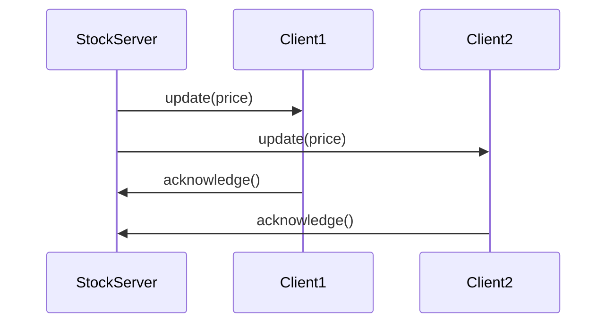
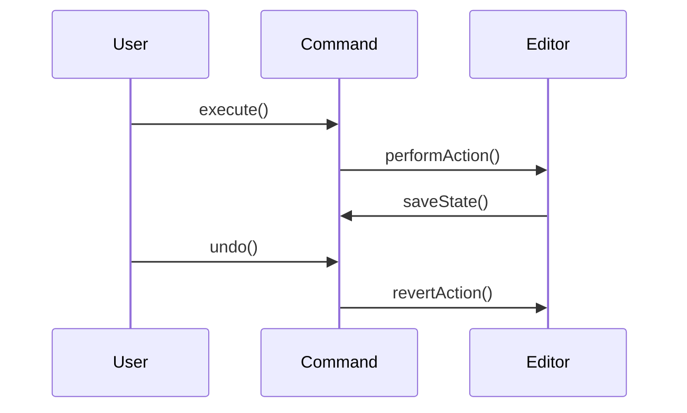
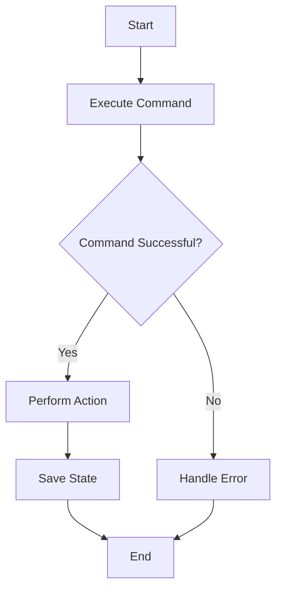

## 4.3.4 Practical Examples

In the realm of software design, understanding the interplay between various components is crucial for creating robust and maintainable systems. Sequence and activity diagrams, two fundamental types of UML diagrams, serve as powerful tools for visualizing these interactions. This section delves into practical examples of these diagrams, focusing on common design patterns such as Observer and Command. Through detailed walkthroughs and code implementations, we aim to bridge the gap between abstract design patterns and their concrete applications.

### Understanding Sequence and Activity Diagrams

Before diving into practical examples, let's briefly recap what sequence and activity diagrams are and how they differ:

- **Sequence Diagrams**: These diagrams illustrate how objects interact in a particular sequence of events. They emphasize the order of messages exchanged between objects and are particularly useful for modeling dynamic behavior in systems.

- **Activity Diagrams**: These diagrams focus on the flow of control or data within a system. They are akin to flowcharts and are used to model workflows and processes, highlighting decision points and parallel activities.

### Modeling the Observer Pattern with Sequence Diagrams

The Observer pattern is a behavioral design pattern that allows an object, known as the subject, to maintain a list of dependents, called observers, and notify them of any state changes. This pattern is commonly used in event-driven systems.

#### Scenario: Real-Time Stock Price Updates

Consider a stock market application where multiple clients (observers) need to receive real-time updates from a stock price server (subject). We'll use a sequence diagram to model this interaction.

#### Sequence Diagram



#### Explanation

1. **StockServer**: Acts as the subject, sending updates to registered clients.
2. **Client1 and Client2**: Represent observers that receive updates.
3. **update(price)**: The message sent from the server to the clients, carrying the new stock price.
4. **acknowledge()**: The clients acknowledge receipt of the update.

#### Code Implementation

Let's translate this sequence diagram into a Python implementation of the Observer pattern.

```python
class StockServer:
    def __init__(self):
        self.observers = []

    def register(self, observer):
        self.observers.append(observer)

    def unregister(self, observer):
        self.observers.remove(observer)

    def notify_observers(self, price):
        for observer in self.observers:
            observer.update(price)

class Client:
    def update(self, price):
        print(f"Received stock price update: {price}")

server = StockServer()
client1 = Client()
client2 = Client()

server.register(client1)
server.register(client2)

server.notify_observers(100.5)
```

### Modeling the Command Pattern with Sequence and Activity Diagrams

The Command pattern encapsulates a request as an object, thereby allowing for parameterization of clients with queues, requests, and operations. It also provides support for undoable operations.

#### Scenario: Text Editor with Undo Functionality

Consider a text editor application where users can execute commands like typing text, deleting text, and undoing the last command. We'll model this using both sequence and activity diagrams.

#### Sequence Diagram



#### Explanation

1. **User**: Initiates commands.
2. **Command**: Encapsulates the action to be performed.
3. **Editor**: The receiver of the command, where actions are executed and undone.
4. **execute()**: Method to perform the command.
5. **undo()**: Method to revert the last executed command.

#### Activity Diagram



#### Explanation

- **Start**: The process begins.
- **Execute Command**: The command is executed.
- **Perform Action**: If successful, the action is performed.
- **Save State**: The current state is saved for potential undo.
- **Handle Error**: If unsuccessful, an error is handled.

#### Code Implementation

Here is a Python implementation of the Command pattern with undo functionality.

```python
class Command:
    def __init__(self, editor, action):
        self.editor = editor
        self.action = action
        self.prev_state = None

    def execute(self):
        self.prev_state = self.editor.get_state()
        self.editor.perform_action(self.action)

    def undo(self):
        self.editor.set_state(self.prev_state)

class Editor:
    def __init__(self):
        self.state = ""

    def perform_action(self, action):
        self.state += action
        print(f"Current state: {self.state}")

    def get_state(self):
        return self.state

    def set_state(self, state):
        self.state = state
        print(f"State reverted to: {self.state}")

editor = Editor()
command = Command(editor, "Hello, World!")
command.execute()
command.undo()
```

### Exercises

To reinforce your understanding, try creating your own sequence and activity diagrams for the following scenarios:

1. **Observer Pattern**: Model a weather station application where multiple displays (observers) receive updates from a weather data server (subject).

2. **Command Pattern**: Design a smart home system where commands like turning on lights, adjusting thermostats, and locking doors can be executed and undone.

### Key Points to Emphasize

- **Practical Application**: Diagrams help visualize the flow of interactions, making it easier to understand and implement design patterns.
- **Code Integration**: Translating diagrams into code solidifies comprehension and highlights the practical utility of design patterns.
- **Exercises**: Hands-on practice with creating diagrams and coding implementations reinforces learning and boosts confidence.

### Conclusion

Sequence and activity diagrams are invaluable tools for modeling the intricate interactions within software systems. By applying these diagrams to common design patterns like Observer and Command, we gain a deeper understanding of both the patterns themselves and the systems they are used to build. Through practical examples and code implementations, we bridge the gap between theory and practice, empowering you to apply these concepts in your own projects.

## Quiz Time!



### Which diagram best illustrates the order of messages exchanged between objects?

- [x] Sequence Diagram
- [ ] Activity Diagram
- [ ] Class Diagram
- [ ] Use Case Diagram

> **Explanation:** Sequence diagrams focus on the order of messages exchanged between objects, capturing the dynamic behavior of a system.

### What is the primary focus of an activity diagram?

- [ ] Object interactions
- [x] Flow of control or data
- [ ] Class structure
- [ ] System architecture

> **Explanation:** Activity diagrams emphasize the flow of control or data, modeling workflows and processes within a system.

### In the Observer pattern, what role does the subject play?

- [x] Maintains a list of observers and notifies them of changes
- [ ] Receives updates from observers
- [ ] Executes commands
- [ ] Manages state transitions

> **Explanation:** The subject in the Observer pattern maintains a list of observers and notifies them of any state changes.

### Which pattern encapsulates a request as an object?

- [ ] Observer Pattern
- [x] Command Pattern
- [ ] Strategy Pattern
- [ ] Singleton Pattern

> **Explanation:** The Command pattern encapsulates a request as an object, allowing for parameterization of clients with queues, requests, and operations.

### What method is used to revert the last executed command in the Command pattern?

- [x] undo()
- [ ] execute()
- [ ] performAction()
- [ ] revertState()

> **Explanation:** The `undo()` method is used to revert the last executed command in the Command pattern.

### Which diagram would you use to model a workflow with decision points and parallel activities?

- [ ] Sequence Diagram
- [x] Activity Diagram
- [ ] Class Diagram
- [ ] Component Diagram

> **Explanation:** Activity diagrams are used to model workflows with decision points and parallel activities, similar to flowcharts.

### In the given sequence diagram for the Command pattern, what is the role of the `saveState()` message?

- [x] Saves the current state for potential undo
- [ ] Executes the command
- [ ] Reverts the action
- [ ] Notifies the user

> **Explanation:** The `saveState()` message saves the current state of the system so that it can be restored if an undo operation is performed.

### What does the `performAction()` method do in the Command pattern?

- [x] Executes the action associated with the command
- [ ] Saves the current state
- [ ] Reverts the action
- [ ] Registers an observer

> **Explanation:** The `performAction()` method executes the action associated with the command in the Command pattern.

### In the Observer pattern, what is the purpose of the `notify_observers()` method?

- [x] Sends updates to all registered observers
- [ ] Registers a new observer
- [ ] Unregisters an observer
- [ ] Executes a command

> **Explanation:** The `notify_observers()` method sends updates to all registered observers in the Observer pattern.

### True or False: Sequence diagrams can be used to model both synchronous and asynchronous interactions.

- [x] True
- [ ] False

> **Explanation:** Sequence diagrams can model both synchronous and asynchronous interactions, illustrating the sequence of messages exchanged between objects.


