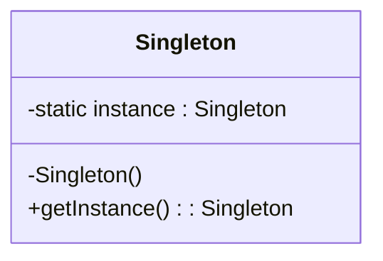
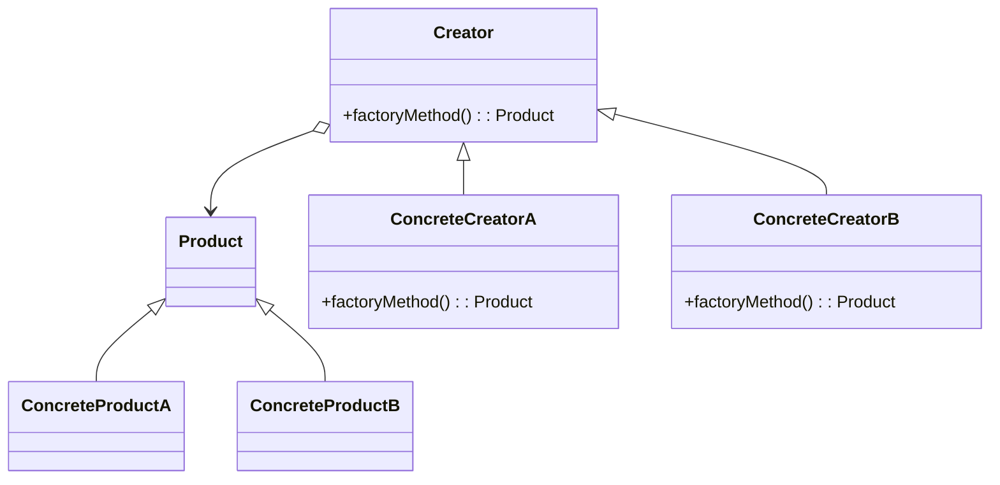
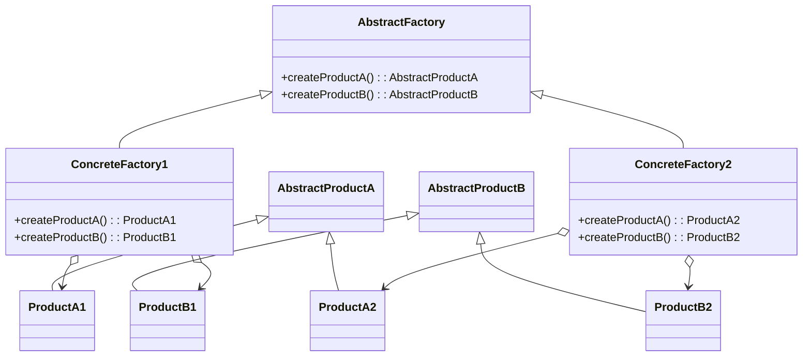
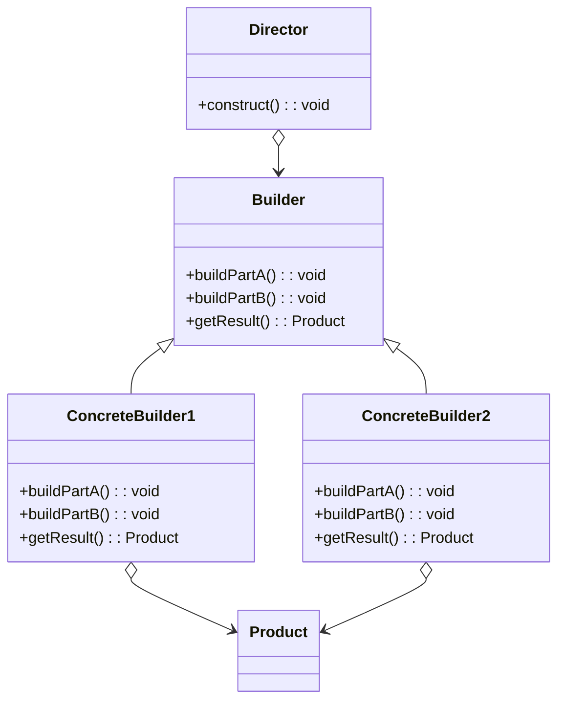
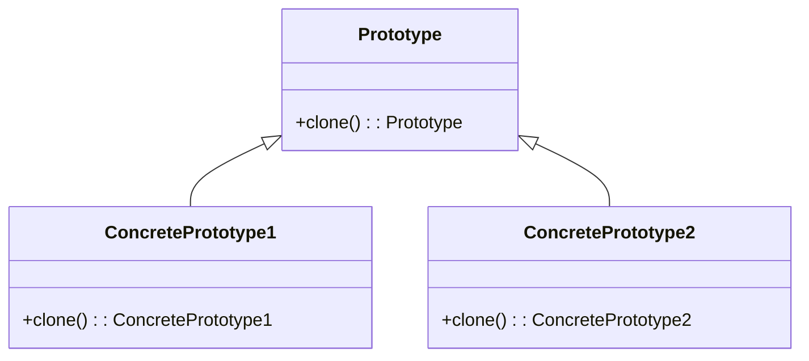

---

linkTitle: "4.4.1 Visualizing Creational Patterns"
title: "Visualizing Creational Patterns with UML Diagrams for Software Design"
description: "Explore how to represent creational design patterns using UML diagrams, focusing on key patterns like Singleton, Factory Method, Abstract Factory, Builder, and Prototype. Learn through detailed class and sequence diagrams, supported by code examples."
categories:
- Software Design
- UML
- Design Patterns
tags:
- Creational Patterns
- UML Diagrams
- Singleton
- Factory Method
- Abstract Factory
- Builder
- Prototype
date: 2024-10-25
type: docs
nav_weight: 441000
---

## 4.4.1 Visualizing Creational Patterns

Understanding creational design patterns is crucial for any software developer aiming to create scalable and maintainable systems. These patterns focus on the best ways to create objects, which is a fundamental aspect of software design. In this section, we will delve into how to represent these patterns using Unified Modeling Language (UML) diagrams. UML is a powerful tool that helps visualize the architecture of software systems, making it easier to understand and implement design patterns.

### Introduction to Creational Patterns

Creational patterns abstract the instantiation process, making the system independent of how its objects are created, composed, and represented. They provide various object creation mechanisms, which increase flexibility and reuse of existing code. The key creational patterns we will explore include:

- **Singleton**
- **Factory Method**
- **Abstract Factory**
- **Builder**
- **Prototype**

### The Role of UML in Visualizing Patterns

UML diagrams serve as a blueprint for software systems. They help in visualizing the structure and behavior of a system, which is essential when dealing with complex design patterns. By using class diagrams, we can represent the static structure of the system, showing the classes involved and their relationships. Sequence diagrams, on the other hand, help us understand the dynamic behavior, illustrating how objects interact in a particular scenario.

### Singleton Pattern

The Singleton pattern ensures that a class has only one instance and provides a global point of access to it. This pattern is particularly useful when exactly one object is needed to coordinate actions across the system.

#### UML Class Diagram for Singleton

In the Singleton pattern, the class diagram highlights the static instance and the private constructor, ensuring that the class cannot be instantiated from outside.



#### Code Example: Singleton in Python

```python
class Singleton:
    _instance = None

    def __new__(cls):
        if cls._instance is None:
            cls._instance = super(Singleton, cls).__new__(cls)
        return cls._instance

singleton1 = Singleton()
singleton2 = Singleton()
print(singleton1 is singleton2)  # Output: True
```

In this Python example, the `__new__` method ensures that only one instance of the class is created. The `is` operator confirms that both `singleton1` and `singleton2` refer to the same instance.

### Factory Method Pattern

The Factory Method pattern defines an interface for creating an object but lets subclasses alter the type of objects that will be created. It allows a class to defer instantiation to subclasses.

#### UML Class Diagram for Factory Method

The class diagram for the Factory Method pattern shows the Creator class and its subclasses, the ConcreteCreators. Each ConcreteCreator overrides the factory method to produce an instance of a ConcreteProduct.



#### Code Example: Factory Method in JavaScript

```javascript
class Product {
  constructor(name) {
    this.name = name;
  }
}

class ConcreteProductA extends Product {
  constructor() {
    super('ConcreteProductA');
  }
}

class ConcreteProductB extends Product {
  constructor() {
    super('ConcreteProductB');
  }
}

class Creator {
  factoryMethod() {
    return new Product('DefaultProduct');
  }
}

class ConcreteCreatorA extends Creator {
  factoryMethod() {
    return new ConcreteProductA();
  }
}

class ConcreteCreatorB extends Creator {
  factoryMethod() {
    return new ConcreteProductB();
  }
}

// Usage
const creatorA = new ConcreteCreatorA();
const productA = creatorA.factoryMethod();
console.log(productA.name); // Output: ConcreteProductA

const creatorB = new ConcreteCreatorB();
const productB = creatorB.factoryMethod();
console.log(productB.name); // Output: ConcreteProductB
```

In this JavaScript example, the `ConcreteCreatorA` and `ConcreteCreatorB` classes override the `factoryMethod` to instantiate and return specific products.

### Abstract Factory Pattern

The Abstract Factory pattern provides an interface for creating families of related or dependent objects without specifying their concrete classes. It is useful when a system needs to be independent of how its products are created.

#### UML Class Diagram for Abstract Factory

The class diagram illustrates the AbstractFactory interface and its ConcreteFactories, each responsible for creating a family of related products.



#### Code Example: Abstract Factory in Python

```python
class AbstractFactory:
    def create_product_a(self):
        pass

    def create_product_b(self):
        pass

class ConcreteFactory1(AbstractFactory):
    def create_product_a(self):
        return ProductA1()

    def create_product_b(self):
        return ProductB1()

class ConcreteFactory2(AbstractFactory):
    def create_product_a(self):
        return ProductA2()

    def create_product_b(self):
        return ProductB2()

class AbstractProductA:
    pass

class AbstractProductB:
    pass

class ProductA1(AbstractProductA):
    pass

class ProductA2(AbstractProductA):
    pass

class ProductB1(AbstractProductB):
    pass

class ProductB2(AbstractProductB):
    pass

factory1 = ConcreteFactory1()
product_a1 = factory1.create_product_a()
product_b1 = factory1.create_product_b()

factory2 = ConcreteFactory2()
product_a2 = factory2.create_product_a()
product_b2 = factory2.create_product_b()
```

In this Python example, `ConcreteFactory1` and `ConcreteFactory2` implement the `AbstractFactory` interface to create products from two different product families.

### Builder Pattern

The Builder pattern separates the construction of a complex object from its representation, allowing the same construction process to create different representations.

#### UML Class Diagram for Builder

The class diagram shows the Builder interface and its ConcreteBuilders, each responsible for constructing and assembling parts of the product.



#### Code Example: Builder in JavaScript

```javascript
class Product {
  constructor() {
    this.parts = [];
  }

  addPart(part) {
    this.parts.push(part);
  }

  show() {
    console.log('Product parts: ' + this.parts.join(', '));
  }
}

class Builder {
  buildPartA() {}
  buildPartB() {}
  getResult() {}
}

class ConcreteBuilder1 extends Builder {
  constructor() {
    super();
    this.product = new Product();
  }

  buildPartA() {
    this.product.addPart('PartA1');
  }

  buildPartB() {
    this.product.addPart('PartB1');
  }

  getResult() {
    return this.product;
  }
}

class ConcreteBuilder2 extends Builder {
  constructor() {
    super();
    this.product = new Product();
  }

  buildPartA() {
    this.product.addPart('PartA2');
  }

  buildPartB() {
    this.product.addPart('PartB2');
  }

  getResult() {
    return this.product;
  }
}

class Director {
  construct(builder) {
    builder.buildPartA();
    builder.buildPartB();
  }
}

// Usage
const director = new Director();
const builder1 = new ConcreteBuilder1();
director.construct(builder1);
const product1 = builder1.getResult();
product1.show(); // Output: Product parts: PartA1, PartB1

const builder2 = new ConcreteBuilder2();
director.construct(builder2);
const product2 = builder2.getResult();
product2.show(); // Output: Product parts: PartA2, PartB2
```

In this JavaScript example, the `Director` class uses the `Builder` interface to construct a product by delegating the building process to `ConcreteBuilder1` and `ConcreteBuilder2`.

### Prototype Pattern

The Prototype pattern is used to create a new object by copying an existing object, known as the prototype. This pattern is useful when the cost of creating a new object is more expensive than cloning.

#### UML Class Diagram for Prototype

The class diagram illustrates the Prototype interface and its ConcretePrototypes, each capable of cloning itself.



#### Code Example: Prototype in Python

```python
import copy

class Prototype:
    def clone(self):
        pass

class ConcretePrototype1(Prototype):
    def __init__(self, value):
        self.value = value

    def clone(self):
        return copy.deepcopy(self)

class ConcretePrototype2(Prototype):
    def __init__(self, value):
        self.value = value

    def clone(self):
        return copy.deepcopy(self)

prototype1 = ConcretePrototype1('Value1')
clone1 = prototype1.clone()
print(clone1.value)  # Output: Value1

prototype2 = ConcretePrototype2('Value2')
clone2 = prototype2.clone()
print(clone2.value)  # Output: Value2
```

In this Python example, the `clone` method uses `deepcopy` to create a new instance of the object with the same state as the original.

### Conclusion

Visualizing creational patterns with UML diagrams provides a clear and structured way to understand and implement these patterns. By representing the static and dynamic aspects of these patterns, developers can plan their implementation more effectively, ensuring that the design is robust and scalable.

The examples and diagrams provided in this section illustrate how each pattern can be applied in real-world scenarios, making it easier for developers to choose the right pattern for their specific needs.

### Best Practices

- **Use UML diagrams** to plan and communicate design decisions effectively.
- **Choose the right pattern** based on the specific requirements of your project.
- **Ensure consistency** in your design by adhering to the principles of each pattern.
- **Test your implementations** thoroughly to confirm that they meet the desired objectives.

### Common Pitfalls

- **Overcomplicating designs** by using patterns unnecessarily.
- **Ignoring scalability** when implementing patterns, leading to maintenance challenges.
- **Misunderstanding the intent** of a pattern, resulting in incorrect implementations.

By avoiding these pitfalls and following best practices, you can leverage the power of design patterns to create flexible and maintainable software systems.

## Quiz Time!



### Which UML diagram is used to represent the static structure of a system?

- [x] Class Diagram
- [ ] Sequence Diagram
- [ ] Use Case Diagram
- [ ] Activity Diagram

> **Explanation:** Class diagrams represent the static structure of a system, showing classes and their relationships.

### What does the Singleton pattern ensure?

- [x] A class has only one instance
- [ ] A class can have multiple instances
- [ ] A class has multiple constructors
- [ ] A class has no instances

> **Explanation:** The Singleton pattern ensures that a class has only one instance and provides a global point of access to it.

### In the Factory Method pattern, what is the role of the Creator class?

- [x] To define an interface for creating an object
- [ ] To directly create instances of objects
- [ ] To store object instances
- [ ] To destroy object instances

> **Explanation:** The Creator class defines an interface for creating an object, allowing subclasses to alter the type of objects that will be created.

### What is the primary purpose of the Abstract Factory pattern?

- [x] To create families of related objects
- [ ] To create a single object
- [ ] To clone objects
- [ ] To build complex objects

> **Explanation:** The Abstract Factory pattern provides an interface for creating families of related or dependent objects without specifying their concrete classes.

### Which pattern allows the same construction process to create different representations?

- [x] Builder
- [ ] Singleton
- [ ] Prototype
- [ ] Factory Method

> **Explanation:** The Builder pattern separates the construction of a complex object from its representation, allowing the same construction process to create different representations.

### In the Prototype pattern, how is a new object created?

- [x] By copying an existing object
- [ ] By using a factory method
- [ ] By using a builder
- [ ] By using a singleton

> **Explanation:** The Prototype pattern creates a new object by copying an existing object, known as the prototype.

### What does a sequence diagram illustrate?

- [x] Object interactions in a particular scenario
- [ ] The static structure of a system
- [ ] The inheritance hierarchy
- [ ] The deployment of components

> **Explanation:** Sequence diagrams illustrate how objects interact in a particular scenario, showing the sequence of messages exchanged.

### Which pattern is useful when the cost of creating a new object is more expensive than cloning?

- [x] Prototype
- [ ] Singleton
- [ ] Factory Method
- [ ] Builder

> **Explanation:** The Prototype pattern is useful when the cost of creating a new object is more expensive than cloning an existing one.

### What is the main advantage of using UML diagrams in software design?

- [x] They provide a visual representation of the system architecture
- [ ] They eliminate the need for documentation
- [ ] They replace coding
- [ ] They are only used for testing

> **Explanation:** UML diagrams provide a visual representation of the system architecture, making it easier to understand and communicate design decisions.

### True or False: The Builder pattern is used to create a single instance of a class.

- [ ] True
- [x] False

> **Explanation:** False. The Builder pattern is used to construct complex objects by separating the construction process from the representation, not for creating a single instance.


