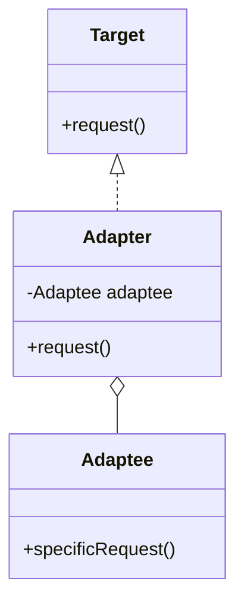
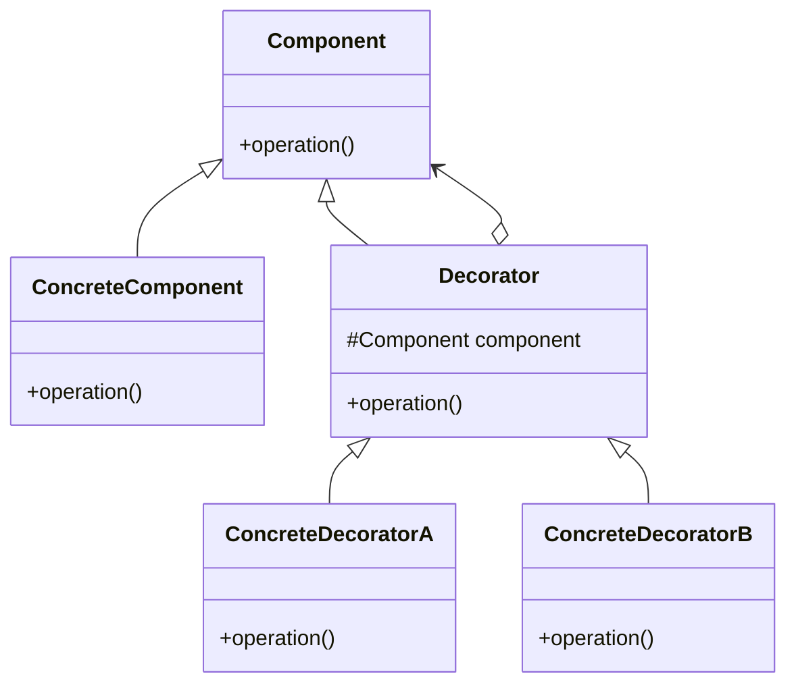
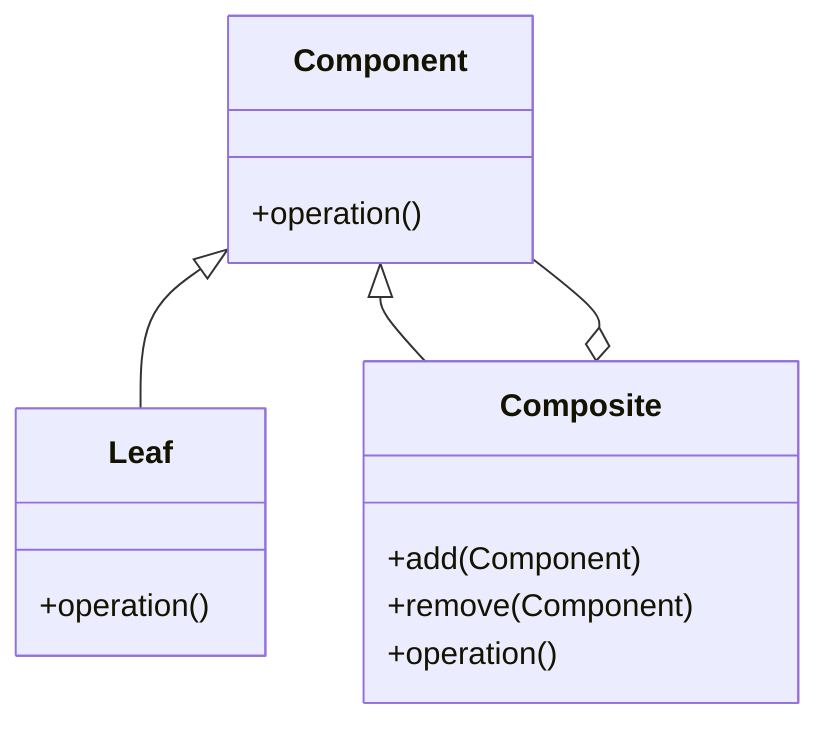
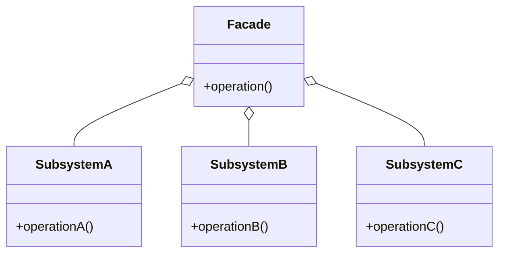
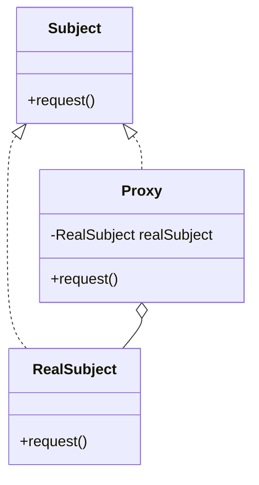

## 4.4.2 Representing Structural Patterns

In the realm of software design, understanding the structural design patterns is crucial for creating systems that are not only efficient but also easy to understand and maintain. Structural patterns are about organizing different classes and objects to form larger structures, providing new functionality. This section will delve into how Unified Modeling Language (UML) can be effectively used to represent these patterns, focusing on the Adapter, Decorator, Composite, Facade, and Proxy patterns.

### Understanding Structural Patterns

Structural design patterns are concerned with how classes and objects are composed to form larger structures. They are essential for defining clear and efficient relationships between entities in a software system. Let's explore each of these patterns in detail, using UML diagrams to illustrate their structure and relationships.

### Adapter Pattern

#### Concept

The Adapter pattern allows incompatible interfaces to work together. It acts as a bridge between two incompatible interfaces by converting the interface of a class into another interface the client expects.

#### UML Representation

In UML, the Adapter pattern is depicted by showing how the Adapter class implements the Target interface and uses an instance of the Adaptee class.



#### Code Example in Python

```python
class Target:
    def request(self):
        return "Target: The default target's behavior."

class Adaptee:
    def specific_request(self):
        return ".eetpadA eht fo roivaheb laicepS"

class Adapter(Target):
    def __init__(self, adaptee: Adaptee):
        self.adaptee = adaptee

    def request(self):
        return f"Adapter: (TRANSLATED) {self.adaptee.specific_request()[::-1]}"

def client_code(target: Target):
    print(target.request())

print("Client: I can work just fine with the Target objects:")
target = Target()
client_code(target)

print("\nClient: The Adaptee class has a weird interface. See, I don't understand it:")
adaptee = Adaptee()
print(f"Adaptee: {adaptee.specific_request()}")

print("\nClient: But I can work with it via the Adapter:")
adapter = Adapter(adaptee)
client_code(adapter)
```

#### Key Points

- **Target Interface:** The interface expected by the client.
- **Adaptee:** The existing interface that needs adapting.
- **Adapter:** Implements the Target interface and translates the Adaptee's interface to the Target's.

### Decorator Pattern

#### Concept

The Decorator pattern adds new functionality to an existing object without altering its structure. This pattern creates a set of decorator classes that are used to wrap concrete components.

#### UML Representation

The UML diagram for the Decorator pattern shows how decorators are related to the component they enhance.



#### Code Example in JavaScript

```javascript
// Component
class Coffee {
    cost() {
        return 5;
    }
}

// Decorator
class MilkDecorator {
    constructor(coffee) {
        this.coffee = coffee;
    }

    cost() {
        return this.coffee.cost() + 1;
    }
}

// Another Decorator
class SugarDecorator {
    constructor(coffee) {
        this.coffee = coffee;
    }

    cost() {
        return this.coffee.cost() + 0.5;
    }
}

// Usage
let coffee = new Coffee();
console.log(`Cost of plain coffee: $${coffee.cost()}`);

coffee = new MilkDecorator(coffee);
console.log(`Cost with milk: $${coffee.cost()}`);

coffee = new SugarDecorator(coffee);
console.log(`Cost with milk and sugar: $${coffee.cost()}`);
```

#### Key Points

- **Component:** Interface for objects that can have responsibilities added to them dynamically.
- **ConcreteComponent:** The object to which additional responsibilities can be attached.
- **Decorator:** Maintains a reference to a Component object and defines an interface that conforms to Component's interface.
- **ConcreteDecorators:** Add responsibilities to the component.

### Composite Pattern

#### Concept

The Composite pattern is used to treat individual objects and compositions of objects uniformly. It composes objects into tree structures to represent part-whole hierarchies.

#### UML Representation

The UML diagram for the Composite pattern shows the recursive composition of components.



#### Code Example in Python

```python
class Component:
    def operation(self):
        pass

class Leaf(Component):
    def operation(self):
        return "Leaf"

class Composite(Component):
    def __init__(self):
        self._children = []

    def add(self, component):
        self._children.append(component)

    def remove(self, component):
        self._children.remove(component)

    def operation(self):
        results = []
        for child in self._children:
            results.append(child.operation())
        return f"Branch({'+'.join(results)})"

def client_code(component: Component):
    print(f"RESULT: {component.operation()}")

leaf = Leaf()
print("Client: I've got a simple component:")
client_code(leaf)

tree = Composite()
branch1 = Composite()
branch1.add(Leaf())
branch1.add(Leaf())

branch2 = Composite()
branch2.add(Leaf())

tree.add(branch1)
tree.add(branch2)

print("Client: Now I've got a composite tree:")
client_code(tree)
```

#### Key Points

- **Component:** Declares the interface for objects in the composition.
- **Leaf:** Represents leaf objects in the composition, implementing the Component interface.
- **Composite:** Defines behavior for components having children and stores child components.

### Facade Pattern

#### Concept

The Facade pattern provides a simplified interface to a complex subsystem. It defines a higher-level interface that makes the subsystem easier to use.

#### UML Representation

The UML diagram for the Facade pattern shows the Facade class interacting with subsystems.



#### Code Example in JavaScript

```javascript
class SubsystemA {
    operationA() {
        return "SubsystemA: Ready!\n";
    }
}

class SubsystemB {
    operationB() {
        return "SubsystemB: Go!\n";
    }
}

class SubsystemC {
    operationC() {
        return "SubsystemC: Fire!\n";
    }
}

class Facade {
    constructor() {
        this.subsystemA = new SubsystemA();
        this.subsystemB = new SubsystemB();
        this.subsystemC = new SubsystemC();
    }

    operation() {
        let result = "Facade initializes subsystems:\n";
        result += this.subsystemA.operationA();
        result += this.subsystemB.operationB();
        result += this.subsystemC.operationC();
        return result;
    }
}

// Client code
const facade = new Facade();
console.log(facade.operation());
```

#### Key Points

- **Facade:** Provides a simple interface to the complex subsystem.
- **Subsystems:** Perform the actual work and have no knowledge of the Facade.

### Proxy Pattern

#### Concept

The Proxy pattern provides a surrogate or placeholder for another object to control access to it. It can be used for lazy initialization, logging, access control, and more.

#### UML Representation

The UML diagram for the Proxy pattern shows the Proxy class implementing the same interface as the RealSubject.



#### Code Example in Python

```python
class Subject:
    def request(self):
        pass

class RealSubject(Subject):
    def request(self):
        return "RealSubject: Handling request."

class Proxy(Subject):
    def __init__(self, real_subject: RealSubject):
        self._real_subject = real_subject

    def request(self):
        if self.check_access():
            result = self._real_subject.request()
            self.log_access()
            return result

    def check_access(self):
        print("Proxy: Checking access prior to firing a real request.")
        return True

    def log_access(self):
        print("Proxy: Logging the time of request.")

def client_code(subject: Subject):
    print(subject.request())

print("Client: Executing the client code with a real subject:")
real_subject = RealSubject()
client_code(real_subject)

print("\nClient: Executing the same client code with a proxy:")
proxy = Proxy(real_subject)
client_code(proxy)
```

#### Key Points

- **Subject:** Declares the common interface for RealSubject and Proxy.
- **RealSubject:** Defines the real object that the Proxy represents.
- **Proxy:** Controls access to the RealSubject and may add additional functionality.

### Conclusion

Structural design patterns play a vital role in defining how classes and objects are organized to form larger structures. By using UML diagrams, we can clearly represent the relationships and interactions within these patterns, making them easier to understand and implement. Understanding these patterns and their UML representations is crucial for designing robust and maintainable software systems.

## Quiz Time!



### What is the primary purpose of the Adapter pattern?

- [x] To allow incompatible interfaces to work together
- [ ] To add new functionality to an existing object
- [ ] To represent part-whole hierarchies
- [ ] To provide a simplified interface to a complex subsystem

> **Explanation:** The Adapter pattern acts as a bridge between two incompatible interfaces, allowing them to work together.

### Which pattern is used to add responsibilities to objects dynamically?

- [ ] Adapter
- [x] Decorator
- [ ] Composite
- [ ] Proxy

> **Explanation:** The Decorator pattern adds new functionality to an existing object without altering its structure.

### In the Composite pattern, what role does the Leaf class play?

- [x] Represents leaf objects in the composition
- [ ] Provides a simplified interface to a complex subsystem
- [ ] Controls access to the RealSubject
- [ ] Acts as a bridge between two incompatible interfaces

> **Explanation:** In the Composite pattern, the Leaf class represents leaf objects that do not have children.

### What is the main advantage of the Facade pattern?

- [ ] It adds responsibilities to objects dynamically.
- [ ] It provides a simplified interface to a complex subsystem.
- [x] It allows incompatible interfaces to work together.
- [ ] It represents part-whole hierarchies.

> **Explanation:** The Facade pattern provides a simplified interface to a complex subsystem, making it easier to use.

### Which pattern uses a surrogate or placeholder to control access to an object?

- [ ] Adapter
- [ ] Decorator
- [ ] Composite
- [x] Proxy

> **Explanation:** The Proxy pattern provides a surrogate or placeholder for another object to control access to it.

### How does the Proxy pattern enhance functionality?

- [x] By controlling access to the RealSubject
- [ ] By adding responsibilities to objects dynamically
- [ ] By representing part-whole hierarchies
- [ ] By providing a simplified interface

> **Explanation:** The Proxy pattern controls access to the RealSubject and may add additional functionality like logging or access control.

### What does the Decorator pattern use to add new functionality?

- [x] A set of decorator classes
- [ ] A simplified interface
- [ ] A surrogate or placeholder
- [ ] A bridge between interfaces

> **Explanation:** The Decorator pattern uses a set of decorator classes to wrap concrete components and add new functionality.

### In the UML diagram for the Composite pattern, what does the Composite class do?

- [x] Defines behavior for components having children
- [ ] Represents leaf objects in the composition
- [ ] Provides a simplified interface to a complex subsystem
- [ ] Controls access to the RealSubject

> **Explanation:** The Composite class defines behavior for components having children and stores child components.

### What is the relationship between the Facade and the subsystems?

- [x] The Facade interacts with subsystems to simplify their usage.
- [ ] The Facade adds responsibilities to the subsystems dynamically.
- [ ] The Facade acts as a surrogate or placeholder for the subsystems.
- [ ] The Facade represents part-whole hierarchies of the subsystems.

> **Explanation:** The Facade interacts with subsystems to provide a simplified interface, making them easier to use.

### True or False: The Adapter pattern can be used to add new functionality to an existing object.

- [ ] True
- [x] False

> **Explanation:** False. The Adapter pattern is used to allow incompatible interfaces to work together, not to add new functionality.


