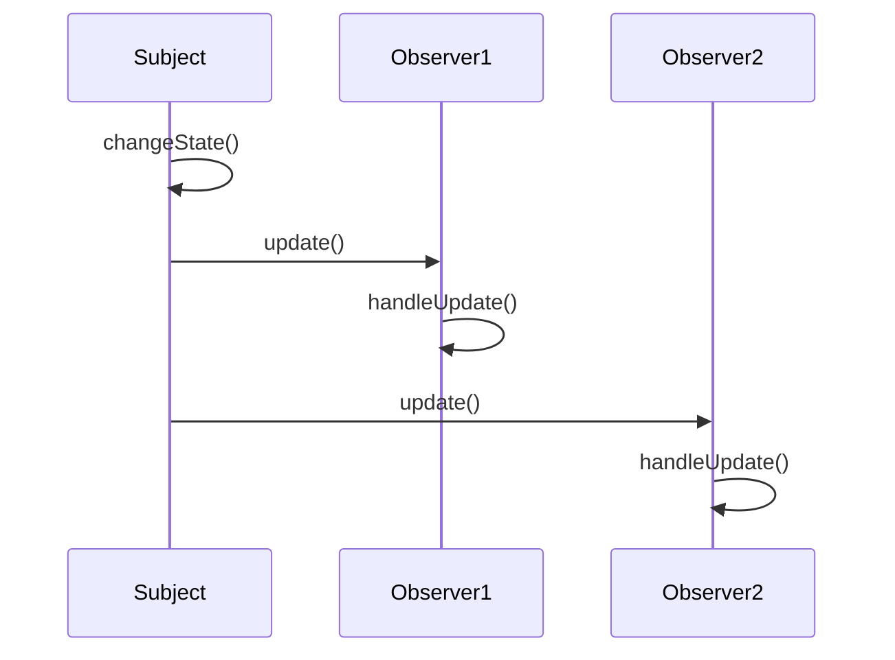
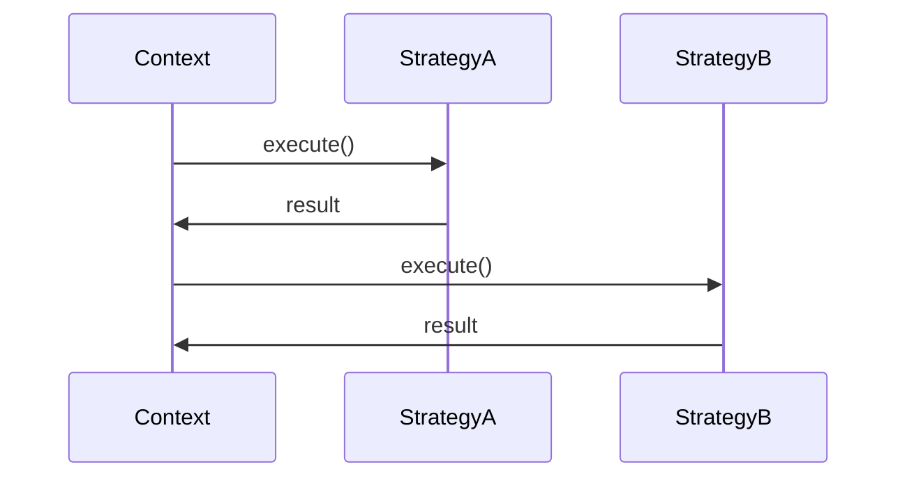
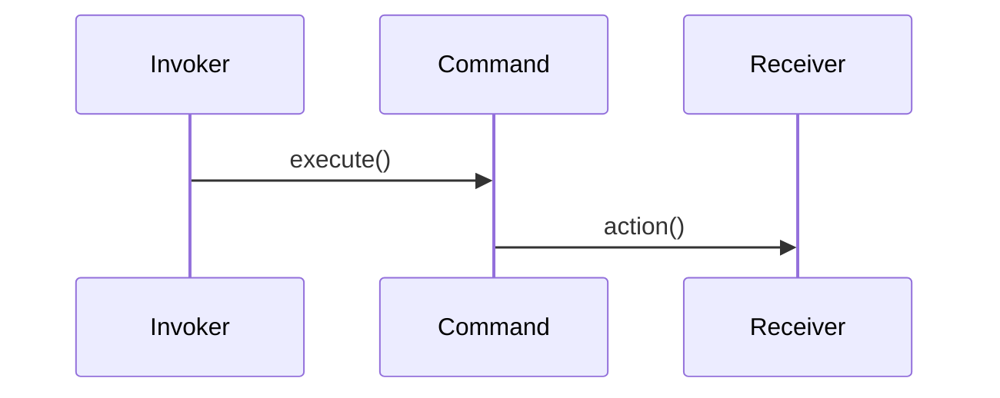
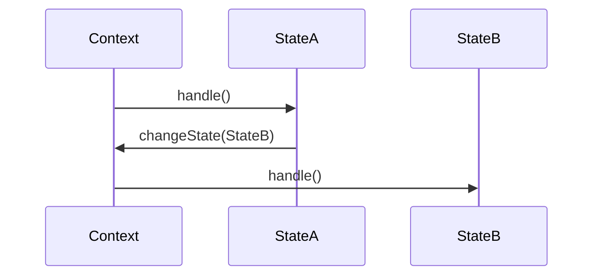
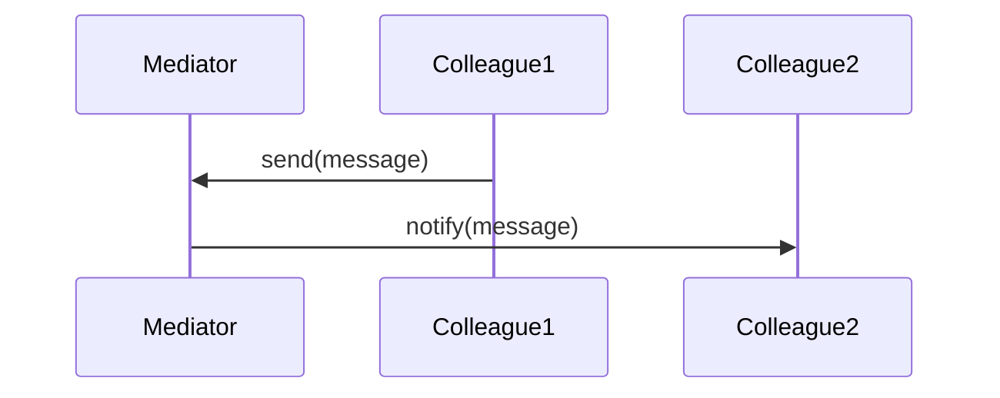

## 4.4.3 Depicting Behavioral Patterns

In the realm of software design, understanding how objects interact and collaborate is crucial for building robust and maintainable systems. Behavioral design patterns play a pivotal role in managing algorithms, object responsibilities, and the flow of communication between objects. This section delves into the depiction of key behavioral patterns using Unified Modeling Language (UML), providing a clear visualization of these interactions and collaborations.

### Understanding Behavioral Patterns

Behavioral patterns are concerned with the assignment of responsibilities between objects and the communication patterns that emerge. They help in defining how objects interact in a system, encapsulating complex control flows, and promoting loose coupling. The key behavioral patterns we'll explore include:

- **Observer Pattern**
- **Strategy Pattern**
- **Command Pattern**
- **State Pattern**
- **Mediator Pattern**

Each of these patterns addresses specific challenges in software design and can be effectively modeled using UML diagrams such as sequence diagrams and collaboration diagrams.

### UML Diagrams for Behavioral Patterns

UML provides a suite of diagrams that are instrumental in depicting the dynamic aspects of a system. For behavioral patterns, sequence diagrams and collaboration diagrams are particularly useful.

#### Sequence Diagrams

Sequence diagrams illustrate how objects interact in a particular sequence over time. They are invaluable for visualizing the flow of messages between objects and understanding the temporal aspect of interactions.

#### Collaboration Diagrams

Collaboration diagrams, also known as communication diagrams, emphasize the structural organization of the objects that interact. They show the relationships between objects and the messages that are passed between them.

### Modeling Key Behavioral Patterns

Let's explore how to model each of the key behavioral patterns using UML.

#### Observer Pattern

The Observer Pattern is used to define a one-to-many dependency between objects, so that when one object changes state, all its dependents are notified and updated automatically. This pattern is particularly useful in scenarios where a state change in one object requires others to be informed.

**Sequence Diagram for Observer Pattern:**



In this diagram, the `Subject` changes its state and subsequently notifies all registered `Observer` objects. Each observer then handles the update accordingly.

**Code Example in Python:**

```python
class Subject:
    def __init__(self):
        self._observers = []
        self._state = None

    def attach(self, observer):
        self._observers.append(observer)

    def detach(self, observer):
        self._observers.remove(observer)

    def notify(self):
        for observer in self._observers:
            observer.update(self._state)

    def change_state(self, state):
        self._state = state
        self.notify()

class Observer:
    def update(self, state):
        raise NotImplementedError("Subclasses should implement this!")

class ConcreteObserver(Observer):
    def update(self, state):
        print(f"Observer notified of state change to {state}")

subject = Subject()
observer1 = ConcreteObserver()
observer2 = ConcreteObserver()

subject.attach(observer1)
subject.attach(observer2)

subject.change_state('new state')
```

In this Python example, the `Subject` class maintains a list of `Observer` objects. When its state changes, it notifies each observer by calling their `update` method.

#### Strategy Pattern

The Strategy Pattern allows a family of algorithms to be defined and encapsulated within a class hierarchy, enabling the algorithm to be selected and executed at runtime. This pattern is useful for scenarios where multiple algorithms can be applied to a problem and the best one needs to be chosen dynamically.

**Sequence Diagram for Strategy Pattern:**



This diagram illustrates how a `Context` object interacts with different `Strategy` objects to execute a specific algorithm.

**Code Example in JavaScript:**

```javascript
class StrategyA {
  execute() {
    console.log("Executing Strategy A");
  }
}

class StrategyB {
  execute() {
    console.log("Executing Strategy B");
  }
}

class Context {
  constructor(strategy) {
    this.strategy = strategy;
  }

  setStrategy(strategy) {
    this.strategy = strategy;
  }

  executeStrategy() {
    this.strategy.execute();
  }
}

// Usage
const strategyA = new StrategyA();
const strategyB = new StrategyB();

const context = new Context(strategyA);
context.executeStrategy(); // Executing Strategy A

context.setStrategy(strategyB);
context.executeStrategy(); // Executing Strategy B
```

In this JavaScript example, the `Context` class uses a `Strategy` object to execute an algorithm. The strategy can be changed at runtime, allowing different algorithms to be applied.

#### Command Pattern

The Command Pattern encapsulates a request as an object, thereby allowing for parameterization of clients with queues, requests, and operations. It also provides support for undoable operations.

**Sequence Diagram for Command Pattern:**



In this sequence diagram, the `Invoker` object calls the `execute` method on a `Command` object, which then invokes an action on the `Receiver`.

**Code Example in Python:**

```python
class Command:
    def execute(self):
        pass

class ConcreteCommand(Command):
    def __init__(self, receiver):
        self.receiver = receiver

    def execute(self):
        self.receiver.action()

class Receiver:
    def action(self):
        print("Receiver action executed")

class Invoker:
    def __init__(self):
        self._commands = []

    def store_command(self, command):
        self._commands.append(command)

    def execute_commands(self):
        for command in self._commands:
            command.execute()

receiver = Receiver()
command = ConcreteCommand(receiver)
invoker = Invoker()

invoker.store_command(command)
invoker.execute_commands()
```

In this Python example, the `Invoker` stores and executes `Command` objects, which encapsulate actions to be performed on a `Receiver`.

#### State Pattern

The State Pattern allows an object to alter its behavior when its internal state changes. This pattern is useful for implementing state machines and workflows.

**Sequence Diagram for State Pattern:**



This diagram shows how a `Context` object delegates behavior to a `State` object, which can change the state of the context.

**Code Example in JavaScript:**

```javascript
class State {
  handle(context) {}
}

class StateA extends State {
  handle(context) {
    console.log("Handling State A");
    context.setState(new StateB());
  }
}

class StateB extends State {
  handle(context) {
    console.log("Handling State B");
    context.setState(new StateA());
  }
}

class Context {
  constructor(state) {
    this.state = state;
  }

  setState(state) {
    this.state = state;
  }

  request() {
    this.state.handle(this);
  }
}

// Usage
const context = new Context(new StateA());
context.request(); // Handling State A
context.request(); // Handling State B
```

In this JavaScript example, the `Context` class changes its behavior based on its current `State`. The state can be switched dynamically, altering the behavior of the context.

#### Mediator Pattern

The Mediator Pattern defines an object that encapsulates how a set of objects interact. This pattern is useful for reducing the complexity of communication between multiple objects.

**Sequence Diagram for Mediator Pattern:**



This diagram illustrates how a `Mediator` coordinates communication between `Colleague` objects.

**Code Example in Python:**

```python
class Mediator:
    def notify(self, sender, event):
        pass

class ConcreteMediator(Mediator):
    def __init__(self):
        self.colleague1 = None
        self.colleague2 = None

    def notify(self, sender, event):
        if sender == self.colleague1:
            self.colleague2.receive(event)
        elif sender == self.colleague2:
            self.colleague1.receive(event)

class Colleague:
    def __init__(self, mediator):
        self.mediator = mediator

    def send(self, event):
        self.mediator.notify(self, event)

    def receive(self, event):
        pass

class Colleague1(Colleague):
    def receive(self, event):
        print(f"Colleague1 received: {event}")

class Colleague2(Colleague):
    def receive(self, event):
        print(f"Colleague2 received: {event}")

mediator = ConcreteMediator()
colleague1 = Colleague1(mediator)
colleague2 = Colleague2(mediator)

mediator.colleague1 = colleague1
mediator.colleague2 = colleague2

colleague1.send("Hello from Colleague1")
colleague2.send("Hello from Colleague2")
```

In this Python example, the `ConcreteMediator` facilitates communication between `Colleague1` and `Colleague2`, ensuring they interact without direct references to each other.

### Key Points to Emphasize

- **Behavioral patterns** manage algorithms, object responsibilities, and communication.
- **UML diagrams** such as sequence and collaboration diagrams provide clarity on dynamic interactions and communication paths.
- **Code examples** demonstrate how these patterns can be implemented in real-world applications.

### Conclusion

Understanding and depicting behavioral patterns using UML is a powerful skill for software designers. By visualizing interactions and collaborations, developers can design systems that are both flexible and maintainable. As you continue your journey in software design, consider how these patterns can be applied to solve complex challenges in your projects.

## Quiz Time!



### Which UML diagram is best suited for illustrating the flow of messages over time?

- [x] Sequence Diagram
- [ ] Class Diagram
- [ ] Use Case Diagram
- [ ] Component Diagram

> **Explanation:** Sequence diagrams are specifically designed to show how objects interact in a particular order over time, making them ideal for illustrating message flows.

### What is the primary focus of collaboration diagrams?

- [x] Object relationships and interactions
- [ ] Object inheritance
- [ ] Object states
- [ ] Object algorithms

> **Explanation:** Collaboration diagrams emphasize the structural organization and interactions between objects, highlighting how they are connected.

### In the Observer Pattern, what role does the 'Subject' play?

- [x] Notifies observers of state changes
- [ ] Executes algorithms
- [ ] Manages object states
- [ ] Defines object interfaces

> **Explanation:** The 'Subject' in the Observer Pattern is responsible for notifying its observers whenever its state changes.

### Which pattern allows the selection of algorithms at runtime?

- [x] Strategy Pattern
- [ ] Observer Pattern
- [ ] Command Pattern
- [ ] State Pattern

> **Explanation:** The Strategy Pattern enables the selection and execution of different algorithms at runtime, providing flexibility in algorithm selection.

### What is encapsulated within a Command object in the Command Pattern?

- [x] A request or action
- [ ] An algorithm
- [ ] A state
- [ ] A notification

> **Explanation:** A Command object encapsulates a request or action, allowing for parameterization and execution of operations.

### How does the State Pattern affect an object's behavior?

- [x] Alters behavior based on internal state
- [ ] Changes the object's interface
- [ ] Manages object relationships
- [ ] Defines object algorithms

> **Explanation:** The State Pattern allows an object to change its behavior when its internal state changes, effectively altering its behavior dynamically.

### What is the role of a Mediator in the Mediator Pattern?

- [x] Facilitates communication between objects
- [ ] Executes algorithms
- [ ] Manages object states
- [ ] Defines object interfaces

> **Explanation:** A Mediator facilitates communication between objects, reducing the complexity of direct interactions among them.

### Which pattern is useful for implementing state machines?

- [x] State Pattern
- [ ] Observer Pattern
- [ ] Strategy Pattern
- [ ] Command Pattern

> **Explanation:** The State Pattern is particularly useful for implementing state machines, as it allows objects to change behavior based on their state.

### In the Strategy Pattern, what does the 'Context' object do?

- [x] Uses a strategy to execute an algorithm
- [ ] Notifies observers
- [ ] Manages state transitions
- [ ] Facilitates communication

> **Explanation:** The 'Context' object in the Strategy Pattern uses a strategy to execute an algorithm, allowing for dynamic selection of strategies.

### True or False: Sequence diagrams can depict both synchronous and asynchronous message flows.

- [x] True
- [ ] False

> **Explanation:** Sequence diagrams can represent both synchronous and asynchronous message flows, making them versatile for modeling interactions.


