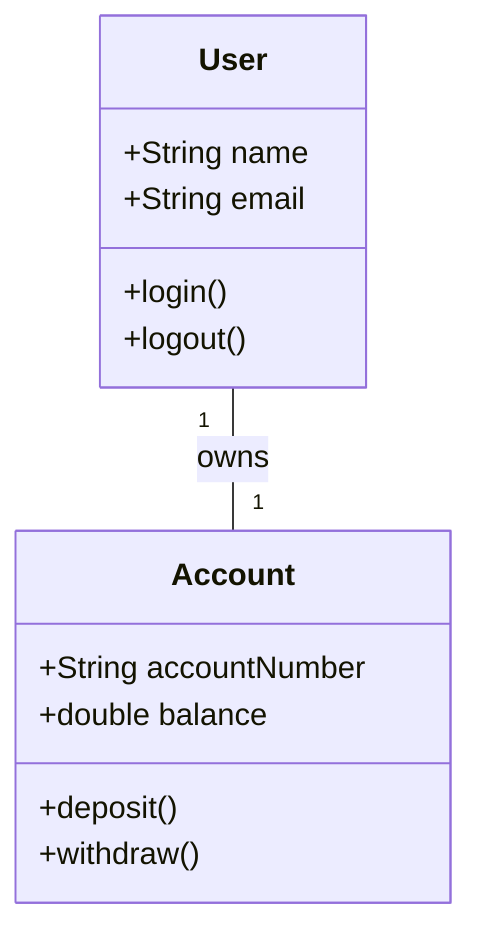
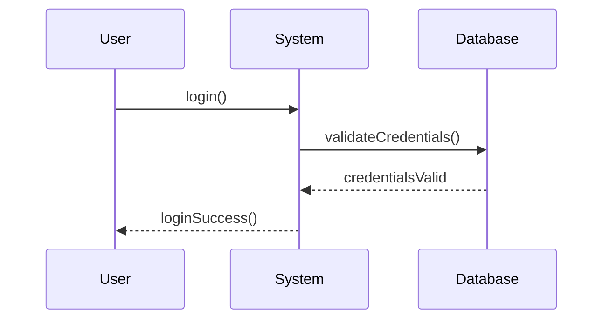
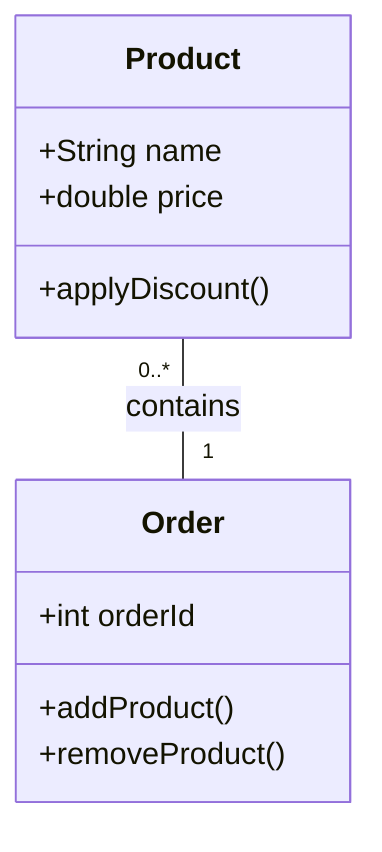
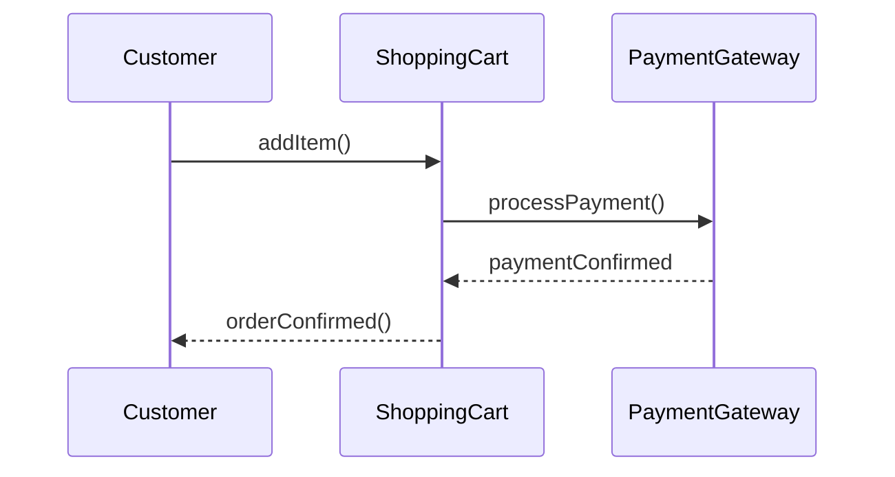

## 4.4.4 Interpreting UML Diagrams in Practice

In the realm of software design, Unified Modeling Language (UML) diagrams serve as a universal language for visualizing, specifying, constructing, and documenting the artifacts of software systems. For those venturing into the world of design patterns, mastering the interpretation of UML diagrams is not just beneficial—it's essential. This section aims to equip you with the skills to read and interpret UML diagrams effectively, enabling you to apply design patterns seamlessly in your projects.

### Understanding UML Diagrams: The Basics

UML diagrams are powerful tools that convey complex system architectures and interactions through standardized symbols and notations. Before diving into the interpretation of these diagrams, let's revisit some basic components:

- **Classes and Objects**: Represented by rectangles, classes are blueprints for objects. Each class box typically contains three compartments: the class name, attributes, and operations (methods).
- **Relationships**: Lines connecting classes signify relationships, such as associations, dependencies, generalizations, and realizations.
- **Multiplicity**: Indicates the number of instances in a relationship (e.g., one-to-many).
- **Directionality**: Arrows on lines show the direction of the relationship or flow of control.

### Step-by-Step Guidance: Breaking Down Complex Diagrams

To effectively interpret UML diagrams, it is crucial to break them down into understandable segments. Let's explore this process using a step-by-step approach:

#### 1. Identify the Diagram Type

UML encompasses various diagram types, each serving a different purpose:

- **Class Diagrams**: Illustrate the static structure of a system, showing classes, their attributes, methods, and relationships.
- **Sequence Diagrams**: Depict object interactions arranged in a time sequence.
- **Use Case Diagrams**: Represent the functionality of a system from an end-user perspective.
- **Activity Diagrams**: Model the flow of control or data within a system.

Understanding the type of diagram you are dealing with is the first step in effective interpretation.

#### 2. Recognize Key Components

Focus on identifying the core components of the diagram:

- **Classes and Interfaces**: Look for class boxes and note their attributes and operations.
- **Relationships**: Examine lines connecting classes, noting the type of relationship and any multiplicity indicators.
- **Interactions**: In dynamic diagrams like sequence diagrams, observe the flow of messages between objects.

#### 3. Analyze Relationships and Interactions

Pay close attention to the relationships between classes and the interactions between objects:

- **Associations**: Represented by solid lines, these indicate a connection between classes.
- **Dependencies**: Dotted lines with arrows show a dependency between classes.
- **Generalizations**: Solid lines with hollow arrowheads depict inheritance hierarchies.

Understanding these relationships is crucial for interpreting the structure and behavior of the system.

#### 4. Look for Design Patterns

Many UML diagrams embed design patterns within their structure. Recognizing these patterns can provide insights into the system's design:

- **Singleton Pattern**: Look for a class with a static operation that returns an instance of the class.
- **Observer Pattern**: Identify a subject class with a list of observers and methods to add, remove, and notify them.
- **Factory Pattern**: Spot classes that create objects without specifying the exact class of object that will be created.

### Practical Tips for Interpreting UML Diagrams

- **Start Simple**: Begin with simpler diagrams to build your confidence before tackling more complex ones.
- **Use Annotations**: Annotate diagrams as you interpret them to highlight key elements and relationships.
- **Cross-Reference with Code**: Map diagrams to code to reinforce your understanding and see how the design translates into implementation.

### Common Mistakes and How to Avoid Them

Interpreting UML diagrams can be challenging, and several common mistakes can lead to misunderstandings:

- **Misinterpreting Associations and Dependencies**: Be careful not to confuse associations (which imply a stronger relationship) with dependencies (which indicate a weaker, more transient connection).
- **Ignoring Multiplicities**: Multiplicity indicators provide crucial information about the number of instances involved in a relationship. Pay attention to these details.
- **Overlooking Directionality**: Arrows indicate the direction of relationships or message flows. Ignoring these can lead to incorrect interpretations of the system's behavior.

### Examples: Walking Through Sample Diagrams

To solidify your understanding, let's walk through some sample UML diagrams and their interpretations.

#### Example 1: Class Diagram

Consider the following class diagram:



**Interpretation:**

- **Classes**: We have two classes, `User` and `Account`, each with their respective attributes and methods.
- **Relationship**: There is a one-to-one association between `User` and `Account`, indicating that each user owns one account.

#### Example 2: Sequence Diagram

Now, let's examine a sequence diagram:



**Interpretation:**

- **Participants**: The diagram involves three participants: `User`, `System`, and `Database`.
- **Interactions**: The `User` initiates a `login()` request to the `System`, which in turn validates credentials with the `Database`. Upon validation, the `System` responds with `loginSuccess()` to the `User`.

### Exercises: Practice Interpreting Diagrams

Let's put your skills to the test with some practice exercises. Try interpreting the following diagrams and compare your interpretations with the provided solutions.

#### Exercise 1: Class Diagram



**Solution:**

- **Classes**: `Product` and `Order` are the main classes, with attributes and methods defined.
- **Relationship**: The `Order` class can contain multiple `Product` instances, as indicated by the multiplicity `0..*`.

#### Exercise 2: Sequence Diagram



**Solution:**

- **Participants**: The diagram involves `Customer`, `ShoppingCart`, and `PaymentGateway`.
- **Interactions**: The `Customer` adds an item to the `ShoppingCart`, which processes the payment through the `PaymentGateway`. Upon confirmation, the `ShoppingCart` notifies the `Customer` of the order confirmation.

### Mapping Diagrams to Code: Reinforcing Understanding

To reinforce your understanding, it's beneficial to map UML diagrams to actual code. Let's take the class diagram from Example 1 and translate it into Python code:

```python
class User:
    def __init__(self, name, email):
        self.name = name
        self.email = email
        self.account = None

    def login(self):
        print(f"{self.name} logged in.")

    def logout(self):
        print(f"{self.name} logged out.")

class Account:
    def __init__(self, account_number, balance):
        self.account_number = account_number
        self.balance = balance

    def deposit(self, amount):
        self.balance += amount

    def withdraw(self, amount):
        if amount <= self.balance:
            self.balance -= amount
        else:
            print("Insufficient funds.")

user = User("Alice", "alice@example.com")
account = Account("123456", 1000.0)
user.account = account
user.login()
```

### Key Points to Emphasize

- **Proficiency in UML**: Developing proficiency in interpreting UML diagrams is crucial for effectively applying design patterns.
- **Practice Makes Perfect**: Regular practice and exposure to different diagram types enhance your diagram literacy.
- **Cross-Disciplinary Skills**: The ability to interpret UML diagrams is a valuable skill across various software development disciplines.

### Conclusion

Interpreting UML diagrams is a critical skill for software developers, especially when working with design patterns. By breaking down complex diagrams, recognizing key components, and mapping them to code, you can gain a deeper understanding of system architectures and design patterns. Remember, practice is key—regularly challenge yourself with new diagrams and scenarios to hone your skills.

## Quiz Time!



### Which UML diagram type is used to illustrate the static structure of a system?

- [x] Class Diagram
- [ ] Sequence Diagram
- [ ] Use Case Diagram
- [ ] Activity Diagram

> **Explanation:** Class diagrams depict the static structure of a system, showing classes, attributes, methods, and relationships.

### What does a solid line with a hollow arrowhead represent in UML?

- [ ] Association
- [ ] Dependency
- [x] Generalization
- [ ] Realization

> **Explanation:** A solid line with a hollow arrowhead represents a generalization, indicating an inheritance relationship.

### In UML, what does multiplicity indicate?

- [x] The number of instances in a relationship
- [ ] The direction of a relationship
- [ ] The type of relationship
- [ ] The name of a relationship

> **Explanation:** Multiplicity indicates the number of instances involved in a relationship, such as one-to-many.

### What is the first step in interpreting a UML diagram?

- [ ] Analyzing relationships
- [ ] Mapping to code
- [x] Identifying the diagram type
- [ ] Recognizing key components

> **Explanation:** Identifying the diagram type is the first step, as it determines the purpose and context of the diagram.

### Which UML diagram type depicts object interactions arranged in a time sequence?

- [ ] Class Diagram
- [x] Sequence Diagram
- [ ] Use Case Diagram
- [ ] Activity Diagram

> **Explanation:** Sequence diagrams show object interactions arranged in a time sequence, illustrating the flow of messages.

### What is a common mistake when interpreting UML diagrams?

- [x] Misinterpreting associations and dependencies
- [ ] Identifying key components
- [ ] Recognizing diagram types
- [ ] Mapping to code

> **Explanation:** Misinterpreting associations and dependencies is a common mistake that can lead to misunderstandings of the system's structure.

### How can you reinforce your understanding of UML diagrams?

- [ ] By ignoring multiplicities
- [ ] By avoiding practice
- [x] By mapping diagrams to code
- [ ] By overlooking directionality

> **Explanation:** Mapping diagrams to code helps reinforce understanding by showing how design translates into implementation.

### What does a dotted line with an arrow represent in UML?

- [ ] Association
- [x] Dependency
- [ ] Generalization
- [ ] Realization

> **Explanation:** A dotted line with an arrow represents a dependency, indicating a weaker, more transient connection between classes.

### Which design pattern can be identified by a class with a static operation returning an instance of the class?

- [x] Singleton Pattern
- [ ] Observer Pattern
- [ ] Factory Pattern
- [ ] Strategy Pattern

> **Explanation:** The Singleton Pattern is identified by a class with a static operation that returns an instance of the class.

### True or False: Practice and familiarity enhance diagram literacy.

- [x] True
- [ ] False

> **Explanation:** True. Regular practice and familiarity with different diagram types enhance your ability to interpret UML diagrams effectively.



By mastering the interpretation of UML diagrams, you are well on your way to becoming proficient in applying design patterns, ultimately leading to more robust and maintainable software designs.
