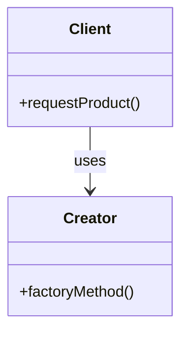

## 5.1.1 Purpose of Creational Patterns

In the realm of software engineering, design patterns serve as blueprints for solving recurring design problems. Among these, creational design patterns hold a pivotal role, focusing on the mechanisms of object creation. Their primary objective is to abstract the instantiation process, thereby making a system independent of how its objects are created, composed, and represented. This independence is crucial for developing flexible, maintainable, and reusable code.

### Understanding Creational Design Patterns

**Definition:**

Creational design patterns are concerned with the process of object creation. Unlike traditional methods that directly instantiate objects using constructors, creational patterns offer a more controlled and optimized approach. They provide solutions to manage object creation mechanisms in a way that is suitable for the specific context and requirements of the system.

These patterns encapsulate the knowledge about which classes to instantiate and how to instantiate them. By doing so, they allow for the decoupling of the client code from the actual instantiation process, leading to more flexible and maintainable codebases.

**Purpose:**

The primary purpose of creational design patterns is to abstract the instantiation process. By doing so, they achieve several key objectives:

- **Decoupling Object Creation:** Creational patterns allow the client code to be independent of the concrete classes it needs to instantiate. This is akin to ordering a pizza; as a customer, you don't need to know the intricacies of dough preparation, topping selection, or baking. You simply place an order, and the pizza arrives ready to enjoy. Similarly, in software, the client code requests an object, and the creational pattern handles the complexities of its creation.

- **Enhancing Flexibility:** By abstracting the creation process, these patterns enable a system to be more adaptable to change. New types of objects can be introduced with minimal impact on the existing code, thus enhancing the system's flexibility.

- **Improving Code Reusability:** Creational patterns promote code reuse by providing a common interface for object creation. This allows for the easy substitution of different object types without altering the client code.

### Benefits of Creational Design Patterns

Implementing creational design patterns in software development brings a multitude of benefits:

1. **Improved Control Over Object Creation:**
   - Creational patterns provide a structured approach to object creation, allowing developers to control the instantiation process more precisely. This control is essential for managing complex object hierarchies and dependencies.

2. **Increased Flexibility in Code Architecture:**
   - By decoupling the client code from the concrete classes, creational patterns make it easier to adapt the system to new requirements. Changes in object creation logic can be made with minimal disruption to the rest of the system.

3. **Reduction in Complexity of Object Instantiation:**
   - These patterns simplify the instantiation process by encapsulating complex creation logic within a single place. This reduces the cognitive load on developers and makes the codebase easier to understand and maintain.

4. **Enhanced Maintainability of Code:**
   - By centralizing the creation logic, creational patterns make it easier to manage and modify object instantiation. This leads to more maintainable code, as changes can be made in one place without affecting the entire system.

### Real-World Analogy: Ordering a Pizza

To better understand the purpose of creational design patterns, consider the analogy of ordering a pizza. When you order a pizza, you don't need to know how the dough is made, how the toppings are prepared, or how the pizza is baked. You simply place an order, specifying your preferences, and the pizza arrives ready to eat.

In this analogy, the pizza restaurant acts as a creational pattern. It abstracts the complexities of pizza creation, allowing you to focus on your preferences rather than the details of the process. Similarly, in software design, creational patterns abstract the complexities of object creation, allowing the client code to focus on its core responsibilities without worrying about the intricacies of instantiation.

### Code Example: Simplifying Client Code with Creational Patterns

While detailed code examples will be provided in the sections dedicated to specific creational patterns, let's consider a high-level illustration of how client code can be simplified using these patterns.

Imagine a scenario where we need to create different types of notifications (e.g., email, SMS, push notifications) based on user preferences. Without creational patterns, the client code might look like this:

```python
class EmailNotification:
    def send(self, message):
        print(f"Sending email: {message}")

class SMSNotification:
    def send(self, message):
        print(f"Sending SMS: {message}")

class PushNotification:
    def send(self, message):
        print(f"Sending push notification: {message}")

def send_notification(notification_type, message):
    if notification_type == 'email':
        notification = EmailNotification()
    elif notification_type == 'sms':
        notification = SMSNotification()
    elif notification_type == 'push':
        notification = PushNotification()
    else:
        raise ValueError("Unknown notification type")

    notification.send(message)

send_notification('email', 'Hello, Email!')
send_notification('sms', 'Hello, SMS!')
send_notification('push', 'Hello, Push!')
```

In this example, the client code is tightly coupled with the concrete classes of notifications. Any change in the notification types would require modifications in the client code.

Using a creational pattern, such as the Factory Method, we can abstract the instantiation process:

```python
class NotificationFactory:
    def create_notification(self, notification_type):
        if notification_type == 'email':
            return EmailNotification()
        elif notification_type == 'sms':
            return SMSNotification()
        elif notification_type == 'push':
            return PushNotification()
        else:
            raise ValueError("Unknown notification type")

def send_notification(factory, notification_type, message):
    notification = factory.create_notification(notification_type)
    notification.send(message)

factory = NotificationFactory()
send_notification(factory, 'email', 'Hello, Email!')
send_notification(factory, 'sms', 'Hello, SMS!')
send_notification(factory, 'push', 'Hello, Push!')
```

In this refactored example, the client code is decoupled from the concrete notification classes. The `NotificationFactory` handles the instantiation, allowing for greater flexibility and easier maintenance.

### Visual Representation

To visually represent the abstraction of object creation, consider the following Mermaid.js diagram:



In this diagram, the `Client` class is responsible for requesting a product, while the `Creator` class handles the creation process through a `factoryMethod`. This abstraction allows the client to remain unaware of the specific details involved in object creation.

### Key Points to Emphasize

- **Critical Role in Software Design:** Creational design patterns are essential for building flexible, maintainable object-oriented systems. They provide a robust framework for managing object creation, ensuring that systems can adapt to changing requirements without significant rework.

- **Enabling Loose Coupling:** By hiding the details of object creation and initialization, creational patterns promote loose coupling between client code and concrete classes. This leads to more modular and adaptable systems.

- **Facilitating Code Reuse:** These patterns promote code reuse by providing a consistent interface for object creation. This allows developers to easily switch between different object types without modifying the client code.

In conclusion, creational design patterns play a fundamental role in modern software development. By abstracting the instantiation process, they enable developers to build systems that are flexible, maintainable, and easy to extend. As you continue to explore specific creational patterns in the following sections, keep in mind the overarching purpose and benefits they bring to software design.

## Quiz Time!



### What is the primary focus of creational design patterns?

- [x] Object creation mechanisms
- [ ] Object behavior mechanisms
- [ ] Object structural mechanisms
- [ ] Object destruction mechanisms

> **Explanation:** Creational design patterns focus on the mechanisms of object creation, aiming to optimize and control the instantiation process.

### How do creational patterns improve flexibility?

- [x] By abstracting the instantiation process
- [ ] By enforcing strict type checks
- [ ] By reducing code reuse
- [ ] By increasing object dependencies

> **Explanation:** Creational patterns abstract the instantiation process, making systems more adaptable to change and enhancing flexibility.

### What is a key benefit of using creational patterns?

- [x] Improved control over object creation
- [ ] Increased complexity of code
- [ ] Reduced code flexibility
- [ ] Tighter coupling between classes

> **Explanation:** Creational patterns provide improved control over object creation, simplifying and optimizing the process.

### In the pizza analogy, what does the pizza restaurant represent?

- [x] Creational pattern
- [ ] Client code
- [ ] Concrete class
- [ ] Object behavior

> **Explanation:** The pizza restaurant represents the creational pattern, abstracting the complexities of pizza creation.

### What is the role of the `NotificationFactory` in the code example?

- [x] To handle the instantiation of notification objects
- [ ] To send notifications directly
- [ ] To define notification types
- [ ] To manage user preferences

> **Explanation:** The `NotificationFactory` handles the instantiation of notification objects, abstracting the creation logic from the client code.

### What does the Mermaid.js diagram illustrate?

- [x] Abstraction of object creation
- [ ] Object destruction process
- [ ] Client-server interaction
- [ ] Data flow in a network

> **Explanation:** The diagram illustrates the abstraction of object creation, showing how the client uses the creator to request products.

### How do creational patterns facilitate code reuse?

- [x] By providing a consistent interface for object creation
- [ ] By enforcing unique interfaces for each object type
- [ ] By eliminating interfaces altogether
- [ ] By duplicating code across classes

> **Explanation:** Creational patterns facilitate code reuse by providing a consistent interface for object creation, allowing easy substitution of object types.

### Why is loose coupling important in software design?

- [x] It leads to more modular and adaptable systems
- [ ] It increases object dependencies
- [ ] It reduces system flexibility
- [ ] It complicates the codebase

> **Explanation:** Loose coupling is important because it leads to more modular and adaptable systems, making them easier to maintain and extend.

### What is a consequence of not using creational patterns?

- [x] Increased complexity of object instantiation
- [ ] Simplified object creation process
- [ ] Enhanced code flexibility
- [ ] Improved system adaptability

> **Explanation:** Without creational patterns, the complexity of object instantiation increases, making the code harder to manage and maintain.

### True or False: Creational patterns are only useful in large-scale systems.

- [ ] True
- [x] False

> **Explanation:** Creational patterns are beneficial in systems of all sizes, as they provide a structured approach to object creation that enhances flexibility and maintainability.


