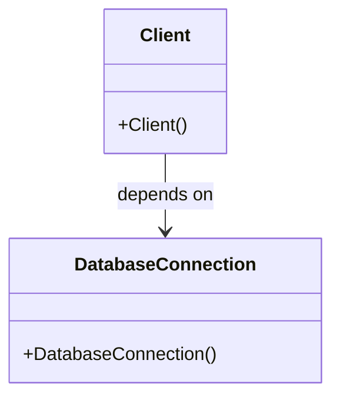

---

linkTitle: "5.1.2 Common Challenges in Object Creation"
title: "Common Challenges in Object Creation: Overcoming Complexity with Creational Patterns"
description: "Explore the common challenges in object creation and understand why creational design patterns are essential for modern software development. Learn about complexities, tight coupling, code duplication, and scalability issues with practical examples and solutions."
categories:
- Software Design
- Object-Oriented Programming
- Design Patterns
tags:
- Object Creation
- Creational Patterns
- Software Architecture
- Code Maintainability
- Design Flexibility
date: 2024-10-25
type: docs
nav_weight: 512000
---

## 5.1.2 Common Challenges in Object Creation

In the realm of software development, object creation is a fundamental activity that often presents a variety of challenges. Understanding these challenges is crucial for appreciating the role and necessity of creational design patterns. This section delves into the complexities associated with object creation, such as the intricacies of setup, the pitfalls of tight coupling, the hazards of code duplication, and the obstacles to scalability and maintainability. Through practical examples and insightful analysis, we aim to illuminate these challenges and set the stage for the introduction of creational patterns as a solution.

### Complexity of Creation

Creating objects in software can be deceptively complex. This complexity arises from several factors:

#### 1. Significant Setup or Configuration

In many applications, objects cannot be instantiated with simple constructors. They often require significant setup or configuration before they can be used. This setup might include initializing various properties, connecting to external systems, or setting up event listeners.

**Example: GUI Component Initialization**

Consider a graphical user interface (GUI) component that requires multiple configuration steps:

```python
class Button:
    def __init__(self, label, width, height):
        self.label = label
        self.width = width
        self.height = height
        self.color = "default"
        self.onClick = None

    def configure(self, color, onClick):
        self.color = color
        self.onClick = onClick

button = Button("Submit", 100, 50)
button.configure("blue", lambda: print("Button clicked"))
```

In this example, the `Button` class requires additional configuration after instantiation, which complicates its creation.

#### 2. Dependency on External Resources

Objects often depend on external resources or systems, such as databases, file systems, or network services. Managing these dependencies can complicate the instantiation process.

**Example: Database Connection**

```python
class DatabaseConnection:
    def __init__(self, host, port, user, password):
        self.host = host
        self.port = port
        self.user = user
        self.password = password
        # Additional setup...

conn = DatabaseConnection('localhost', 5432, 'admin', 'secret')
```

Here, the `DatabaseConnection` class requires specific parameters that tie it to a particular database configuration, making it less flexible.

#### 3. Need for Multiple Types or Variations

Applications often require different types or variations of an object, each with its own specific setup. This need can lead to complex and error-prone code if not managed properly.

**Example: Different Types of Database Connections**

```python
class MySQLConnection(DatabaseConnection):
    def __init__(self, host, port, user, password):
        super().__init__(host, port, user, password)
        # MySQL-specific setup...

class PostgreSQLConnection(DatabaseConnection):
    def __init__(self, host, port, user, password):
        super().__init__(host, port, user, password)
        # PostgreSQL-specific setup...

mysql_conn = MySQLConnection('localhost', 3306, 'admin', 'secret')
postgres_conn = PostgreSQLConnection('localhost', 5432, 'admin', 'secret')
```

Managing multiple connection types can lead to duplicated code and increased complexity.

### Tight Coupling

Directly instantiating objects within client code creates a strong dependency between the client and the concrete classes. This tight coupling makes the code less flexible and harder to maintain, as changes in the object creation process necessitate changes in every client that instantiates the object.

**Mermaid.js Diagram:**



In the diagram above, the `Client` class is directly dependent on the `DatabaseConnection` class, illustrating tight coupling.

### Code Duplication

When object creation logic is embedded directly within client code, it often leads to code duplication. This duplication occurs because similar instantiation logic is repeated across multiple parts of the application, making maintenance difficult and error-prone.

**Example: Repeated Instantiation Logic**

```python
conn1 = DatabaseConnection('localhost', 5432, 'admin', 'secret')
conn2 = DatabaseConnection('localhost', 5432, 'admin', 'secret')
```

If the instantiation process changes (e.g., adding a new parameter), every instance of this code must be updated, increasing the risk of errors.

### Scalability and Maintainability Issues

As applications grow, the complexity of managing object creation increases. Changes to the instantiation process can require widespread code changes if not abstracted, leading to scalability and maintainability issues.

**Example: Changing Connection Parameters**

Imagine a scenario where the database connection parameters need to change due to a new security requirement. Without abstraction, this change must be propagated throughout the codebase:

```python
class DatabaseConnection:
    def __init__(self, host, port, user, password, ssl):
        self.host = host
        self.port = port
        self.user = user
        self.password = password
        self.ssl = ssl
        # Additional setup...

conn = DatabaseConnection('localhost', 5432, 'admin', 'secret', True)
```

Every instantiation point must be updated to include the new `ssl` parameter, highlighting the lack of scalability and maintainability.

### Examples of Challenges

To further illustrate these challenges, let's explore two common scenarios in software development:

#### 1. Creating Different Types of Database Connections

In many applications, different types of database connections are required for different purposes, such as connecting to MySQL, PostgreSQL, or MongoDB. Each type requires specific setup and configuration, leading to duplicated code and increased complexity.

#### 2. Instantiating GUI Components with Varying Configurations

GUI applications often require components with different configurations, such as buttons, text fields, and labels. Each component may have unique properties and behaviors, leading to complex instantiation logic if not managed properly.

### Key Points to Emphasize

Understanding the challenges of object creation is crucial for appreciating the value offered by creational patterns. These patterns aim to decouple client code from the object creation process, enhancing flexibility, maintainability, and scalability. By abstracting the instantiation logic, creational patterns allow for more adaptable and robust software architectures.

### Conclusion

In this section, we've explored the common challenges associated with object creation in software development. From the complexity of setup and configuration to the pitfalls of tight coupling and code duplication, these challenges highlight the need for effective solutions. Creational design patterns offer a powerful approach to overcoming these issues, providing a foundation for building flexible, maintainable, and scalable software systems. As we delve deeper into creational patterns, we'll discover how they address these challenges and empower developers to create robust and adaptable applications.

## Quiz Time!



### What is a common challenge associated with object creation?

- [x] Significant setup or configuration is often required.
- [ ] Objects never depend on external resources.
- [ ] There is no need for multiple types or variations of objects.
- [ ] Object creation is always straightforward and simple.

> **Explanation:** Objects often require significant setup or configuration, making their creation complex.


### Why can directly instantiating objects lead to tight coupling?

- [x] It creates a strong dependency between the client and the concrete class.
- [ ] It eliminates all dependencies between classes.
- [ ] It makes the code more flexible and easier to maintain.
- [ ] It automatically abstracts the instantiation process.

> **Explanation:** Direct instantiation creates a dependency between the client and the concrete class, leading to tight coupling.


### What is a consequence of code duplication in object creation?

- [x] Increased maintenance difficulty and risk of errors.
- [ ] Improved code readability and simplicity.
- [ ] Elimination of all bugs and issues.
- [ ] Automatic scalability and maintainability.

> **Explanation:** Code duplication makes maintenance difficult and increases the risk of errors.


### How can changes to the instantiation process affect scalability?

- [x] They can require widespread code changes if not abstracted.
- [ ] They have no impact on scalability.
- [ ] They automatically improve scalability.
- [ ] They reduce the need for code changes.

> **Explanation:** Without abstraction, changes to the instantiation process require widespread code changes, affecting scalability.


### What is an example of a challenge in object creation?

- [x] Creating different types of database connections.
- [ ] Instantiating a single, simple object.
- [ ] Using a single type of database connection.
- [ ] Avoiding any setup or configuration.

> **Explanation:** Creating different types of database connections is a common challenge due to specific setup requirements.


### What is the goal of creational patterns?

- [x] To decouple client code from the object creation process.
- [ ] To tightly couple client code with concrete classes.
- [ ] To increase code duplication.
- [ ] To make object creation more complex.

> **Explanation:** Creational patterns aim to decouple client code from the object creation process, enhancing flexibility and maintainability.


### What is a benefit of abstracting the instantiation logic?

- [x] Enhanced flexibility and maintainability of the code.
- [ ] Increased complexity and tight coupling.
- [ ] More code duplication.
- [ ] Reduced flexibility and maintainability.

> **Explanation:** Abstracting the instantiation logic enhances flexibility and maintainability.


### Which of the following illustrates tight coupling?

- [x] Client code directly depends on concrete classes.
- [ ] Client code is independent of concrete classes.
- [ ] Client code is abstracted from the instantiation process.
- [ ] Client code uses interfaces or abstract classes.

> **Explanation:** Tight coupling occurs when client code directly depends on concrete classes.


### What is a common issue with directly embedding object creation in client code?

- [x] Inflexibility and difficulty in adapting to changes.
- [ ] Automatic adaptation to changes.
- [ ] Elimination of all dependencies.
- [ ] Simplification of the codebase.

> **Explanation:** Directly embedding object creation in client code leads to inflexibility and difficulty in adapting to changes.


### True or False: Creational patterns help manage the complexity of object creation.

- [x] True
- [ ] False

> **Explanation:** Creational patterns help manage the complexity of object creation by abstracting and decoupling the instantiation process.


