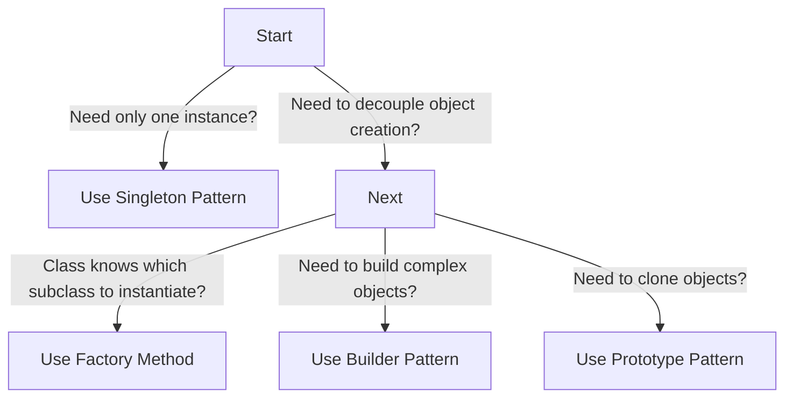

## 5.1.4 When to Use Creational Patterns

In the realm of software design, the ability to effectively manage object creation is crucial for building scalable, maintainable, and flexible applications. Creational design patterns provide solutions to various problems related to object instantiation, offering a structured approach to create objects while hiding the instantiation logic. This section delves into the scenarios where creational patterns are beneficial, how to choose the right pattern, and provides real-world examples to illustrate their application.

### Indicators for Using Creational Patterns

Understanding when to apply creational patterns is essential for effective software design. Here are key indicators that suggest the need for these patterns:

#### 1. Abstracting the Instantiation Process

In many applications, the process of creating objects can become complex and intertwined with business logic. This complexity can lead to rigid and error-prone code. Creational patterns abstract the instantiation process, allowing developers to focus on the "what" rather than the "how" of object creation. By doing so, they promote cleaner and more modular code.

#### 2. Decoupling Types and Dependencies

When the exact types and dependencies of objects need to be decoupled from client code, creational patterns offer a robust solution. This decoupling is particularly useful in scenarios where the system needs to be flexible and adaptable to change. For example, in a plugin-based architecture, the client code should not be tightly coupled with the specific types of plugins it uses.

#### 3. Flexibility in Object Creation

Applications often require flexibility in terms of what objects are created and how they are configured. Creational patterns provide this flexibility by allowing the system to determine the appropriate class to instantiate at runtime. This is particularly useful in scenarios where different configurations or environments require different object setups.

#### 4. Controlling the Number of Instances

In certain situations, it is essential to control the number of instances of a particular class. The Singleton pattern, for instance, ensures that only one instance of a class exists and provides a global point of access to it. This is useful in scenarios such as managing a centralized logging system or a connection pool.

### Choosing the Right Pattern

Selecting the appropriate creational pattern depends on the specific requirements and constraints of your application. Here are guidelines for choosing among the most common creational patterns:

#### Singleton Pattern

- **Use Case:** When only one instance of a class should exist and it must be accessible globally.
- **Example Scenario:** Managing a centralized logging system where all components of an application need access to a single logger instance.

#### Factory Method Pattern

- **Use Case:** When a class cannot anticipate the type of objects it needs to create ahead of time.
- **Example Scenario:** Creating user interfaces that can switch between different themes, where the specific theme is not known until runtime.

#### Builder Pattern

- **Use Case:** When constructing complex objects with numerous configuration options or steps.
- **Example Scenario:** Building customizable HTTP requests with optional headers and parameters, where the request configuration can vary significantly.

### Examples and Scenarios

To better understand when to use creational patterns, let's explore some real-world scenarios:

#### Singleton Example: Centralized Logging System

In a large-scale application, logging is a critical component that needs to be accessible from various parts of the system. Using the Singleton pattern ensures that all components use the same logger instance, providing consistent logging behavior and avoiding the overhead of managing multiple logger instances.

#### Factory Method Example: Themed User Interfaces

Consider an application that supports multiple themes, such as light and dark modes. The Factory Method pattern allows the application to create UI components based on the selected theme. This decouples the theme-specific logic from the core application, making it easier to add new themes in the future.

#### Builder Example: Configurable HTTP Requests

When constructing HTTP requests, there are often numerous optional parameters, such as headers, query parameters, and body content. The Builder pattern provides a flexible way to construct these requests, allowing developers to specify only the parameters they need without dealing with complex constructors.

### Visuals and Diagrams

To aid in selecting the appropriate creational pattern, consider the following decision tree:

### Key Points to Emphasize

- **Recognizing Application Scenarios:** Identifying scenarios where creational patterns are applicable is crucial for effective design. This recognition helps in applying the right pattern to enhance system flexibility and maintainability.
- **Enhancing Flexibility:** The right creational pattern can significantly enhance the flexibility of your application, allowing it to adapt to changing requirements with minimal changes to the codebase.
- **Reducing Maintenance Costs:** By decoupling object creation from business logic, creational patterns make the system easier to maintain and extend, reducing long-term maintenance costs.

### Conclusion

Creational patterns play a vital role in software design by providing solutions to common object creation challenges. By understanding when and how to apply these patterns, developers can create systems that are more robust, flexible, and maintainable. Whether it's managing a single instance with the Singleton pattern, creating flexible user interfaces with the Factory Method, or constructing complex objects with the Builder pattern, creational patterns offer valuable tools for modern software development.

## Quiz Time!



### Which scenario is a clear indicator for using a creational pattern?

- [x] When the instantiation process needs to be abstracted.
- [ ] When the application has no need for object creation.
- [ ] When the application is only using primitive data types.
- [ ] When the application does not involve any user input.

> **Explanation:** Creational patterns are used to abstract the instantiation process, making it more flexible and decoupled from client code.

### What is a primary benefit of using the Singleton pattern?

- [x] Ensuring only one instance of a class exists.
- [ ] Allowing multiple instances of a class.
- [ ] Simplifying complex object creation.
- [ ] Facilitating object cloning.

> **Explanation:** The Singleton pattern ensures that only one instance of a class is created and provides a global point of access to it.

### When should the Factory Method pattern be considered?

- [x] When a class cannot anticipate the type of objects it needs to create.
- [ ] When only one instance of a class is needed.
- [ ] When constructing objects with numerous configuration options.
- [ ] When cloning existing objects.

> **Explanation:** The Factory Method pattern is ideal when a class cannot anticipate the specific type of objects it needs to create and must defer this decision to subclasses.

### Which pattern is best suited for building complex objects with numerous configuration options?

- [x] Builder Pattern
- [ ] Singleton Pattern
- [ ] Factory Method Pattern
- [ ] Prototype Pattern

> **Explanation:** The Builder pattern is designed to construct complex objects with various configuration options, allowing for flexible and step-by-step construction.

### In what scenario would you use the Prototype pattern?

- [x] When you need to clone objects.
- [ ] When you need only one instance of a class.
- [ ] When you need to decouple object creation.
- [ ] When constructing complex objects.

> **Explanation:** The Prototype pattern is used when you need to create new objects by copying existing ones, thus enabling object cloning.

### What is a key advantage of using creational patterns?

- [x] They provide flexibility in object creation.
- [ ] They eliminate the need for object creation.
- [ ] They simplify the use of primitive data types.
- [ ] They ensure objects are immutable.

> **Explanation:** Creational patterns provide flexibility in how objects are created, allowing for more adaptable and maintainable code.

### Which pattern should be used when a class should only have one instance accessible globally?

- [x] Singleton Pattern
- [ ] Builder Pattern
- [ ] Factory Method Pattern
- [ ] Prototype Pattern

> **Explanation:** The Singleton pattern ensures that a class has only one instance and provides a global point of access to it.

### Why is the Factory Method pattern useful for user interfaces with themes?

- [x] It allows the creation of UI components based on the selected theme.
- [ ] It ensures only one theme is used globally.
- [ ] It simplifies the construction of UI components.
- [ ] It clones UI components for different themes.

> **Explanation:** The Factory Method pattern allows for the creation of UI components based on the selected theme, decoupling theme-specific logic from the core application.

### What is a common use case for the Builder pattern?

- [x] Constructing customizable HTTP requests.
- [ ] Managing a centralized logging system.
- [ ] Creating user interfaces with themes.
- [ ] Cloning existing objects.

> **Explanation:** The Builder pattern is commonly used for constructing complex objects like customizable HTTP requests, where various optional parameters can be specified.

### True or False: Creational patterns eliminate the need for object creation in software design.

- [ ] True
- [x] False

> **Explanation:** False. Creational patterns do not eliminate the need for object creation; instead, they provide flexible and structured approaches to manage object creation.


