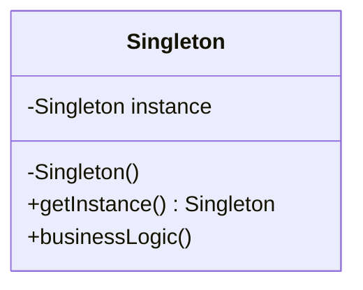

## 5.2.1 Understanding the Singleton Pattern

In the realm of software design, the Singleton pattern stands as a quintessential example of a creational design pattern. Its primary objective is to ensure that a class has only one instance while providing a global point of access to that instance. This pattern is particularly useful in scenarios where a single point of coordination or control is necessary, such as managing shared resources or ensuring consistent state across an application.

### Definition of the Singleton Pattern

The Singleton pattern is designed to limit the instantiation of a class to a single object. This is achieved through a combination of a private constructor, a static method to access the instance, and a static variable to hold the instance. By controlling object creation, the Singleton pattern ensures that the class has only one instance, which can be accessed globally by different parts of an application.

### Applicability of the Singleton Pattern

The Singleton pattern is applicable in several scenarios, particularly when managing shared resources or ensuring a single point of coordination:

1. **Shared Resources Management:**
   - **Database Connections:** In applications that require database interactions, managing connections efficiently is crucial. The Singleton pattern can be used to ensure that only one connection pool is maintained, reducing overhead and improving performance.
   - **Configuration Settings:** Applications often need to access configuration settings from multiple locations. A Singleton can provide a centralized access point, ensuring consistency across the application.
   - **Logging Mechanisms:** Logging is a common requirement in software applications. Using a Singleton for logging ensures that all logs are written to a single file or output stream, maintaining a cohesive log history.

2. **Ensuring a Single Instance:**
   - The pattern is suitable when exactly one instance of a class is required throughout the application. This is often the case in systems where a single point of control is necessary, such as in the case of a central configuration manager or an application-wide event bus.

### Pattern Structure

The structure of the Singleton pattern involves several key components:

- **Singleton Class:** This class contains a static or class-level variable that holds the single instance. It encapsulates the logic for creating and managing the instance.
- **Private Constructor:** The constructor is made private to prevent direct instantiation from outside the class. This ensures that the class can only be instantiated through the controlled method provided.
- **Public Static Method:** A public static method, often named `getInstance()`, provides access to the instance. This method checks if the instance already exists; if not, it creates and returns it.

Below is a Mermaid.js class diagram illustrating the Singleton pattern:

### Real-World Analogy

To better understand the Singleton pattern, consider the analogy of a central government or a company's CEO. In both cases, there is only one leader who coordinates and makes decisions for the entire entity. All requests and communications are directed to this single entity, ensuring consistent decision-making and a unified direction.

### Key Points to Emphasize

1. **Control Over Object Creation:**
   - The Singleton pattern provides control over the creation of an object, ensuring that only one instance exists. This is particularly useful in scenarios where resource management and consistency are critical.

2. **Global Access Point:**
   - By providing a global access point, the Singleton pattern ensures that the single instance can be accessed from anywhere within the application. This facilitates coordination and communication across different parts of the system.

3. **Potential Drawbacks:**
   - While the Singleton pattern offers several advantages, it is important to be aware of potential drawbacks. These include the risk of creating a global state, which can complicate testing and maintenance. Additionally, the pattern can introduce tight coupling between components, making it harder to modify or extend the system.

### Conclusion

The Singleton pattern is a powerful tool in the software engineer's toolkit, offering a way to manage shared resources and ensure consistent state across an application. By understanding its structure, applicability, and potential drawbacks, developers can effectively leverage this pattern to build robust and maintainable software systems. As with any design pattern, it is important to consider the specific needs and constraints of your application to determine whether the Singleton pattern is the right choice.

## Quiz Time!



### What is the primary objective of the Singleton pattern?

- [x] To ensure a class has only one instance and provide a global point of access to it.
- [ ] To allow multiple instances of a class with shared state.
- [ ] To enhance the performance of object creation.
- [ ] To facilitate inheritance and polymorphism.

> **Explanation:** The Singleton pattern ensures that a class has only one instance and provides a global point of access to it, making it suitable for managing shared resources and ensuring consistency.

### When is the Singleton pattern most applicable?

- [x] When managing shared resources like database connections or configuration settings.
- [ ] When multiple instances of a class are needed for different tasks.
- [ ] When implementing complex inheritance hierarchies.
- [ ] When optimizing memory usage for large objects.

> **Explanation:** The Singleton pattern is most applicable when managing shared resources or when exactly one instance of a class is needed and accessible to multiple parts of the program.

### What is a key component of the Singleton pattern?

- [x] A private constructor to prevent direct instantiation.
- [ ] A public constructor for easy access.
- [ ] A static method for creating multiple instances.
- [ ] An interface for implementing multiple classes.

> **Explanation:** A key component of the Singleton pattern is a private constructor, which prevents direct instantiation from outside the class, ensuring controlled creation of the instance.

### How does the Singleton pattern provide access to the instance?

- [x] Through a public static method.
- [ ] By exposing a public variable.
- [ ] By using a protected method.
- [ ] By implementing an interface.

> **Explanation:** The Singleton pattern provides access to the instance through a public static method, often named `getInstance()`, which creates and returns the instance if it doesn't already exist.

### What is a real-world analogy for the Singleton pattern?

- [x] A central government or a company's CEO.
- [ ] Multiple branches of a bank.
- [ ] Different models of a car.
- [ ] A family with several members.

> **Explanation:** A central government or a company's CEO is a real-world analogy for the Singleton pattern, as there is only one leader who coordinates and makes decisions for the entire entity.

### What is a potential drawback of the Singleton pattern?

- [x] It can introduce a global state, complicating testing and maintenance.
- [ ] It allows for too many instances, leading to resource waste.
- [ ] It restricts the use of interfaces.
- [ ] It requires complex inheritance structures.

> **Explanation:** A potential drawback of the Singleton pattern is that it can introduce a global state, which can complicate testing and maintenance due to tight coupling and reduced flexibility.

### What does the Singleton pattern control?

- [x] Object creation, limiting it to one instance.
- [ ] The number of subclasses.
- [ ] The size of objects.
- [ ] The inheritance hierarchy.

> **Explanation:** The Singleton pattern controls object creation, ensuring that only one instance of the class exists, which is crucial for managing shared resources and ensuring consistency.

### Which method in the Singleton pattern is responsible for creating the instance?

- [x] The public static method.
- [ ] The private constructor.
- [ ] The protected method.
- [ ] The instance variable.

> **Explanation:** The public static method in the Singleton pattern is responsible for creating the instance if it doesn't already exist and providing access to it.

### What is an example of a shared resource that can be managed by a Singleton?

- [x] A database connection pool.
- [ ] A local variable.
- [ ] A private method.
- [ ] A static array.

> **Explanation:** A database connection pool is an example of a shared resource that can be managed by a Singleton, ensuring efficient use and consistent access across the application.

### True or False: The Singleton pattern is suitable when multiple instances of a class are needed.

- [ ] True
- [x] False

> **Explanation:** False. The Singleton pattern is suitable when exactly one instance of a class is needed, not when multiple instances are required.


