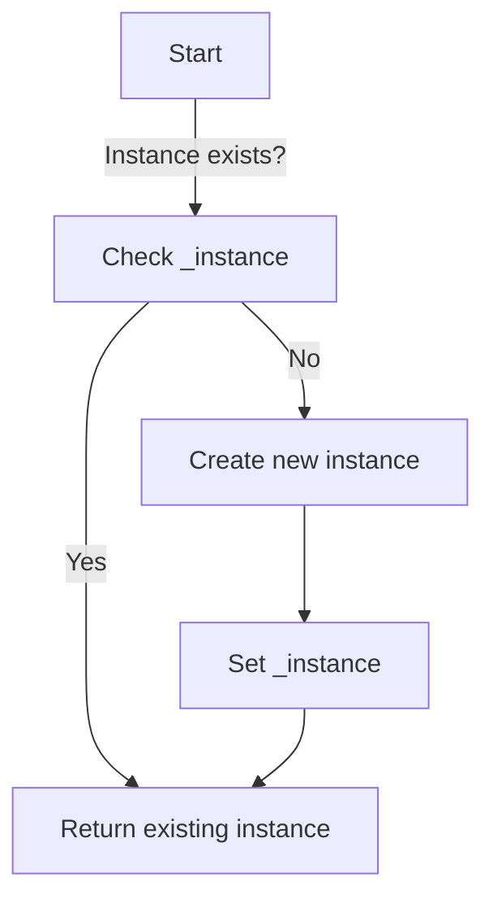

## 5.2.2 Implementation in Python

The Singleton pattern is a creational design pattern that ensures a class has only one instance and provides a global point of access to that instance. This pattern is particularly useful when exactly one object is needed to coordinate actions across a system. In this section, we will explore how to implement the Singleton pattern in Python, considering various approaches, including metaclasses, decorators, and leveraging Python's module system. We will also address thread safety and discuss best practices to avoid common pitfalls associated with Singletons.

### Understanding the Singleton Pattern

Before diving into the implementation details, let's briefly recap what the Singleton pattern is and why it might be used. The Singleton pattern restricts the instantiation of a class to one "single" instance. This is useful when exactly one object is needed to coordinate actions across the system. The pattern also provides a global point of access to the instance, which can be beneficial in certain scenarios, such as logging, configuration management, and resource pooling.

### Implementation Methods

Python provides several ways to implement the Singleton pattern. Each method has its own advantages and trade-offs. We'll cover three primary methods: using a metaclass, using a decorator, and relying on Python's module system.

#### Using a Metaclass

Metaclasses in Python are a powerful feature that allows you to control the creation and behavior of classes. By defining a metaclass, you can enforce the Singleton pattern at the class level.

##### Example Implementation

Here is an example of implementing the Singleton pattern using a metaclass:

```python
class SingletonMeta(type):
    _instance = None

    def __call__(cls, *args, **kwargs):
        if cls._instance is None:
            cls._instance = super().__call__(*args, **kwargs)
        return cls._instance

class Logger(metaclass=SingletonMeta):
    def log(self, message):
        print(f"[LOG]: {message}")

logger1 = Logger()
logger2 = Logger()
print(logger1 is logger2)  # Output: True
```

##### Explanation

- **SingletonMeta:** This is a metaclass that controls the instantiation of the class. It overrides the `__call__` method, which is invoked when an instance of the class is created.
- **__call__ method:** The overridden `__call__` method checks if an instance already exists. If not, it creates one using `super().__call__(*args, **kwargs)`. Otherwise, it returns the existing instance.

This approach ensures that only one instance of the class is created, making it a true Singleton.

#### Alternative Methods

While metaclasses provide a robust way to implement Singletons, there are alternative methods that might be more suitable depending on the context.

##### Using Decorators

Decorators in Python are a convenient way to modify or enhance functions and classes. You can use a decorator to enforce Singleton behavior.

###### Example Implementation

```python
def singleton(cls):
    instances = {}

    def get_instance(*args, **kwargs):
        if cls not in instances:
            instances[cls] = cls(*args, **kwargs)
        return instances[cls]
    return get_instance

@singleton
class ConfigManager:
    def __init__(self):
        self.config = {}

config1 = ConfigManager()
config2 = ConfigManager()
print(config1 is config2)  # Output: True
```

###### Explanation

- **singleton Decorator:** This decorator maintains a dictionary `instances` that maps classes to their single instances.
- **get_instance Function:** When a class decorated with `@singleton` is instantiated, `get_instance` checks if an instance already exists. If not, it creates and stores one.

This method is straightforward and works well for simple use cases.

##### Using Modules

In Python, modules are singletons by nature. When a module is imported, it is initialized once, and subsequent imports retrieve the already initialized module. This property can be leveraged to implement the Singleton pattern.

###### Explanation

- **Module as Singleton:** Simply use a module to hold the state or behavior you want to be singleton. Since Python initializes modules once, the module itself acts as a Singleton.

This approach is particularly useful for configuration settings or global variables.

### Ensuring Thread Safety

In a multithreaded environment, ensuring that the Singleton pattern remains thread-safe is crucial. Without proper synchronization, multiple threads might create multiple instances of the Singleton class.

#### Thread-Safe Singleton with Locks

To prevent race conditions, you can use threading locks.

##### Example Implementation

```python
import threading

class SingletonMeta(type):
    _instances = {}
    _lock: threading.Lock = threading.Lock()

    def __call__(cls, *args, **kwargs):
        with cls._lock:
            if cls not in cls._instances:
                cls._instances[cls] = super().__call__(*args, **kwargs)
        return cls._instances[cls]

class DatabaseConnection(metaclass=SingletonMeta):
    def connect(self):
        print("Connecting to the database...")

db1 = DatabaseConnection()
db2 = DatabaseConnection()
print(db1 is db2)  # Output: True
```

##### Explanation

- **_lock:** A class-level lock ensures that only one thread can execute the instance creation code at a time.
- **with cls._lock:** The `with` statement acquires the lock before checking or creating the instance, ensuring thread safety.

This implementation guarantees that only one instance is created even in a multithreaded context.

### Best Practices

While the Singleton pattern can be useful, it is important to use it judiciously. Here are some best practices to consider:

- **Avoid Overuse:** Singletons introduce global state, which can make testing and debugging difficult. Use them only when necessary.
- **Consider Alternatives:** In many cases, dependency injection or other design patterns might be more appropriate.
- **Be Mindful of Global State:** Global state can lead to tight coupling and reduced flexibility. Ensure that the Singleton pattern truly benefits your application architecture.

### Visuals and Diagrams

To better understand the Singleton pattern, let's visualize the instance creation process using a flowchart.



This flowchart illustrates the decision-making process when creating an instance of a Singleton class.

### Key Points to Emphasize

- **Multiple Implementation Options:** Python offers various ways to implement the Singleton pattern. Choose the method that best fits your use case.
- **Thread Safety:** Ensure thread safety if your Singleton will be accessed by multiple threads.
- **Global State Implications:** Be cautious of the global state introduced by Singletons, as it can complicate testing and maintenance.

### Conclusion

The Singleton pattern is a powerful tool in a software engineer's toolkit, especially when used appropriately. By understanding the different ways to implement Singletons in Python and considering thread safety and best practices, you can effectively manage global state and ensure your application remains robust and maintainable. Remember to weigh the benefits against potential drawbacks and explore alternative patterns when necessary.

## Quiz Time!



### What is the primary purpose of the Singleton pattern?

- [x] To ensure a class has only one instance
- [ ] To allow multiple instances of a class
- [ ] To enhance the performance of a class
- [ ] To provide multiple points of access to a class

> **Explanation:** The Singleton pattern is used to ensure that a class has only one instance and provides a global point of access to that instance.

### Which Python feature allows you to control class creation and enforce Singleton behavior?

- [x] Metaclasses
- [ ] Decorators
- [ ] Modules
- [ ] Functions

> **Explanation:** Metaclasses in Python allow you to control the creation of classes, making them suitable for enforcing Singleton behavior.

### What does the `__call__` method do in a metaclass-based Singleton implementation?

- [x] It overrides the default instantiation behavior to return the same instance
- [ ] It deletes the instance of the class
- [ ] It creates multiple instances of the class
- [ ] It enhances the class performance

> **Explanation:** The `__call__` method in a metaclass-based Singleton implementation overrides the default instantiation behavior to ensure only one instance is created.

### How does a decorator-based Singleton implementation maintain a single instance?

- [x] By using a dictionary to store class instances
- [ ] By creating new instances every time
- [ ] By deleting previous instances
- [ ] By using a list to store class instances

> **Explanation:** A decorator-based Singleton implementation uses a dictionary to store and return the single instance of a class.

### What makes Python modules inherently suitable as Singletons?

- [x] They are initialized only once
- [ ] They allow multiple initializations
- [ ] They are faster than classes
- [ ] They are easier to write

> **Explanation:** Python modules are initialized only once when imported, making them inherently suitable as Singletons.

### What is a common issue when using Singletons in multithreaded environments?

- [x] Race conditions leading to multiple instances
- [ ] Improved performance
- [ ] Easier debugging
- [ ] Enhanced security

> **Explanation:** In multithreaded environments, race conditions can occur, leading to multiple instances of a Singleton if not properly synchronized.

### How can you ensure thread safety in a Singleton implementation?

- [x] By using locks to prevent race conditions
- [ ] By creating multiple instances
- [ ] By avoiding the use of Singletons
- [ ] By using global variables

> **Explanation:** Using locks ensures thread safety by preventing race conditions during instance creation in a Singleton implementation.

### Why should Singletons be used cautiously?

- [x] They introduce global state, complicating testing and maintenance
- [ ] They are too easy to implement
- [ ] They always improve performance
- [ ] They are not supported in Python

> **Explanation:** Singletons introduce global state, which can complicate testing and maintenance, so they should be used cautiously.

### What alternative pattern can be considered instead of Singletons?

- [x] Dependency Injection
- [ ] Inheritance
- [ ] Abstraction
- [ ] Polymorphism

> **Explanation:** Dependency Injection is an alternative pattern that can be considered instead of Singletons to manage dependencies more flexibly.

### True or False: The Singleton pattern should be used whenever you need to share data across different parts of an application.

- [ ] True
- [x] False

> **Explanation:** False. While the Singleton pattern can be used to share data, it should not be used indiscriminately as it introduces global state and can complicate testing and maintenance.



By understanding and implementing the Singleton pattern effectively, you can ensure that your Python applications are both efficient and maintainable, leveraging the benefits of controlled instance creation while being mindful of potential pitfalls.
