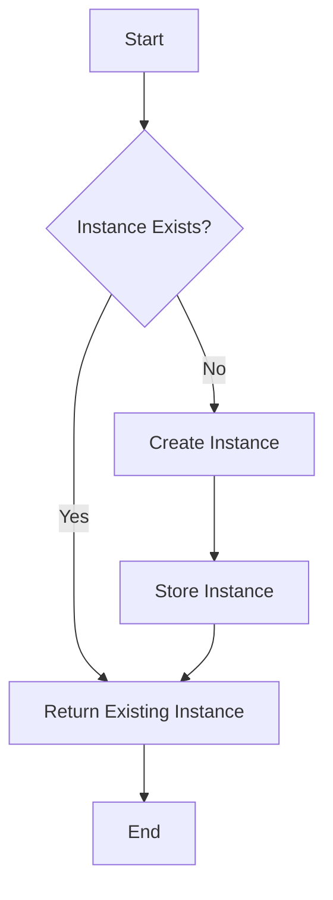

## 5.2.3 Implementation in JavaScript

The Singleton pattern is a creational design pattern that ensures a class has only one instance and provides a global point of access to it. In JavaScript, this can be achieved through various techniques, each with its unique advantages and considerations. This section will guide you through implementing the Singleton pattern using the module pattern, ES6 classes, and closures. We'll explore each method's intricacies, best practices, and potential pitfalls to help you choose the right approach for your project.

### Understanding the Singleton Pattern in JavaScript

Before diving into the implementation, it's crucial to understand the role of the Singleton pattern in software design. The Singleton pattern restricts the instantiation of a class to a single object. This is useful when exactly one object is needed to coordinate actions across the system. Common use cases include logging, driver objects, caching, and thread pools.

JavaScript's dynamic and flexible nature allows for multiple ways to implement the Singleton pattern, each suited to different scenarios. Let's explore these methods in detail.

### Implementing Singleton with the Module Pattern (IIFE)

The module pattern is a classic approach in JavaScript for creating Singleton-like structures. It uses an Immediately Invoked Function Expression (IIFE) to encapsulate private variables and methods, ensuring that only one instance of the module exists.

#### Example: Singleton using Module Pattern

```javascript
const Singleton = (function() {
    let instance;

    function init() {
        // Private methods and variables
        let privateVariable = "I am private";

        function privateMethod() {
            console.log(privateVariable);
        }

        return {
            // Public methods and variables
            publicMethod: function() {
                console.log("Hello World");
            }
        };
    }

    return {
        getInstance: function() {
            if (!instance) {
                instance = init();
            }
            return instance;
        }
    };
})();

const singletonA = Singleton.getInstance();
const singletonB = Singleton.getInstance();
console.log(singletonA === singletonB); // Output: true
```

#### Explanation

- **IIFE**: An IIFE is used to create a closure that encapsulates the `instance` variable, ensuring it remains private and inaccessible from the outside.
- **`getInstance` Method**: This method checks if an instance has already been created. If not, it initializes one. This ensures that only one instance exists throughout the application.

#### Advantages

- **Encapsulation**: The module pattern provides excellent encapsulation of private variables and methods.
- **Simplicity**: It's straightforward and easy to understand, making it a good choice for simple applications.

#### Considerations

- **Global State**: Be cautious of using Singletons to manage global state, as it can lead to tightly coupled code and testing difficulties.
- **Performance**: The module pattern can impact performance if not used judiciously, especially in large applications.

### Implementing Singleton with ES6 Modules

ES6 modules offer a natural way to implement Singletons in JavaScript. Due to module caching, any module imported across different files will always return the same instance.

#### Example: Singleton using ES6 Modules

```javascript
// logger.js
class Logger {
    log(message) {
        console.log(`[LOG]: ${message}`);
    }
}

const logger = new Logger();
export default logger;

// Usage in another file
import logger from './logger.js';
logger.log('Hello World');
```

#### Explanation

- **Module Caching**: JavaScript modules are cached after the first load. This means that the `logger` instance is created once and reused wherever it's imported.
- **Simplicity**: This method is straightforward and leverages JavaScript's built-in module system, which is efficient and easy to maintain.

#### Advantages

- **Built-in Support**: ES6 modules naturally enforce Singleton behavior, eliminating the need for additional code to manage instance creation.
- **Maintainability**: Using modules improves code organization and maintainability, especially in large applications.

#### Considerations

- **Environment Compatibility**: Ensure your environment supports ES6 modules, or use a transpiler like Babel for compatibility with older environments.

### Implementing Singleton with Classes and Static Properties

With ES6, JavaScript introduced classes, which can be used alongside static properties to implement Singletons. This approach provides a more traditional object-oriented style.

#### Example: Singleton using Classes and Static Properties

```javascript
class Singleton {
    constructor() {
        if (Singleton.instance) {
            return Singleton.instance;
        }
        Singleton.instance = this;
        // Initialize your singleton instance here
    }
}

const instance1 = new Singleton();
const instance2 = new Singleton();
console.log(instance1 === instance2); // Output: true
```

#### Explanation

- **Static Property**: The `Singleton.instance` static property holds the instance of the class. If an instance already exists, the constructor returns it instead of creating a new one.
- **Traditional Approach**: This method aligns with traditional object-oriented programming practices, making it familiar to developers with experience in other languages.

#### Advantages

- **Object-Oriented**: Provides a clear, object-oriented approach to implementing Singletons.
- **Clarity**: The use of classes and static properties makes the code easy to read and understand.

#### Considerations

- **Complexity**: While more structured, this approach can introduce complexity, especially in managing the Singleton lifecycle.

### Best Practices for Using Singletons in JavaScript

When implementing Singletons, consider the following best practices to ensure your code is efficient, maintainable, and scalable:

- **Avoid Global State**: Use Singletons judiciously to avoid introducing unnecessary global state, which can lead to tightly coupled code and testing challenges.
- **Consider Module Systems**: Leverage JavaScript's module system to naturally enforce Singleton behavior, reducing the need for additional code.
- **Align with Project Needs**: Choose an implementation method that aligns with your project's architecture and requirements. Consider factors like environment compatibility and team familiarity with the approach.
- **Testing and Maintainability**: Be aware of potential testing challenges with Singletons. Use dependency injection or mocking frameworks to facilitate testing.
- **Performance Considerations**: Ensure that the Singleton implementation does not negatively impact performance, especially in large-scale applications.

### Visualizing the Singleton Pattern in JavaScript

To better understand how the Singleton pattern works in JavaScript, let's visualize the process using a flowchart. This diagram illustrates the decision-making process in creating and accessing a Singleton instance.



### Key Points to Emphasize

- **Natural Support**: JavaScript's module system and closures provide natural support for the Singleton pattern, making it easier to implement and maintain.
- **Implementation Choice**: Choose an implementation method that aligns with your project's needs and architecture. Consider factors like environment compatibility and team familiarity.
- **Potential Issues**: Be aware of potential issues with testing and maintainability, especially when using Singletons to manage global state.

### Conclusion

The Singleton pattern is a powerful tool in a software developer's arsenal, providing a way to manage shared resources and coordinate actions across a system. In JavaScript, multiple methods exist to implement this pattern, each with its unique advantages and considerations. By understanding these methods and following best practices, you can effectively implement the Singleton pattern in your projects, ensuring efficient and maintainable code.

## Quiz Time!



### What is the primary purpose of the Singleton pattern?

- [x] To ensure a class has only one instance and provide a global point of access to it.
- [ ] To allow multiple instances of a class to be created.
- [ ] To encapsulate a group of related methods.
- [ ] To provide a way to create objects without specifying the exact class of object that will be created.

> **Explanation:** The Singleton pattern restricts the instantiation of a class to a single object and provides a global point of access to it.

### Which JavaScript feature naturally enforces Singleton behavior?

- [x] ES6 Modules
- [ ] Promises
- [ ] Callbacks
- [ ] Async/Await

> **Explanation:** ES6 modules naturally enforce Singleton behavior due to module caching, ensuring only one instance is created and shared across imports.

### How does the module pattern ensure only one instance is created?

- [x] By using an IIFE to encapsulate the instance and a `getInstance` method to control access.
- [ ] By using a global variable to store the instance.
- [ ] By using a class constructor to create the instance.
- [ ] By using a factory function to return the instance.

> **Explanation:** The module pattern uses an IIFE to encapsulate the instance and a `getInstance` method to control access, ensuring only one instance is created.

### In the class-based Singleton implementation, what role does the static property play?

- [x] It stores the instance of the class to ensure only one instance exists.
- [ ] It initializes the class with default values.
- [ ] It provides a method to reset the instance.
- [ ] It defines the class's public interface.

> **Explanation:** The static property stores the instance of the class, ensuring that only one instance exists and is returned by the constructor.

### What is a potential drawback of using Singletons?

- [x] They can introduce global state, leading to tightly coupled code and testing difficulties.
- [ ] They always improve performance by reducing memory usage.
- [ ] They simplify the code by reducing the number of classes needed.
- [ ] They eliminate the need for dependency injection.

> **Explanation:** Singletons can introduce global state, leading to tightly coupled code and testing difficulties, which is a potential drawback.

### Why is it important to consider module systems when implementing Singletons?

- [x] Because module systems can naturally enforce Singleton behavior, reducing the need for additional code.
- [ ] Because module systems always require complex configuration.
- [ ] Because module systems are incompatible with Singletons.
- [ ] Because module systems make Singletons obsolete.

> **Explanation:** Module systems can naturally enforce Singleton behavior due to module caching, reducing the need for additional code to manage instance creation.

### What is a common use case for Singletons?

- [x] Logging services
- [ ] Creating multiple user interfaces
- [ ] Managing independent threads
- [ ] Generating random numbers

> **Explanation:** Singletons are commonly used for logging services, where a single instance is needed to coordinate actions across the system.

### How can you test code that uses Singletons effectively?

- [x] By using dependency injection or mocking frameworks to isolate the Singleton.
- [ ] By directly modifying the Singleton's internal state.
- [ ] By creating multiple instances of the Singleton.
- [ ] By avoiding the use of Singletons altogether.

> **Explanation:** Using dependency injection or mocking frameworks allows you to isolate the Singleton, making it easier to test code that depends on it.

### What is a benefit of using the ES6 module approach for Singletons?

- [x] It leverages JavaScript's built-in module system for efficiency and ease of maintenance.
- [ ] It requires additional libraries for implementation.
- [ ] It allows for multiple instances of the Singleton.
- [ ] It is incompatible with modern JavaScript frameworks.

> **Explanation:** The ES6 module approach leverages JavaScript's built-in module system, making it efficient and easy to maintain.

### True or False: The Singleton pattern is always the best choice for managing shared resources.

- [ ] True
- [x] False

> **Explanation:** While the Singleton pattern is useful for managing shared resources, it is not always the best choice. Considerations such as testing, maintainability, and global state management must be taken into account.


