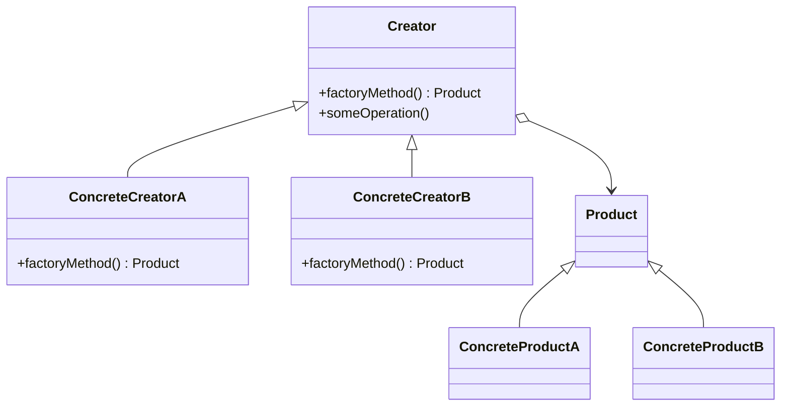

## 5.3.1 Concept of the Factory Method

### Introduction

In the realm of software design, the Factory Method pattern stands as a cornerstone of creational design patterns. Its primary goal is to define an interface for creating objects, but it cleverly defers the instantiation to subclasses. This approach not only promotes loose coupling but also enhances flexibility and reusability within software systems.

### Definition of the Factory Method Pattern

The **Factory Method pattern** is a creational design pattern that provides an interface for creating objects in a superclass, but allows subclasses to alter the type of objects that will be created. This pattern is particularly useful when a class cannot anticipate the class of objects it needs to create, thus delegating the responsibility of instantiation to subclasses.

#### Key Characteristics

- **Interface Definition:** The pattern defines a method that must be implemented by subclasses to create objects.
- **Deferred Instantiation:** The actual creation of objects is deferred to subclasses, allowing them to decide which class to instantiate.
- **Promotes Loose Coupling:** By using the Factory Method, the client code can work with interfaces rather than concrete implementations, reducing dependencies.

### Problem Addressed by the Factory Method

In software design, there are scenarios where a class cannot predict the type of objects it needs to create. This could be due to varying configurations, user inputs, or other dynamic factors. The Factory Method pattern addresses this problem by encapsulating the object creation process, thus achieving flexibility and reusability.

#### Use Cases

- **Dynamic Object Creation:** When the exact type of objects cannot be determined until runtime.
- **Configuration-Based Creation:** When different configurations require different classes to be instantiated.
- **Framework Development:** When developing libraries or frameworks that need to allow users to extend and customize object creation.

### Structure of the Factory Method Pattern

The Factory Method pattern consists of several key components, each playing a distinct role in the pattern's structure:

#### 1. Creator (Abstract Class)

The Creator class declares the factory method, which returns an object of type `Product`. It may also provide a default implementation of the factory method, allowing subclasses to override it as needed.

#### 2. Concrete Creator (Subclass)

Concrete Creators override the factory method to return an instance of a `Concrete Product`. This is where the specific class of the product is determined and instantiated.

#### 3. Product (Interface or Abstract Class)

The Product interface defines the structure for objects that the factory method creates. It ensures that all products share a common interface.

#### 4. Concrete Products

Concrete Products implement the Product interface, providing specific implementations of the product's behavior.

### Real-World Analogy

Consider a logistics company that needs to decide what type of transport to use for deliveries. Depending on the delivery method, the company might choose a truck, ship, or airplane. The decision is deferred to the specific delivery method, much like how the Factory Method pattern defers object creation to subclasses.

### Visual Representation

Below is a Mermaid.js class diagram illustrating the structure of the Factory Method pattern:

### Key Points to Emphasize

- **Loose Coupling:** The Factory Method pattern promotes loose coupling by eliminating the need to bind application-specific classes into code.
- **Flexibility and Maintainability:** By allowing the client code to work with interfaces rather than concrete implementations, the pattern enhances code flexibility and maintainability.
- **Customization and Extension:** The pattern provides a framework for creating objects that can be customized and extended by subclasses.

### Conclusion

The Factory Method pattern is a powerful tool in the software designer's toolkit. By deferring the instantiation of objects to subclasses, it allows for greater flexibility and adaptability in software systems. This pattern is particularly useful in scenarios where the type of objects cannot be determined until runtime, making it an essential concept for any software engineer to understand and apply.

## Quiz Time!



### What is the primary goal of the Factory Method pattern?

- [x] To define an interface for creating objects and defer instantiation to subclasses.
- [ ] To create a single instance of a class.
- [ ] To provide a global point of access to an object.
- [ ] To ensure a class has only one instance.

> **Explanation:** The Factory Method pattern defines an interface for creating objects but allows subclasses to decide which class to instantiate, promoting flexibility and loose coupling.

### Which of the following is NOT a component of the Factory Method pattern?

- [ ] Creator
- [ ] Concrete Creator
- [x] Singleton
- [ ] Product

> **Explanation:** Singleton is a separate design pattern. The components of the Factory Method pattern include Creator, Concrete Creator, and Product.

### How does the Factory Method pattern promote loose coupling?

- [x] By allowing client code to work with interfaces rather than concrete implementations.
- [ ] By creating a single instance of a class.
- [ ] By providing a global point of access to an object.
- [ ] By ensuring a class has only one instance.

> **Explanation:** The Factory Method pattern promotes loose coupling by allowing client code to interact with interfaces, thus reducing dependencies on specific implementations.

### In which scenario is the Factory Method pattern particularly useful?

- [x] When a class cannot anticipate the type of objects it needs to create.
- [ ] When a class needs to ensure a single instance.
- [ ] When a class requires a global point of access.
- [ ] When a class needs to manage multiple connections.

> **Explanation:** The Factory Method pattern is useful when a class cannot predict the type of objects it needs to create, allowing subclasses to determine the specific class of objects.

### What role does the Concrete Creator play in the Factory Method pattern?

- [x] It overrides the factory method to return an instance of a Concrete Product.
- [ ] It declares the factory method.
- [ ] It provides a global point of access.
- [ ] It ensures a single instance of a class.

> **Explanation:** The Concrete Creator overrides the factory method to return an instance of a Concrete Product, defining the specific class of objects to be instantiated.

### What does the Product component represent in the Factory Method pattern?

- [x] The interface for objects created by the factory method.
- [ ] The class that declares the factory method.
- [ ] The class that overrides the factory method.
- [ ] The class that provides a global point of access.

> **Explanation:** The Product component represents the interface or abstract class for objects that the factory method creates, ensuring a common structure for all products.

### Which of the following best describes a real-world analogy of the Factory Method pattern?

- [x] A logistics company deciding on the type of transport based on the delivery method.
- [ ] A single company managing multiple branches globally.
- [ ] A company maintaining a single database connection.
- [ ] A company providing a single point of contact for customer service.

> **Explanation:** The analogy of a logistics company choosing transport methods based on delivery needs reflects the Factory Method pattern's deferred decision-making process.

### What is one of the key benefits of using the Factory Method pattern?

- [x] It enhances code flexibility and maintainability.
- [ ] It ensures a class has only one instance.
- [ ] It provides a global point of access to an object.
- [ ] It manages multiple connections.

> **Explanation:** The Factory Method pattern enhances code flexibility and maintainability by allowing client code to work with interfaces rather than concrete implementations.

### How does the Factory Method pattern differ from the Singleton pattern?

- [x] The Factory Method pattern focuses on creating objects through an interface, while the Singleton pattern ensures a single instance.
- [ ] The Factory Method pattern ensures a single instance, while the Singleton pattern creates objects through an interface.
- [ ] Both patterns ensure a single instance of a class.
- [ ] Both patterns create objects through an interface.

> **Explanation:** The Factory Method pattern focuses on creating objects through an interface, deferring instantiation to subclasses, while the Singleton pattern ensures a class has only one instance.

### True or False: The Factory Method pattern allows subclasses to decide which class to instantiate.

- [x] True
- [ ] False

> **Explanation:** True. The Factory Method pattern allows subclasses to decide which class to instantiate, providing flexibility and customization in object creation.


