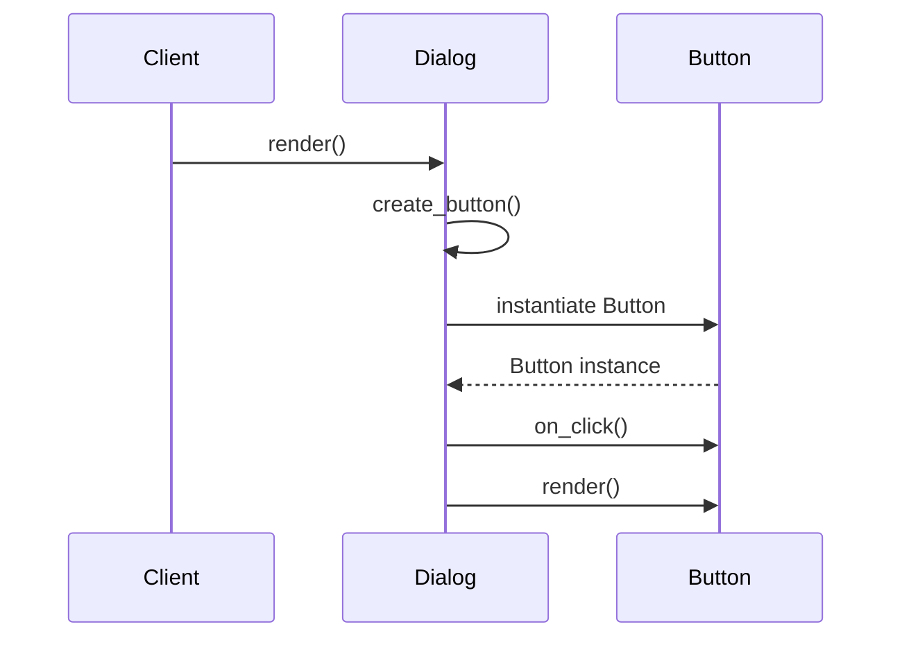

## 5.3.2 Implementing Factory Method in Python

In the world of software design, the Factory Method pattern is a creational pattern that provides an interface for creating objects in a superclass, but allows subclasses to alter the type of objects that will be created. This pattern is particularly useful when a class cannot anticipate the class of objects it must create, or when a class wants its subclasses to specify the objects it creates. In this section, we will explore how to implement the Factory Method pattern in Python, using a practical example to illustrate the concepts.

### Understanding the Factory Method Pattern

The Factory Method pattern involves a few key components:

- **Creator**: This is an abstract class that declares the factory method, which returns an object of type Product. The Creator class may also define some default implementation of the factory method that returns a default product object.
- **Concrete Creator**: These are subclasses of the Creator class that override the factory method to return an instance of a Concrete Product.
- **Product**: This is an interface or an abstract class that defines the type of objects the factory method creates.
- **Concrete Product**: These are classes that implement the Product interface.

The Factory Method pattern helps achieve decoupling of the client code from the concrete classes of the products it needs to work with. This is achieved by relying on the abstract factory method to create product objects.

### Implementation Steps

Let's break down the implementation of the Factory Method pattern in Python into manageable steps:

1. **Define an Abstract Creator Class with the Factory Method**: This class will contain the factory method that returns a product object. It may also contain some core logic that relies on the product objects returned by the factory method.

2. **Implement Concrete Creator Subclasses**: These subclasses will override the factory method to return specific product objects.

3. **Define a Product Interface or Abstract Class**: This defines the interface for the product objects.

4. **Implement Concrete Product Classes**: These classes will implement the product interface.

### Example Scenario: Dialog Application with Different Button Types

To illustrate the Factory Method pattern, we'll create a dialog application that can render different types of buttons depending on the operating system (Windows or macOS). This example will help demonstrate how the Factory Method pattern allows for the creation of different product objects without changing the client code.

#### Step 1: Define the Abstract Creator Class

We'll start by defining an abstract `Dialog` class, which contains a factory method `create_button()` and a `render()` method that uses the button created by `create_button()`.

```python
from abc import ABC, abstractmethod

class Dialog(ABC):
    @abstractmethod
    def create_button(self):
        pass

    def render(self):
        button = self.create_button()
        button.on_click(self.close_dialog)
        button.render()

    def close_dialog(self):
        print("Dialog closed.")
```

In this code, `Dialog` is an abstract class with an abstract method `create_button()`. The `render()` method uses the product created by `create_button()` to perform operations like rendering and handling click events.

#### Step 2: Implement Concrete Creator Subclasses

Next, we implement `WindowsDialog` and `MacOSDialog`, which are subclasses of `Dialog`. These classes override the `create_button()` method to return specific button types.

```python
class WindowsDialog(Dialog):
    def create_button(self):
        return WindowsButton()

class MacOSDialog(Dialog):
    def create_button(self):
        return MacOSButton()
```

Here, `WindowsDialog` and `MacOSDialog` override the `create_button()` method to return `WindowsButton` and `MacOSButton` respectively.

#### Step 3: Define the Product Interface

We define an abstract `Button` class that outlines the interface for button objects.

```python
class Button(ABC):
    @abstractmethod
    def render(self):
        pass

    @abstractmethod
    def on_click(self, action):
        pass
```

The `Button` class defines two abstract methods: `render()` and `on_click()`, which must be implemented by concrete button classes.

#### Step 4: Implement Concrete Product Classes

Finally, we implement `WindowsButton` and `MacOSButton`, which are concrete implementations of the `Button` interface.

```python
class WindowsButton(Button):
    def render(self):
        print("Render a button in Windows style")

    def on_click(self, action):
        print("Bind a Windows click event")
        action()

class MacOSButton(Button):
    def render(self):
        print("Render a button in macOS style")

    def on_click(self, action):
        print("Bind a macOS click event")
        action()
```

These classes implement the `render()` and `on_click()` methods to provide specific behavior for Windows and macOS buttons.

#### Step 5: Client Code

The client code demonstrates how to use the Factory Method pattern to create and render buttons without knowing the exact classes of the buttons.

```python
def main(os_type):
    if os_type == "Windows":
        dialog = WindowsDialog()
    elif os_type == "macOS":
        dialog = MacOSDialog()
    else:
        raise ValueError("Unknown OS type")
    dialog.render()

if __name__ == '__main__':
    main("Windows")
```

In this code, the `main()` function creates a `Dialog` object based on the operating system type and calls its `render()` method. The client code is decoupled from the concrete button classes, relying instead on the abstract `Dialog` interface.

### Explanation of the Code

Let's walk through the code step by step:

1. **Abstract Creator Class (`Dialog`)**: This class defines the factory method `create_button()`, which is meant to be overridden by subclasses. It also provides a `render()` method that uses the button created by `create_button()`.

2. **Concrete Creator Classes (`WindowsDialog`, `MacOSDialog`)**: These classes override the `create_button()` method to return specific button types, `WindowsButton` and `MacOSButton`.

3. **Product Interface (`Button`)**: This interface defines the methods that all button objects must implement, namely `render()` and `on_click()`.

4. **Concrete Product Classes (`WindowsButton`, `MacOSButton`)**: These classes implement the `Button` interface, providing specific behavior for Windows and macOS buttons.

5. **Client Code**: The client code uses the abstract `Dialog` interface to create and render buttons without needing to know the specific classes of the buttons.

### Best Practices

When implementing the Factory Method pattern, consider the following best practices:

- **Use Abstract Base Classes**: Define clear interfaces using abstract base classes to ensure consistency and enforce implementation of necessary methods in concrete classes.

- **Separate Creation Logic from Business Logic**: Keep the logic for creating objects separate from the logic for using them. This separation enhances flexibility and maintainability.

- **Rely on Polymorphism**: Use polymorphism to allow the client code to work with abstract interfaces rather than concrete implementations.

- **Enhance Extensibility**: The Factory Method pattern makes it easy to introduce new product types without changing existing client code, enhancing the extensibility of your application.

### Visuals and Diagrams

To further illustrate how the Factory Method pattern works, let's look at a sequence diagram that shows the interaction between the client code, the `Dialog` creator, and the `Button` products.



In this sequence diagram, the `Client` calls the `render()` method on the `Dialog`. The `Dialog` uses the factory method `create_button()` to instantiate a `Button`. The `Button` is then used to handle click events and render itself.

### Key Points to Emphasize

- **Decoupling**: The Factory Method pattern decouples the client code from concrete product classes, allowing for flexibility and easier maintenance.

- **Inheritance and Overriding**: By using inheritance and method overriding, the Factory Method pattern allows for the creation of different product objects without changing the client code.

- **Extensibility**: The pattern enhances extensibility by allowing new product types to be added with minimal changes to existing code.

### Conclusion

The Factory Method pattern is a powerful tool in the software designer's toolkit, providing a way to create objects without specifying their concrete classes. By understanding and implementing this pattern, you can create flexible and maintainable code that is easy to extend and modify. In this section, we've explored how to implement the Factory Method pattern in Python, using a practical example to illustrate the concepts. By following the steps outlined and adhering to best practices, you can effectively apply this pattern in your own projects.

## Quiz Time!



### What is the primary purpose of the Factory Method pattern?

- [x] To provide an interface for creating objects in a superclass, allowing subclasses to alter the type of objects that will be created.
- [ ] To create a single instance of a class.
- [ ] To provide a way to access the elements of an aggregate object sequentially.
- [ ] To define a family of algorithms, encapsulate each one, and make them interchangeable.

> **Explanation:** The Factory Method pattern provides an interface for creating objects in a superclass, allowing subclasses to alter the type of objects that will be created.

### Which of the following is NOT a component of the Factory Method pattern?

- [ ] Creator
- [ ] Concrete Creator
- [ ] Product
- [x] Singleton

> **Explanation:** The Singleton is not a component of the Factory Method pattern. The components are Creator, Concrete Creator, Product, and Concrete Product.

### In the provided example, what is the role of the `Dialog` class?

- [x] It is an abstract class that defines the factory method and provides a default implementation.
- [ ] It is a concrete class that creates button objects directly.
- [ ] It is a utility class that provides helper functions for rendering dialogs.
- [ ] It is a data class that stores dialog properties.

> **Explanation:** `Dialog` is an abstract class that defines the factory method `create_button()` and provides a default implementation of `render()`.

### How does the Factory Method pattern promote code extensibility?

- [x] By allowing new product types to be added without changing existing client code.
- [ ] By using global variables to manage product instances.
- [ ] By hardcoding product types in the client code.
- [ ] By using static methods to create product instances.

> **Explanation:** The Factory Method pattern promotes code extensibility by allowing new product types to be added without changing existing client code.

### What is the main advantage of using abstract base classes in the Factory Method pattern?

- [x] They define clear interfaces and enforce implementation of necessary methods in concrete classes.
- [ ] They allow for the use of global state across the application.
- [ ] They enable direct manipulation of concrete product classes.
- [ ] They eliminate the need for method overriding.

> **Explanation:** Abstract base classes define clear interfaces and enforce implementation of necessary methods in concrete classes, ensuring consistency.

### What does the `create_button()` method in the `Dialog` class represent?

- [x] The factory method that is meant to be overridden by subclasses to create specific product objects.
- [ ] A utility method for rendering buttons.
- [ ] A method for closing the dialog.
- [ ] A method for binding click events to buttons.

> **Explanation:** The `create_button()` method is the factory method that is meant to be overridden by subclasses to create specific product objects.

### In the example, how does the `main()` function determine which `Dialog` subclass to instantiate?

- [x] By checking the `os_type` parameter and instantiating the appropriate subclass.
- [ ] By using a random selection process.
- [ ] By hardcoding the subclass names in the function.
- [ ] By reading from a configuration file.

> **Explanation:** The `main()` function checks the `os_type` parameter and instantiates the appropriate `Dialog` subclass based on its value.

### What is the benefit of separating creation logic from business logic in the Factory Method pattern?

- [x] It enhances flexibility and maintainability by keeping the logic for creating objects separate from the logic for using them.
- [ ] It allows for the use of global variables in the application.
- [ ] It simplifies the code by reducing the number of classes.
- [ ] It enables the use of static methods for object creation.

> **Explanation:** Separating creation logic from business logic enhances flexibility and maintainability by keeping the logic for creating objects separate from the logic for using them.

### How does the `Button` interface contribute to the Factory Method pattern?

- [x] It defines the methods that all button objects must implement, ensuring consistency across different button types.
- [ ] It provides default implementations for all button methods.
- [ ] It acts as a singleton for managing button instances.
- [ ] It stores the state of button objects.

> **Explanation:** The `Button` interface defines the methods that all button objects must implement, ensuring consistency across different button types.

### True or False: The Factory Method pattern requires the client code to know the exact classes of the products it works with.

- [ ] True
- [x] False

> **Explanation:** False. The Factory Method pattern decouples the client code from the concrete product classes, allowing the client to work with abstract interfaces instead.


