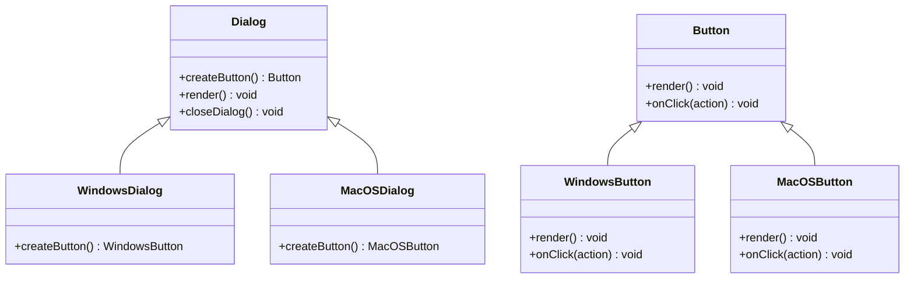

## 5.3.3 Implementing Factory Method in JavaScript

In this section, we will delve into the implementation of the Factory Method pattern using JavaScript, particularly leveraging ES6 classes. This approach will help us create flexible and maintainable code by abstracting the instantiation of objects. The Factory Method pattern is a creational design pattern that provides an interface for creating objects in a superclass but allows subclasses to alter the type of objects that will be created.

### Understanding the Factory Method Pattern

Before we jump into the implementation, let's revisit the core concepts of the Factory Method pattern:

- **Creator (Abstract Class):** Declares the factory method, which returns an object of type Product. The Creator may also define a default implementation of the factory method that returns a default ConcreteProduct object.
  
- **Concrete Creators (Subclasses):** Override the factory method to return an instance of a ConcreteProduct.
  
- **Product (Interface/Abstract Class):** Declares the interface for objects the factory method creates.
  
- **Concrete Products:** Implement the Product interface.

The Factory Method pattern is particularly useful when dealing with frameworks or libraries where the exact types of objects to be created are not known until runtime.

### JavaScript and the Factory Method Pattern

JavaScript, with its prototypal inheritance and ES6 class syntax, provides a robust environment for implementing design patterns. The use of classes and inheritance in JavaScript allows us to define a clear structure for our Factory Method pattern.

### Implementation Steps

Let's implement the Factory Method pattern in JavaScript using a dialog and button scenario. We'll define a `Dialog` class as the Creator and `WindowsDialog` and `MacOSDialog` as Concrete Creators. The `Button` class will serve as the Product interface, with `WindowsButton` and `MacOSButton` as Concrete Products.

#### Step 1: Define the Creator and Concrete Creators

The Creator class declares the factory method that returns a product object. In our example, the `Dialog` class is the Creator, and it has a method `createButton` that subclasses will implement.

```javascript
class Dialog {
    createButton() {
        // Abstract method
        throw new Error('Method createButton() must be implemented.');
    }

    render() {
        const button = this.createButton();
        button.onClick(this.closeDialog.bind(this));
        button.render();
    }

    closeDialog() {
        console.log('Dialog closed.');
    }
}

class WindowsDialog extends Dialog {
    createButton() {
        return new WindowsButton();
    }
}

class MacOSDialog extends Dialog {
    createButton() {
        return new MacOSButton();
    }
}
```

**Explanation:**

- **Dialog Class:** Acts as the abstract Creator. It defines the `createButton` method, which is meant to be overridden by subclasses. The `render` method uses the factory method to create a button and then calls its `render` and `onClick` methods.
  
- **WindowsDialog and MacOSDialog:** These are Concrete Creators that implement the `createButton` method to return specific button types (`WindowsButton` and `MacOSButton`).

#### Step 2: Define the Product and Concrete Products

The Product interface defines the operations that all concrete products must implement. Here, `Button` is the Product interface.

```javascript
class Button {
    render() {
        // Abstract method
        throw new Error('Method render() must be implemented.');
    }

    onClick(action) {
        // Abstract method
        throw new Error('Method onClick() must be implemented.');
    }
}

class WindowsButton extends Button {
    render() {
        console.log('Render a button in Windows style');
    }

    onClick(action) {
        console.log('Bind a Windows click event');
        action();
    }
}

class MacOSButton extends Button {
    render() {
        console.log('Render a button in macOS style');
    }

    onClick(action) {
        console.log('Bind a macOS click event');
        action();
    }
}
```

**Explanation:**

- **Button Class:** Serves as the abstract Product. It declares the `render` and `onClick` methods, which must be implemented by concrete products.
  
- **WindowsButton and MacOSButton:** These are Concrete Products that implement the `render` and `onClick` methods to perform actions specific to their styles.

#### Step 3: Implement the Client Code

The client code works with an instance of a Concrete Creator, but through its base interface. This allows the client to remain independent of the concrete classes that it instantiates.

```javascript
function main(osType) {
    let dialog;
    if (osType === 'Windows') {
        dialog = new WindowsDialog();
    } else if (osType === 'macOS') {
        dialog = new MacOSDialog();
    } else {
        throw new Error('Unknown OS type');
    }
    dialog.render();
}

main('Windows');
```

**Explanation:**

- **Client Code:** The `main` function acts as the client. It decides which dialog to instantiate based on the operating system type. The client code uses the `Dialog` interface to call the `render` method, which internally uses the factory method to create buttons.

### Best Practices and Considerations

- **Handling Abstract Methods:** In JavaScript, abstract methods can be simulated by throwing errors in the base class methods. This ensures that subclasses must implement these methods.
  
- **Use of Inheritance:** Proper use of inheritance helps maintain code clarity and extensibility. Each Concrete Creator and Product should extend their respective base classes.

- **Flexibility and Maintainability:** By abstracting the object creation process, we achieve flexibility and maintainability. The client code can work with different dialogs without knowing the specifics of the buttons.

### Visual Representation

To better understand the structure of the Factory Method pattern in this example, let's visualize it using a class diagram.



### Key Points to Emphasize

- **JavaScript's Support for Design Patterns:** JavaScript's prototypal inheritance and class syntax provide a solid foundation for implementing design patterns like the Factory Method.
  
- **Abstracting Object Creation:** The Factory Method pattern is essential for abstracting the creation of objects, which leads to more flexible and maintainable code.

- **Code Reusability and Extensibility:** By using interfaces and abstract classes, we ensure that our code is reusable and extensible.

### Conclusion

The Factory Method pattern is a powerful tool in the software design arsenal, allowing developers to create flexible and maintainable code by abstracting the instantiation process. By implementing this pattern in JavaScript, we leverage the language's strengths to build applications that are both robust and adaptable to change.

### Further Reading and Resources

For those interested in exploring more about design patterns and their implementations in JavaScript, consider the following resources:

- [MDN Web Docs: Classes](https://developer.mozilla.org/en-US/docs/Web/JavaScript/Reference/Classes)
- [JavaScript Design Patterns](https://addyosmani.com/resources/essentialjsdesignpatterns/book/)
- [Refactoring Guru: Factory Method](https://refactoring.guru/design-patterns/factory-method)

These resources provide a deeper dive into JavaScript's capabilities and how design patterns can be effectively utilized in modern software development.

## Quiz Time!



### What is the main purpose of the Factory Method pattern?

- [x] To define an interface for creating an object, but let subclasses alter the type of objects that will be created.
- [ ] To create a single instance of an object.
- [ ] To provide a way to access elements of an aggregate object sequentially.
- [ ] To separate the construction of a complex object from its representation.

> **Explanation:** The Factory Method pattern provides an interface for creating objects in a superclass but allows subclasses to alter the type of objects that will be created.

### Which JavaScript feature is used to simulate abstract methods in the Factory Method pattern?

- [x] Throwing errors in base class methods
- [ ] Using `null` as a placeholder
- [ ] Implementing methods in the base class
- [ ] Using `undefined` as a return value

> **Explanation:** In JavaScript, abstract methods can be simulated by throwing errors in the base class methods, ensuring that subclasses must implement these methods.

### In the provided example, what is the role of the `Dialog` class?

- [x] It acts as the abstract Creator class.
- [ ] It is a concrete implementation of a dialog.
- [ ] It represents the client code.
- [ ] It is an interface for buttons.

> **Explanation:** The `Dialog` class is the abstract Creator in the Factory Method pattern, declaring the factory method `createButton`.

### What does the `main` function demonstrate in the example?

- [x] How client code can work with different dialogs without knowing the specifics of the buttons.
- [ ] How to implement a button rendering method.
- [ ] How to create a new dialog type.
- [ ] How to handle user input.

> **Explanation:** The `main` function shows how client code can work with different dialogs using the Factory Method pattern, abstracting the specifics of the button creation.

### What is the benefit of using the Factory Method pattern in terms of code maintainability?

- [x] It allows the code to be more flexible and maintainable by abstracting object creation.
- [ ] It makes the code run faster.
- [ ] It reduces the number of classes needed.
- [ ] It simplifies the user interface.

> **Explanation:** The Factory Method pattern abstracts the object creation process, leading to more flexible and maintainable code.

### How does the `WindowsDialog` class differ from the `Dialog` class?

- [x] `WindowsDialog` implements the `createButton` method to return a `WindowsButton`.
- [ ] `WindowsDialog` does not use the `createButton` method.
- [ ] `WindowsDialog` is an interface.
- [ ] `WindowsDialog` is the client code.

> **Explanation:** `WindowsDialog` is a Concrete Creator that implements the `createButton` method to return a `WindowsButton`.

### What is the purpose of the `Button` class in the example?

- [x] To serve as the abstract Product interface.
- [ ] To act as a concrete product.
- [ ] To handle user input.
- [ ] To manage dialog rendering.

> **Explanation:** The `Button` class serves as the abstract Product interface in the Factory Method pattern.

### Which method in the `Button` class must be implemented by all concrete products?

- [x] `render()`
- [ ] `closeDialog()`
- [ ] `createButton()`
- [ ] `main()`

> **Explanation:** The `render()` method is declared in the `Button` class and must be implemented by all concrete products.

### What would happen if the `createButton` method is not implemented in a subclass of `Dialog`?

- [x] An error will be thrown when `createButton` is called.
- [ ] The program will run without any buttons.
- [ ] A default button will be created.
- [ ] The dialog will not render.

> **Explanation:** If the `createButton` method is not implemented in a subclass, an error will be thrown when it is called, as per the abstract method simulation.

### The Factory Method pattern is a type of which design pattern category?

- [x] Creational
- [ ] Structural
- [ ] Behavioral
- [ ] Functional

> **Explanation:** The Factory Method pattern is a creational design pattern, focusing on the creation of objects.


