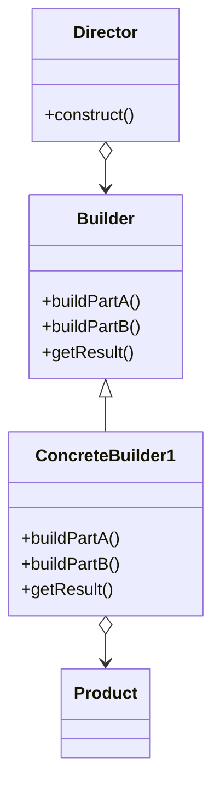

## 5.4.1 Understanding the Builder Pattern

In the realm of software design, creating complex objects can often become a cumbersome task, especially when the object construction involves numerous steps or configurations. The **Builder pattern** emerges as a solution to this problem, offering a way to construct complex objects step by step, while separating the construction process from the final representation. This pattern is particularly useful when an object can be created with different configurations or representations, allowing developers to maintain clean and manageable code.

### Definition of the Builder Pattern

The Builder pattern is a creational design pattern that provides a flexible solution to constructing complex objects. By separating the construction of an object from its representation, the Builder pattern allows the same construction process to create different representations. This separation not only simplifies the creation process but also enhances code readability and maintainability.

### Problem Addressed by the Builder Pattern

The Builder pattern addresses several critical issues in software design:

- **Complex Construction Processes:** When constructing an object involves multiple steps that must be executed in a specific order, the Builder pattern provides a structured approach to manage this complexity.
- **Varied Configurations:** When an object can be created with various configurations or representations, the Builder pattern allows different builders to create these variations without altering the client code.
- **Decoupling Construction and Representation:** By decoupling the construction process from the object's representation, the Builder pattern promotes a clean separation of concerns, making the codebase easier to understand and modify.

### Pattern Structure

The Builder pattern is composed of several key components, each playing a vital role in the construction process:

- **Builder Interface:** This interface specifies the methods for creating the different parts of the product object. It defines the steps required to construct the product, allowing concrete builders to implement these steps.
  
- **Concrete Builders:** These classes implement the Builder interface to construct and assemble parts of the product. Each concrete builder provides its own implementation of the construction steps, allowing for different representations of the product.
  
- **Director:** The Director class constructs an object using the Builder interface. It orchestrates the construction process by invoking the necessary steps on the builder, ensuring that the product is built correctly.
  
- **Product:** The Product is the complex object under construction. It is the final result of the builder's efforts, representing the fully constructed object.

### Real-World Analogy

To better understand the Builder pattern, consider the analogy of building a house. The process of constructing a house involves multiple steps, such as laying the foundation, constructing the walls, and installing the roof. Different types of houses can be built using the same process but with different materials and configurations. For instance, a wooden house and a brick house may follow the same construction steps but differ in the materials used.

In this analogy:

- The **Builder Interface** represents the blueprint for constructing a house, specifying the steps required.
- The **Concrete Builders** are the different construction teams, each using different materials and techniques to build the house.
- The **Director** is the construction manager, overseeing the process and ensuring each step is completed correctly.
- The **Product** is the finished house, which can vary in style and materials based on the builder used.

### Visual Representation

To visualize the Builder pattern, consider the following Mermaid.js class diagram, which illustrates the relationships between the components:



### Key Points to Emphasize

- **Step-by-Step Construction:** The Builder pattern emphasizes constructing complex objects one step at a time, ensuring that each part is built correctly before moving on to the next.
- **Decoupled Construction and Representation:** By decoupling the construction process from the object's representation, the Builder pattern allows for flexible and maintainable code.
- **Enhanced Code Readability and Maintainability:** The structured approach provided by the Builder pattern results in code that is easier to read, understand, and modify, particularly when dealing with complex object creation.

### Practical Implementation

To solidify your understanding of the Builder pattern, let's explore a practical implementation in both Python and JavaScript. These examples will demonstrate how the pattern can be applied to real-world scenarios, highlighting its benefits and versatility.

#### Python Example

Imagine we are building a meal ordering system where meals can have various configurations, such as different types of burgers, drinks, and sides. Here's how we can implement the Builder pattern in Python:

```python
class Meal:
    def __init__(self):
        self.parts = []

    def add(self, part):
        self.parts.append(part)

    def show(self):
        print("Meal includes: ", ", ".join(self.parts))

class MealBuilder:
    def build_burger(self):
        pass

    def build_drink(self):
        pass

    def get_meal(self):
        pass

class VegMealBuilder(MealBuilder):
    def __init__(self):
        self.meal = Meal()

    def build_burger(self):
        self.meal.add("Veg Burger")

    def build_drink(self):
        self.meal.add("Orange Juice")

    def get_meal(self):
        return self.meal

class NonVegMealBuilder(MealBuilder):
    def __init__(self):
        self.meal = Meal()

    def build_burger(self):
        self.meal.add("Chicken Burger")

    def build_drink(self):
        self.meal.add("Coke")

    def get_meal(self):
        return self.meal

class MealDirector:
    def __init__(self, builder):
        self.builder = builder

    def construct_meal(self):
        self.builder.build_burger()
        self.builder.build_drink()

veg_builder = VegMealBuilder()
director = MealDirector(veg_builder)
director.construct_meal()
veg_meal = veg_builder.get_meal()
veg_meal.show()

non_veg_builder = NonVegMealBuilder()
director = MealDirector(non_veg_builder)
director.construct_meal()
non_veg_meal = non_veg_builder.get_meal()
non_veg_meal.show()
```

In this example, we have defined a `Meal` class as the product, a `MealBuilder` interface, and two concrete builders: `VegMealBuilder` and `NonVegMealBuilder`. The `MealDirector` class orchestrates the construction process, allowing us to create different types of meals using the same construction steps.

#### JavaScript Example

Let's implement a similar example in JavaScript, showcasing how the Builder pattern can be applied in a web development context:

```javascript
// Define the Product class
class Meal {
    constructor() {
        this.parts = [];
    }

    add(part) {
        this.parts.push(part);
    }

    show() {
        console.log("Meal includes: " + this.parts.join(", "));
    }
}

// Define the Builder interface
class MealBuilder {
    buildBurger() {}
    buildDrink() {}
    getMeal() {}
}

// Implement Concrete Builders
class VegMealBuilder extends MealBuilder {
    constructor() {
        super();
        this.meal = new Meal();
    }

    buildBurger() {
        this.meal.add("Veg Burger");
    }

    buildDrink() {
        this.meal.add("Orange Juice");
    }

    getMeal() {
        return this.meal;
    }
}

class NonVegMealBuilder extends MealBuilder {
    constructor() {
        super();
        this.meal = new Meal();
    }

    buildBurger() {
        this.meal.add("Chicken Burger");
    }

    buildDrink() {
        this.meal.add("Coke");
    }

    getMeal() {
        return this.meal;
    }
}

// Define the Director class
class MealDirector {
    constructor(builder) {
        this.builder = builder;
    }

    constructMeal() {
        this.builder.buildBurger();
        this.builder.buildDrink();
    }
}

// Client code
const vegBuilder = new VegMealBuilder();
const director = new MealDirector(vegBuilder);
director.constructMeal();
const vegMeal = vegBuilder.getMeal();
vegMeal.show();

const nonVegBuilder = new NonVegMealBuilder();
director.builder = nonVegBuilder;
director.constructMeal();
const nonVegMeal = nonVegBuilder.getMeal();
nonVegMeal.show();
```

This JavaScript example mirrors the Python implementation, demonstrating the Builder pattern's versatility across different programming languages.

### Real-World Applications

The Builder pattern is widely used in software development, particularly in scenarios where complex objects require careful construction. Some real-world applications include:

- **UI Component Libraries:** Constructing complex UI components with various configurations and styles.
- **Document Generation Systems:** Creating documents with different formats and content structures.
- **Game Development:** Building complex game entities with various attributes and behaviors.

### Best Practices and Common Pitfalls

When implementing the Builder pattern, consider the following best practices and potential pitfalls:

- **Use the Builder Pattern for Complex Objects:** The Builder pattern is most beneficial when constructing complex objects with multiple parts. For simpler objects, consider other creational patterns like the Factory pattern.
- **Maintain a Clear Separation of Concerns:** Ensure that the builder is responsible only for constructing the object, while the director manages the construction process.
- **Avoid Overcomplicating the Design:** While the Builder pattern offers flexibility, avoid overcomplicating the design by introducing unnecessary builders or steps.

### Conclusion

The Builder pattern is a powerful tool in the software designer's toolkit, providing a structured approach to constructing complex objects. By separating the construction process from the object's representation, the Builder pattern enhances code readability, maintainability, and flexibility. Whether you're building a meal ordering system, a UI component library, or any other complex system, the Builder pattern offers a reliable solution for managing complexity and ensuring consistent object creation.

## Quiz Time!



### What is the primary purpose of the Builder pattern?

- [x] To construct complex objects step by step, separating the construction process from the representation.
- [ ] To create a single instance of an object.
- [ ] To define a family of algorithms.
- [ ] To provide a way to access elements of an aggregate object sequentially.

> **Explanation:** The Builder pattern allows for constructing complex objects step by step, separating the construction process from the representation.

### Which component of the Builder pattern specifies the methods for creating the different parts of the product object?

- [x] Builder Interface
- [ ] Concrete Builder
- [ ] Director
- [ ] Product

> **Explanation:** The Builder Interface specifies the methods for creating the different parts of the product object.

### In the Builder pattern, what role does the Director play?

- [x] Constructs an object using the Builder interface.
- [ ] Implements the Builder interface to construct parts.
- [ ] Represents the complex object under construction.
- [ ] Specifies methods for creating parts of the product.

> **Explanation:** The Director constructs an object using the Builder interface by orchestrating the construction process.

### What is a real-world analogy for the Builder pattern?

- [x] Building a house with different materials and configurations.
- [ ] Creating a single instance of a database connection.
- [ ] Sorting a list using different algorithms.
- [ ] Accessing elements of a list sequentially.

> **Explanation:** Building a house with different materials and configurations is a real-world analogy for the Builder pattern.

### Which of the following is NOT a component of the Builder pattern?

- [ ] Builder Interface
- [ ] Concrete Builder
- [ ] Director
- [x] Singleton

> **Explanation:** Singleton is not a component of the Builder pattern; it is a separate design pattern.

### How does the Builder pattern enhance code maintainability?

- [x] By separating the construction process from the representation, allowing different builders to create various representations.
- [ ] By ensuring only one instance of an object is created.
- [ ] By defining a family of algorithms.
- [ ] By providing a way to access elements of an aggregate object sequentially.

> **Explanation:** The Builder pattern enhances code maintainability by separating the construction process from the representation, allowing flexibility in creating various representations.

### What is the benefit of having different Concrete Builders in the Builder pattern?

- [x] They allow for different representations of the product.
- [ ] They ensure a single instance of the product.
- [ ] They define a family of algorithms.
- [ ] They provide sequential access to product elements.

> **Explanation:** Different Concrete Builders allow for different representations of the product, providing flexibility in object construction.

### In the Builder pattern, what does the Product represent?

- [x] The complex object under construction.
- [ ] The methods for creating parts of the product.
- [ ] The class that constructs the object.
- [ ] The implementation of the Builder interface.

> **Explanation:** The Product represents the complex object under construction, which is the final result of the builder's efforts.

### Which pattern is most suitable for constructing complex objects with multiple parts?

- [x] Builder Pattern
- [ ] Singleton Pattern
- [ ] Strategy Pattern
- [ ] Iterator Pattern

> **Explanation:** The Builder pattern is most suitable for constructing complex objects with multiple parts.

### True or False: The Builder pattern can be used to create different representations of the same object.

- [x] True
- [ ] False

> **Explanation:** True. The Builder pattern allows for different representations of the same object by using different builders.


