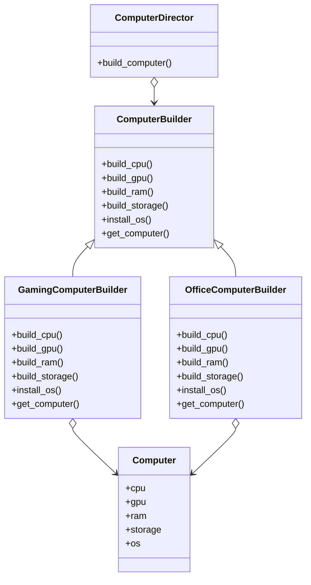

## 5.4.2 Implementation in Python

The Builder pattern is a powerful creational design pattern that allows for the step-by-step construction of complex objects. It is especially useful when an object needs to be created in multiple steps or when the object can have different representations. In this section, we will explore how to implement the Builder pattern in Python, using a practical example of constructing customized computers.

### Understanding the Builder Pattern

The Builder pattern separates the construction of a complex object from its representation, allowing the same construction process to create different representations. This pattern is particularly beneficial when the construction process is complex and involves multiple steps.

**Key Components of the Builder Pattern:**

1. **Product:** The complex object that is being built.
2. **Builder Interface:** An abstract interface that defines the steps required to build the product.
3. **Concrete Builders:** Implementations of the Builder interface that construct specific representations of the product.
4. **Director:** Orchestrates the building process using a Builder object.
5. **Client Code:** Uses the Director and Builder to construct the product.

### Implementation Steps

Let's dive into the implementation of the Builder pattern in Python, focusing on building customized computers.

#### Step 1: Define the Product Class

The first step is to define the `Product` class, which represents the complex object we want to build. In our example, the product is a `Computer`.

```python
class Computer:
    def __init__(self):
        self.cpu = None
        self.gpu = None
        self.ram = None
        self.storage = None
        self.os = None

    def __str__(self):
        return (f"CPU: {self.cpu}\n"
                f"GPU: {self.gpu}\n"
                f"RAM: {self.ram}\n"
                f"Storage: {self.storage}\n"
                f"OS: {self.os}")
```

**Explanation:**

- The `Computer` class includes attributes for each component of the computer, such as `cpu`, `gpu`, `ram`, `storage`, and `os`.
- The `__str__` method provides a string representation of the computer's configuration, which is useful for displaying the constructed product.

#### Step 2: Create the Builder Interface

Next, we define the `Builder` interface, which declares the methods for constructing the parts of the product. We'll use the `abc` module to create an abstract base class.

```python
from abc import ABC, abstractmethod

class ComputerBuilder(ABC):
    @abstractmethod
    def build_cpu(self):
        pass

    @abstractmethod
    def build_gpu(self):
        pass

    @abstractmethod
    def build_ram(self):
        pass

    @abstractmethod
    def build_storage(self):
        pass

    @abstractmethod
    def install_os(self):
        pass

    @abstractmethod
    def get_computer(self):
        pass
```

**Explanation:**

- The `ComputerBuilder` class is an abstract base class that defines the methods required to build each part of the computer.
- Each method is marked with `@abstractmethod`, indicating that concrete subclasses must implement these methods.

#### Step 3: Implement Concrete Builders

Concrete builders implement the `Builder` interface to construct specific configurations of the product. In our example, we'll create two concrete builders: `GamingComputerBuilder` and `OfficeComputerBuilder`.

**GamingComputerBuilder:**

```python
class GamingComputerBuilder(ComputerBuilder):
    def __init__(self):
        self.computer = Computer()

    def build_cpu(self):
        self.computer.cpu = "Intel Core i9"

    def build_gpu(self):
        self.computer.gpu = "NVIDIA RTX 3080"

    def build_ram(self):
        self.computer.ram = "32GB DDR4"

    def build_storage(self):
        self.computer.storage = "1TB SSD"

    def install_os(self):
        self.computer.os = "Windows 10 Pro"

    def get_computer(self):
        return self.computer
```

**OfficeComputerBuilder:**

```python
class OfficeComputerBuilder(ComputerBuilder):
    def __init__(self):
        self.computer = Computer()

    def build_cpu(self):
        self.computer.cpu = "Intel Core i5"

    def build_gpu(self):
        self.computer.gpu = "Integrated Graphics"

    def build_ram(self):
        self.computer.ram = "16GB DDR4"

    def build_storage(self):
        self.computer.storage = "512GB SSD"

    def install_os(self):
        self.computer.os = "Windows 10 Home"

    def get_computer(self):
        return self.computer
```

**Explanation:**

- Each concrete builder class initializes a `Computer` object and implements the methods to set the attributes for specific configurations.
- The `get_computer` method returns the constructed `Computer` object.

#### Step 4: Define the Director Class

The `Director` class orchestrates the construction process by using a `Builder` object to execute the building steps in a specific sequence.

```python
class ComputerDirector:
    def __init__(self, builder):
        self._builder = builder

    def build_computer(self):
        self._builder.build_cpu()
        self._builder.build_gpu()
        self._builder.build_ram()
        self._builder.build_storage()
        self._builder.install_os()
        return self._builder.get_computer()
```

**Explanation:**

- The `ComputerDirector` class receives a `Builder` object and calls its methods in a specific order to construct the computer.
- The `build_computer` method returns the fully constructed `Computer` object.

#### Step 5: Client Code

The client code demonstrates how to use the `Director` and `Builder` to construct different configurations of the product.

```python
def main():
    # Build a gaming computer
    gaming_builder = GamingComputerBuilder()
    director = ComputerDirector(gaming_builder)
    gaming_computer = director.build_computer()
    print("Gaming Computer:")
    print(gaming_computer)
    print()

    # Build an office computer
    office_builder = OfficeComputerBuilder()
    director = ComputerDirector(office_builder)
    office_computer = director.build_computer()
    print("Office Computer:")
    print(office_computer)

if __name__ == "__main__":
    main()
```

**Explanation:**

- The client code creates instances of `GamingComputerBuilder` and `OfficeComputerBuilder`.
- A `ComputerDirector` is created for each builder, and the `build_computer` method is called to construct the product.
- The constructed computers are printed to the console.

### Best Practices for Using the Builder Pattern

- **Modularity:** Keep builders focused on constructing specific products. This makes the code easier to manage and extend.
- **Extensibility:** Easily add new builders for additional configurations without modifying existing code.
- **Optional Director:** For simple builds, the client can control the builder directly without a director.

### Visual Representation

To better understand the relationships between the classes in the Builder pattern, let's look at a class diagram:



### Key Points to Emphasize

- **Flexibility:** The Builder pattern allows for flexible and modular construction of complex objects.
- **Separation of Concerns:** It separates the construction logic from the final product representation, enhancing code readability and maintainability.
- **Reusability:** Different builders can construct variations of the product without altering the director's code, promoting reusability.

### Conclusion

The Builder pattern is a valuable tool in software design, particularly when dealing with complex objects that require a detailed construction process. By separating the construction logic from the product representation, the Builder pattern provides flexibility, modularity, and reusability, making it an excellent choice for many software development scenarios.

### Further Reading

- [Python Official Documentation](https://docs.python.org/3/)
- [Design Patterns: Elements of Reusable Object-Oriented Software](https://en.wikipedia.org/wiki/Design_Patterns) by Erich Gamma, Richard Helm, Ralph Johnson, and John Vlissides
- [Python Design Patterns](https://python-patterns.guide/) - A comprehensive guide to design patterns in Python

## Quiz Time!



### What is the primary purpose of the Builder pattern?

- [x] To separate the construction of a complex object from its representation.
- [ ] To allow multiple instances of a class to be created.
- [ ] To ensure a class only has one instance.
- [ ] To provide a way to access the elements of an aggregate object sequentially.

> **Explanation:** The Builder pattern is designed to separate the construction of a complex object from its representation, allowing the same construction process to create different representations.

### Which component of the Builder pattern is responsible for orchestrating the construction process?

- [ ] Product
- [x] Director
- [ ] Builder Interface
- [ ] Concrete Builder

> **Explanation:** The Director is responsible for orchestrating the construction process by using a Builder object to execute the building steps in a specific sequence.

### In the provided example, what is the role of the `Computer` class?

- [x] It represents the complex object being built.
- [ ] It defines the steps required to build the product.
- [ ] It orchestrates the building process.
- [ ] It implements the methods to construct specific configurations.

> **Explanation:** The `Computer` class represents the complex object being built, containing attributes for each component of the computer.

### What is the purpose of the `get_computer` method in the concrete builder classes?

- [x] To return the fully constructed Computer object.
- [ ] To set the attributes of the Computer object.
- [ ] To initialize the Computer object.
- [ ] To define the steps required to build the product.

> **Explanation:** The `get_computer` method returns the fully constructed `Computer` object after all the parts have been built and assembled.

### How does the Builder pattern promote modularity?

- [x] By keeping builders focused on constructing specific products.
- [ ] By allowing the same construction process to create different representations.
- [x] By separating the construction logic from the product representation.
- [ ] By using a single class to handle all construction logic.

> **Explanation:** The Builder pattern promotes modularity by keeping builders focused on constructing specific products and separating the construction logic from the product representation.

### What advantage does the Builder pattern offer when adding new product configurations?

- [x] New builders can be added without modifying existing code.
- [ ] The Director class needs to be rewritten.
- [ ] Existing builders must be modified.
- [ ] The Product class must be changed.

> **Explanation:** The Builder pattern allows new builders to be added without modifying existing code, enhancing extensibility and maintainability.

### Can the Builder pattern be used without a Director?

- [x] Yes, for simple builds, the client can control the builder directly.
- [ ] No, the Director is always required.
- [x] Yes, but it is not recommended.
- [ ] No, the Builder pattern requires a Director to function.

> **Explanation:** While the Director is useful for orchestrating complex builds, for simple builds, the client can control the builder directly without a Director.

### What is the role of the `ComputerBuilder` class in the example?

- [x] It declares the abstract methods for building each part of the computer.
- [ ] It implements the methods to construct specific configurations.
- [ ] It represents the complex object being built.
- [ ] It orchestrates the building process.

> **Explanation:** The `ComputerBuilder` class declares the abstract methods for building each part of the computer, ensuring consistency across concrete builders.

### How does the Builder pattern enhance code readability and maintainability?

- [x] By separating the construction logic from the final product representation.
- [ ] By combining all construction logic into a single class.
- [ ] By using complex inheritance hierarchies.
- [ ] By requiring detailed documentation for each class.

> **Explanation:** The Builder pattern enhances code readability and maintainability by separating the construction logic from the final product representation, making the code easier to understand and modify.

### True or False: The Builder pattern allows for the same construction process to create different representations of a product.

- [x] True
- [ ] False

> **Explanation:** True. The Builder pattern allows for the same construction process to create different representations of a product, providing flexibility in how products are constructed.


