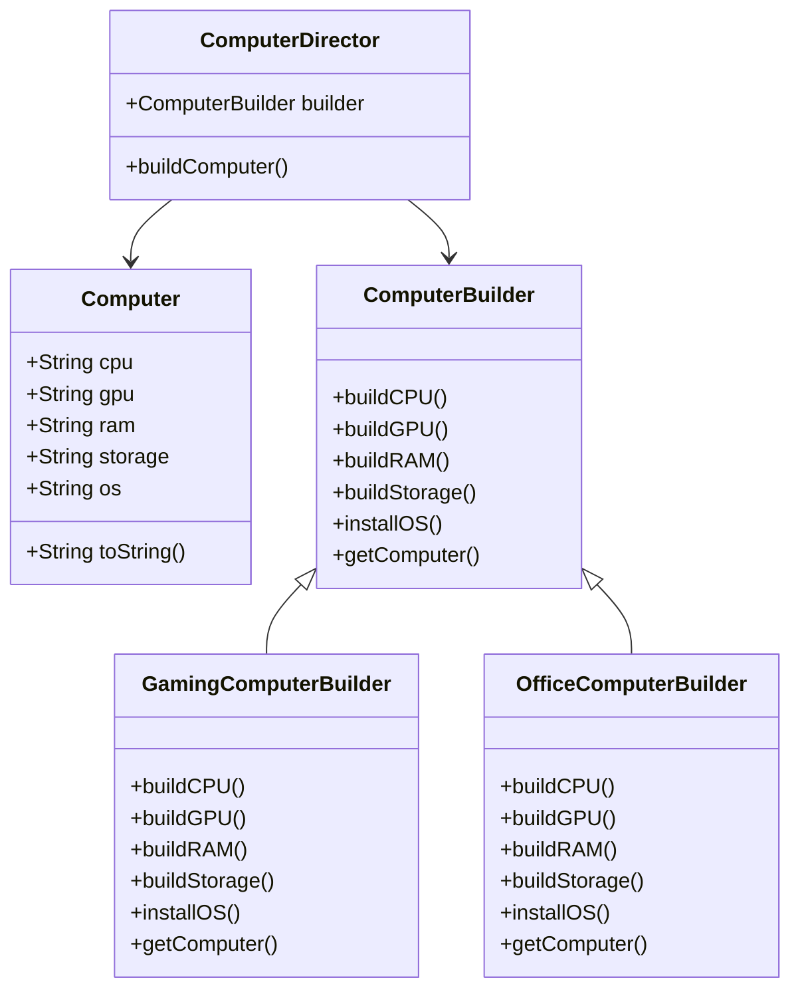

## 5.4.3 Implementation in JavaScript

In this section, we delve into the Builder pattern, a creational design pattern that is particularly useful in JavaScript for constructing complex objects step by step. This pattern is ideal when an object needs to be constructed with multiple parts, and the construction process needs to be independent of the parts that make up the object. By the end of this article, you will understand how to implement the Builder pattern in JavaScript and how it can be applied to real-world scenarios such as building customized computer systems.

### Understanding the Builder Pattern

The Builder pattern is a design pattern that provides a way to construct a complex object step by step. It separates the construction of a complex object from its representation, allowing the same construction process to create different representations. This pattern is particularly useful when an object can be constructed in multiple configurations.

#### Key Concepts of the Builder Pattern

1. **Product**: The complex object being constructed.
2. **Builder**: An abstract interface for creating parts of the Product object.
3. **Concrete Builder**: Implements the Builder interface and provides specific implementations for the construction steps.
4. **Director**: Constructs an object using the Builder interface.
5. **Client**: The client code that uses the Director and Builders to construct objects.

### Implementing the Builder Pattern in JavaScript

Let's implement the Builder pattern in JavaScript using an example scenario of building customized computers. We will follow these steps:

1. **Define the Product Class**: Create a `Computer` class with properties for each component.
2. **Create the Builder Class**: Define a base `ComputerBuilder` class with methods for building components.
3. **Implement Concrete Builders**: Extend the `ComputerBuilder` class to create `GamingComputerBuilder` and `OfficeComputerBuilder`.
4. **Define the Director Class**: Implement a `ComputerDirector` that constructs computers using a builder.
5. **Client Code**: Demonstrate how the client code uses the director and builders to construct different computer configurations.

#### Step 1: Define the Product Class

The `Computer` class represents the complex object that we want to build. It includes properties for each component of a computer.

```javascript
class Computer {
    constructor() {
        this.cpu = null;
        this.gpu = null;
        this.ram = null;
        this.storage = null;
        this.os = null;
    }

    toString() {
        return [
            `CPU: ${this.cpu}`,
            `GPU: ${this.gpu}`,
            `RAM: ${this.ram}`,
            `Storage: ${this.storage}`,
            `OS: ${this.os}`
        ].join('\n');
    }
}
```

**Explanation**: The `Computer` class has properties for CPU, GPU, RAM, storage, and OS. The `toString` method provides a string representation of the computer's configuration.

#### Step 2: Create the Builder Class

The `ComputerBuilder` class serves as a base class with method stubs for building each component of a computer.

```javascript
class ComputerBuilder {
    buildCPU() {}
    buildGPU() {}
    buildRAM() {}
    buildStorage() {}
    installOS() {}
    getComputer() {}
}
```

**Explanation**: The `ComputerBuilder` class defines methods for building each component of the computer. These methods are intended to be overridden by concrete builders.

#### Step 3: Implement Concrete Builders

Concrete builders extend the `ComputerBuilder` class and provide specific implementations for building different types of computers.

##### GamingComputerBuilder

```javascript
class GamingComputerBuilder extends ComputerBuilder {
    constructor() {
        super();
        this.computer = new Computer();
    }

    buildCPU() {
        this.computer.cpu = "Intel Core i9";
    }

    buildGPU() {
        this.computer.gpu = "NVIDIA RTX 3080";
    }

    buildRAM() {
        this.computer.ram = "32GB DDR4";
    }

    buildStorage() {
        this.computer.storage = "1TB SSD";
    }

    installOS() {
        this.computer.os = "Windows 10 Pro";
    }

    getComputer() {
        return this.computer;
    }
}
```

##### OfficeComputerBuilder

```javascript
class OfficeComputerBuilder extends ComputerBuilder {
    constructor() {
        super();
        this.computer = new Computer();
    }

    buildCPU() {
        this.computer.cpu = "Intel Core i5";
    }

    buildGPU() {
        this.computer.gpu = "Integrated Graphics";
    }

    buildRAM() {
        this.computer.ram = "16GB DDR4";
    }

    buildStorage() {
        this.computer.storage = "512GB SSD";
    }

    installOS() {
        this.computer.os = "Windows 10 Home";
    }

    getComputer() {
        return this.computer;
    }
}
```

**Explanation**: The `GamingComputerBuilder` and `OfficeComputerBuilder` classes provide specific implementations for building gaming and office computers, respectively. Each method sets a specific component of the `Computer` object.

#### Step 4: Define the Director Class

The `ComputerDirector` class constructs a computer using the builder interface.

```javascript
class ComputerDirector {
    constructor(builder) {
        this.builder = builder;
    }

    buildComputer() {
        this.builder.buildCPU();
        this.builder.buildGPU();
        this.builder.buildRAM();
        this.builder.buildStorage();
        this.builder.installOS();
        return this.builder.getComputer();
    }
}
```

**Explanation**: The `ComputerDirector` class uses a builder to construct a computer. It calls the builder's methods in a specific order to ensure the computer is constructed correctly.

#### Step 5: Client Code

The client code demonstrates how to use the director and builders to construct different computer configurations.

```javascript
function main() {
    // Build a gaming computer
    const gamingBuilder = new GamingComputerBuilder();
    const director = new ComputerDirector(gamingBuilder);
    const gamingComputer = director.buildComputer();
    console.log("Gaming Computer:");
    console.log(gamingComputer.toString());
    console.log();

    // Build an office computer
    const officeBuilder = new OfficeComputerBuilder();
    director.builder = officeBuilder;
    const officeComputer = director.buildComputer();
    console.log("Office Computer:");
    console.log(officeComputer.toString());
}

main();
```

**Explanation**: The client code creates instances of `GamingComputerBuilder` and `OfficeComputerBuilder` and uses the `ComputerDirector` to build gaming and office computers. The `toString` method of the `Computer` class is used to display the configuration of each computer.

### Best Practices and Considerations

- **Flexibility**: JavaScript's dynamic nature allows for flexibility in implementing the Builder pattern. You can easily extend or modify builders to accommodate new requirements.
- **Code Organization**: Use ES6 classes for clarity and structure. This helps in maintaining organized and readable code.
- **TypeScript Option**: Consider using TypeScript for improved type safety and interfaces. TypeScript can enforce interfaces, making the Builder pattern more robust.

### Visual Representation

To better understand the structure and relationships in the Builder pattern, let's visualize it using a class diagram.



### Key Points to Emphasize

- **Separation of Concerns**: The Builder pattern separates the construction logic from the representation of the object, making it easier to manage and extend.
- **Reusability**: Builders can be reused to create different configurations of the same object, enhancing code reusability.
- **Maintainability**: By encapsulating the construction process, the Builder pattern improves code maintainability and scalability.

### Conclusion

The Builder pattern is a powerful tool in JavaScript for constructing complex objects. It allows developers to build objects step by step, separating the construction process from the representation. This pattern is particularly useful in scenarios where an object needs to be constructed in multiple configurations, such as building customized computers. By following the Builder pattern, you can create flexible, maintainable, and scalable software solutions.

## Quiz Time!



### What is the primary purpose of the Builder pattern?

- [x] To construct complex objects step by step
- [ ] To simplify the interface of a class
- [ ] To provide a way to access the elements of an aggregate object sequentially
- [ ] To define a family of algorithms

> **Explanation:** The Builder pattern is used to construct complex objects step by step, separating the construction process from the representation.

### Which component in the Builder pattern is responsible for constructing the object?

- [ ] Product
- [ ] Builder
- [ ] Concrete Builder
- [x] Director

> **Explanation:** The Director is responsible for constructing the object using the Builder interface.

### In the provided JavaScript example, what does the `GamingComputerBuilder` class do?

- [x] It provides specific implementations for building a gaming computer
- [ ] It serves as an abstract class for building computers
- [ ] It builds office computers
- [ ] It manages the construction process

> **Explanation:** The `GamingComputerBuilder` class provides specific implementations for building a gaming computer by setting appropriate components.

### What is the role of the `Computer` class in the Builder pattern?

- [x] It represents the complex object being constructed
- [ ] It constructs the object
- [ ] It defines the steps for building the object
- [ ] It manages the builders

> **Explanation:** The `Computer` class represents the complex object being constructed, with properties for each component.

### How does the `ComputerDirector` use the builder in the example?

- [x] It calls the builder's methods in a specific order to construct the computer
- [ ] It directly sets the properties of the computer
- [ ] It provides default configurations for the computer
- [ ] It manages multiple builders simultaneously

> **Explanation:** The `ComputerDirector` calls the builder's methods in a specific order to ensure the computer is constructed correctly.

### Why might you consider using TypeScript with the Builder pattern in JavaScript?

- [x] For improved type safety and interfaces
- [ ] To reduce the number of classes needed
- [ ] To simplify the construction process
- [ ] To eliminate the need for a Director

> **Explanation:** TypeScript provides improved type safety and interfaces, making the Builder pattern more robust.

### What is a key benefit of using the Builder pattern?

- [x] It enhances code maintainability and scalability
- [ ] It reduces the number of classes needed
- [ ] It simplifies the interface of a class
- [ ] It eliminates the need for constructors

> **Explanation:** The Builder pattern enhances code maintainability and scalability by separating the construction process from the representation.

### In the Builder pattern, which class typically contains the `getComputer` method?

- [ ] Director
- [ ] Product
- [x] Concrete Builder
- [ ] Client

> **Explanation:** The `getComputer` method is typically found in the Concrete Builder class, which assembles the product.

### What is one of the main advantages of separating the construction logic from the representation in the Builder pattern?

- [x] It allows for different representations to be created using the same construction process
- [ ] It reduces the number of lines of code
- [ ] It makes the code run faster
- [ ] It simplifies debugging

> **Explanation:** Separating the construction logic from the representation allows for different representations to be created using the same construction process.

### True or False: The Builder pattern is only useful for constructing simple objects.

- [ ] True
- [x] False

> **Explanation:** False. The Builder pattern is particularly useful for constructing complex objects that require multiple construction steps.


