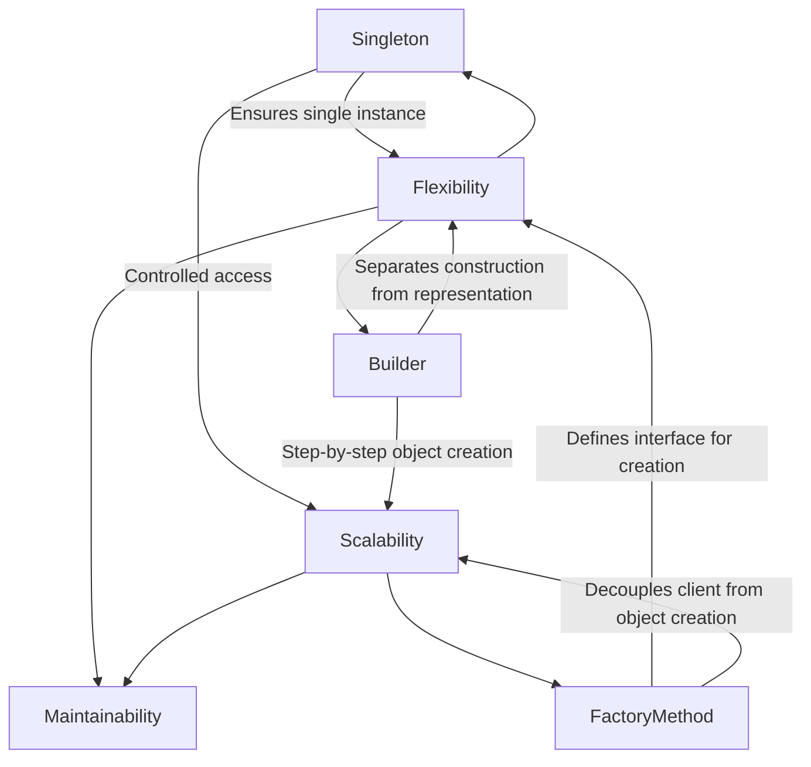

## Conclusion

In Chapter 5, **Creational Design Patterns**, we delved deep into the mechanisms of object creation within software design. Creational patterns play a pivotal role in managing how objects are instantiated, ensuring that software systems remain flexible, scalable, and maintainable. This chapter provided a comprehensive exploration of three fundamental creational patterns: **Singleton**, **Factory Method**, and **Builder**. As we conclude this chapter, it's essential to summarize the key concepts, reinforce your understanding, and prepare you for the next phase of your design patterns journey.

### Recap of Creational Patterns

**Creational design patterns** address the challenges associated with object creation, aiming to create objects in a manner that is both efficient and adaptable to changing requirements. They abstract the instantiation process, providing mechanisms to increase flexibility and reuse of existing code.

- **Flexibility:** By decoupling the client from the object creation process, these patterns allow systems to be more adaptable to changes.
- **Scalability:** They facilitate the addition of new types without altering existing code, making systems easier to scale.
- **Maintainability:** By promoting loose coupling and high cohesion, creational patterns make codebases easier to maintain and extend.

### Summary of Patterns Discussed

#### Singleton Pattern

- **Purpose:** Ensures a class has only one instance and provides a global point of access to it.
- **Implementation:** Achieved by restricting the class constructor and providing a static method that returns the single instance.
- **Advantages:**
  - Controlled access to the sole instance.
  - Reduced memory footprint.
- **Disadvantages:**
  - Can introduce global state into an application, making testing difficult.
  - May lead to tight coupling between classes.
- **Use Cases:**
  - Managing shared resources like configuration settings or connection pools.

```python
# Python Singleton Implementation
class Singleton:
    _instance = None

    def __new__(cls):
        if cls._instance is None:
            cls._instance = super(Singleton, cls).__new__(cls)
            cls._instance.value = 42
        return cls._instance

# Usage
singleton1 = Singleton()
singleton2 = Singleton()
print(singleton1 is singleton2)  # Output: True
```

#### Factory Method Pattern

- **Purpose:** Defines an interface for creating an object but lets subclasses alter the type of objects that will be created.
- **Implementation:** Involves creating a factory class with a method that returns instances of different classes based on input parameters.
- **Advantages:**
  - Promotes loose coupling by eliminating the need to bind specific classes to the code.
  - Enhances flexibility in object creation.
- **Disadvantages:**
  - Can lead to an increased number of classes.
- **Use Cases:**
  - When a class cannot anticipate the class of objects it needs to create.

```javascript
// JavaScript Factory Method Implementation
class Button {
    render() {
        throw new Error("This method should be overridden!");
    }
}

class WindowsButton extends Button {
    render() {
        console.log("Rendering Windows button.");
    }
}

class MacOSButton extends Button {
    render() {
        console.log("Rendering MacOS button.");
    }
}

class ButtonFactory {
    static createButton(osType) {
        if (osType === 'Windows') {
            return new WindowsButton();
        } else if (osType === 'MacOS') {
            return new MacOSButton();
        }
        throw new Error("Unsupported OS type.");
    }
}

// Usage
const button = ButtonFactory.createButton('Windows');
button.render();  // Output: Rendering Windows button.
```

#### Builder Pattern

- **Purpose:** Separates the construction of a complex object from its representation, allowing the same construction process to create different representations.
- **Implementation:** Utilizes a builder class that constructs the final object step by step.
- **Advantages:**
  - Provides control over the construction process.
  - Facilitates the creation of immutable objects.
- **Disadvantages:**
  - Can introduce additional complexity due to multiple builder classes.
- **Use Cases:**
  - Creating objects with numerous optional parameters.
  - When an object needs to be constructed in multiple steps or configurations.

```python
# Python Builder Pattern Implementation
class Car:
    def __init__(self):
        self.make = None
        self.model = None
        self.year = None

    def __str__(self):
        return f"{self.year} {self.make} {self.model}"

class CarBuilder:
    def __init__(self):
        self.car = Car()

    def set_make(self, make):
        self.car.make = make
        return self

    def set_model(self, model):
        self.car.model = model
        return self

    def set_year(self, year):
        self.car.year = year
        return self

    def build(self):
        return self.car

# Usage
builder = CarBuilder()
car = builder.set_make("Toyota").set_model("Corolla").set_year(2022).build()
print(car)  # Output: 2022 Toyota Corolla
```

### Key Takeaways

#### Understanding When to Use Each Pattern

Recognizing the right scenario to apply a creational pattern is crucial for designing effective systems:

- **Singleton:** When you need exactly one instance of a class to coordinate actions across the system.
- **Factory Method:** When a class can't anticipate the class of objects it needs to create.
- **Builder:** When constructing a complex object requires a step-by-step process or when you want to create different representations using the same construction process.

#### Importance of Design Patterns

Design patterns are integral to writing robust, flexible, and maintainable code. They provide:

- **Proven Solutions:** Leveraging patterns that have been tested and refined over time.
- **Common Language:** Facilitating communication among developers through a shared vocabulary.
- **Code Reusability and Modularity:** Encouraging the creation of interchangeable and reusable components.

#### Practical Application

Applying these patterns in your projects can lead to:

- **Enhanced Code Quality:** Cleaner and more organized code structures.
- **Reduced Development Time:** Reusing established solutions speeds up the development process.
- **Easier Maintenance and Scalability:** Well-designed patterns make it easier to extend and modify codebases as requirements evolve.

### Looking Forward

As you transition to the next chapters, where we will explore **Structural Design Patterns**, you will build upon the concepts learned in this chapter. Structural patterns will further enhance your ability to design complex systems by focusing on how classes and objects are composed to form larger structures. Understanding creational patterns provides a solid foundation for appreciating the intricacies of structural patterns and their interrelations.

### Final Thoughts

Mastering creational design patterns is a vital step in becoming a proficient software developer. These patterns empower you to manage object creation effectively, ensuring that your software systems are flexible, scalable, and maintainable. As you integrate these patterns into your development practices, you'll find yourself better equipped to tackle complex design challenges and build software that stands the test of time.

Embrace the principles and practices discussed in this chapter, experiment with implementing the patterns in various contexts, and continually refine your understanding through hands-on application. Your journey through design patterns is just beginning, and with each pattern you master, you enhance your ability to create elegant and efficient software solutions.

---



---

### **Integration of Patterns**

Understanding how different creational patterns can be combined enhances your ability to solve complex problems. For instance, integrating the **Singleton** and **Factory Method** patterns can manage both the creation of single instances and the instantiation of different object types based on context.

### **Adaptability**

Design patterns are not rigid templates; they are adaptable solutions that can be modified to fit specific needs. Whether adjusting the Singleton pattern to include lazy initialization or tailoring the Builder pattern to accommodate additional construction steps, adaptability is key to leveraging these patterns effectively.

### **Foundation for Further Learning**

Mastering creational patterns sets a robust foundation for exploring other design patterns. As you advance, patterns from the **Structural** and **Behavioral** categories will interconnect with your existing knowledge, enabling you to design comprehensive and sophisticated software systems.

---

**Resources for Further Learning:**

- **Books:**
  - *Design Patterns: Elements of Reusable Object-Oriented Software* by Erich Gamma, Richard Helm, Ralph Johnson, and John Vlissides.
  - *Head First Design Patterns* by Eric Freeman and Elisabeth Robson.
- **Online Courses:**
  - [Coursera: Design Patterns](https://www.coursera.org/learn/design-patterns)
  - [Udemy: Design Patterns in Object-Oriented Programming](https://www.udemy.com/course/design-patterns-in-object-oriented-programming/)
- **Websites:**
  - [Refactoring Guru: Design Patterns](https://refactoring.guru/design-patterns)
  - [GeeksforGeeks: Design Patterns](https://www.geeksforgeeks.org/software-design-patterns/)
- **Documentation:**
  - [Python Official Documentation](https://docs.python.org/3/)
  - [MDN Web Docs - JavaScript](https://developer.mozilla.org/en-US/docs/Web/JavaScript)

---

**Final Encouragement:**

As you continue to integrate creational design patterns into your coding practices, remember that the true mastery of these patterns comes from experience. Apply them in diverse projects, reflect on their impact, and remain open to discovering new ways to enhance your software solutions. Your dedication to understanding and implementing design patterns will significantly contribute to your growth as a skilled and thoughtful software engineer.

---