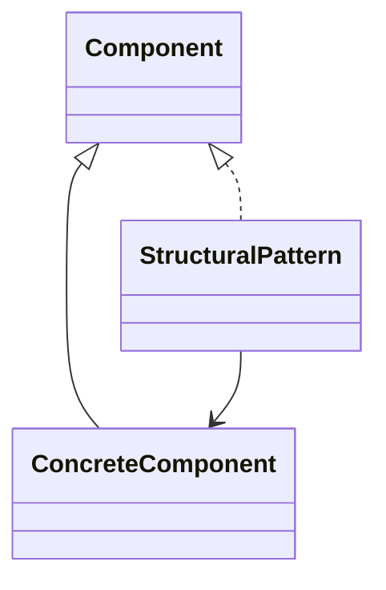

## 6.1.1 What Are Structural Patterns?

In the realm of software design, structural patterns play a pivotal role by providing a framework to manage the complexity of class and object composition. These patterns are fundamental in creating software architectures that are both robust and flexible, facilitating maintenance and scalability. This section delves into the essence of structural patterns, their purpose, and their significance in the software design landscape.

### Defining Structural Patterns

Structural design patterns are a subset of design patterns that focus on the composition of classes and objects. They provide solutions to facilitate the creation of complex structures by identifying simple ways to realize relationships between entities. The core idea is to define how entities can be composed to form larger, more complex structures without compromising the system's integrity or performance.

**Key Characteristics of Structural Patterns:**

- **Composition Over Inheritance:** Structural patterns often promote composition over inheritance, allowing for greater flexibility in how objects are interconnected.
- **Simplification of Relationships:** They simplify the relationships between different parts of a system, making it easier to understand and manage.
- **Enhanced Code Reusability:** By defining clear interfaces and roles, these patterns encourage code reuse and reduce redundancy.

### The Purpose of Structural Patterns

The primary purpose of structural patterns is to organize code in a manner that enhances readability, maintainability, and scalability. They provide a blueprint for structuring code so that it remains manageable as systems grow in size and complexity.

**Benefits of Structural Patterns:**

- **Improved Readability:** By clearly defining how components interact, structural patterns make the codebase easier to read and understand.
- **Maintainability:** These patterns help in isolating changes to specific components, minimizing the impact of modifications on the overall system.
- **Scalability:** Structural patterns facilitate the addition of new features or components with minimal disruption to existing code.

### Overview of Key Structural Patterns

In this chapter, we will explore several key structural patterns that are widely used in software design. Each pattern addresses specific challenges related to the composition of classes and objects:

1. **Adapter:** Allows incompatible interfaces to work together by acting as a bridge between them.
2. **Composite:** Enables the composition of objects into tree structures to represent part-whole hierarchies.
3. **Decorator:** Adds new functionality to objects dynamically without altering their structure.
4. **Facade:** Provides a simplified interface to a complex subsystem, making it easier to use.
5. **Bridge:** Separates an abstraction from its implementation, allowing them to vary independently.
6. **Flyweight:** Reduces memory usage by sharing common parts of objects across multiple instances.
7. **Proxy:** Controls access to an object, allowing for additional functionality such as lazy loading or access control.

### Real-World Analogies

Understanding structural patterns can be challenging without concrete examples. Here are a couple of analogies to help illustrate the concept:

- **Building Architecture:** Just as structural engineers design how beams, columns, and other components come together to support a building, structural patterns define how software components interact to form a cohesive system.
  
- **Lego Blocks:** Consider how individual Lego pieces can be combined in various ways to build complex structures. Similarly, structural patterns provide the guidelines for assembling software components into larger, functional systems.

### Visual Representation

To visualize the role of structural patterns, consider the following high-level diagram. It illustrates the concept of structural patterns and their role in connecting different classes or objects:

In this diagram, `Component` represents a general interface or abstract class, `ConcreteComponent` is a specific implementation, and `StructuralPattern` acts as a mediator or connector, facilitating interaction between components.

### Key Points to Emphasize

- **Composition and Relationships:** Structural patterns are primarily concerned with how classes and objects are composed and how they interact with one another.
- **Complexity Management:** By structuring code in a clear and organized manner, these patterns help manage complexity, making systems easier to understand and maintain.
- **Adaptability:** Structural patterns provide the flexibility needed to adapt to changing requirements and technologies, ensuring that software systems remain relevant over time.

### Conclusion

Structural patterns are an indispensable tool in the software designer's toolkit. They provide the means to create architectures that are not only functional but also elegant and maintainable. By understanding and applying these patterns, developers can build systems that stand the test of time, adapting to new challenges and opportunities as they arise.

As we delve deeper into each structural pattern in the following sections, you'll gain a comprehensive understanding of how they can be applied to solve real-world software design problems. Whether you're building a simple application or a complex enterprise system, structural patterns offer the guidance needed to craft well-architected solutions.

## Quiz Time!



### Structural patterns primarily focus on which aspect of software design?

- [x] Composition and relationships between classes and objects
- [ ] User interface design
- [ ] Database schema design
- [ ] Network protocol implementation

> **Explanation:** Structural patterns are concerned with how classes and objects are composed to form larger structures, emphasizing relationships and interactions.

### Which of the following is NOT a structural pattern?

- [ ] Adapter
- [ ] Composite
- [ ] Decorator
- [x] Observer

> **Explanation:** Observer is a behavioral pattern, not a structural pattern. Structural patterns include Adapter, Composite, Decorator, etc.

### What is the primary benefit of using structural patterns?

- [x] Improved readability, maintainability, and scalability of code
- [ ] Faster execution speed
- [ ] Reduced hardware requirements
- [ ] Enhanced security

> **Explanation:** Structural patterns help organize code to improve readability, maintainability, and scalability, making systems easier to manage and extend.

### The Facade pattern is used to:

- [x] Provide a simplified interface to a complex subsystem
- [ ] Add new functionality to objects dynamically
- [ ] Control access to an object
- [ ] Separate an abstraction from its implementation

> **Explanation:** The Facade pattern provides a simplified interface to a complex subsystem, making it easier to use.

### Which structural pattern allows incompatible interfaces to work together?

- [x] Adapter
- [ ] Composite
- [ ] Proxy
- [ ] Flyweight

> **Explanation:** The Adapter pattern acts as a bridge between incompatible interfaces, allowing them to work together.

### How do structural patterns help with scalability?

- [x] By facilitating the addition of new features or components with minimal disruption
- [ ] By reducing the number of lines of code
- [ ] By increasing the speed of execution
- [ ] By improving data storage efficiency

> **Explanation:** Structural patterns allow for new features or components to be added with minimal disruption, aiding in scalability.

### In the Lego blocks analogy, what do structural patterns represent?

- [x] Guidelines for assembling components into larger systems
- [ ] The individual Lego pieces
- [ ] The color of the blocks
- [ ] The packaging of the Lego set

> **Explanation:** Structural patterns provide guidelines for how components (like Lego blocks) can be assembled into larger, functional systems.

### Which pattern is used to reduce memory usage by sharing common parts of objects?

- [x] Flyweight
- [ ] Proxy
- [ ] Decorator
- [ ] Facade

> **Explanation:** The Flyweight pattern reduces memory usage by sharing common parts of objects across multiple instances.

### What is the main advantage of using composition over inheritance in structural patterns?

- [x] Greater flexibility in how objects are interconnected
- [ ] Faster execution time
- [ ] Easier debugging
- [ ] Reduced code size

> **Explanation:** Composition offers greater flexibility in how objects are interconnected, allowing for more adaptable and maintainable designs.

### True or False: Structural patterns are only useful in large-scale enterprise applications.

- [ ] True
- [x] False

> **Explanation:** Structural patterns are useful in any size application, providing benefits of organization, readability, and maintainability regardless of scale.


