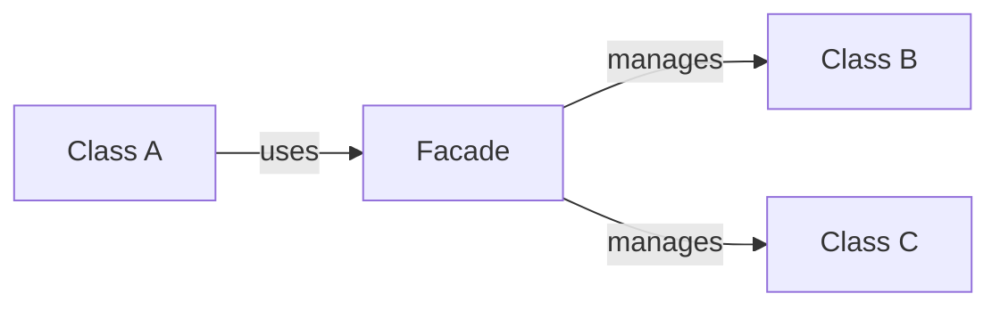

## 6.1.2 Importance in Software Design

In the realm of software development, structural design patterns play a pivotal role in shaping how systems are organized and maintained. These patterns are not just theoretical constructs but practical tools that enhance the quality, scalability, and flexibility of software. This section delves into the significance of structural patterns, elucidating their impact on code organization, complexity reduction, scalability, and real-world applications.

### Code Organization

One of the foremost benefits of structural design patterns is their ability to organize code effectively. By defining clear interfaces and relationships between components, structural patterns promote modularity, reusability, and maintainability.

#### Modularity and Reusability

**Modularity** refers to the degree to which a system's components can be separated and recombined. Structural patterns facilitate modularity by encapsulating the complexity of interactions within well-defined interfaces. This encapsulation allows developers to build systems where components can be developed, tested, and understood independently.

**Reusability** is another critical advantage. By adhering to structural patterns, developers can create components that are not only modular but also reusable across different parts of a system or even in different projects. This reusability reduces development time and increases consistency across applications.

Consider the **Adapter Pattern**, which allows incompatible interfaces to work together. By using an adapter, you can reuse existing components without altering their code, thus enhancing both modularity and reusability.

```python

class EuropeanSocketInterface:
    def voltage(self): pass
    def live(self): pass
    def neutral(self): pass
    def earth(self): pass

class Socket(EuropeanSocketInterface):
    def voltage(self):
        return 230
    
    def live(self):
        return 1
    
    def neutral(self):
        return -1
    
    def earth(self):
        return 0

class USASocketInterface:
    def voltage(self): pass
    def live(self): pass
    def neutral(self): pass

class Adapter(USASocketInterface):
    def __init__(self, socket):
        self.socket = socket
    
    def voltage(self):
        return 110
    
    def live(self):
        return self.socket.live()
    
    def neutral(self):
        return self.socket.neutral()

socket = Socket()
adapter = Adapter(socket)
print(f"Voltage: {adapter.voltage()}V")  # Output: Voltage: 110V
```

### Reduction of Complexity

Structural patterns are instrumental in managing the complexity of software systems. By defining clear relationships and interactions between components, these patterns help maintain *high cohesion* and *low coupling*, which are essential principles in software design.

#### High Cohesion and Low Coupling

**High cohesion** refers to how closely related and focused the responsibilities of a single module or class are. Structural patterns encourage high cohesion by ensuring that each component has a well-defined role and responsibility.

**Low coupling** is about minimizing dependencies between different modules or classes. Low coupling makes a system easier to modify and extend, as changes in one module are less likely to impact others. Structural patterns like the **Facade Pattern** are designed to achieve low coupling by providing a simplified interface to a complex subsystem.


In the above diagram, Class A directly interacts with Classes B and C, creating a tightly coupled system. Applying the Facade Pattern can simplify these interactions:



By introducing a Facade, Class A interacts with a single interface, reducing its dependency on the internal workings of Classes B and C.

### Scalability and Flexibility

Structural patterns are vital for developing scalable and flexible systems. They allow software to grow and adapt to changing requirements with minimal disruption.

#### Enabling Scalability

Scalability is the ability of a system to handle increased load without compromising performance. Structural patterns like the **Composite Pattern** enable scalability by allowing individual objects to be composed into more complex structures, which can be treated uniformly.

```javascript
// Example of Composite Pattern in JavaScript

class Component {
  constructor(name) {
    this.name = name;
  }
  
  add(component) {}
  remove(component) {}
  display(depth) {}
}

class Leaf extends Component {
  display(depth) {
    console.log('-'.repeat(depth) + this.name);
  }
}

class Composite extends Component {
  constructor(name) {
    super(name);
    this.children = [];
  }
  
  add(component) {
    this.children.push(component);
  }
  
  remove(component) {
    this.children = this.children.filter(child => child !== component);
  }
  
  display(depth) {
    console.log('-'.repeat(depth) + this.name);
    this.children.forEach(child => child.display(depth + 2));
  }
}

// Usage
const root = new Composite('root');
const leaf1 = new Leaf('Leaf A');
const leaf2 = new Leaf('Leaf B');
root.add(leaf1);
root.add(leaf2);

const comp = new Composite('Composite X');
comp.add(new Leaf('Leaf XA'));
comp.add(new Leaf('Leaf XB'));

root.add(comp);
root.display(1);
```

In this example, the Composite Pattern allows for the creation of complex tree structures that can be managed uniformly, facilitating scalability.

#### Enhancing Flexibility

Flexibility is the system's ability to adapt to changes. Structural patterns like the **Decorator Pattern** enhance flexibility by allowing behavior to be added to individual objects without affecting the behavior of other objects from the same class.

### Real-World Applications

Structural patterns are not confined to academic exercises; they are crucial in various industries and applications.

#### UI Design

In UI design, structural patterns like the **Decorator Pattern** are used to add functionalities such as scrolling, borders, or shadows to UI components without altering their core logic.

#### Network Systems

In network systems, the **Proxy Pattern** is often employed to control access to resources, manage caching, or provide additional security layers.

#### Middleware

In middleware, structural patterns help manage interactions between different software components, ensuring seamless communication and integration.

### Key Points to Emphasize

- **Structural patterns are essential tools** for creating well-organized, maintainable codebases. They provide a blueprint for arranging classes and objects in a way that promotes clarity and efficiency.
- **Enhancing readability and collaboration** among developers is a significant advantage of using structural patterns. By adhering to these patterns, teams can ensure that their codebases are understandable and easy to navigate, facilitating better collaboration and knowledge transfer.

### Conclusion

In conclusion, structural design patterns are indispensable in modern software development. They offer a framework for organizing code, reducing complexity, and enhancing scalability and flexibility. By understanding and applying these patterns, developers can build robust, maintainable, and adaptable systems that stand the test of time.

## Quiz Time!



### What is one of the primary benefits of using structural patterns in software design?

- [x] They help organize code for improved clarity.
- [ ] They increase the complexity of the system.
- [ ] They eliminate the need for testing.
- [ ] They make code harder to understand.

> **Explanation:** Structural patterns assist in organizing code, making it more modular, reusable, and maintainable, which improves clarity.

### How do structural patterns contribute to reducing system complexity?

- [x] By defining clear relationships and interactions between components.
- [ ] By increasing the number of classes in a system.
- [ ] By making code more abstract and less readable.
- [ ] By removing all dependencies between components.

> **Explanation:** Structural patterns reduce complexity by establishing clear interfaces and interactions, promoting high cohesion and low coupling.

### Which principle is promoted by structural patterns to ensure easy modification and extension of systems?

- [x] Low coupling
- [ ] High coupling
- [ ] High complexity
- [ ] Low cohesion

> **Explanation:** Low coupling is a principle that structural patterns promote, ensuring that changes in one module have minimal impact on others.

### What is the role of the Facade Pattern in software design?

- [x] It provides a simplified interface to a complex subsystem.
- [ ] It complicates the interactions between classes.
- [ ] It makes systems less flexible.
- [ ] It increases the number of dependencies.

> **Explanation:** The Facade Pattern simplifies interactions by providing a unified interface to a set of interfaces in a subsystem.

### In which industry is the Decorator Pattern commonly used?

- [x] UI Design
- [ ] Network Systems
- [x] Middleware
- [ ] Hardware Design

> **Explanation:** The Decorator Pattern is used in UI design to add functionalities to components without altering their core logic.

### How do structural patterns enhance scalability?

- [x] By allowing systems to handle increased load without compromising performance.
- [ ] By making systems more rigid and less adaptable.
- [ ] By increasing the number of dependencies.
- [ ] By reducing the number of components in a system.

> **Explanation:** Structural patterns like the Composite Pattern enable scalability by allowing complex structures to be managed uniformly.

### What benefit does the Adapter Pattern provide?

- [x] It allows incompatible interfaces to work together.
- [ ] It increases the complexity of the system.
- [x] It reduces the modularity of the system.
- [ ] It makes code less reusable.

> **Explanation:** The Adapter Pattern allows existing components to be reused by making incompatible interfaces compatible.

### Which pattern is used to control access to resources in network systems?

- [x] Proxy Pattern
- [ ] Composite Pattern
- [ ] Decorator Pattern
- [ ] Adapter Pattern

> **Explanation:** The Proxy Pattern is used to control access, manage caching, and provide security in network systems.

### What is a key characteristic of high cohesion in software design?

- [x] Closely related and focused responsibilities within a module.
- [ ] Many unrelated functionalities within a module.
- [ ] High number of dependencies between modules.
- [ ] Low focus on module responsibilities.

> **Explanation:** High cohesion means that the responsibilities of a module are closely related and focused.

### Structural patterns help in creating maintainable codebases. True or False?

- [x] True
- [ ] False

> **Explanation:** Structural patterns provide a framework for organizing code in a way that enhances maintainability and readability.


