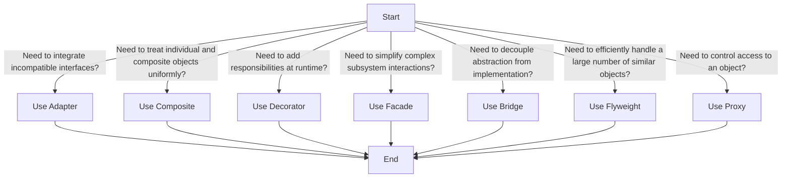

## 6.1.4 Choosing the Right Structural Pattern

In the world of software design, structural patterns play a crucial role in defining the composition of classes and objects. They help ensure that if one part of a system changes, the entire system does not need to be rewritten. However, with multiple structural patterns available, choosing the right one for your specific needs can be daunting. This section aims to provide a comprehensive guide to help you select the most appropriate structural pattern based on your design requirements.

### Understanding Design Requirements

Before diving into the intricacies of each structural pattern, it's essential to first understand the specific problem or requirement your design must address. This involves a thorough analysis of your project’s needs, which can include factors such as compatibility, complexity, extensibility, and performance. Let's explore these factors in more detail:

- **Compatibility:** Consider whether your system needs to integrate with existing systems or third-party services. Compatibility issues often arise when dealing with legacy systems or diverse technologies.
  
- **Complexity:** Evaluate the complexity of your system. Is it a simple application, or does it involve multiple subsystems and components that interact with each other?
  
- **Extensibility:** Determine if the system needs to be easily extendable in the future. This is crucial for systems expected to evolve over time.
  
- **Performance:** Assess the performance requirements. Some patterns may introduce overhead, which can impact the performance of the system.

By thoroughly understanding these aspects, you can better align your design choices with the system's needs, ensuring a robust and efficient architecture.

### Pattern Suitability

Now that you have a grasp of your design requirements, let’s delve into the suitability of each structural pattern. Each pattern serves a specific purpose and is best suited for particular scenarios. Understanding the intent and applicability of each pattern is key to making informed decisions.

#### Adapter Pattern

**Use Case:** The Adapter pattern is ideal when you need to make two incompatible interfaces work together. It acts as a bridge between two incompatible interfaces, allowing them to communicate and function together seamlessly.

**When to Use:**
- When you have existing classes with incompatible interfaces that need to work together.
- When you want to create a reusable class that cooperates with unrelated or unforeseen classes.

**Example Scenario:** Imagine you are developing a payment processing system that needs to integrate with multiple third-party payment gateways, each with its own unique interface. Using the Adapter pattern, you can create a uniform interface for your system to interact with these gateways, simplifying integration and reducing complexity.

#### Composite Pattern

**Use Case:** The Composite pattern is appropriate when dealing with hierarchical data and when operations need to be applied uniformly across both individual and composite objects.

**When to Use:**
- When you want to represent part-whole hierarchies of objects.
- When you want clients to be able to ignore the difference between compositions of objects and individual objects.

**Example Scenario:** Consider a graphics application that allows users to create complex drawings using basic shapes like circles and squares. Using the Composite pattern, you can treat both individual shapes and groups of shapes uniformly, simplifying the application’s design and making it more flexible.

#### Decorator Pattern

**Use Case:** The Decorator pattern is suitable when you need to add responsibilities to objects without subclassing. It provides a flexible alternative to subclassing for extending functionality.

**When to Use:**
- When you need to add responsibilities to individual objects dynamically and transparently.
- When you want to avoid a feature-laden class hierarchy.

**Example Scenario:** Think of a text editor that allows users to apply various formatting options like bold, italic, and underline. Using the Decorator pattern, you can add these formatting options to text objects at runtime, without altering the underlying object structure.

#### Facade Pattern

**Use Case:** The Facade pattern is used to simplify interactions with complex subsystems. It provides a unified interface to a set of interfaces in a subsystem, making it easier to use.

**When to Use:**
- When you want to provide a simple interface to a complex subsystem.
- When there are many dependencies between clients and the implementation classes of an abstraction.

**Example Scenario:** In a home automation system, you might have complex subsystems for lighting, heating, and security. Using the Facade pattern, you can provide a simple interface for users to control the entire system, hiding the complexities of the underlying subsystems.

#### Bridge Pattern

**Use Case:** The Bridge pattern is ideal when you need to vary both abstractions and implementations independently. It decouples an abstraction from its implementation, allowing them to vary independently.

**When to Use:**
- When you want to avoid a permanent binding between an abstraction and its implementation.
- When both the abstractions and their implementations should be extensible by subclassing.

**Example Scenario:** Consider a graphic library that supports multiple types of rendering engines, such as vector and raster. Using the Bridge pattern, you can separate the abstraction (graphic objects) from the implementation (rendering engines), allowing them to evolve independently.

#### Flyweight Pattern

**Use Case:** The Flyweight pattern is employed when there is a need to efficiently handle a large number of similar objects. It minimizes memory usage by sharing as much data as possible with similar objects.

**When to Use:**
- When an application uses a large number of objects.
- When storage costs are high because of the sheer quantity of objects.

**Example Scenario:** In a text editor, each character can be represented as an object. Using the Flyweight pattern, you can share common data (like font and style) among character objects, significantly reducing memory usage.

#### Proxy Pattern

**Use Case:** The Proxy pattern is suitable for controlling access to another object. It acts as a placeholder for another object to control access to it.

**When to Use:**
- When you need to represent a complex or heavy object with a simpler one.
- When you want to control access to an object.

**Example Scenario:** In a virtual proxy scenario, you might have a high-resolution image that is expensive to load. Using the Proxy pattern, you can create a lightweight proxy object that loads the image only when it is actually needed, improving application performance.

### Decision-Making Tips

Selecting the right structural pattern is critical for effective design. Here are some tips to guide your decision-making process:

- **Analyze the Problem:** Clearly define the problem you are trying to solve. Understanding the problem is half the battle in selecting the right pattern.
  
- **Consider Future Scalability:** Choose a pattern that not only solves the current problem but also allows for future growth and scalability.
  
- **Evaluate Maintainability:** Opt for patterns that enhance the maintainability of your codebase. A well-chosen pattern can make your code easier to understand and modify.

- **Use a Decision Tree:** A decision tree can be a valuable tool in selecting the right pattern. Below is a simple decision tree to help guide your choice:

### Key Points to Emphasize

- **Intent and Applicability:** Understanding the intent and applicability of each pattern is crucial. This knowledge aids in making informed decisions that align with your design goals.

- **Critical Selection:** Selecting the appropriate pattern is critical for effective design. A well-chosen pattern can significantly enhance the flexibility and robustness of your system.

- **Future-Proof Design:** Consider future scalability and maintainability when choosing a pattern. The right pattern not only solves current problems but also accommodates future changes and expansions.

By following these guidelines and understanding the suitability of each pattern, you can make informed decisions that lead to effective and efficient software design.

## Quiz Time!



### Which pattern is ideal for making two incompatible interfaces work together?

- [x] Adapter Pattern
- [ ] Composite Pattern
- [ ] Decorator Pattern
- [ ] Facade Pattern

> **Explanation:** The Adapter pattern is used to make two incompatible interfaces work together by acting as a bridge between them.

### When should you use the Composite pattern?

- [x] When dealing with hierarchical data
- [ ] When needing to simplify complex subsystem interactions
- [ ] When adding responsibilities to objects without subclassing
- [ ] When controlling access to another object

> **Explanation:** The Composite pattern is suitable for dealing with hierarchical data and allows treating individual and composite objects uniformly.

### What is the primary use case for the Decorator pattern?

- [x] Adding responsibilities to objects without subclassing
- [ ] Simplifying complex subsystem interactions
- [ ] Decoupling abstraction from implementation
- [ ] Efficiently handling a large number of similar objects

> **Explanation:** The Decorator pattern is used to add responsibilities to objects dynamically without altering their structure through subclassing.

### Which pattern should you choose to simplify interactions with complex subsystems?

- [x] Facade Pattern
- [ ] Adapter Pattern
- [ ] Composite Pattern
- [ ] Proxy Pattern

> **Explanation:** The Facade pattern provides a simplified interface to a complex subsystem, making it easier to use.

### When is the Bridge pattern most appropriate?

- [x] When you need to vary both abstractions and implementations independently
- [ ] When you need to control access to another object
- [ ] When you need to make two incompatible interfaces work together
- [ ] When you need to add responsibilities to objects without subclassing

> **Explanation:** The Bridge pattern decouples abstraction from implementation, allowing them to vary independently.

### What is the primary benefit of the Flyweight pattern?

- [x] Efficiently handling a large number of similar objects
- [ ] Simplifying complex subsystem interactions
- [ ] Adding responsibilities to objects without subclassing
- [ ] Decoupling abstraction from implementation

> **Explanation:** The Flyweight pattern minimizes memory usage by sharing as much data as possible with similar objects.

### Which pattern is used for controlling access to another object?

- [x] Proxy Pattern
- [ ] Adapter Pattern
- [ ] Composite Pattern
- [ ] Flyweight Pattern

> **Explanation:** The Proxy pattern acts as a placeholder for another object to control access to it.

### What should you consider when selecting a structural pattern?

- [x] Future scalability and maintainability
- [ ] Only the current problem
- [ ] The number of classes involved
- [ ] The programming language used

> **Explanation:** Future scalability and maintainability are important considerations when selecting a structural pattern to ensure the design can accommodate future changes.

### How can a decision tree assist in choosing the right pattern?

- [x] By providing a visual guide to pattern selection based on specific questions
- [ ] By listing all available patterns
- [ ] By detailing code examples for each pattern
- [ ] By explaining the historical background of each pattern

> **Explanation:** A decision tree provides a visual guide that helps in selecting the right pattern based on specific design questions and requirements.

### True or False: The Decorator pattern is used to simplify interactions with complex subsystems.

- [ ] True
- [x] False

> **Explanation:** False. The Decorator pattern is used to add responsibilities to objects without subclassing, not to simplify complex subsystem interactions.



By understanding the specific needs of your project and the unique advantages of each structural pattern, you can create a design that is both efficient and adaptable. This knowledge will empower you to make strategic decisions that enhance the overall architecture and functionality of your software systems.
